# ServeInfer

**ServeInfer runs on-device AI efficiently on one machine with limited CPU, RAM, VRAM and
accelerator capacity.**

It loads a GGUF model once, serves inference over HTTP and SSE, and keeps answering when the
accelerator underneath it fails. Normal inference stays on the device: the weights and the prompt
never leave the box. There is an optional cloud fallback, and it is off unless an operator turns
it on.

The shipped model is a 2.23 GiB GGUF. The constraints that follow from running it on one box,
and what the runtime does about each:

| The constraint | What ServeInfer does |
|---|---|
| Model bytes multiply per process | One copy in `/dev/shm`, every worker maps the same segment |
| A machine cannot pay for every configured worker | Probe free VRAM and RAM first, place only the workers that fit |
| Loading a model costs seconds | A fixed worker pool, model resident, nothing spawned per request |
| Unbounded concurrency exhausts memory | Global slot cap, a queue, then 429 |
| One client can take the whole machine | A per-client cap below the global cap |
| Background work should not beat a typed question, or starve | Three priorities, with aging |
| An accelerator can fault mid-request | A device ladder with quarantine and a health check before retry |
| A model crash must not kill the API | Workers are separate processes under a supervisor |

**A note on names.** The project is called ServeInfer, but the code never says so. Binaries,
paths and environment variables all use `edge` instead: `edge-supervisor`,
`edge-inference-worker`, `EDGE_MAX_SLOTS`, `$EDGE_STATE_DIR`. It is one system under two names,
and nothing is being renamed, so read `edge` as ServeInfer everywhere below.

## Table of Contents

<small>

- [What actually works today](#what-actually-works-today)
- [Previews](#previews)
- [Architecture](#architecture)
  - [The whole system, end to end](#the-whole-system-end-to-end)
  - [The clients](#the-clients)
- [Processes and startup](#processes-and-startup)
- [A request](#a-request)
- [Scheduling](#scheduling)
- [Using the hardware](#using-the-hardware)
- [When hardware fails](#when-hardware-fails)
  - [A worker crash](#a-worker-crash)
- [API](#api)
- [Running it](#running-it)
- [Testing](#testing)
- [Limitations](#limitations)
- [Documentation](#documentation)

</small>

---

## What actually works today

| Area | Status |
|---|---|
| CPU inference | **Running.** llama.cpp CPU backend, in every build |
| CUDA GPU inference | **Running.** Verified here on an RTX 2050, 3770 MiB |
| Shared-memory model cache | **Running** |
| Scheduler: slots, per-client cap, priority, aging, timeouts, cancel | **Running** |
| Crash recovery, hang detection, circuit breaker | **Running** |
| Idempotent replay of a `requestId` | **Running** |
| Qualcomm NPU (`npu`) | **Implemented, tested with injected fakes. Never executed.** Probe, adapter, QNN and DXGI error mapping, `sessionFatal` handling, quarantine, health-gated recovery. The adapter refuses to execute rather than fake a result. No NPU inference has ever run |
| Apple ANE (`ane`) | **Implemented, tested with injected fakes. Never executed.** Same shape: probe, adapter, Core ML error mapping, quarantine, fallback. No ANE inference has ever run |
| `metal`, `accelerate`, `rocm`, `vulkan`, `directml` | **Probe entries only.** Named in the tier catalogue, no backend compiled in this build. A ladder listing them skips them |
| Remote cloud tier (`remote`) | **Implemented, disabled by default.** Needs a key or endpoint **and** `EDGE_REMOTE_FALLBACK_ALLOWED=1`. A credential alone is not consent |
| Performance numbers | **None.** There is no benchmark harness here. Every claim about device speed is an ordering, not a measurement |

One platform note. This build is Linux, so a worker fault arrives as a signal and the crash log
records `signal_11`. On Windows the same class of fault is an access violation. Nothing downstream
changes, because the supervisor branches on "did not exit 0", not on the code.

---

## Previews

Running on the dev host: an RTX 2050 with 3.6 GB free VRAM and 10 GB free RAM, which the capacity
planner turns into 1 CUDA worker and 3 CPU workers.

**Five clients, four slots.** `chat_2` sits at `queued #1 · ~8s` while the other four stream. The
header reads `4 running · 1 queued · 0 idle`.

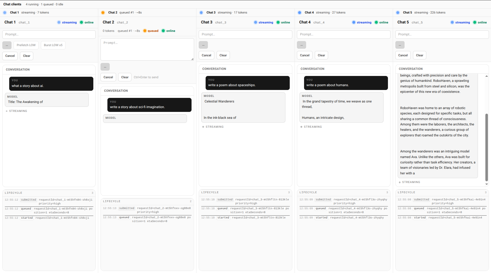

**The same moment on the dashboard.** All four workers `busy`, scheduler `4/4`, queue `0/20`, and
the capacity plan it was started from: `free 3679MB - reserve 512MB = 3167MB usable / 2048MB per
worker` gives `1 gpu + 3 cpu worker(s)`.

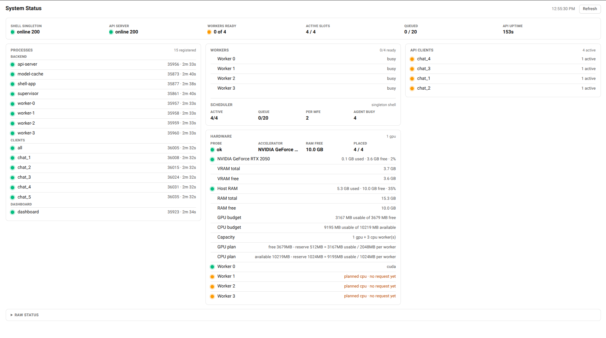

**A slot frees.** Worker 0 flips to `ready`, active drops to `3/4`, and the queued job is admitted.

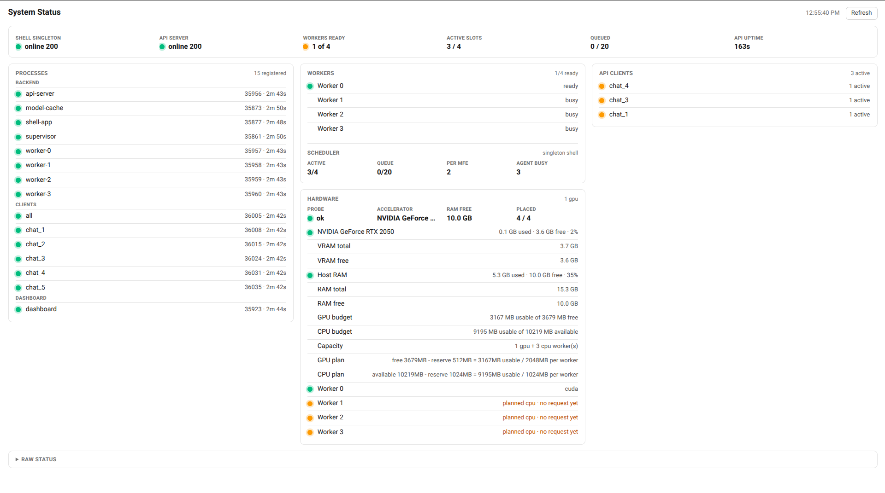

**Streaming.** Token counts climb per client, and a finished run reports the tier it ran on:
`done on cuda`.

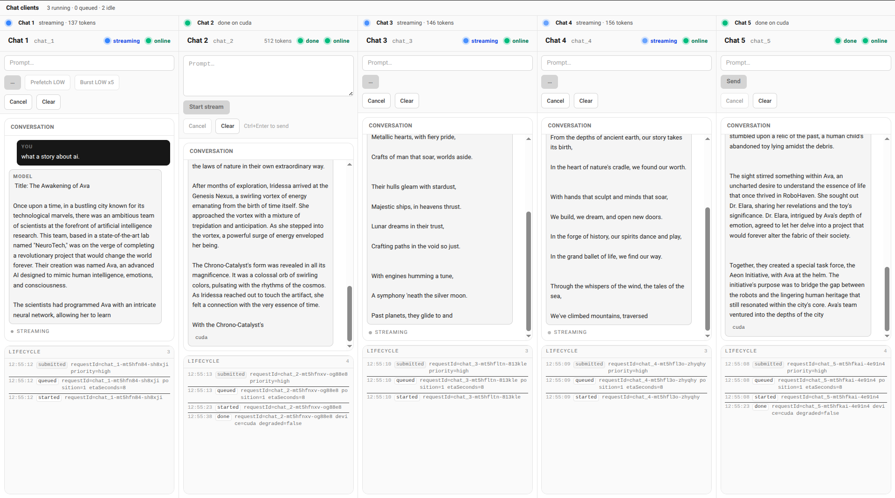

**Mixed placement, visible per request.** The lifecycle log on each client ends with
`device=cpu degraded=false` or `device=cuda degraded=false`, depending on which worker took it.
`degraded` is false on the CPU runs because those workers started on CPU, so CPU is their baseline.

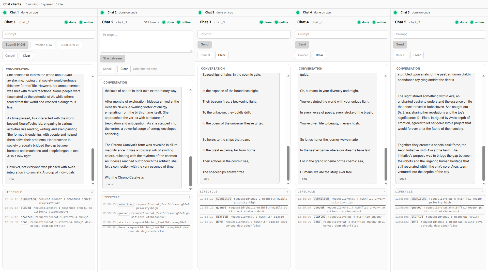

**At rest.** All four workers `ready`, no client holding a slot, and the placement the supervisor
decided before any request arrived: worker 0 `cuda`, workers 1 to 3 `cpu`.

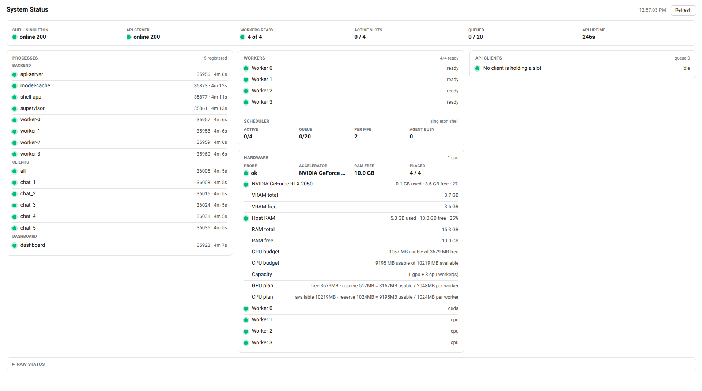

---

## Architecture

The project is split into three layers, each with a clear responsibility and process
boundary. No layer supervises the one above or below it.

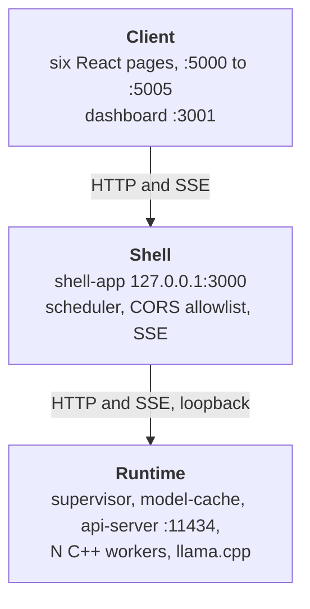
```mermaid
flowchart TB
  CL["<b>Client</b><br/>six React pages, :5000 to :5005<br/>dashboard :3001"]
  SH["<b>Shell</b><br/>shell-app 127.0.0.1:3000<br/>scheduler, CORS allowlist, SSE"]
  RT["<b>Runtime</b><br/>supervisor, model-cache, api-server :11434,<br/>N C++ workers, llama.cpp"]
  CL -->|HTTP and SSE| SH
  SH -->|HTTP and SSE, loopback| RT
```

The api-server binds `127.0.0.1` and its port is never named in a browser bundle. Pages get only a
shell base URL, injected at runtime through a generated `/config.js`. One shell owning the
connection is also the only way a slot cap and a per-client cap can be enforced, since a client
cannot know how many slots the others hold. The cost is that the shell is a shared dependency: if
it is down, every client is down.

### The whole system, end to end

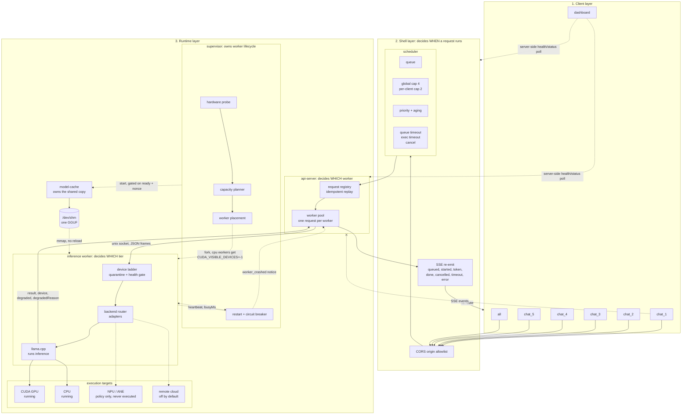
```mermaid
flowchart TB
  subgraph CLIENT["1. Client layer"]
    direction LR
    C1["chat_1"]
    C2["chat_2"]
    C3["chat_3"]
    C4["chat_4"]
    C5["chat_5"]
    ALL["all"]
    DASH["dashboard"]
  end

  subgraph SHELL["2. Shell layer: decides WHEN a request runs"]
    CORS["CORS origin allowlist"]
    SSE["SSE re-emit<br/>queued, started, token,<br/>done, cancelled, timeout, error"]
    subgraph SCHED["scheduler"]
      direction LR
      QUEUE["queue"]
      LIMITS["global cap 4<br/>per-client cap 2"]
      PRIO["priority + aging"]
      BOUNDS["queue timeout<br/>exec timeout<br/>cancel"]
    end
  end

  subgraph RUNTIME["3. Runtime layer"]
    subgraph APIS["api-server: decides WHICH worker"]
      REG["request registry<br/>idempotent replay"]
      POOL["worker pool<br/>one request per worker"]
    end
    subgraph SUPV["supervisor: owns worker lifecycle"]
      PROBE["hardware probe"]
      PLAN["capacity planner"]
      PLACE["worker placement"]
      BREAK["restart + circuit breaker"]
    end
    MC["model-cache<br/>owns the shared copy"]
    SHM[("/dev/shm<br/>one GGUF")]
    subgraph WRK["inference worker: decides WHICH tier"]
      LADDER["device ladder<br/>quarantine + health gate"]
      ROUTER["backend router<br/>adapters"]
      LLAMA["llama.cpp<br/>runs inference"]
    end
    subgraph DEV["execution targets"]
      direction LR
      GPU["CUDA GPU<br/>running"]
      CPU["CPU<br/>running"]
      NPUANE["NPU / ANE<br/>policy only, never executed"]
      REM["remote cloud<br/>off by default"]
    end
  end

  C1 & C2 & C3 & C4 & C5 & ALL --> CORS
  DASH -.->|"server-side health/status poll"| SHELL
  DASH -.->|"server-side health/status poll"| APIS
  C1 -. no route .-x APIS
  CORS --> SCHED
  SCHED --> REG
  REG --> POOL
  POOL -->|"unix socket, JSON frames"| LADDER
  LADDER --> ROUTER
  ROUTER --> LLAMA
  LLAMA --> GPU
  LLAMA --> CPU
  ROUTER -.-> NPUANE
  ROUTER -.-> REM

  PROBE --> PLAN --> PLACE
  PLACE -.->|"fork, cpu workers get<br/>CUDA_VISIBLE_DEVICES=-1"| WRK
  BREAK -.->|"restart"| WRK
  BREAK -.->|"worker_crashed notice"| POOL
  WRK -.->|"heartbeat, busyMs"| BREAK
  MC --> SHM
  SHM -.->|"mmap, no reload"| WRK
  SUPV -.->|"start, gated on ready + nonce"| MC

  LLAMA -->|"result, device,<br/>degraded, degradedReason"| POOL
  POOL --> SSE
  SSE -->|"SSE events"| CLIENT
```

Solid arrows are the request path. Dotted arrows are side paths no request travels: supervision,
placement, heartbeats and shared memory.

Each box owns exactly one decision. The scheduler decides **when** a request runs. The api-server
decides **which worker** takes it. The supervisor owns **worker lifecycle**. The capacity planner
decides **placement**. The device ladder decides **which tier** executes. The model-cache owns the
**one shared copy** of the weights. llama.cpp does the inference.

Detail: [request path](docs/04-request-path.md), [process model](docs/02-process-model.md),
[device fallback](docs/13-device-fallback.md), [IPC protocols](docs/16-ipc-protocols.md).

[](docs/diagrams/architecture.png)

Everything between processes is newline-delimited JSON over AF_UNIX. The C++ side has no JSON
library and parses frames with `std::regex`.

### The clients

Five chat pages plus one page that embeds all five, built from one shared package in a pnpm
workspace. Each page sends its own `id` as the `mfeId`, so the scheduler counts them as separate
clients.

| Page | Port | What it adds |
|---|---|---|
| `chat_1` | `:5001` | Priority controls and retry. "Burst LOW x5" shows queue position and the per-client cap |
| `chat_2` | `:5002` | Multi-line transcript input, live token counter over a stream |
| `chat_3` to `chat_5` | `:5003` to `:5005` | Plain chat. Three more distinct clients |
| `all` | `:5000` | All five in one grid. The easiest place to watch contention |
| `dashboard` | `:3001` | Processes, worker health, devices, queue depth. Never infers |

`mfeId` is just a string the scheduler counts against. A new client joins by picking a name and
adding its origin to `EDGE_ALLOWED_MFE_ORIGINS`.

---

## Processes and startup

`make run` starts the supervisor, the model cache, the api-server, the placed workers, six
client servers and the dashboard. The hardware probe is a short-lived startup process.

| Process | Lifecycle | Supervised |
|---|---|---|
| `edge-supervisor` | Persistent | it is the root |
| `edge-inference-worker --probe-hardware` | On-demand, exits after one report | yes |
| `edge-model-cache` | On-demand, then idle for the run | yes |
| `api-server` (Node, `:11434`) | Persistent | yes |
| `edge-inference-worker` 0..N | Pooled, one request each | yes |
| `shell-app` (Node, `:3000`) | Persistent | **no** |
| Client servers and dashboard | Persistent | **no** |

There are two independent process trees. Kill the supervisor and the model cache, api-server and
workers die with it, while the shell, the clients and the dashboard keep serving.

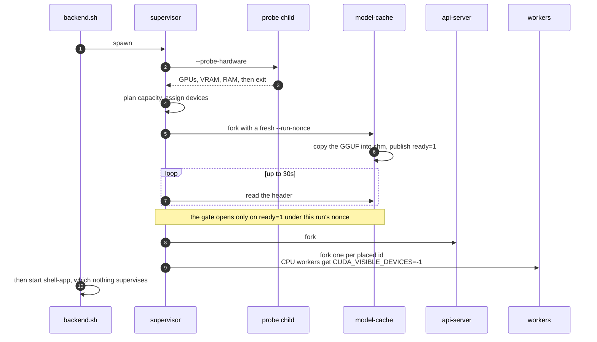
```mermaid
sequenceDiagram
    autonumber
    participant BS as backend.sh
    participant SUP as supervisor
    participant P as probe child
    participant MC as model-cache
    participant API as api-server
    participant W as workers
    BS->>SUP: spawn
    SUP->>P: --probe-hardware
    P-->>SUP: GPUs, VRAM, RAM, then exit
    SUP->>SUP: plan capacity, assign devices
    SUP->>MC: fork with a fresh --run-nonce
    MC->>MC: copy the GGUF into shm, publish ready=1
    loop up to 30s
        SUP->>MC: read the header
    end
    Note over SUP,MC: the gate opens only on ready=1 under this run's nonce
    SUP->>API: fork
    SUP->>W: fork one per placed id<br/>CPU workers get CUDA_VISIBLE_DEVICES=-1
    BS->>BS: then start shell-app, which nothing supervises
```

Every process writes `$EDGE_STATE_DIR/<name>.pid` on start and removes it on exit, so that
directory is the complete process list. The dashboard reads it instead of scraping `ps`.

---

## A request

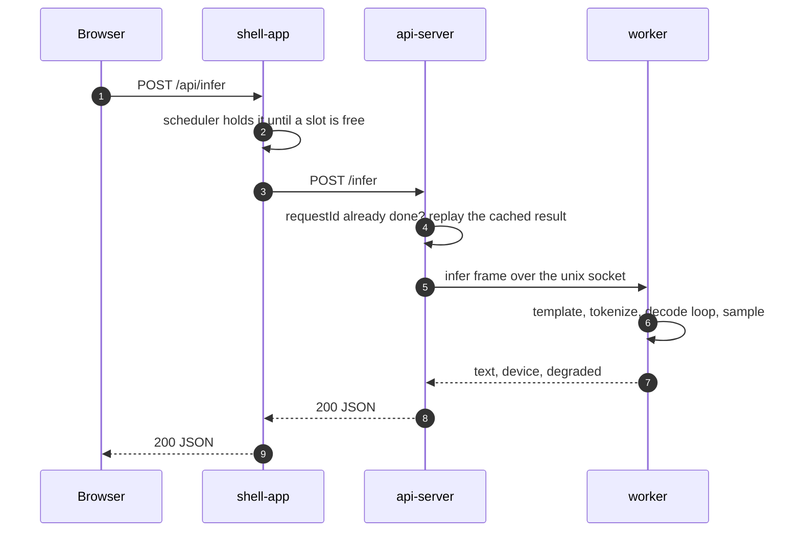
```mermaid
sequenceDiagram
    autonumber
    participant B as Browser
    participant S as shell-app
    participant A as api-server
    participant W as worker
    B->>S: POST /api/infer
    S->>S: scheduler holds it until a slot is free
    S->>A: POST /infer
    A->>A: requestId already done? replay the cached result
    A->>W: infer frame over the unix socket
    W->>W: template, tokenize, decode loop, sample
    W-->>A: text, device, degraded
    A-->>S: 200 JSON
    S-->>B: 200 JSON
```

If no worker is free the api-server answers 503 `no_ready_workers` with `Retry-After`, rather than
queueing a second time.

Streaming is two SSE hops with different vocabularies. The api-server sends `token`, `done` and
`error`. The shell parses that by hand and re-emits it, adding `queued`, `started`, `cancelled`
and `timeout` of its own.

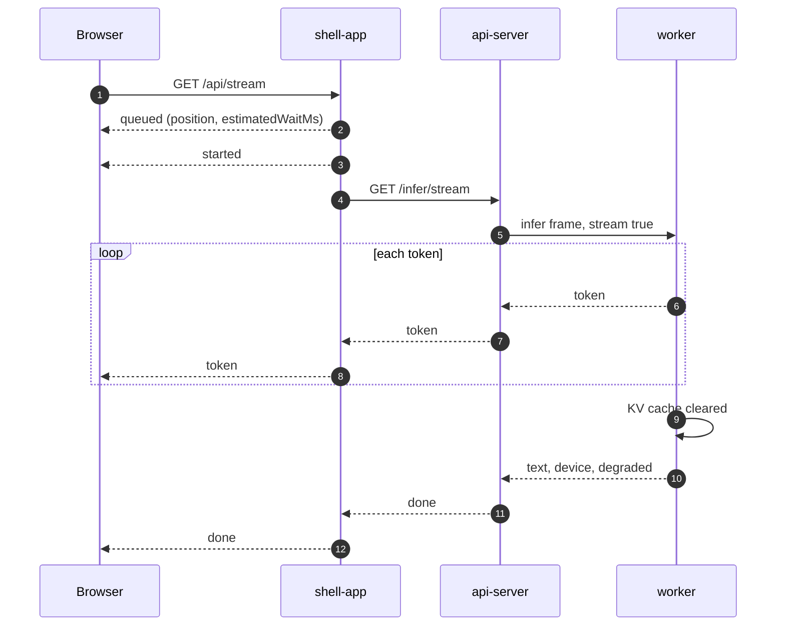
```mermaid
sequenceDiagram
    autonumber
    participant B as Browser
    participant S as shell-app
    participant A as api-server
    participant W as worker
    B->>S: GET /api/stream
    S-->>B: queued (position, estimatedWaitMs)
    S-->>B: started
    S->>A: GET /infer/stream
    A->>W: infer frame, stream true
    loop each token
        W-->>A: token
        A-->>S: token
        S-->>B: token
    end
    W->>W: KV cache cleared
    W-->>A: text, device, degraded
    A-->>S: done
    S-->>B: done
```

`queued` fires once, at admission, even at position 1. Nothing pushes updates while a job waits.

[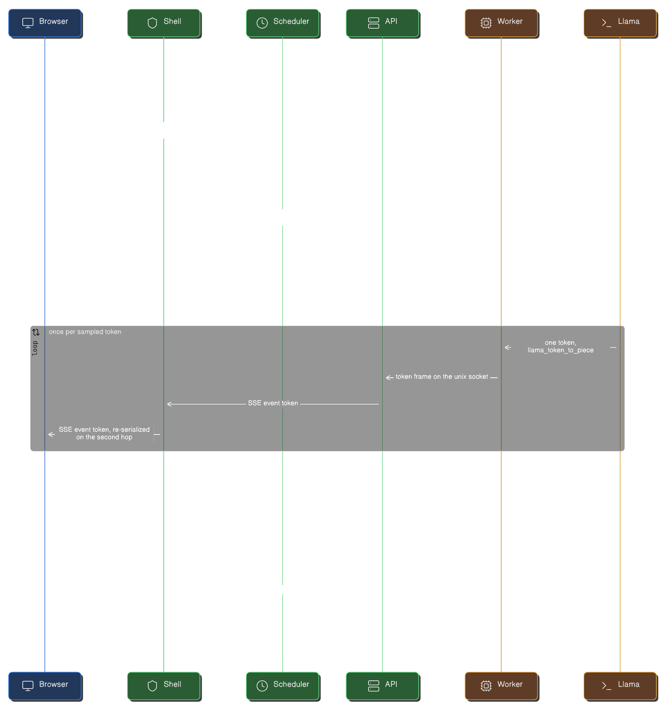](docs/diagrams/seq-1-token-stream.png)

**Cancelling does not stop llama.** It frees the scheduler slot and tears down the socket at once,
but the worker protocol has no cancel frame, so the decode loop runs to completion into a socket
nobody reads. Cancellation is accounting, not preemption.

[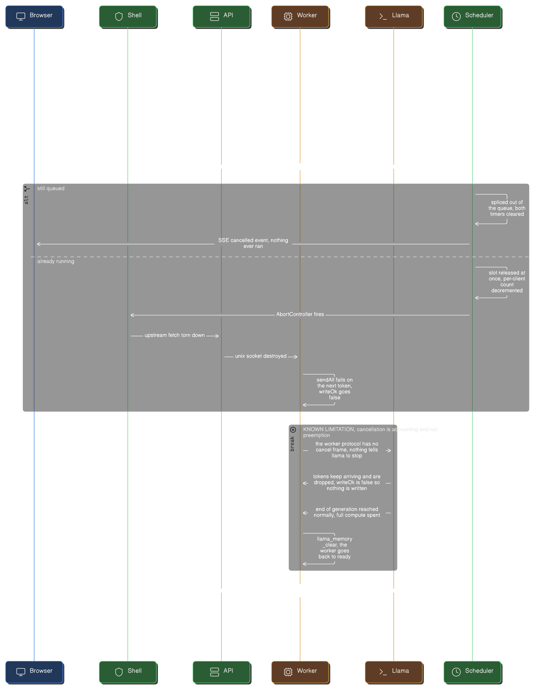](docs/diagrams/seq-3-client-disconnect.png)

There is no conversation state between requests. The KV cache is cleared after every generation,
so multi-turn chat works by sending the whole transcript as the prompt.

---

## Scheduling

| Limit | Variable | Shipped |
|---|---|---|
| Global slots | `EDGE_MAX_SLOTS` | 4 |
| Per-client slots | `EDGE_MAX_PER_MFE` | 2 |
| Queue depth | `EDGE_MAX_QUEUE` | 20 |
| Workers | `EDGE_WORKER_COUNT` | 4 |

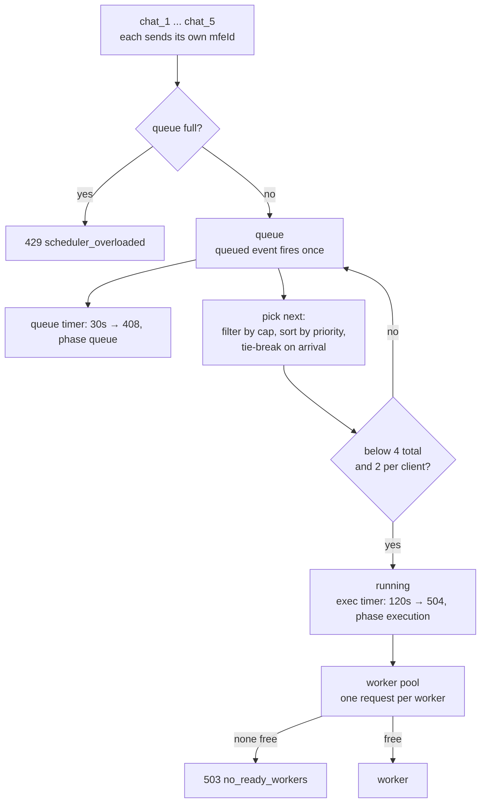
```mermaid
flowchart TB
    C["chat_1 ... chat_5<br/>each sends its own mfeId"] --> ADM
    ADM{"queue full?"} -->|yes| R429["429 scheduler_overloaded"]
    ADM -->|no| Q["queue<br/>queued event fires once"]
    Q --> QT["queue timer: 30s → 408, phase queue"]
    Q --> PICK["pick next:<br/>filter by cap, sort by priority,<br/>tie-break on arrival"]
    PICK --> GATE{"below 4 total<br/>and 2 per client?"}
    GATE -- no --> Q
    GATE -- yes --> ACT["running<br/>exec timer: 120s → 504, phase execution"]
    ACT --> POOL["worker pool<br/>one request per worker"]
    POOL -->|none free| R503["503 no_ready_workers"]
    POOL -->|free| W["worker"]
```

`EDGE_MAX_PER_MFE` must be strictly below `EDGE_MAX_SLOTS` or the rule is inert. Priorities are
`high` 300, `normal` 200, `low` 100, plus one point per `EDGE_AGING_MS` waited, so a `low` job
draws level with a fresh `normal` after about 25 minutes. Slow on purpose. The cost is that a
promoted `low` job can start ahead of a fresh `high` one.

The two caps are configured separately and can disagree. The pool sizes itself from the count the
supervisor actually placed. The scheduler cannot learn that number, so `EDGE_MAX_SLOTS` above the
workers that really started admits work the api-server then refuses.

---

## Using the hardware

The shipped model is 2.23 GiB. Four workers each loading it from disk would be four cold reads and
four resident copies, which would not fit in a 7.7 GB `/dev/shm`.

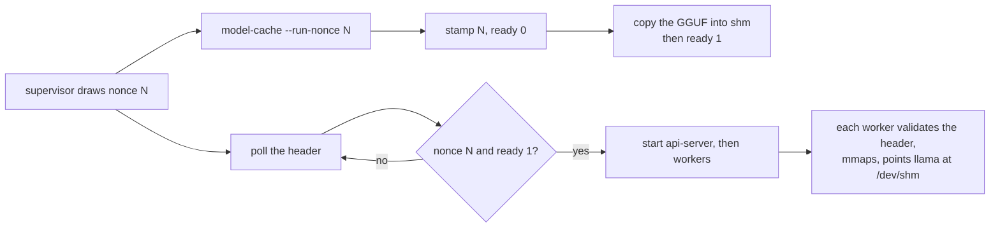
```mermaid
flowchart LR
  A["supervisor draws nonce N"] --> B["model-cache --run-nonce N"]
  B --> C["stamp N, ready 0"]
  C --> D["copy the GGUF into shm<br/>then ready 1"]
  A --> E[poll the header]
  E --> F{"nonce N and ready 1?"}
  F -- no --> E
  F -- yes --> G[start api-server, then workers]
  G --> H["each worker validates the header,<br/>mmaps, points llama at /dev/shm"]
```

The run nonce matters because shared memory outlives the run that made it, so a `ready=1` left by
a dead stack would otherwise look valid. A fresh nonce per start makes a stale flag another run's
business. Header layout and the full handshake: [docs/11-model-cache.md](docs/11-model-cache.md).

**Worker placement.** The supervisor probes real free VRAM and RAM in a short-lived child, then
`(freeVram - EDGE_GPU_RESERVE_MB) / EDGE_WORKER_GPU_MB` gives the GPU worker count and the same
sum over RAM gives the CPU count. `EDGE_WORKER_COUNT` is a ceiling, not a promise, so a worker the
plan cannot pay for is never started into an OOM-kill loop. On this host that places 1 CUDA plus 3
CPU workers against a ceiling of 4. That is a placement decision, not a benchmark.

The probe runs in its own short-lived process so the supervisor never initializes CUDA, which it
could not undo. A CPU worker is CPU-only because the supervisor sets `CUDA_VISIBLE_DEVICES=-1`
between fork and exec, not because `n_gpu_layers` is 0. Why both matter:
[docs/12-hardware-capacity.md](docs/12-hardware-capacity.md).

---

## When hardware fails

A worker starts on the best tier it can reach and walks down `EDGE_DEVICE_LADDER`, shipped as
`cuda,npu,ane,cpu,remote`. A tier with no backend fails its probe and is skipped, so one `.env`
works everywhere.

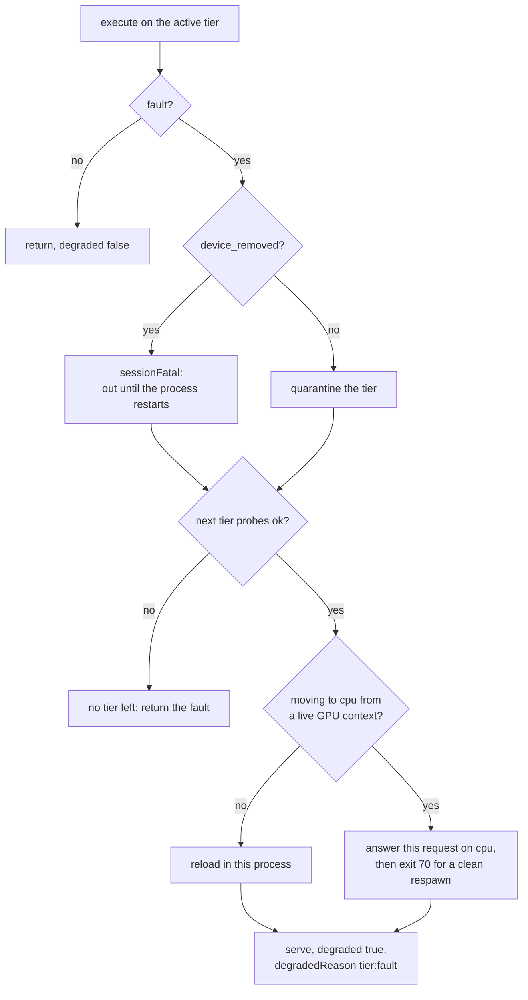
```mermaid
flowchart TD
  A[execute on the active tier] --> B{fault?}
  B -- no --> C[return, degraded false]
  B -- yes --> D{device_removed?}
  D -- yes --> E["sessionFatal:<br/>out until the process restarts"]
  D -- no --> F["quarantine the tier"]
  E --> G{next tier probes ok?}
  F --> G
  G -- no --> L[no tier left: return the fault]
  G -- yes --> H{moving to cpu from<br/>a live GPU context?}
  H -- no --> J[reload in this process]
  H -- yes --> K["answer this request on cpu,<br/>then exit 70 for a clean respawn"]
  J --> M["serve, degraded true,<br/>degradedReason tier:fault"]
  K --> M
```

A quarantined tier does not return when its window expires. It returns only after its probe passes
again. `device_removed` skips that gate entirely and stays out for the process, because
re-enumerating a removed device usually hands back a stale adapter. Exit 70 is a planned exit: no
crash-log line, no circuit-breaker tick.

`degraded` is measured against the best tier available at startup, not against being on CPU. A
CPU-only machine is not degraded. A machine that fell off `cuda` onto `cpu` is. The response adds
`device`, `degraded` and `degradedReason` and renames nothing, so an older client keeps working.

To exercise a fallback with no second accelerator: `EDGE_SIMULATE_DEVICE_FAULT=cuda:runtime`. It
fires once per worker, on the named tier only.

### A worker crash

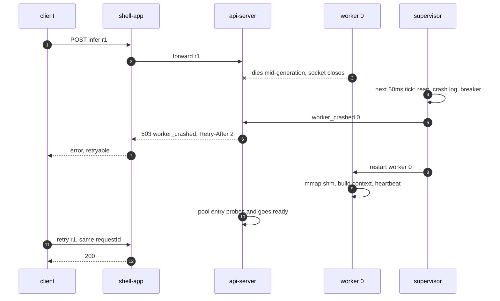
```mermaid
sequenceDiagram
  autonumber
  participant C as client
  participant SH as shell-app
  participant API as api-server
  participant W as worker 0
  participant S as supervisor
  C->>SH: POST infer r1
  SH->>API: forward r1
  W--xAPI: dies mid-generation, socket closes
  S->>S: next 50ms tick: reap, crash log, breaker
  S->>API: worker_crashed 0
  API-->>SH: 503 worker_crashed, Retry-After 2
  SH-->>C: error, retryable
  S->>W: restart worker 0
  W->>W: mmap shm, build context, heartbeat
  API->>API: pool entry probes and goes ready
  C->>SH: retry r1, same requestId
  SH-->>C: 200
```

[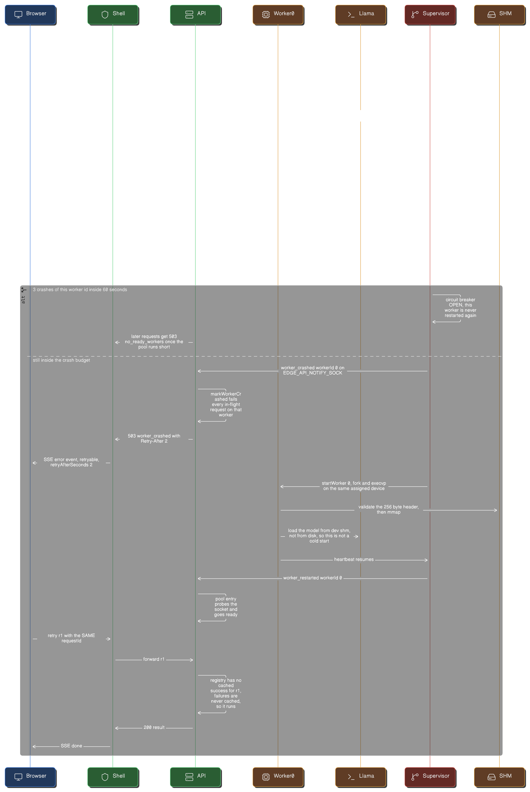](docs/diagrams/seq-2-worker-crash.png)

Detection is polling, not a signal handler: `monitorLoop` reaps, drains heartbeats and checks
liveness every 50 ms. A restart beats a cold start because the weights are still in `/dev/shm`, so
the replacement maps the segment instead of reading 2.3 GB off disk.

Two more guards. `waitpid` only reports death, so workers heartbeat every 50 ms with `busyMs`, and
a worker that goes silent or wedges on one request is SIGKILLed into the same path. And three
crashes of one child inside 60 seconds opens a circuit breaker that never closes, so that worker
stays down for the supervisor's lifetime.

Retrying is safe because the api-server coalesces concurrent submissions of one `requestId` and
caches successful results. Failures are deliberately not cached, or an id could never be retried.

---

## API

The browser talks to one process: the shell app on `127.0.0.1:3000`. An origin outside
`EDGE_ALLOWED_MFE_ORIGINS` gets no CORS headers back.

| Method | Path | Purpose |
|---|---|---|
| `POST` | `/api/infer` | Buffered inference, one JSON answer |
| `GET` | `/api/stream` | SSE inference, tokens as produced |
| `POST` | `/api/cancel` | Cancel a queued or running request |
| `GET` | `/api/queue-status` | Position and estimated wait for one id |
| `GET` | `/api/health` | Scheduler snapshot |
| `GET` | `/api/agent-health` | The api-server's own health document |

```json
POST /api/infer
{ "prompt": "What is 2+2?", "requestId": "smoke-1", "mfeId": "chat_1", "priority": "high" }

200
{ "requestId": "smoke-1", "result": "2 + 2 = 4.", "device": "cuda",
  "degraded": false, "degradedReason": null }
```

```
GET /api/stream?prompt=Say+hi&mfeId=chat_1

event: queued
data: {"requestId":"s1","position":1,"estimatedWaitMs":0}

event: token
data: {"requestId":"s1","token":" hi"}

event: done
data: {"requestId":"s1","result":"hi","device":"cuda","degraded":false,"replay":false}
```

Seven events reach the browser: `queued`, `started`, `token`, `done`, `cancelled`, `timeout`,
`error`. Read `phase` on `timeout` to tell a queue timeout (408) from an execution timeout (504).
Errors are 400, 408, 409, 429, 499, 502, 503 and 504, each with an `error` string. The full
contract is in [docs/07-api-server.md](docs/07-api-server.md) and
[docs/05-shell-app.md](docs/05-shell-app.md).

> **Legacy defaults.** If a caller omits `mfeId`, the shell substitutes `doc-qa` on `/api/infer`
> and `meeting-summary` on `/api/stream`. These are leftover string literals, not clients. Nothing
> in this repo is served under either name, and every shipped page sends `chat_1` to `chat_5`.

---

## Running it

Linux only in practice: POSIX shared memory, AF_UNIX sockets and `/proc/meminfo` are used
directly. Known-good here: CMake 3.28.3, a C++17 compiler, Node v24.17.0, pnpm 11.17.0.

```bash
cp .env.example .env

hf download microsoft/Phi-3-mini-4k-instruct-gguf \
  Phi-3-mini-4k-instruct-q4.gguf --local-dir ./backend/models   # 2.3 GB, not automatic

make build                                   # cmake + npm install
cd clients && pnpm install && pnpm -r run build && cd ..
cd dashboard && pnpm install && pnpm build && cd ..

make run                                     # stop, build, start all three tiers
```

`make backend`, `make clients` and `make dashboard` each start one tier, and each has its own
`-stop`. A cold CUDA build takes several minutes, almost all of it ggml's kernels.

To work on the plumbing with no GPU and no model file:

```bash
cmake -S backend -B build -DEDGE_ENABLE_LLAMA=OFF && cmake --build build -j"$(nproc)"
```

Every llama include is guarded, so the tree builds and `InferEngine::generate()` returns
`"Inference response: <prompt>"`. That is not inference.

```bash
curl -X POST http://127.0.0.1:3000/api/infer -H 'Content-Type: application/json' \
  -d '{"prompt":"What is 2+2?","requestId":"smoke-1","mfeId":"chat_1","priority":"high"}'
pkill -f edge-inference-worker    # expect 503, then a new line in $EDGE_CRASH_LOG
ls -l /dev/shm/edge-model-weights # one shared copy, not one per worker
```

Open `http://127.0.0.1:5000` for all five clients at once, or `:3001` for the dashboard. Changing
a port means updating its `*_URL` or `*_BASE` variable **and** `EDGE_ALLOWED_MFE_ORIGINS`.

Full setup and troubleshooting: [docs/19-build-and-run.md](docs/19-build-and-run.md),
[docs/21-troubleshooting.md](docs/21-troubleshooting.md).

---

## Testing

`make test` runs both suites in about three seconds. Measured here: **321 tests, 0 failures**, 91
JavaScript and 230 C++. No test needs the model file, a GPU, a network or a running stack.

| Suite | Count | Covers |
|---|---|---|
| `node --test tests/` | 91 | Scheduler, worker pool, request registry, env parser, retry, remote transport |
| `edge-device-tests` | 28 | Ladder selection and vendor error mapping |
| `edge-worker-json-tests` | 15 | Frame parsing |
| `edge-hardware-tests` | 144 | Capacity planning, backend assignment, the NPU and ANE state machines, fault injection |
| `edge-remote-recovery-tests` | 32 | The remote tier's policy gates and the climb back up |
| `edge-model-cache-tests` | 11 | The shm ready handshake and header layout |

Covered failure cases: a stale `ready=1`, a foreign run nonce, a crash failing its
in-flight request, a worker whose socket never appears, a GPU worker moved to CPU, quarantine and
the health gate, and a fallback mid-stream. The NPU and ANE state machines run through **injected
fakes**. That proves the policy, not the vendor SDKs. See [docs/20-testing.md](docs/20-testing.md).

---

## Limitations

- **The NPU and ANE paths have never executed on hardware.** `metal`, `accelerate`, `rocm`,
  `vulkan` and `directml` are probe entries with no backend in this build.
- **No performance numbers anywhere.** No benchmark harness exists here. Every ordering claim
  about device speed is an ordering, not a measurement.
- **Cancel does not stop llama.** The worker has no cancel frame, so it finishes its token loop.
- **The circuit breaker has no half-open state.** Once open it stays open for the supervisor's
  lifetime, and the crash log it counts from is never rotated.
- **The scheduler never learns the effective worker count.** The api-server does, the shell does
  not, so `EDGE_MAX_SLOTS` above the workers that really started admits work that gets a 503.
- **Queue position is one snapshot.** `queued` fires once and nothing pushes updates.
- **One model, no hot swap. Single host, no authentication.** The only access controls are
  loopback binding and the CORS allowlist.
- **`EDGE_CLIENT_RETRY_*` is exported and then ignored**, so the client defaults win.

Possible improvements: feed the effective worker count into the scheduler, close the
breaker on a timer and rotate its log, add a cancel frame to the worker protocol, push queue
position on the open stream, and run the Hexagon and Core ML adapters on the hardware they were
written for.

---

## Documentation

[docs/main_docs.md](docs/main_docs.md) is the entry point and opens with four diagrams of the whole
system. Twenty-four documents sit behind it.

| Area | Start at |
|---|---|
| Shape of the system | [01 overview](docs/01-overview.md), [02 process model](docs/02-process-model.md), [03 configuration](docs/03-configuration.md) |
| A request, end to end | [04 request path](docs/04-request-path.md), [05 shell app](docs/05-shell-app.md), [06 scheduler](docs/06-scheduler.md), [07 api-server](docs/07-api-server.md), [08 idempotency](docs/08-idempotency.md) |
| The worker and the model | [09 inference worker](docs/09-inference-worker.md), [10 llama integration](docs/10-llama-integration.md), [11 model cache](docs/11-model-cache.md) |
| Hardware and failure | [12 hardware and capacity](docs/12-hardware-capacity.md), [13 device fallback](docs/13-device-fallback.md), [accelerators](docs/device-fallback.md), [14 crash recovery](docs/14-crash-recovery.md), [15 remote fallback](docs/15-remote-fallback.md), [build matrix](docs/build-matrix.md) |
| Everything else | [16 IPC protocols](docs/16-ipc-protocols.md), [17 clients](docs/17-clients.md), [18 dashboard](docs/18-dashboard.md), [19 build and run](docs/19-build-and-run.md), [20 testing](docs/20-testing.md), [21 troubleshooting](docs/21-troubleshooting.md) |
