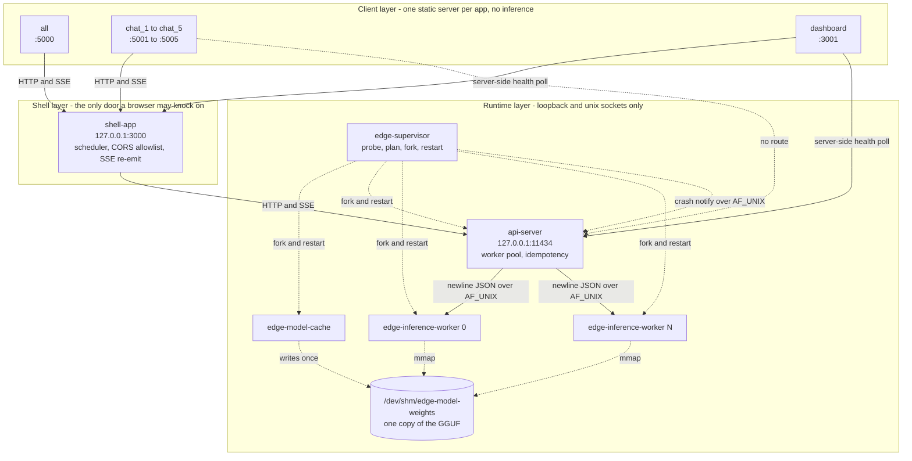
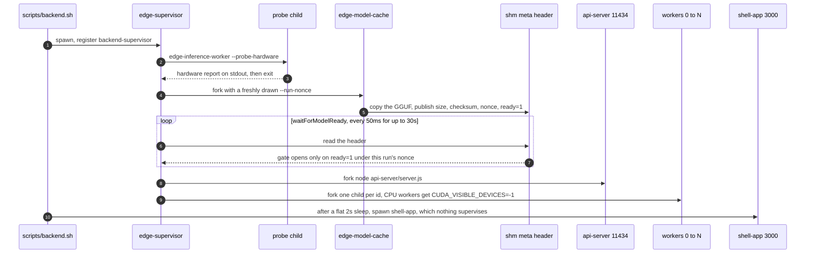
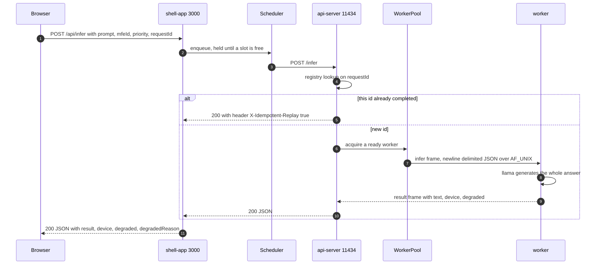
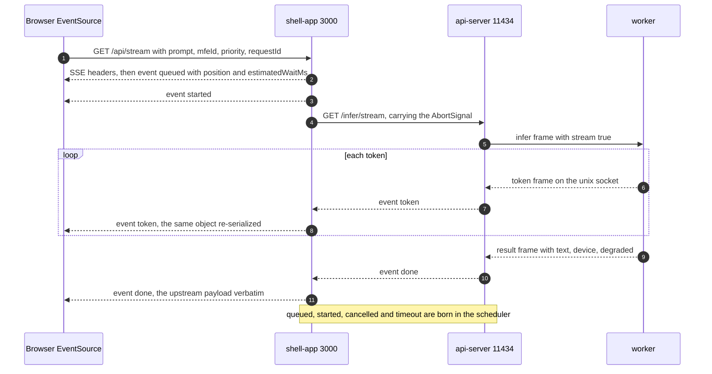
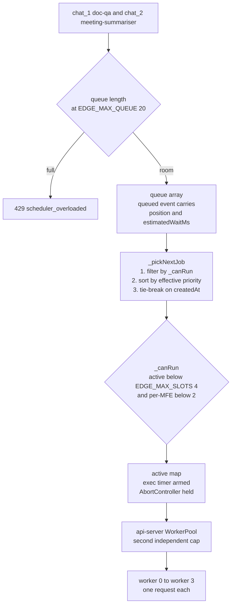
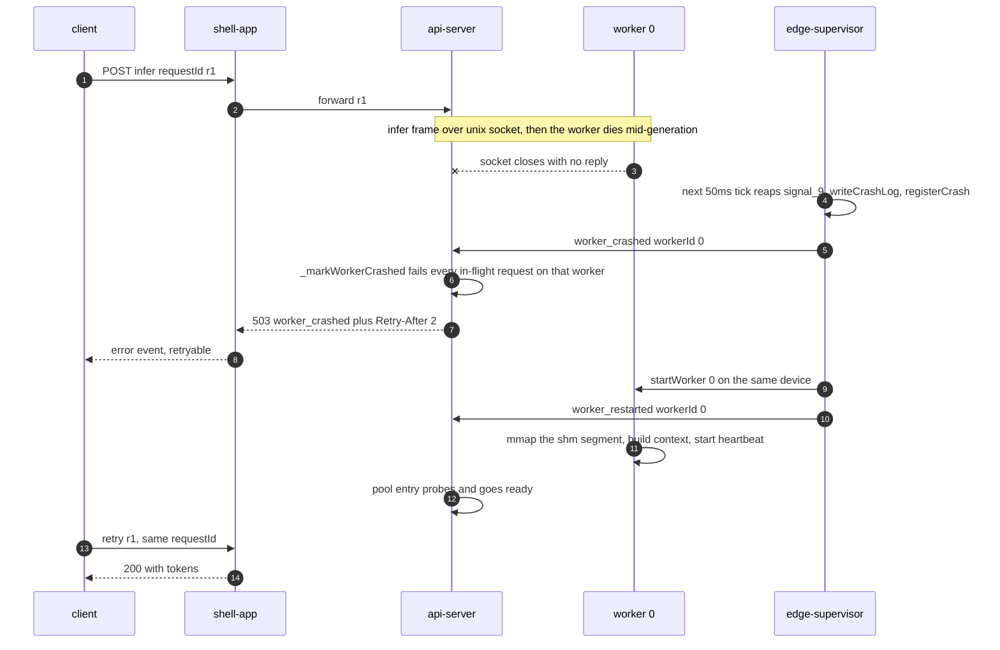
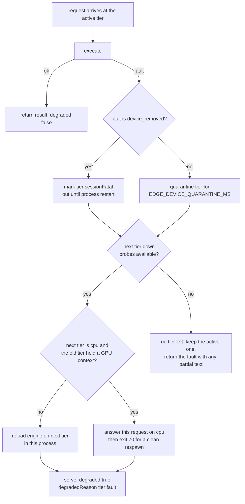
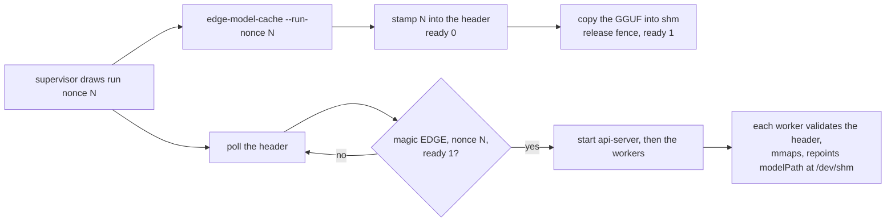

# ServeInfer

**Runs a GGUF language model on the machine in front of you, and gets as much out of that machine
as it can.**

On-device means the weights never leave the box: no per-token bill, no network round trip, and it
still answers with the network down. The constraint is that one machine has a fixed amount of
VRAM, RAM and cores, and a 2.3 GB model will take all of it if you let it. Everything here is
about spending that budget deliberately.

### How it stays efficient

- **The weights are loaded once.** `edge-model-cache` copies the GGUF into `/dev/shm` and every
  worker mmaps the same segment. Four workers cost one copy, not four, and a worker restart is a
  remap rather than a 2.3 GB reload from disk.
- **The machine is measured before anything starts.** A short-lived probe child reports real free
  VRAM and RAM, then `placeableWorkerCount` decides how many workers the machine can actually pay
  for. `EDGE_WORKER_COUNT` is a ceiling, not a promise, so a worker with no budget is never started
  into an OOM-kill loop.
- **Each worker is placed on the hardware it can use.** The plan assigns GPU slots while VRAM
  lasts and CPU for the rest, and a CPU worker is made CPU-only by hiding the device before
  `execvp`, not by asking llama nicely.
- **Work falls down the device ladder instead of failing.** `cuda → npu → ane → cpu → remote`. A
  tier that faults is quarantined, health-checked, and taken back when it recovers. The cloud tier
  is last and off unless you opt in.
- **The model stays resident.** Workers are a fixed pool holding one request each, so nothing
  reloads or thrashes between requests, and admission is decided up front by a scheduler rather
  than by whoever calls fastest.
- **A dead worker is not a dead API.** The api-server, the workers and the model cache are separate
  processes under a supervisor that restarts them, behind a circuit breaker, and kills any worker
  that hangs.

### What you get when you run it

| Open this | And you see |
|---|---|
| `http://127.0.0.1:5000` | all five chat clients side by side on one page |
| `http://127.0.0.1:5001` to `:5005` | `chat_1` to `chat_5`, each on its own |
| `http://127.0.0.1:3001` | the operator dashboard: processes, workers, queue, probed hardware |
| `http://127.0.0.1:3000` | the shell API, the only address a browser is allowed to call |
| `127.0.0.1:11434` | the inference API, loopback only, no browser can reach it |

Answers stream back token by token, and each client shows the queue position, the device the
request ran on, and every lifecycle event as it happens.

### Reading the code: `edge` is ServeInfer

The product is called ServeInfer, but every binary, identifier, environment variable and log
prefix says `edge` or `EDGE_`: `edge-supervisor`, `edge-inference-worker`, `EDGE_MAX_SLOTS`,
`$EDGE_STATE_DIR`. That is deliberate and none of it is being renamed, so when you read `edge`,
read ServeInfer.

---

## Contents

- [Architecture](#architecture)
- [Tech Stack](#tech-stack)
- [How It Works](#how-it-works)
  - [Processes and startup](#processes-and-startup)
  - [The request lifecycle](#the-request-lifecycle)
  - [Inference](#inference)
  - [Streaming](#streaming)
  - [Scheduling and concurrency](#scheduling-and-concurrency)
  - [Crash recovery](#crash-recovery)
  - [Device fallback](#device-fallback)
  - [Model caching](#model-caching)
- [Core Design Decisions](#core-design-decisions)
- [API](#api)
- [Implementation](#implementation)
- [Setup and Usage](#setup-and-usage)
- [Testing](#testing)
- [Limitations and Improvements](#limitations-and-improvements)

Full implementation detail lives in [docs/](docs/), starting at
[docs/main_docs.md](docs/main_docs.md).

---

## Architecture

The system is three layers. Each one is a separate set of processes with its own lifecycle, and
no layer supervises the layer above or below it.

| Layer | Processes | Owns | Not allowed to |
|---|---|---|---|
| Client | six React apps, `all` on `:5000` and `chat_1` to `chat_5` on `:5001` to `:5005`, plus the operator dashboard on `:3001`. Each is a static build served by its own small `node:http` server | Rendering, user controls, retry with the same `requestId`, showing queue position and degraded mode | Import anything from `backend/`. Call the inference API. Learn the inference API's address at all |
| Shell | one Node service, `shell-app` on `127.0.0.1:3000` | The [scheduler](docs/06-scheduler.md), the CORS origin allowlist in `EDGE_ALLOWED_MFE_ORIGINS`, the browser-facing SSE stream, and the injected `/config.js` that tells a page where the shell is | Load a model. Talk to a worker. Run inference itself |
| Runtime | `edge-supervisor`, `edge-model-cache`, the Node `api-server` on `127.0.0.1:11434`, and N `edge-inference-worker` C++ processes | Process supervision and restart, hardware probing and capacity planning, the shared-memory copy of the model, the worker pool, idempotent replay, and llama.cpp itself | Serve a browser. Bind anything but loopback or a unix socket. Link llama into the supervisor, which would cost it a CUDA context it can never return |

Each app server hands its page one value, `shellApiBase`, through a generated `/config.js`
([clients/chat_1/server.js](clients/chat_1/server.js)). No page is told the api-server exists, and
the api-server binds `127.0.0.1` and answers no browser origin. The inference API is unreachable
from a browser by design, not by deployment accident. The dashboard reads api-server health
server-side in `dashboard/server.js` and serves the result as its own `/status`.



### How the layers talk

| Hop | Transport | Detail |
|---|---|---|
| Browser to shell | HTTP and SSE on `:3000` | `POST /api/infer`, `GET /api/infer/stream`. The shell adds `queued`, `started`, `cancelled` and `timeout` events of its own |
| Shell to api-server | HTTP and SSE on `127.0.0.1:11434` | The shell parses the api-server's `token`, `done` and `error` stream by hand and re-emits its own |
| api-server to worker | newline-delimited JSON over AF_UNIX | One connection per request, on `$EDGE_WORKER_SOCKET_PREFIX<id>.sock` |
| Supervisor to api-server | newline-delimited JSON over AF_UNIX | Crash notifications on `$EDGE_API_NOTIFY_SOCK`, which fail in-flight requests with 503 |
| Worker to supervisor | newline-delimited JSON over AF_UNIX | A heartbeat every 50 ms on `$EDGE_SUPERVISOR_SOCK`, carrying the age of the request in flight. The supervisor kills and restarts a worker that goes silent or wedges on one request |
| Worker to model | POSIX shared memory | Each worker validates a 256-byte header, then mmaps `/dev/shm/edge-model-weights` |

Every frame on every socket is in [the IPC protocols](docs/16-ipc-protocols.md), and the
hop-by-hop walk of one request is in [the request path](docs/04-request-path.md).

---

## Tech Stack

The dependency list is deliberately short. The C++ side has no JSON library at all and parses
frames with `std::regex`, and the tests add nothing beyond `node:test` and a small assert harness.

| Component | Language and runtime | Notable dependencies |
|---|---|---|
| `shell-app`, `api-server` | Node.js 24, CommonJS | `express` 4 for routing. Everything else is `node:net`, `node:fs`, `node:http`, `node:crypto` |
| Scheduler, worker pool, request registry | Node.js 24 | None. Standard library only |
| Optional remote fallback tier | Node.js 24 | `sarvamai`, loaded lazily and only when the remote tier is turned on |
| `edge-supervisor`, `edge-model-cache` | C++17, CMake 3.18 or newer | POSIX and `rt` only. No llama, on purpose |
| `edge-inference-worker` | C++17 | Vendored llama.cpp at commit `e85caa81`, upstream build 10582, ggml `0.21.0`. CUDA optional through `EDGE_ENABLE_CUDA` |
| Client apps and dashboard | React 19, Vite 8, Tailwind 4 | One pnpm workspace. The five chat pages and `all` share `@serveinfer/chat-shared` |
| Client and dashboard static servers | Node.js, ESM | None. `node:http` and `node:fs` |
| Tests | `node --test` and a hand-rolled C++ harness | None |

The vendored llama.cpp tree in `backend/inference-worker/llama-src` is a byte-exact, unmodified
subset of upstream at that commit, verified file by file. Which backends a given build can
actually contain, and why one binary cannot hold CUDA, Metal and Hexagon at once, is
[the build matrix](docs/build-matrix.md).

---

## How It Works

### Processes and startup

`make run` leaves 15 processes alive on the shipped configuration: 8 in the backend tier, 6
client servers and the dashboard. A ninth, the hardware probe, lives under a second at startup.

| Process | What it does | Lifecycle |
|---|---|---|
| `edge-supervisor` | Forks and owns the model cache, the api-server and the workers. Restarts them, keeps the crash log, holds the circuit breaker. Links only `rt`, never llama. | Persistent, one |
| `edge-inference-worker --probe-hardware` | Short-lived child that reports GPUs, VRAM and RAM on stdout. It runs in its own process because touching a ggml device initializes CUDA, and the supervisor must never pay that cost. | On-demand, exits after one report |
| `edge-model-cache` | Copies the GGUF into `/dev/shm`, publishes size, checksum, run nonce and `ready=1` in a 256-byte header, then sleeps holding the segment. | On-demand at startup, then idle for the run |
| api-server, `node backend/api-server/server.js` | HTTP on `127.0.0.1:11434`. Idempotency registry, worker pool, SSE out. Never reachable from a browser. | Persistent, one |
| `edge-inference-worker` 0 to N | One in-flight request each. Validates the shm header, mmaps the weights, runs llama. `EDGE_WORKER_COUNT` is 4 by default and is a ceiling, not a promise. | Pooled, restarted on crash |
| shell-app, `node backend/shell-app/server.js` | HTTP on `127.0.0.1:3000`. The only address a browser knows. Scheduler, CORS allowlist, second SSE hop. | Persistent, one, unsupervised |
| Client servers `all`, `chat_1` to `chat_5` | Six static React pages on `:5000` to `:5005`. Each injects `shellApiBase` through a generated `/config.js`. | Persistent, start-once |
| dashboard | Operator view on `:3001`. Reads the pidfile registry and `/health`. | Persistent, start-once |

Each writes `$EDGE_STATE_DIR/<name>.pid` on start and removes it on exit, so that directory is the complete process list. The dashboard reads it instead of scraping `ps`.

**There are two independent process trees, not one.** `scripts/backend.sh start` launches the
supervisor, then two seconds later the shell app as a plain background job. The supervisor owns
the three boxes under it and nothing else: not the shell app, not the clients, not the dashboard.
Kill it and the model cache, api-server and every worker die with it, while `:3000`, `:5000` to
`:5005` and `:3001` keep serving. A crash in the inference tier cannot take the API tier with it.

Startup order is strict, and the gate in the middle is the one to remember: nothing else starts
until the model cache publishes `ready=1` **under this run's nonce**, so a leftover flag from a
dead stack is ignored.



The registry, every listener and every startup failure message: [docs/02-process-model.md](docs/02-process-model.md).

### The request lifecycle

`POST /api/infer` is the buffered path: one request in, one JSON body out. The browser only ever
talks to the shell on `:3000`. The scheduler holds the job until a slot is free, the api-server
checks the id against the idempotency registry before any work starts, and the pool hands it to a
worker in state `ready`, or answers 503 `no_ready_workers` with a `Retry-After` header. Every hop
and failure exit: [docs/04-request-path.md](docs/04-request-path.md).



### Inference

Inside the worker, `InferEngine` is the only code that calls llama.cpp. The prompt is wrapped in
the model's instruct template first, because the shipped model is instruct-tuned and a bare prompt
gets completed as text instead of answered. `EDGE_PROMPT_TEMPLATE` overrides the wrapper.

The wrapped string goes through `llama_tokenize`, then one `llama_decode` of the prompt batch. The
decode loop builds a fresh sampler chain per request, samples a token, detokenizes it with
`llama_token_to_piece` and feeds it back in. It ends on end-of-generation, `EDGE_MAX_TOKENS`, an
attempts budget or a failed decode. `llama_memory_clear` then wipes the KV cache, so **there is no
conversation state between requests**. Multi-turn chat works because the client sends the whole
transcript as the prompt.

The model is loaded from `/dev/shm`, not disk: the worker repoints its model path at the segment before `llama_model_load_from_file` sees it, so N workers do not cost N copies of the weights.

One honest limitation: with `EDGE_ENABLE_LLAMA=OFF` there is no model and no llama at all, and
`InferEngine::generate()` returns the fixed string `Inference response: <prompt>`. That path lets
the tree build and the tests run without a GPU or a 2.3 GB download, and it is not inference.
Full walkthrough: [docs/10-llama-integration.md](docs/10-llama-integration.md).

### Streaming

Streaming is **two SSE hops** that do not speak the same vocabulary. The api-server emits SSE to the shell.
The shell parses it by hand, splitting on `event:` and `data:` lines, then re-emits its own SSE to the browser
with four events the api-server never sends.

| Hop | Events |
|---|---|
| api-server to shell | `token`, `done`, `error` |
| shell to browser | those three plus `queued`, `started`, `cancelled`, `timeout` |



`queued` always fires, even at position 1 with every slot free. Changing a token payload shape means editing both hops.

One thing surprises people: **cancelling does not stop llama.** A cancel tears down the shell's
fetch, the api-server destroys the unix socket and the scheduler frees the slot at once, but the
worker protocol has no cancel frame. The worker's `sendAll` fails, `writeOk` goes false and it
stops writing, while the decode loop generates to completion into a socket nobody reads. An
aborted request costs the same compute as one read to the end. More in [docs/05-shell-app.md](docs/05-shell-app.md).

### Scheduling and concurrency

The runtime runs a fixed number of inference requests at once. The rest wait in a queue, and
anything past the queue is refused with a number the client can act on.

| Limit | Variable | Shipped | What it caps |
|---|---|---|---|
| Global slots | `EDGE_MAX_SLOTS` | 4 | Jobs running at the same time |
| Per-client slots | `EDGE_MAX_PER_MFE` | 2 | Slots any single `mfeId` may hold |
| Queue depth | `EDGE_MAX_QUEUE` | 20 | Waiting jobs before 429 |
| Workers | `EDGE_WORKER_COUNT` | 4 | Worker processes, one request each |

The scheduler is one dependency-free class in [scheduler.js](backend/shell-app/scheduler.js).
The queue is a plain array, not a sorted structure: order is decided at selection time by
`_pickNextJob`, which filters by `_canRun`, sorts by effective priority, then breaks ties on
arrival time. Filtering before sorting means a job blocked by its client's cap is stepped
over rather than blocking the queue behind it.



**Per-client fairness.** `EDGE_MAX_PER_MFE` is why one client app cannot take all four slots.
It must be strictly less than `EDGE_MAX_SLOTS` or the rule does nothing: with both at 4, a
client reaching 4 active jobs has already hit the global cap. At the shipped 4 and 2 a
flooder holds half the machine, and a quiet client's `low` job starts ahead of its `high` one.

**Priority.** Three levels, normalized from free text, anything unrecognized becoming `normal`.

| Level | Base score | For |
|---|---|---|
| `high` | 300 | Work the user just triggered, such as a submitted prompt |
| `normal` | 200 | The default for anything that does not say |
| `low` | 100 | Background prefetch and speculative warm-up |

**Starvation prevention.** A waiting job scores its base plus one point per whole
`EDGE_AGING_MS` waited (15000 shipped), so a `low` job draws level with a freshly arrived
`normal` after about 25 minutes and with a fresh `high` after about 50, winning the tie
because it arrived first. Slow on purpose: background work stops starving without ever
jumping interactive work on a normal timescale.

**Cancellation and timeouts.** Two separate bounds, and the SSE `timeout` event carries
`phase` so a client can tell them apart.

| Bound | Variable | Fires while | HTTP | `phase` | What is aborted |
|---|---|---|---|---|---|
| Queue wait | `EDGE_QUEUE_TIMEOUT_MS` 30000 | queued | 408 | `queue` | Nothing is running. The job is spliced out of the queue, both timers cleared |
| Execution | `EDGE_EXEC_TIMEOUT_MS` 120000 | running | 504 | `execution` | The job's `AbortController` fires, tearing down the shell's upstream fetch to the api-server |

`cancel(requestId)` looks in the queue, then the active map, then the finished map. A queued
job is spliced out and gets a `cancelled` event, an active one has its `AbortController`
fired and settles later, and a browser disconnect calls the same thing. The slot is released
by whichever comes first, the job settling or the execution timer, so a job that ignores its
abort signal still gives it back on time.

**Backpressure.** Four signals reach the client: `position` and `estimatedWaitMs` on the
`queued` event, `retryable: true` on both timeout kinds, 429 `scheduler_overloaded` at the
queue cap, and `Retry-After` on the api-server's 503s. The clients use all four.

**Two caps, configured separately.** The shell's scheduler admits against `EDGE_MAX_SLOTS`.
The api-server's `WorkerPool` allows one in-flight request per worker and answers 503
`no_ready_workers` when none is free. The pool sizes itself from the count the supervisor
actually placed, read from the model config JSON by
[workerCountSource.js](backend/api-server/workerCountSource.js). The scheduler cannot learn
that number, so `EDGE_MAX_SLOTS` above the workers that really started admits work the
api-server refuses. Detail in [docs/06-scheduler.md](docs/06-scheduler.md).

### Crash recovery

A worker can die mid-request and nothing else goes down with it. The supervisor discovers
the death by polling, not through a signal handler: `monitorLoop` runs `reapChildren`,
`drainSupervisorSocket` and `checkWorkerLiveness` every 50 ms, so detection waits for the
next tick and everything after it runs inline on that tick. There is no hard latency
guarantee in the code, only one poll interval plus a socket write.

`handleCrash` in [supervisor.cpp](backend/supervisor/supervisor.cpp) then runs in a fixed order:
clean up the pidfile and health entries, hand exit 70 to the device fallback path, write the crash
log line, notify the api-server, ask the breaker, restart, notify `worker_restarted`.



Reusing `requestId` on the retry is safe because the request registry coalesces concurrent
submissions of one id and caches successful results. Failures are not cached, so a failed id
replays.

| Path | Contents | Survives a restart |
|---|---|---|
| `$EDGE_STATE_DIR/<name>.pid` | One pidfile per process, the complete process list | No. Written on start, removed on exit, including for the supervisor's children |
| `$EDGE_INFLIGHT_PATH` | Open request ids, written temp-file-plus-rename | Yes. Read back at boot and reported under `/health` as `requests.orphanedFromPreviousRun` |
| `$EDGE_CRASH_LOG` | One JSON line per crash, with `ts`, `pid`, `type`, `workerId` and `reason` | Yes, and it is never rotated |
| `$EDGE_MODEL_CONFIG_PATH` | Model path, shm name, placed `workerCount` beside `configuredWorkerCount`, hardware, capacity plan, per-worker devices | Rewritten on every supervisor start |

**Why a restart beats a cold start.** The weights are still in `/dev/shm`, so the replacement maps
the segment instead of reading 2.3 GB off disk. See [docs/11-model-cache.md](docs/11-model-cache.md).

**The circuit breaker.** Three crashes inside 60 seconds and the supervisor stops restarting
that child. The key is the worker id, with sentinels for the model cache and the api-server,
so one bad worker does not stop the others coming back. Once open it stays open for the
supervisor's lifetime: no half-open state, no retry timer, and the stack runs with fewer
workers until someone restarts it, with one line on stderr as the only signal.

**Hang detection is separate.** `waitpid` only reports death, so a wedged worker would sit in
the pool forever. Workers heartbeat to `$EDGE_SUPERVISOR_SOCK` every 50 ms with their status
and `busyMs`, the elapsed time on the current request. A worker silent past
`EDGE_WORKER_HEARTBEAT_TIMEOUT_MS`, or whose `busyMs` passes `EDGE_WORKER_STUCK_REQUEST_MS`
(180000, above the execution timeout on purpose), is SIGKILLed. That kill lands as an
ordinary death and takes the sequence above, crash log line and breaker tick included.
Detail in [docs/14-crash-recovery.md](docs/14-crash-recovery.md).

### Device fallback

A worker starts on the best device it can reach and walks down a list when that device stops
answering. That list is the ladder. `EDGE_DEVICE_LADDER` names the tiers, highest first, and ships as
`cuda,npu,ane,cpu,remote`. A tier with no backend compiled in fails its probe and is skipped, so one
`.env` works on all three platforms.

**What has never run on real hardware.** The Qualcomm Hexagon NPU and the Apple Neural Engine paths
have never executed a single inference, and neither backend can be compiled on this machine. What is
implemented and tested is the policy around them: the per-tier probes, the adapters, the vendor error
mapping (DXGI, Win32, QNN families, CoreMedia, Core ML), the quarantine and health-gate state
machine, and the fallback and recovery flow, all driven through injected fakes. Both adapters refuse
to execute rather than fake success, and `EDGE_SIMULATE_DEVICE_FAULT=[<tier>:]removed|unsupported|runtime`
exercises the path without them.

#### Fault detection, quarantine, and the health gate

A fault is whatever the active adapter reports as a failure: a non-zero `llama_decode` return, a
vendor error code, or an adapter that cannot execute. `deviceLadder.cpp` classifies it as
`device_unavailable`, `device_removed`, `unsupported_operation` or `runtime_error`, then
`reportFault` quarantines the tier for `EDGE_DEVICE_QUARANTINE_MS` (60 s shipped) and re-runs
selection so the request lands on the next tier down.

**A quarantined tier does not come back just because its window expired.** `recoverEligibleTier` runs
once per request and only readmits a tier after its probe passes again, so the device is never
retried until a health check succeeds. Probe results are cached for
`EDGE_DEVICE_PROBE_INTERVAL_MS`, so a benched tier is not re-probed on every request.

#### The unrecoverable case

A `device_removed` fault is not quarantined. It sets `sessionFatal` and the tier stays out until the
worker restarts. Windows `ERROR_DEVICE_REMOVED` and the DXGI removed, hung and reset family map here,
because re-enumerating a removed device in the same process usually hands back a stale adapter, so a
longer quarantine would only fault again on a slower cadence. Apple's side is asymmetric on purpose:
nothing Core ML returns maps to removed, and `kCMErrorUnsupportedOperation` means the device is
healthy and cannot run this graph, so it quarantines and a different model may use it later.

#### Escalation order



| Tier | Cost relative to the tier above |
|---|---|
| `cuda` / `npu` / `ane` | the accelerator the machine was bought for |
| `metal`, `directml`, `vulkan`, `rocm` | still on-device GPU, higher power draw than a dedicated NPU |
| `cpu` | large throughput loss, always available, cannot fail from a missing driver |
| `remote` | network latency, and the prompt leaves the device. Opt-in only |

**These relative figures are not measured in this project.** There is no Snapdragon part or Apple
silicon in reach and no benchmark harness here, so the ladder encodes an ordering, not numbers. One
consequence: `EDGE_EXEC_TIMEOUT_MS` has to be sized for the worst tier on the ladder, or a legitimate
CPU fallback gets killed as a stuck job.

The bottom rung is a remote API, off unless an operator sets `EDGE_REMOTE_FALLBACK_ALLOWED=1`. A
credential is not consent: a key someone left in `.env` must never quietly turn into "every prompt
leaves this machine". The tier is gated twice, on configuration and on that separate opt-in, and it
ships disabled. See [the remote tier](docs/15-remote-fallback.md).

#### Telling the client, without changing the contract

A fallback only ever **adds** fields. Nothing is renamed or removed, so a client written before the
ladder existed keeps working. The `/infer` result body:

```json
{"requestId": "doc-qa-4821", "result": "the answer text", "device": "cpu",
 "degraded": true, "degradedReason": "cuda:runtime_error", "replay": false}
```

The SSE `done` event carries the same three fields. Alongside them, on the HTTP response:

| Header | Value |
|---|---|
| `X-Inference-Device` | the tier that answered, `cpu` if the worker did not say |
| `X-Inference-Degraded` | `true` or `false` |
| `X-Latency-Mode` | `degraded` or `normal`, derived from the same flag |
| `X-Degraded-Reason` | only set when degraded, for example `cuda:removed` |

`degraded` is measured against the best tier available at startup, not against being on CPU. The
first tier selection settles on becomes the baseline, and `degraded()` is
`activeIndex_ > baselineIndex_`. A CPU-only machine started on CPU and is still on CPU, so it is not
degraded. A machine that fell off `cuda` onto `cpu` is. Any other rule would leave half a fleet
permanently degraded and the flag would mean nothing.

#### The GPU-to-CPU case needs a new process

A process that has initialized CUDA cannot give the context back. llama.cpp at the pinned commit has
no API for it, so process exit is the only complete teardown. A worker that faults off the GPU
releases what it can, **answers the request already in flight** on CPU, then exits with code `70`
(`EdgeExit::kReassignCpu`). The supervisor demotes it to the CPU pool and respawns it with
`CUDA_VISIBLE_DEVICES=-1`. Exit 70 is a planned exit: no crash-log line and no circuit-breaker tick.
`EDGE_DEVICE_FALLBACK_MODE=reload` opts out and keeps the context resident. Depth:
[the ladder](docs/13-device-fallback.md), [the accelerators](docs/device-fallback.md).

### Model caching

The shipped model is a 2.23 GiB GGUF. Four workers each loading it from disk would be four cold reads
and four private resident copies, which on a box with a 7.7 GB `/dev/shm` would not even fit.

So `edge-model-cache` copies the file into POSIX shared memory once, at startup, and publishes a
256-byte header beside it holding the size, an FNV-1a checksum, a run nonce and a ready flag. Each
worker validates that header, maps the segment, then repoints its own model path at
`/dev/shm/edge-model-weights` so llama loads out of shared memory rather than off disk. llama
memory-maps what it loads (`PROT_READ, MAP_SHARED`), so those pages are physically the same in every
CPU worker, which is also what makes a worker restart cheaper than a cold start. The sharing is not
total: repacked CPU weights are per-process, and a GPU worker uploads its own copy into VRAM.

**The run nonce is the interesting part.** Shared memory outlives the run that created it. A stack
killed with SIGKILL leaves both objects on `/dev/shm` with `ready=1` still on display. The supervisor
used to poll for exactly that flag, start workers against a segment the new cache was still
zero-filling, and watch every worker die on `invalid magic characters` until the breaker opened. Now
it draws a fresh 64-bit nonce on every model-cache start and passes it as `--run-nonce`. The cache
stamps it in before copying a byte, and `EdgeIPC::evaluateModelHeader` treats `ready=1` under any
other nonce as another run's business. `shm_unlink` is cleanup, never the correctness mechanism: it
does not run after a SIGKILL, the exact case the nonce exists for.



The header layout, the full handshake and the tests that pin it: [the model cache](docs/11-model-cache.md).

---

## Core Design Decisions

### 1. The API process and the model worker are separate OS processes

Nothing that serves HTTP ever loads a GGUF. `api-server` is Node and talks to
`edge-inference-worker`, a separate C++ binary, over an AF_UNIX socket. Model code is the part
that faults, and a bad tensor shape, an OOM kill or a driver access violation lands inside the
worker's address space. The process holding the client connection answers with a real error
instead of dying with it.

**Tradeoff.** Every token crosses a process boundary as newline-delimited JSON, which costs
serialization, another socket to manage, and more processes to start, stop and supervise.

**Today.** One connection per request, and a worker crash surfaces as 503 `worker_crashed`
with a `Retry-After`. See [docs/02-process-model.md](docs/02-process-model.md).

### 2. Workers are a fixed pool, one request each

Workers start at boot and each holds exactly one in-flight request. Nothing is spawned per
request, because loading a model costs seconds. A fixed pool also makes concurrency countable,
which is what lets the api-server answer 503 `no_ready_workers` instead of thrashing.

**Tradeoff.** The pool is sized ahead of demand. Idle workers hold memory, and a burst larger
than the pool queues or is refused rather than scaling out.

**Today.** `EDGE_WORKER_COUNT` is a ceiling, not a promise.
[capacityPlan.cpp](backend/hardware/capacityPlan.cpp) decides how many the machine can pay for,
the supervisor writes that into the model config file, and the api-server reads it back through
[workerCountSource.js](backend/api-server/workerCountSource.js) to size the pool, falling back
to the ceiling on any error. See [docs/12-hardware-capacity.md](docs/12-hardware-capacity.md).

### 3. One supervisor owns the backend lifecycle

`edge-supervisor` forks and owns `edge-model-cache`, then `api-server`, then the workers. It
restarts what dies, kills what hangs, and stops restarting behind a circuit breaker of 3
crashes in 60 seconds ([supervisor.h:59-60](backend/supervisor/supervisor.h#L59-L60)). Restart
policy in one place beats restart policy in five, and it is the only component that can enforce
startup order: no worker starts before the model cache publishes a ready segment this run.

**Tradeoff.** It is itself a process that can fail, and its restart loop can mask a config
error as a crash loop until the breaker opens.

**Today.** It deliberately does not supervise the shell, the clients or the dashboard. Those
are HTTP clients of the runtime, not parts of it: a browser app going away is not a runtime
fault, and a runtime restart should not close somebody's tab. Killing the supervisor leaves
all three running. See [docs/14-crash-recovery.md](docs/14-crash-recovery.md).

### 4. The weights live once, in shared memory

`edge-model-cache` copies the GGUF into a POSIX shared memory object and publishes size, an
FNV-1a checksum, a run nonce and a ready flag in a 256-byte header. Each worker validates that
header, maps the segment, and points llama at `/dev/shm` instead of disk. N workers would
otherwise cost N copies of a multi-gigabyte model, in RAM and in load time, and one copy makes
a worker restart far cheaper than a cold start.

**Tradeoff.** An extra process in the startup path, a handshake to get exactly right, and
`/dev/shm` sized for the model. Shared memory outlives the run that made it, so a stale
`ready=1` is a real failure mode.

**Today.** The nonce is the fix. `ready=1` under any other nonce is another run's business, so
`shm_unlink` is cleanup and never the correctness mechanism. See
[docs/11-model-cache.md](docs/11-model-cache.md).

### 5. Admission control lives in the shell, not in the clients

Every browser request passes through a scheduler in the shell that caps global concurrency at
`EDGE_MAX_SLOTS` and per-client concurrency at `EDGE_MAX_PER_MFE`, queues the rest up to
`EDGE_MAX_QUEUE`, and answers 429 `scheduler_overloaded` beyond that. Fairness only exists if
one component sees every request: a client cannot know how many slots the others hold.

**Tradeoff.** Concurrency is now capped in two places, configured separately, that can
disagree. Set `EDGE_MAX_SLOTS` above the effective worker count and the scheduler admits work
the pool then refuses.

**Today.** Shipped values are 4 slots, 2 per client, 4 workers. `EDGE_MAX_PER_MFE` must be
strictly less than `EDGE_MAX_SLOTS` or the rule is inert. See
[docs/06-scheduler.md](docs/06-scheduler.md).

### 6. Three priorities, with aging

Jobs carry `high`, `normal` or `low`, the queue is ordered by priority, and a job's effective
priority climbs the longer it waits. A typed question and a background prefetch are not worth
the same latency, but priority alone would starve every `low` job forever, so waiting has to
buy something.

**Tradeoff.** Aging is exactly what lets a promoted `low` job start ahead of a freshly
submitted `high` one, which makes the priority label a strong hint rather than a guarantee.

**Today.** Aging is in [scheduler.js](backend/shell-app/scheduler.js), and the `queued` event
carries queue position and `estimatedWaitMs`, so a waiting job stays visible to the user.

### 7. Cancel, and two timeouts that name themselves

A client can cancel by request id or by closing the connection. Two bounds also apply:
`EDGE_QUEUE_TIMEOUT_MS` while queued (408) and `EDGE_EXEC_TIMEOUT_MS` while running (504). The
SSE `timeout` event carries `phase: "queue"` or `phase: "execution"`, because the two need
different client behaviour. Timing out in the queue means the machine is busy and a retry may
work. Timing out mid-generation means the request was too big to retry unchanged.

**Tradeoff, and the real limitation.** Cancelling frees the scheduler slot, aborts the job's
`AbortController` and tears down the socket, so capacity is genuinely returned. It does not
stop llama. `InferEngine::generate` and `generateStreaming` take a prompt and a token callback
and no cancellation handle
([inferEngine.h:53-55](backend/inference-worker/inferEngine.h#L53-L55)), and `worker.cpp` has no
cancellation path. The worker keeps generating into a connection nobody reads.

**Today.** Documented, not fixed. Cancellation is accounting, not preemption. See
[docs/06-scheduler.md](docs/06-scheduler.md).

### 8. Request ids are idempotent, but only on success

`requestRegistry.js` coalesces concurrent submissions of one `requestId` onto a single run and
caches the successful result for `EDGE_IDEMPOTENCY_TTL_MS` (shipped 300000). Two tabs, a
flaky socket or a double click should not run the model twice. Failures are never cached,
because that would pin a transient error to an id and make retrying impossible.

**Tradeoff.** The registry is per-process state with a TTL, so an evicted id is
indistinguishable from one that never existed.

**Today.** The clients retry with the same id on purpose
([retry.js](clients/shared/src/lib/retry.js)), so a retry that races a late success replays the
answer instead of paying for a second run. Open ids are written to `$EDGE_INFLIGHT_PATH` and
read back at boot, under `/health` as `requests.orphanedFromPreviousRun`. See
[docs/08-idempotency.md](docs/08-idempotency.md).

### 9. Device selection is a ladder, not branching inside the engine

`EDGE_DEVICE_LADDER` names tiers highest first (`cuda,npu,ane,cpu,remote`).
[deviceLadder.cpp](backend/inference-worker/deviceLadder.cpp) owns selection, fault counting,
quarantine and the health-check gate a faulted tier must pass before reuse, and
`backendRouter.cpp` sits above it holding the adapters. Device logic scattered through the
inference code turns every new accelerator into more conditionals in the hot path. As a ladder
it is one list and one state machine, and a tier with no backend compiled in fails its probe
and is skipped, so one `.env` works everywhere.

**Tradeoff.** An extra layer between the worker and llama, and adapters that compile
everywhere but refuse to execute off their own platform rather than faking success.

**Today, plainly.** The CUDA and CPU tiers run. The Qualcomm NPU and Apple ANE paths have
never executed on real hardware: probes, adapters, vendor error mapping and fallback state
machines are implemented and tested through injected fakes, and no inference has run on
either. `EDGE_SIMULATE_DEVICE_FAULT` exercises the path without the hardware. See
[docs/13-device-fallback.md](docs/13-device-fallback.md).

### 10. One shell owns the agent connection, browser apps never touch it

Either every browser app opens its own connection to the local inference API, or one shell
owns that connection and exposes it to all of them. This runtime chose the shell.

**Security.** The api-server binds `127.0.0.1` only and its port is never named in any browser
bundle. Clients get a shell base URL and nothing else, and the shell enforces an origin
allowlist from `EDGE_ALLOWED_MFE_ORIGINS` ([server.js:33](backend/shell-app/server.js#L33)).
With direct access, knowing the port number would be enough to use the runtime.

**Resource coordination.** The global slot cap and the per-client cap are only enforceable by
a component that sees every request. Independent clients cannot negotiate a shared limit, so
the real choice is one scheduler or no scheduler.

**Failure handling.** Queueing, retry, both timeout kinds, cancellation and degraded-mode
signalling are implemented once, instead of copied into every app and drifting as each is edited.

**Tradeoff.** The shell is a single point of failure: if it is down, every client is down even
though the runtime behind it is fine. It adds a hop to every request and a second SSE parse and
re-emit on the streaming path. A new client origin must also be added to
`EDGE_ALLOWED_MFE_ORIGINS`, or CORS drops its requests with no error the client can see.

**Today.** The five sample clients receive only `shellApiBase`, injected at runtime through a
generated `/config.js` ([chat_1/server.js:34-38](clients/chat_1/server.js#L34-L38)). They import
nothing from the backend and run from a clone with no repo config. See
[docs/05-shell-app.md](docs/05-shell-app.md) and [docs/17-clients.md](docs/17-clients.md).

---

## API

The browser talks to one process: the shell app on `127.0.0.1:3000`
([backend/shell-app/server.js](backend/shell-app/server.js)). A request from an origin outside
`EDGE_ALLOWED_MFE_ORIGINS` gets no CORS headers back.

| Method | Path | Purpose |
|---|---|---|
| `POST` | `/api/infer` | Buffered inference, one JSON answer |
| `GET` | `/api/stream` | SSE inference, tokens as they are produced |
| `POST` | `/api/cancel` | Cancel a queued or running request by id |
| `GET` | `/api/queue-status` | Position and estimated wait for one request id |
| `GET` | `/api/health` | Scheduler snapshot: limits, active count, queue length |
| `GET` | `/api/agent-health` | Proxies the api-server's own health document |

`POST /api/infer` takes `prompt` (required), `requestId` (a fresh UUID by default), `mfeId`
(`doc-qa`) and `priority` (`high`, `normal` or `low`, default `normal`). `GET /` lists the routes.

```
POST { "prompt": "What is 2+2?", "requestId": "smoke-1", "mfeId": "doc-qa", "priority": "high" }
200  { "requestId": "smoke-1", "result": "2 + 2 = 4.", "device": "cuda",
       "degraded": false, "degradedReason": null }
```

`device` is the tier that answered, `degraded` is true when the worker fell below the best tier it
had at startup, and `degradedReason` carries the vendor detail, for example `"cuda: device_removed"`.
All three are always present ([the ladder](docs/13-device-fallback.md)).

`GET /api/stream` takes the same parameters in the query string, except that `mfeId` defaults to
`chat_1` and `priority` to `high`. Seven event names reach the browser:

| Event | When | `data:` payload |
|---|---|---|
| `queued` | Admitted, no slot free | `{"requestId":"s1","position":3,"estimatedWaitMs":8000}` |
| `started` | A slot opened | `{"requestId":"s1"}` |
| `token` | Each token from the worker | `{"requestId":"s1","token":" hello"}` |
| `done` | Generation finished | `{"requestId":"s1","result":"hello there","device":"cuda","degraded":false,"degradedReason":null,"replay":false}` |
| `cancelled` | Cancel call or disconnect | `{"requestId":"s1","reason":"user_cancelled"}` |
| `timeout` | Either deadline | `{"requestId":"s1","phase":"queue","waitedMs":30011,"retryable":true}` or `{"requestId":"s1","phase":"execution","ranMs":120004,"retryable":true}` |
| `error` | Anything else | `{"error":"worker_crashed","message":"worker crashed while request in-flight","requestId":"s1","retryAfterSeconds":2}` |

`phase` is the only thing separating the two timeouts, so read it rather than the event name.
`done` is the last event either way, and its `replay` is true on an answer served from the cache.

| Status | `error` | When |
|---|---|---|
| 408 | `queue_timeout` | Queued past `EDGE_QUEUE_TIMEOUT_MS` (30 s) |
| 429 | `scheduler_overloaded` | Queue already holds `EDGE_MAX_QUEUE` (20) jobs |
| 502 | `worker_unavailable` | Socket error, bad frame, or a worker that closed early |
| 503 | `worker_crashed` | The worker died with the request in flight |
| 503 | `no_ready_workers` | Every pool entry is busy, crashed or still starting |
| 504 | `exec_timeout` | Running past `EDGE_EXEC_TIMEOUT_MS` (120 s) |
| 409 | `request_in_flight` | A second stream opened on a `requestId` already running |

An empty prompt is 400 `prompt_required` and a cancel while queued is 499 `request_cancelled`. The
api-server sets `Retry-After` on `worker_crashed` and `no_ready_workers`, and the shell forwards the
value as `retryAfterSeconds` in the body instead. The 409 is raised by the api-server, so at the
shell it arrives as an SSE `error` carrying `stream_failed`.

```json
GET /api/queue-status?requestId=s1
{ "requestId": "s1", "state": "queued", "position": 3, "estimatedWaitMs": 8000 }
```

`state` is `queued`, `active`, `done`, `cancelled`, `timeout` or `not_found`. `position` is 0 for an
active job and -1 for an unknown id, and `estimatedWaitMs` is
`ceil(position / EDGE_MAX_SLOTS) * avgDurationMs` over a moving average seeded from
`EDGE_DEFAULT_JOB_MS`. `GET /api/health` returns the scheduler snapshot (`limits`, `activeCount`,
`queueLength`, `activeByMfe`), and `POST /api/cancel` takes `{"requestId":"s1"}` and answers
`{"requestId":"s1","cancelled":true,"state":"queued"}`. The api-server on `:11434` has its own HTTP
surface, binds loopback, and no browser talks to it ([docs/07-api-server.md](docs/07-api-server.md)).

---

## Implementation

```
backend/             the runtime, nothing here serves a browser
  supervisor/        forking, hardware discovery, crash recovery, the circuit breaker
  model-cache/       copies the GGUF into /dev/shm and publishes the header
  inference-worker/  llama wrapper, device ladder, backend router, vendored llama-src/
  api-server/        Node on :11434, worker pool, idempotency registry
  shell-app/         Node on :3000, the scheduler and the SSE facade
  hardware/ ipc/ config/  probe and capacity code, socket paths, the shm header, the env loader
  remote/ models/    the opt-in cloud transport, and where the GGUF lands
clients/ dashboard/  six React apps in a pnpm workspace, and the operator page on :3001
scripts/ tests/ docs/  per-tier start and stop, the JS suites, and 24 documents
```

| File | Responsible for |
|---|---|
| [supervisor.cpp](backend/supervisor/supervisor.cpp) | Startup order, `fork`/`execvp`, crash log, restart, the circuit breaker, moving a faulted GPU worker to CPU |
| [model_cache.cpp](backend/model-cache/model_cache.cpp) | GGUF into POSIX shm, checksum, run nonce, the ready flag workers gate on |
| [worker.cpp](backend/inference-worker/worker.cpp) | AF_UNIX server, regex JSON frames, heartbeats, repointing the model at shm |
| [inferEngine.cpp](backend/inference-worker/inferEngine.cpp) | llama.cpp load, chat template, token loop, streaming callback |
| [deviceLadder.cpp](backend/inference-worker/deviceLadder.cpp), [backendRouter.cpp](backend/inference-worker/backendRouter.cpp) | Tier order, quarantine, the health gate before a faulted tier returns, and the adapters above it |
| [hardware/](backend/hardware) | The probe wire format and `/proc/meminfo`, then how many workers fit, which one gets the GPU, and the child env |
| [scheduler.js](backend/shell-app/scheduler.js) | Slots, per-MFE cap, priorities with aging, both timeouts, cancel |
| [edgeAgentService.js](backend/shell-app/edgeAgentService.js) | The single connection to the api-server, and SSE reparsing |
| [ipc.js](backend/api-server/ipc.js) | `WorkerPool`: readiness, one request per worker, crash marking |
| [requestRegistry.js](backend/api-server/requestRegistry.js) | Coalescing a replayed id, the result cache, the inflight file |
| [clients/shared](clients/shared) | `ChatClient`, `useChatClient`, the retry policy every app reuses |

**What runs.** The supervisor and its three child kinds, the shm model cache, real llama.cpp
inference, the scheduler, idempotency, crash recovery, hang detection, and the CUDA rung. On the
host here (RTX 2050, 3.7 GB) the plan places one CUDA worker plus three CPU workers, and that one
serves real requests on the GPU.

**What has never run on hardware.** The Qualcomm Hexagon NPU and Apple ANE adapters compile on every
platform and **refuse to execute** rather than faking a result. No inference has ever run on either.
Their probes, vendor error mapping, quarantine and fallback state machines are implemented and
covered by tests through injected fakes. The Metal rung has no backend compiled in, so it fails its
probe and the ladder skips it, and the remote rung is opt-in until turned on. To exercise the
fallback path here, `EDGE_SIMULATE_DEVICE_FAULT` fires one fault on one tier in one worker.

---

## Setup and Usage

Linux only in practice, since POSIX shared memory, AF_UNIX sockets and `/proc/meminfo` are used
directly. Known-good here: CMake 3.28.3 (3.18 is the floor), a C++17 compiler, Node v24.17.0, pnpm
11.17.0. The CUDA toolkit and the `hf` CLI are both optional.

1. **Config.** `cp .env.example .env`. Optional, since the scripts source `.env.example` first, but every real change belongs in the gitignored `.env`.
2. **Model.** 2.3 GB, and no build target fetches it for you.
   ```bash
   hf download microsoft/Phi-3-mini-4k-instruct-gguf Phi-3-mini-4k-instruct-q4.gguf \
     --local-dir ./backend/models
   ```
3. **Build the backend.** `make build` runs cmake plus `npm install` in the two Node services. A
   cold CUDA build takes several minutes, almost all of it ggml's kernels. Rebuilds are fast.
4. **Build the browser apps.** `make build` skips this half, and without `dist/` the static servers answer 503.
   ```bash
   cd clients && pnpm install && pnpm -r run build
   cd ../dashboard && pnpm install && pnpm build
   ```
5. **Run.** `make run` stops, builds, then starts all three tiers. `make backend`, `make clients`
   and `make dashboard` each start one tier, and each has its own `-stop`.

To work on the plumbing with no GPU and no model file:
`cmake -S backend -B build -DEDGE_ENABLE_LLAMA=OFF && cmake --build build -j"$(nproc)"`. Every
llama include is guarded, so `InferEngine::generate()` returns `"Inference response: <prompt>"`.
See [docs/19-build-and-run.md](docs/19-build-and-run.md).

```bash
curl -X POST http://127.0.0.1:3000/api/infer -H 'Content-Type: application/json' \
  -d '{"prompt":"What is 2+2?","requestId":"smoke-1","mfeId":"doc-qa","priority":"high"}'
curl -N "http://127.0.0.1:3000/api/stream?prompt=Say+hi&requestId=s1&mfeId=chat_1"
```

| Open | What it shows |
|---|---|
| `http://127.0.0.1:5000` | All five chat apps in one grid with a summary bar, the contention demo |
| `http://127.0.0.1:5001` | Priority controls. "Burst LOW x5" makes queue position and the per-MFE cap visible |
| `http://127.0.0.1:5002` | Multi-line transcript input and a live token counter over a stream |
| `:5003` to `:5005` | Plain chat, three more distinct `mfeId` values for the scheduler |
| `http://127.0.0.1:3001` | Operator dashboard: processes, worker health, devices, queue depth |

---

## Testing

`make test` runs both suites in about three seconds. Measured here: **321 tests, 0 failures**, 91
JavaScript and 230 C++. No test needs the model file, a GPU, a network or a running stack.

| Suite | Count | Covers |
|---|---|---|
| `node --test tests/*.test.js` | 91 | Scheduler, worker pool, request registry, env parser, retry policy, worker-count source, remote transport |
| `edge-device-tests` | 28 | Ladder selection and the vendor error mapping |
| `edge-worker-json-tests` | 15 | The worker's frame parsing |
| `edge-hardware-tests` | 144 | Capacity planning, which worker gets which backend, the CUDA environment guarantee, the NPU and ANE state machines, fault injection |
| `edge-remote-recovery-tests` | 32 | The remote tier's two policy gates and the climb back up the ladder |
| `edge-model-cache-tests` | 11 | The shm ready handshake and the header byte layout |

The failure cases carry the weight. Covered: a stale `ready=1` left by a dead run and a foreign run
nonce, a worker crash failing its in-flight request with 503 and a retry hint, a worker whose socket
never appears, a GPU worker moved to CPU, tier quarantine and the health gate, injected device
faults, the streaming contract across a mid-stream fallback, the remote tier's policy gates, and
scheduler priority with aging. `make test-cpp` builds with the llama backend off, so a run never
waits on CUDA ([docs/20-testing.md](docs/20-testing.md)).

---

## Limitations and Improvements

Known limitations, each checked against the code:

- **One model, no hot swap.** The path is fixed at startup and the shm segment holds one GGUF.
- **Single host, and no authentication anywhere.** Shm, sockets and the pidfile registry assume
  one machine, and the only access controls are loopback binding and the CORS allowlist.
- **Cancel does not stop llama.** It fails the in-flight request and closes the socket to the
  worker, but the worker has no cancel frame, so it finishes its token loop first.
- **The circuit breaker has no half-open state.** Three crashes of one child in 60 s opens it and
  it never closes, so that worker stays down for the supervisor's lifetime. The crash log it
  counts from is never rotated, so a long-lived install keeps lines a later run still reads.
- **`EDGE_CLIENT_RETRY_ATTEMPTS`, `_BASE_MS` and `_MAX_MS` are plumbed and then ignored.**
  `scripts/clients.sh` exports them, nothing reads them, so `retry.js` defaults win.
- **The NPU and ANE paths have never executed on hardware.** Fakes prove the state machines, not
  the vendor SDKs.

Not done yet, in rough order of value:

1. Close the circuit breaker on a timer, and rotate the crash log it reads.
2. Read `EDGE_CLIENT_RETRY_*` in the client retry policy, or delete the three variables.
3. A cancel frame in the worker protocol, so an abandoned generation stops burning a slot.
4. Feed the effective worker count into the scheduler's slot count, as the api-server already does.
5. Model hot swap through a second shm segment, and a run of the Hexagon and Core ML adapters on
   the hardware they were written for.
