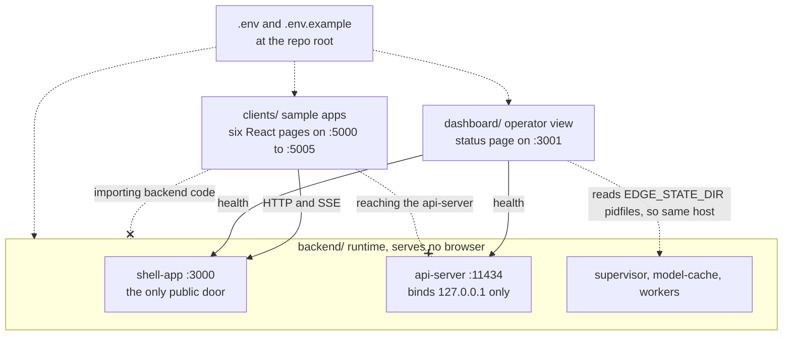
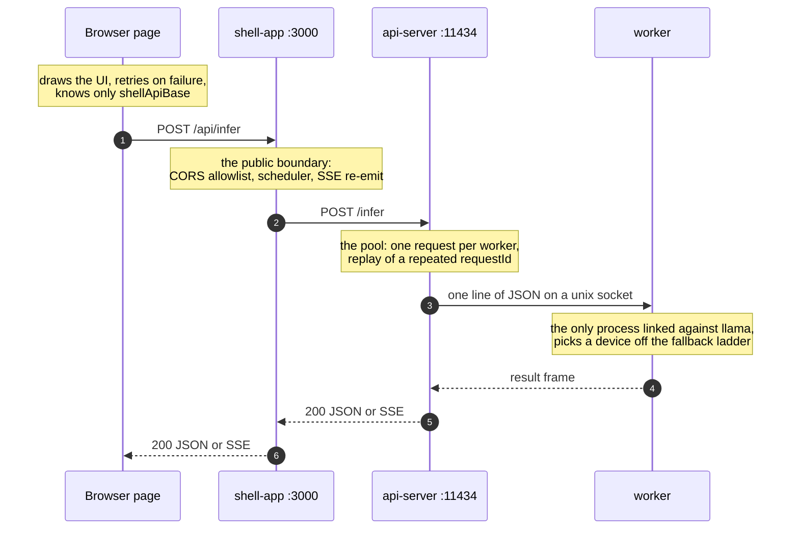
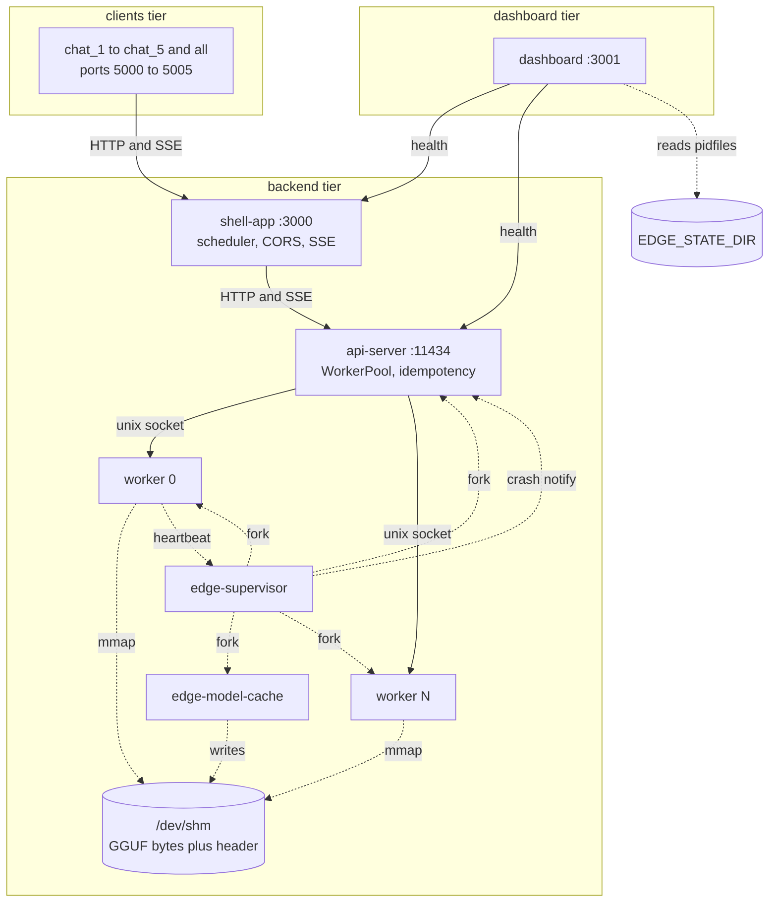

# Overview

ServeInfer is an on-device, multi-process LLM inference runtime for GGUF models, plus a small
client stack that consumes it. It runs a single model on one machine, splits the work across
several OS processes so a crash in one of them cannot take down the others, and exposes the
result over HTTP and SSE.

## The naming quirk

The product is called ServeInfer. Every binary, identifier, environment variable and log prefix
says `edge` or `EDGE_`: `edge-supervisor`, `edge-inference-worker`, `EDGE_MAX_SLOTS`,
`$EDGE_STATE_DIR`. That is deliberate and it is not being renamed. When you read `edge` in the
code, read "ServeInfer".

## Three tiers, three lifecycles

The repository is split by who owns a process. Each tier starts and stops on its own, and no tier
supervises another. Crossed arrows below are the rules, not the wiring.

Because `clients/` imports nothing and every variable it reads has a default,
`node clients/chat_1/server.js` runs from a fresh clone with no repo config at all. The dashboard
imports nothing either, but the pidfile read ties it to the runtime's host. See
[configuration](03-configuration.md).

## The pieces

One request touches four of them, and each one has a single job. The supervisor and the model
cache are not on this path at all.

**Supervisor** ([backend/supervisor/supervisor.cpp](../backend/supervisor/supervisor.cpp)) is the
C++ process that owns the runtime's child processes. It probes the hardware in a short-lived
child, decides how many workers the machine can pay for and which device each one gets, then
forks the model-cache, the api-server and the workers in that order. It restarts what dies,
behind a circuit breaker, and kills workers that go silent. It deliberately does not link llama.
See [the process model](02-process-model.md), [hardware and capacity](12-hardware-capacity.md)
and [crash recovery](14-crash-recovery.md).

**Model cache** ([backend/model-cache/model_cache.cpp](../backend/model-cache/model_cache.cpp))
copies the GGUF file into POSIX shared memory once, publishes its size, an FNV-1a checksum, a run
nonce and a ready flag in a 256-byte header, and stays alive holding the segment. Every worker
maps the same copy, so N workers do not cost N times 2.3 GB. See
[the model cache](11-model-cache.md).

**API server** ([backend/api-server/server.js](../backend/api-server/server.js)) is a Node
process that binds `127.0.0.1:11434`. It owns the `WorkerPool`: one in-flight request per worker,
one Unix socket connection per request, worker state tracking, and idempotent replay of repeated
request ids. See [the api-server](07-api-server.md) and [idempotency](08-idempotency.md).

**Inference workers** ([backend/inference-worker/worker.cpp](../backend/inference-worker/worker.cpp))
are the C++ processes that actually run llama.cpp. Each one listens on its own AF_UNIX socket,
attaches the shared model, picks a device off the fallback ladder, and answers newline-delimited
JSON frames. See [the worker](09-inference-worker.md), [llama integration](10-llama-integration.md)
and [device fallback](13-device-fallback.md).

**Shell app** ([backend/shell-app/server.js](../backend/shell-app/server.js)) is the public API
boundary on `127.0.0.1:3000`. It holds the scheduler: a global slot cap, a per-client cap,
three priorities with aging, a queue cap, cancel, and a queue-wait timeout. It enforces a CORS
origin allowlist, and it re-emits the api-server's SSE stream to the browser with its own extra
events. See [the shell app](05-shell-app.md) and [the scheduler](06-scheduler.md).

**Clients** (`clients/`) are six React pages built from one shared package in a pnpm workspace:
`all` on `:5000` shows the other five side by side, and `chat_1` to `chat_5` run on `:5001` to
`:5005`. `chat_1` carries the priority and burst controls, `chat_2` the multi-line transcript
input and a token counter, and the rest are plain chat. See [the clients](17-clients.md).

**Dashboard** (`dashboard/server.js`) is the operator page on `:3001`. It lists every running
process by reading the pidfile registry, and pulls health from the shell and the api-server. See
[the dashboard](18-dashboard.md).

## How it fits together

This is the whole system. Solid arrows are HTTP or socket traffic, dotted arrows are process
control and shared files.

The full request path, browser to llama and back, is in [the request path](04-request-path.md).

## What it deliberately is not

- **No authentication or authorization.** Nothing checks who is calling. The api-server binds
  `127.0.0.1` only and the shell enforces a browser-origin allowlist, and that is the entire
  access story.
- **No multi-host anything.** Every socket is AF_UNIX or loopback, the model cache is POSIX
  shared memory, and the dashboard reads pidfiles off the local filesystem. There is no
  clustering and no service discovery.
- **One model, chosen at startup.** `EDGE_MODEL_PATH` is read once by the supervisor and passed
  to the model cache and every worker. There is no runtime model swap and no per-request model
  selection.
- **Almost no persistence.** The only things that survive a restart are the crash log at
  `$EDGE_CRASH_LOG`, the per-process logs in `$EDGE_LOG_DIR`, the in-flight request file at
  `$EDGE_INFLIGHT_PATH` (read back at boot only to report orphans), and the model config JSON at
  `$EDGE_MODEL_CONFIG_PATH`. There is no database, and the idempotency cache is in memory and
  dies with the api-server.
- **Not a hosted service.** There is one optional remote tier that can call the Sarvam cloud API
  as the last rung of the fallback ladder, and it is off unless you turn it on explicitly. See
  [remote fallback](15-remote-fallback.md).

## Where to go next

- [02-process-model.md](02-process-model.md) if you are about to start or stop the stack, or you
  are confused about which process owns what.
- [04-request-path.md](04-request-path.md) if you want to follow one request from the browser to
  llama.cpp and back.
- [19-build-and-run.md](19-build-and-run.md) if you just want it running on your machine.
