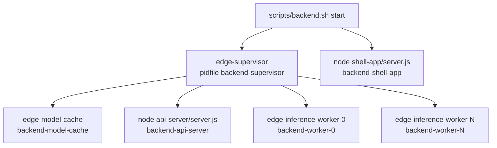
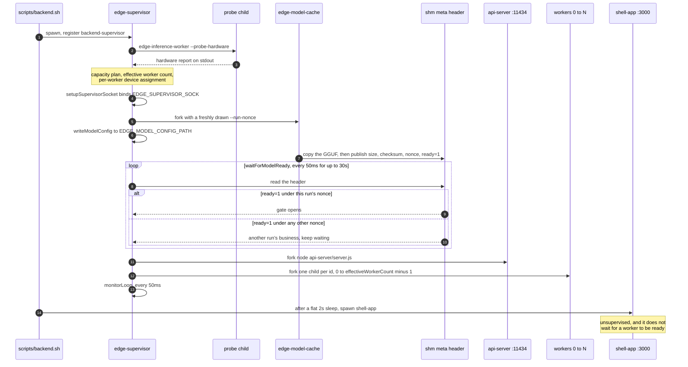
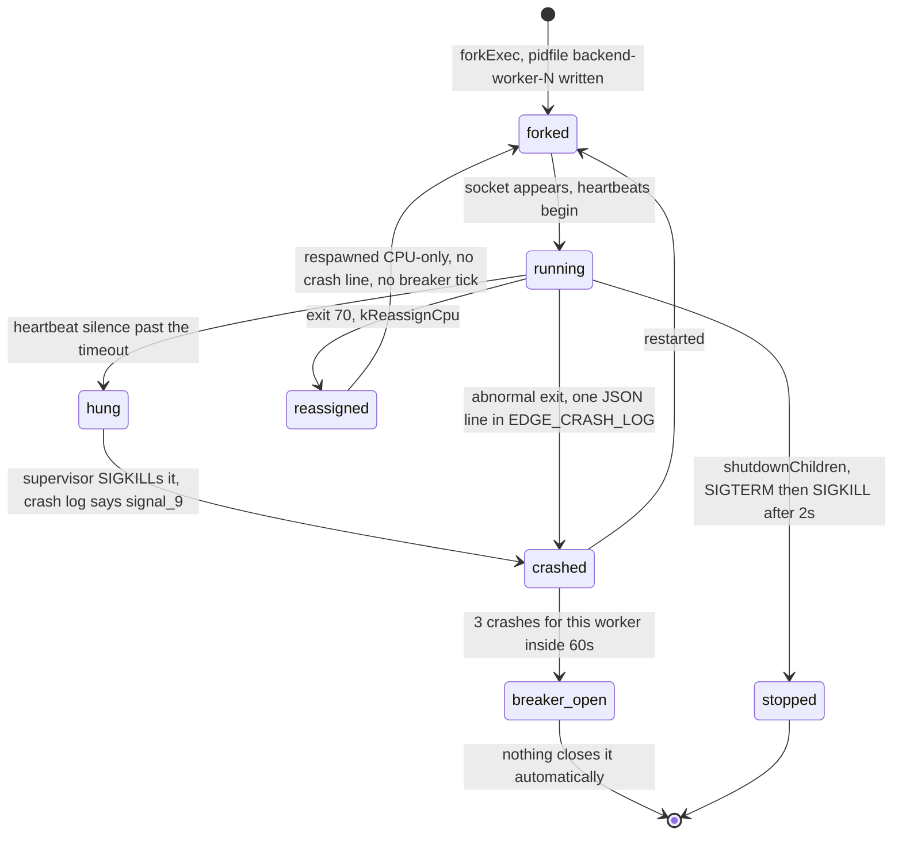
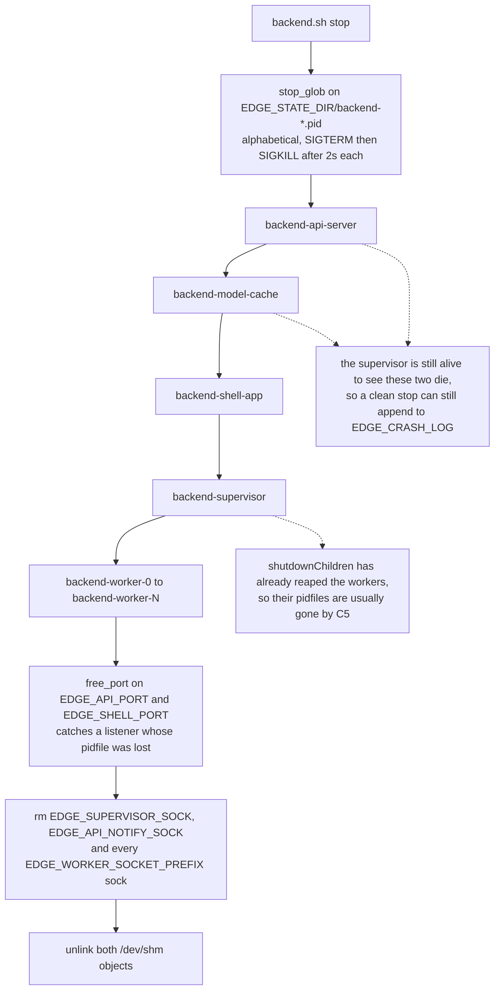

# The process model

The backend is not one process tree, it is two. `scripts/backend.sh start` launches
`edge-supervisor`, which forks and owns the model cache, the api-server and the workers, and it
separately launches `shell-app` as a plain background job that nothing supervises. Almost every
"why is that still running?" question in this repo comes from mixing those two up.

## The two trees

[scripts/backend.sh:63](../scripts/backend.sh#L63) spawns the supervisor. Two seconds later,
[scripts/backend.sh:78](../scripts/backend.sh#L78) spawns the shell app. That is the whole
script's start path.

The supervisor supervises the three boxes under it and nothing else. It has never known about the
shell app, the clients or the dashboard.

### What happens when you kill the supervisor

Send it SIGTERM or SIGKILL and:

- The model cache, the api-server and every worker go down with it. `Supervisor::shutdownChildren`
  ([supervisor.cpp:580](../backend/supervisor/supervisor.cpp#L580)) SIGTERMs each child, waits
  two seconds, then SIGKILLs whatever is left, and removes their pidfiles.
- The shell app keeps running on `:3000`. It will answer requests and then fail them, because the
  api-server it proxies to is gone.
- The clients keep serving their pages on `:5000` to `:5005`.
- The dashboard keeps running on `:3001`, and its process table simply loses the backend rows.

That is the point of the split, not a surprise. `scripts/backend.sh stop` clears both trees plus
any leftover port listener, socket and shared-memory object.

## The pidfile registry

`$EDGE_STATE_DIR` (shipped as `/tmp/edge-runtime`) is the complete process list. Each process gets
one file, `<name>.pid`, containing its pid.

Two things write those files, and neither is the process itself:

- `register()` in [scripts/lib.sh:62](../scripts/lib.sh#L62), called from `spawn()`, for anything
  a shell script backgrounds: `backend-supervisor`, `backend-shell-app`, `client-*`, `dashboard`.
- `Supervisor::writePidFile` ([supervisor.cpp:830](../backend/supervisor/supervisor.cpp#L830)) for
  the supervisor's own children, right after each fork. The name comes from
  `Supervisor::pidFileNameFor`: `backend-model-cache`, `backend-api-server`,
  `backend-worker-<id>`.

Removal is the mirror image. `stop_pidfile()` in [scripts/lib.sh:82](../scripts/lib.sh#L82)
removes the file after it kills the pid, and `Supervisor::removePidFile` runs when a child is
reaped ([supervisor.cpp:499](../backend/supervisor/supervisor.cpp#L499)) and again during
shutdown.

A pidfile can therefore outlive its process, if something was SIGKILLed. The dashboard checks
`process.kill(pid, 0)` for every entry it reads and lists the dead ones separately as stale, so
you can see the leftovers rather than being lied to.

### Why it replaced ps-scraping

The dashboard used to run `ps` and string-match command lines against hardcoded paths. That broke
every time a folder moved, and it could never see a process nobody had told it about. Now a new
client joins the process table by writing one file, and the dashboard needs no change at all.

### The name carries the tier

The prefix is how each stop script knows what belongs to it, and how the dashboard groups rows.

| Prefix | Tier | Stopped by |
|---|---|---|
| `backend-` | runtime | `stop_glob "$EDGE_STATE_DIR/backend-*.pid"` ([backend.sh:11](../scripts/backend.sh#L11)) |
| `client-` | sample apps | `stop_glob "$EDGE_STATE_DIR/client-*.pid"` ([clients.sh:12](../scripts/clients.sh#L12)) |
| `dashboard` | operator view | `stop_glob "$EDGE_STATE_DIR/dashboard.pid"` ([dashboard.sh:11](../scripts/dashboard.sh#L11)) |

The dashboard's `tierOf()` splits on the same prefixes, and anything that matches none of them is
grouped as `other`.

## Logs live somewhere else

Logs do not go in `$EDGE_STATE_DIR`. Each spawned process writes `$EDGE_LOG_DIR/<name>.log`,
opened by `spawn()` in [scripts/lib.sh:70](../scripts/lib.sh#L70). The reasoning is a lifetime
one: pidfiles are runtime state that should die with the machine, logs are worth keeping across a
reboot.

`EDGE_LOG_DIR` is optional. `load_env` defaults it to `$ROOT/logs` and resolves a relative value
against the repo root, so an `.env` written before the variable existed still boots. `logs/` is
tracked through a `.gitkeep` and its contents are gitignored.

One log is not written by `spawn`. `$EDGE_CRASH_LOG` is opened by the supervisor itself in C++
([supervisor.cpp:731](../backend/supervisor/supervisor.cpp#L731)), which is why `load_env` forces
it to an absolute path before exporting it.

The redirect in `spawn()` matters for a reason that is easy to trip over: a child that inherits
the script's stdout holds that pipe open, so `make backend | tail` would never return.

## Startup order

`Supervisor::start()` runs its steps in a fixed order and each one gates the next. The gate in
the middle is the one to remember: nothing else starts until the model cache says ready under
this run's nonce.

Three of those steps carry a reason that is not obvious from the ordering alone:

- The probe runs in a **short-lived child** because reaching a ggml device initializes CUDA, and
  the supervisor must never pay that cost. See [hardware and capacity](12-hardware-capacity.md).
- The **supervisor socket** is bound and set non-blocking before any child exists, so no worker's
  first heartbeat can hit a missing socket.
- The **model config JSON** carries `workerCount` (what will actually start),
  `configuredWorkerCount`, the hardware report, the capacity plan and the assignments. The
  api-server reads `workerCount` back out of it to size its pool.

`modelReadyTimeoutSeconds` is 30 and is not configurable through the environment. A leftover
`ready=1` from a dead stack logs `ignoring shared model metadata from another run`. The nonce
handshake is [the model cache](11-model-cache.md).

If the socket bind, the model cache, the ready wait, the api-server or the workers fail,
`start()` returns false and [main.cpp:190](../backend/supervisor/main.cpp#L190) exits 1. The
model-ready failure prints `[supervisor] model cache ready flag was not observed` first.

## Lifecycle of every process

| Process | Pidfile name | Started by | Restarted by | Stopped by |
|---|---|---|---|---|
| `edge-supervisor` | `backend-supervisor` | `scripts/backend.sh start` | nothing | `backend.sh stop`, SIGTERM or SIGINT |
| `edge-model-cache` | `backend-model-cache` | supervisor | supervisor, behind the circuit breaker | supervisor shutdown |
| api-server (node) | `backend-api-server` | supervisor | supervisor, behind the circuit breaker | supervisor shutdown |
| `edge-inference-worker` N | `backend-worker-N` | supervisor | supervisor, on crash, on hang, or on exit 70 reassignment | supervisor shutdown |
| shell-app (node) | `backend-shell-app` | `scripts/backend.sh start` | nothing | `backend.sh stop` |
| `all`, `chat_1` to `chat_5` | `client-<name>` | `scripts/clients.sh start` | nothing | `clients.sh stop` |
| dashboard | `dashboard` | `scripts/dashboard.sh start` | nothing | `dashboard.sh stop` |

Only the supervisor restarts anything. Everything else is start-once. Its `monitorLoop()` ticks
every `pollIntervalMs` (50 ms) and does three things per tick: reap dead children, drain the
heartbeat socket, and check worker liveness. Those three ticks are what move a worker between
states.

The detail behind each transition is [crash recovery](14-crash-recovery.md) and
[device fallback](13-device-fallback.md).

## Where each process binds

| Process | Listens on |
|---|---|
| shell-app | TCP `127.0.0.1:$EDGE_SHELL_PORT` ([server.js:282](../backend/shell-app/server.js#L282)) |
| api-server | TCP `127.0.0.1:$EDGE_API_PORT` ([server.js:181](../backend/api-server/server.js#L181)), plus AF_UNIX `$EDGE_API_NOTIFY_SOCK` |
| worker N | AF_UNIX `$EDGE_WORKER_SOCKET_PREFIX<N>.sock` |
| supervisor | AF_UNIX `$EDGE_SUPERVISOR_SOCK` |
| model-cache | nothing. It holds `/dev/shm` objects and sleeps |
| client `chat_N` | TCP `127.0.0.1:$EDGE_CHAT_N_PORT` |
| dashboard | TCP `127.0.0.1:$EDGE_STATUS_DASHBOARD_PORT` |

Every TCP listener is loopback-only. Nothing in the stack binds `0.0.0.0`. Every socket path is
listed in [the IPC protocols](16-ipc-protocols.md).

## Startup failure modes

What you see, and what it means. The fixes are in [troubleshooting](21-troubleshooting.md).

| Message | Where | Cause |
|---|---|---|
| `[backend] missing required environment variable: X` | [lib.sh:33](../scripts/lib.sh#L33) | `backend.sh` keeps its own required-variable list, separate from the Node loader |
| `[backend] missing binary: <path>` then `run 'make build' first` | [backend.sh:43](../scripts/backend.sh#L43) | The C++ targets were never compiled |
| `[backend] missing model file: <path>` | [backend.sh:52](../scripts/backend.sh#L52) | The GGUF was never downloaded. Checked even for a build with the llama backend off |
| `[backend] api-server port 11434 is already in use.` | [lib.sh:56](../scripts/lib.sh#L56) | An old runtime is still up. Each tier aborts on its own port only |
| `[supervisor] bind failed for <path>` | [supervisor.cpp:290](../backend/supervisor/supervisor.cpp#L290) | A stale `$EDGE_SUPERVISOR_SOCK` that the stop script did not remove |
| `[supervisor] model cache ready flag was not observed` | [supervisor.cpp:103](../backend/supervisor/supervisor.cpp#L103) | 30 s passed with no `ready=1` under this run's nonce |
| `[supervisor] exec failed for <bin>` then exit 127 | [supervisor.cpp:474](../backend/supervisor/supervisor.cpp#L474) | A child binary path is wrong or not executable |
| `hardware probe timed out after 10000ms` in the model config | [supervisor.cpp:206](../backend/supervisor/supervisor.cpp#L206) | Not fatal. The plan falls back to what `/proc/meminfo` alone can tell it |

## What `backend.sh stop` does, in order

`stop_glob` expands its glob alphabetically, which puts the api-server and the model cache ahead
of the supervisor that owns them.

The other ordering quirk is at start, not stop. `scripts/backend.sh` sleeps a flat 2 seconds
between the supervisor and the shell app and does not wait for a worker to be ready, so workers
reading as `starting` for the first few seconds after `make backend` is normal.
