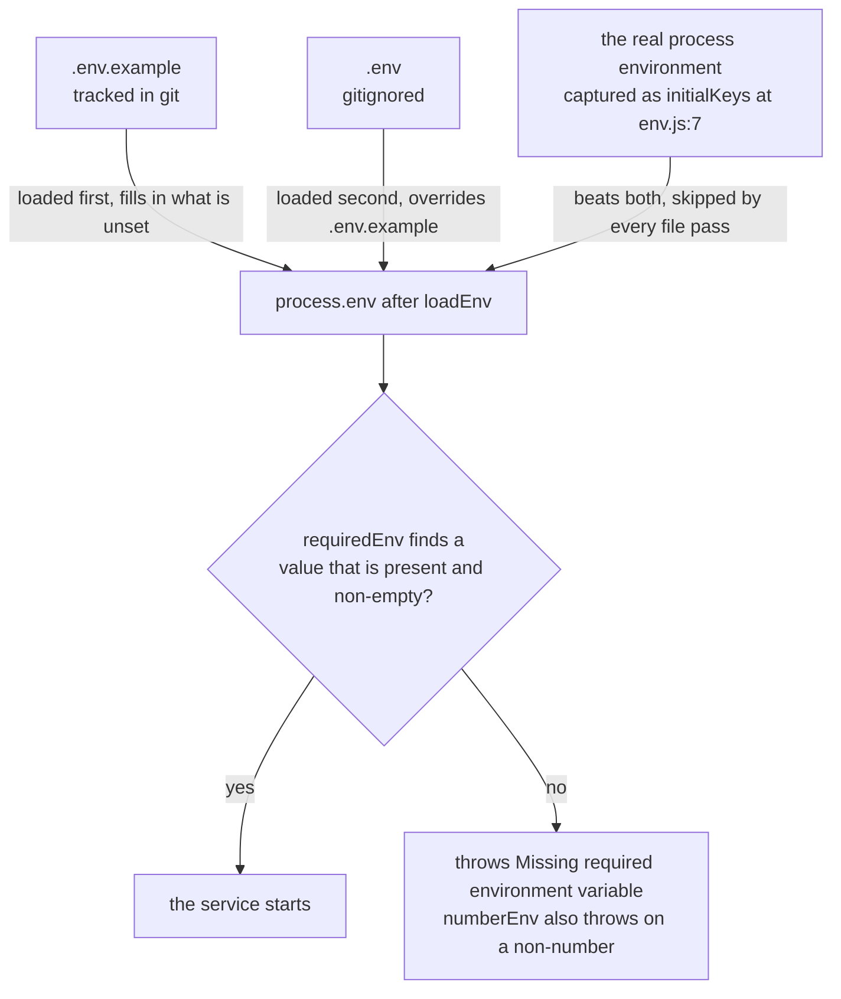
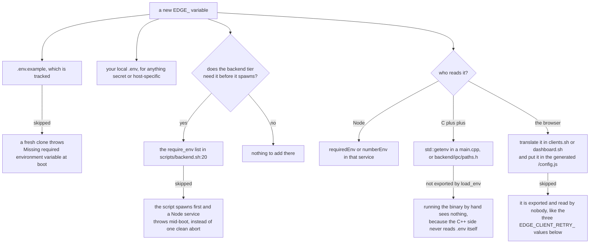
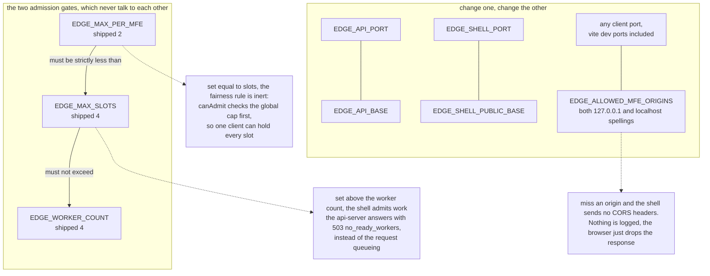

# Configuration

Every tunable in ServeInfer is an environment variable. There is no config file format, no
command-line config beyond a handful of paths the supervisor passes to its children, and no
default literals buried in the Node code. If a value is missing, the service that needs it throws
at startup instead of guessing.

## How the values get loaded

Three loaders exist, one per language, and they read the same two files at the repo root.
[backend/config/env.js](../backend/config/env.js) is the one that defines the precedence.



There is no fallback literal behind that `no` branch, anywhere in the Node code
([env.js:57](../backend/config/env.js#L57)). A typo in a variable name fails loudly at boot
rather than silently running on a default nobody chose.

The parser is deliberately small ([env.js:10](../backend/config/env.js#L10)). It skips blank
lines and lines starting with `#`, splits on the first `=`, trims both sides, and strips one
matching pair of surrounding quotes. It does **not** strip trailing comments, so
`EDGE_MAX_SLOTS=4 # four` gives you the string `4 # four`. Keep comments on their own line.

**C++**: the native services read the same variables through
[backend/ipc/paths.h](../backend/ipc/paths.h) and plain `std::getenv` calls in each `main.cpp`.
They never read `.env` themselves, so running a C++ binary by hand needs the environment loaded
first.

**Shell**: `load_env` in [scripts/lib.sh:5](../scripts/lib.sh#L5) does the same layering with
`set -a && source`, so the variables are exported into every child. Because bash sources these
files as shell scripts, it does strip a trailing `# comment` where the Node parser would not.
`load_env` also applies the only two defaults in the system: `EDGE_LOG_DIR` falls back to
`$ROOT/logs`, and both it and `EDGE_CRASH_LOG` are resolved to absolute paths against the repo
root.

## Adding a new variable

There is more than one place to touch, and each one you skip fails in a different way.



## Every variable

Grouped the way `.env.example` groups them. "Shipped" is the value in `.env.example` as it stands
today.

### Core runtime

| Variable | Shipped | What it does | Read by |
|---|---|---|---|
| `EDGE_STATE_DIR` | `/tmp/edge-runtime` | Directory holding `<name>.pid` for every process | `scripts/lib.sh`, `EdgeIPC::stateDir` (supervisor), `dashboard/server.js` |
| `EDGE_LOG_DIR` | `./logs` | Per-process log directory. **Optional**, defaults to `$ROOT/logs`, relative values resolve against the repo root | `scripts/lib.sh` only |
| `EDGE_WORKER_COUNT` | `4` | Ceiling on worker processes, not a promise. Capacity planning can start fewer | supervisor `main.cpp`, api-server `server.js` |
| `EDGE_MODEL_PATH` | `./backend/models/Phi-3-mini-4k-instruct-q4.gguf` | The GGUF. `backend.sh` resolves it to an absolute path and re-exports it | `scripts/backend.sh`, supervisor, worker |
| `EDGE_FORCE_CPU` | `0` | `1` drops every accelerator rung from the device ladder | worker `main.cpp` |
| `EDGE_LOG_LEVEL` | `info` | `debug` \| `info` \| `warn` \| `error` for the two Node services | shell-app, api-server |

### Ports

| Variable | Shipped | Read by |
|---|---|---|
| `EDGE_API_PORT` | `11434` | api-server, `backend.sh` port check |
| `EDGE_SHELL_PORT` | `3000` | shell-app, `backend.sh` port check |
| `EDGE_STATUS_DASHBOARD_PORT` | `3001` | `dashboard.sh`, passed to the process as `DASHBOARD_PORT` |
| `EDGE_CHAT_ALL_PORT` | `5000` | `clients.sh`, passed as `CLIENT_PORT` |
| `EDGE_CHAT_1_PORT` .. `EDGE_CHAT_5_PORT` | `5001` .. `5005` | `clients.sh`, passed as `CLIENT_PORT` |

The dashboard and the clients never see the `EDGE_` names. `clients.sh` and `dashboard.sh`
translate them into the generic `CLIENT_PORT`, `SHELL_API_BASE`, `AGENT_API_BASE` and
`DASHBOARD_PORT` that those servers actually read, and every one of those has a default. That is
what makes `node clients/chat_1/server.js` work from a clone with no config.

### Service URLs

| Variable | Shipped | What it does | Read by |
|---|---|---|---|
| `EDGE_API_BASE` | `http://127.0.0.1:11434` | Where the shell sends inference | shell-app `edgeAgentService.js`, `dashboard.sh` |
| `EDGE_SHELL_PUBLIC_BASE` | `http://127.0.0.1:3000` | Injected into each client page as `window.MFE_CONFIG.shellApiBase` | `clients.sh`, `dashboard.sh` |
| `EDGE_ALLOWED_MFE_ORIGINS` | the twelve `127.0.0.1`/`localhost` client origins on 5000-5005, plus the six vite dev-server origins on 5180-5185 | Comma-separated CORS allowlist | shell-app `server.js` |

### Inference defaults

All four are read once by the worker at startup, from the environment only. There is no
per-request override.

| Variable | Shipped | What it does |
|---|---|---|
| `EDGE_MAX_TOKENS` | `512` | Decode-loop ceiling per request |
| `EDGE_TEMPERATURE` | `0.8` | Sampling temperature |
| `EDGE_GPU_LAYERS` | `99` | `n_gpu_layers` handed to llama. Not the CPU-only guarantee, `CUDA_VISIBLE_DEVICES=-1` is |
| `EDGE_SEED` | `42` | Sampler seed |

### Scheduler limits

All six are read by [backend/shell-app/edgeAgentService.js](../backend/shell-app/edgeAgentService.js)
and passed into the `Scheduler` constructor. See [the scheduler](06-scheduler.md).

| Variable | Shipped | What it does |
|---|---|---|
| `EDGE_MAX_SLOTS` | `4` | Global cap on concurrently running jobs |
| `EDGE_MAX_PER_MFE` | `2` | Cap on running jobs from any one client id |
| `EDGE_MAX_QUEUE` | `20` | Queue depth. Over it, 429 `scheduler_overloaded` |
| `EDGE_AGING_MS` | `15000` | How long a queued job waits before it gains a priority level |
| `EDGE_QUEUE_TIMEOUT_MS` | `30000` | Time in the queue before 408 `queue_timeout` |
| `EDGE_DEFAULT_JOB_MS` | `8000` | Seed value for the rolling job-duration average used in wait estimates |

### IPC and runtime files

Every path here is listed with its wire format in [the IPC protocols](16-ipc-protocols.md).

| Variable | Shipped | What it does | Read by |
|---|---|---|---|
| `EDGE_SHM_NAME` | `/edge-model-weights` | POSIX shm object for the GGUF bytes. `.meta` is appended for the header | model-cache, supervisor, worker, `backend.sh` cleanup |
| `EDGE_SUPERVISOR_SOCK` | `/tmp/edge-supervisor.sock` | Worker heartbeats in | supervisor, worker |
| `EDGE_WORKER_SOCKET_PREFIX` | `/tmp/edge-worker-` | `<prefix><id>.sock` per worker | supervisor, api-server, worker |
| `EDGE_WORKER_CONNECT_TIMEOUT_MS` | `3000` | How long the pool waits to connect to a worker socket | api-server |
| `EDGE_API_NOTIFY_SOCK` | `/tmp/edge-api-notify.sock` | Supervisor to api-server crash notifications | supervisor, api-server |
| `EDGE_CRASH_LOG` | `./logs/edge-crash.log` | One JSON line per abnormal child exit. Also read back to count crashes across supervisor restarts | supervisor. `lib.sh` forces it absolute |
| `EDGE_MODEL_CONFIG_PATH` | `/tmp/edge-model-config.json` | Supervisor writes the model, hardware, capacity plan and effective worker count here | supervisor writes, api-server and dashboard read |

### Execution bounds

| Variable | Shipped | What it does | Read by |
|---|---|---|---|
| `EDGE_EXEC_TIMEOUT_MS` | `120000` | Time a running job gets before 504 `exec_timeout` and an abort | shell-app |
| `EDGE_DONE_TTL_MS` | `300000` | How long the scheduler keeps a finished job's record | shell-app |
| `EDGE_DONE_MAX_ENTRIES` | `500` | Cap on that same set of finished records | shell-app |

### Worker recovery

All three are read by the api-server and shape `WorkerPool` state transitions. See
[the api-server](07-api-server.md).

| Variable | Shipped | What it does |
|---|---|---|
| `EDGE_WORKER_RECOVERY_MS` | `2000` | Gap between recovery probes of a crashed worker's socket |
| `EDGE_WORKER_RECOVERY_ATTEMPTS` | `10` | How many probes before the pool gives up on that worker |
| `EDGE_WORKER_STARTUP_GRACE_MS` | `15000` | A pool entry whose socket has not appeared within this is marked `crashed`, not left `starting` |

### Hang detection

All three are **optional** in the supervisor: [main.cpp:79](../backend/supervisor/main.cpp#L79)
only overrides the built-in `LivenessLimits` when the variable is set. `backend.sh` does not
require them either. Set any to `0` to switch that check off.

| Variable | Shipped | Code default | What it does |
|---|---|---|---|
| `EDGE_WORKER_HEARTBEAT_GRACE_MS` | `120000` | `120000` | Silence allowed after spawn, covering model load |
| `EDGE_WORKER_HEARTBEAT_TIMEOUT_MS` | `15000` | `15000` | Silence after the grace before the worker is killed |
| `EDGE_WORKER_STUCK_REQUEST_MS` | `180000` | `180000` | A single request running longer than this is a wedge. Keep it above `EDGE_EXEC_TIMEOUT_MS` |

### Replay safety

| Variable | Shipped | What it does | Read by |
|---|---|---|---|
| `EDGE_IDEMPOTENCY_TTL_MS` | `300000` | How long a successful result stays replayable for its `requestId`. Failures are never cached | api-server `routes/infer.js` |
| `EDGE_INFLIGHT_PATH` | `/tmp/edge-inflight.json` | Open request ids, written atomically and read back at boot | api-server `routes/infer.js` |

See [idempotency](08-idempotency.md).

### Client retry policy

| Variable | Shipped | Status |
|---|---|---|
| `EDGE_CLIENT_RETRY_ATTEMPTS` | `3` | See below |
| `EDGE_CLIENT_RETRY_BASE_MS` | `500` | See below |
| `EDGE_CLIENT_RETRY_MAX_MS` | `8000` | See below |

**These three are currently inert.** [scripts/clients.sh:36](../scripts/clients.sh#L36) exports
them into each client process as `CLIENT_RETRY_ATTEMPTS`, `CLIENT_RETRY_BASE_MS` and
`CLIENT_RETRY_MAX_MS`, but no client `server.js` reads those names, and the generated `/config.js`
only carries `shellApiBase`. The browser code falls back to the hardcoded
`RETRY_DEFAULTS = { attempts: 3, baseMs: 500, maxMs: 8000 }` in
[clients/shared/src/lib/retry.js:1](../clients/shared/src/lib/retry.js#L1), which happens to match
the shipped values. Changing them in `.env` changes nothing today. Wiring `retry` into
`window.MFE_CONFIG` in each client's `/config.js` handler is the fix.

### Worker-pool sizing

All five are **optional**. [supervisor/main.cpp:64](../backend/supervisor/main.cpp#L64) only
overrides the `CapacityLimits` defaults when the variable is present. These are per-worker budgets
for context, KV cache and compute buffers. They are not derived from the GGUF size, because the
weights are one shared copy in `/dev/shm`. They are worker counts, not request counts, and nothing
here divides VRAM by `EDGE_MAX_SLOTS`.

| Variable | Shipped | Code default | What it does |
|---|---|---|---|
| `EDGE_GPU_RESERVE_MB` | `512` | `512` | VRAM held back from the worker pool |
| `EDGE_WORKER_GPU_MB` | `2048` | `2048` | VRAM budgeted per GPU worker |
| `EDGE_RAM_RESERVE_MB` | `1024` | `1024` | Host RAM held back |
| `EDGE_WORKER_RAM_MB` | `1024` | `1024` | Host RAM budgeted per CPU worker |
| `EDGE_HW_PROBE_TIMEOUT_MS` | `10000` | `10000` | How long the supervisor waits on the probe child before killing it |

See [hardware and capacity](12-hardware-capacity.md).

### Device fallback

Read by the worker. See [device fallback](13-device-fallback.md).

| Variable | Shipped | What it does |
|---|---|---|
| `EDGE_DEVICE_FALLBACK_MODE` | `reexec` | `reexec` exits 70 so the supervisor respawns the worker as CPU-only, the only way to release a CUDA context. `reload` keeps it resident |
| `EDGE_DEVICE_LADDER` | `cuda,npu,ane,cpu,remote` | Comma-separated tiers, highest first. Valid: `cpu cuda rocm vulkan npu directml gpu ane metal accelerate remote`. A tier with no backend compiled in fails its probe and is skipped |
| `EDGE_DEVICE_QUARANTINE_MS` | `60000` | How long a faulted tier is benched before a health check can restore it |
| `EDGE_DEVICE_PROBE_INTERVAL_MS` | `5000` | Minimum gap between probes of a quarantined tier |
| `EDGE_SIMULATE_DEVICE_FAULT` | empty | `[<tier>:]removed \| unsupported \| runtime`. Fires once per worker on the named tier only. Empty means no injection |

### Remote tier

Read by the worker's remote transport and by
[backend/remote/sarvamTransport.js](../backend/remote/sarvamTransport.js). See
[remote fallback](15-remote-fallback.md).

| Variable | Shipped | What it does |
|---|---|---|
| `EDGE_SARVAM_API_KEY` | empty | The credential. Leave it empty in `.env.example`, put the real one in `.env` |
| `EDGE_REMOTE_FALLBACK_ALLOWED` | `0` | The consent gate. A key on its own is not consent, both must be set |
| `EDGE_REMOTE_ENDPOINT` | empty | Base URL override. Empty means the SDK's own `https://api.sarvam.ai` |
| `EDGE_NODE_BIN` | `node` | Interpreter for the transport child |
| `EDGE_REMOTE_TRANSPORT_SCRIPT` | `./backend/remote/sarvamTransport.js` | Path relative to the repo root |
| `EDGE_REMOTE_TIMEOUT_MS` | `30000` | Bound on one cloud call |
| `EDGE_SARVAM_MODEL` | `sarvam-105b-conversations` | Model id sent to the API |
| `EDGE_SARVAM_TEMPERATURE` | `0.2` | |
| `EDGE_SARVAM_TOP_P` | `1` | |
| `EDGE_SARVAM_MAX_TOKENS` | `2000` | |

### Not in `.env.example`

Three variables are read by the code but not listed in `.env.example`, on purpose.

| Variable | Read by | Why |
|---|---|---|
| `EDGE_MEMINFO_PATH` | supervisor, worker probe | A test hook. Points `/proc/meminfo` parsing at a fixture |
| `EDGE_PROMPT_TEMPLATE` | worker `inferEngine.cpp` | Overrides the model's instruct template |
| `EDGE_WORKER_BACKEND` | worker `main.cpp` | Set by the supervisor per worker, from `workerBackendEnv()`. Not operator config |

`CUDA_VISIBLE_DEVICES` is also set by the supervisor between fork and exec, and that, not
`EDGE_GPU_LAYERS`, is what makes a CPU worker CPU-only.

## Coupling rules

Four groups of variables have to move together. Nothing in the code validates any of them, so a
bad pairing produces different behaviour under load rather than an error.



`Scheduler.canAdmit` is [scheduler.js:226](../backend/shell-app/scheduler.js#L226).

## Running a service by hand

The backend services read config from the environment only, so it has to be loaded first:

```bash
set -a && source .env.example && source .env && set +a
node backend/shell-app/server.js
```

Clients and the dashboard need none of that. Every variable they read has a default:
`node clients/chat_1/server.js` and `node dashboard/server.js` both work from a bare clone.

## Limitations

- Nothing validates the coupling rules. A misconfigured `EDGE_MAX_PER_MFE` produces no warning,
  only different behaviour under load.
- The required-variable list in `scripts/backend.sh` is a hand-maintained duplicate of what the
  code actually reads. It can drift in either direction.
- The three `EDGE_CLIENT_RETRY_*` values are plumbed halfway and read by nothing.
- `modelReadyTimeoutSeconds` (30 s) and the worker heartbeat interval (50 ms) are compile-time
  constants with no environment variable at all.
