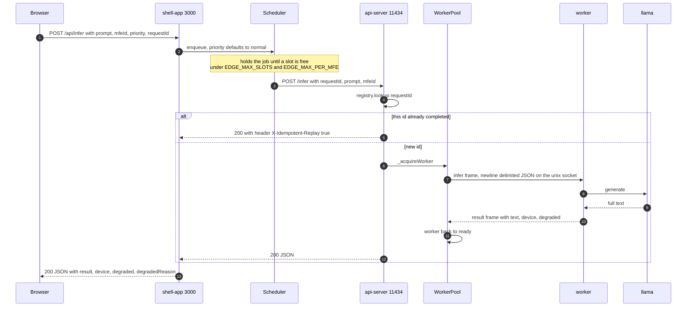
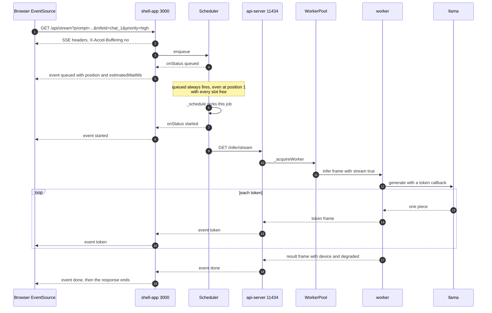
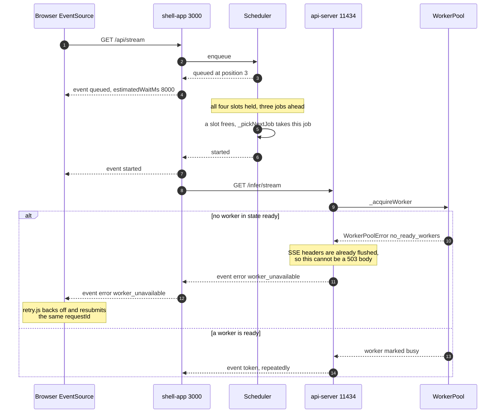
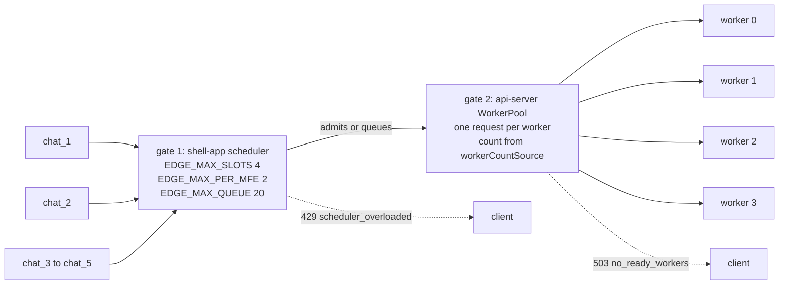
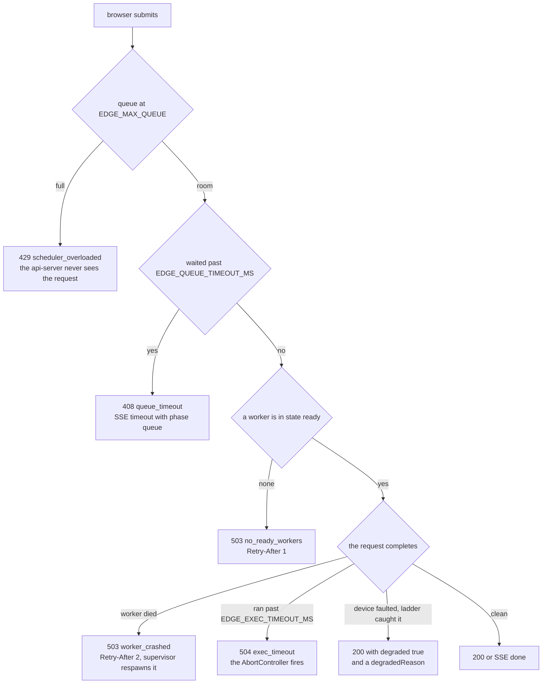

# The request path

This is the map. One prompt travels from a browser tab through four processes and back, and
this page shows the shape of that trip without explaining any single hop in depth. Every hop
links to the document that owns it.

```
Browser :5000-:5005  ->  shell-app :3000  ->  api-server :11434  ->  worker (unix socket)  ->  llama
```

## The buffered path

`POST /api/infer` waits for the whole answer and returns one JSON body. None of the shipped
clients use it, they all stream, so in practice this is the `curl` path. See
[19-build-and-run.md](19-build-and-run.md) for the smoke tests.



## The streaming path

`GET /api/stream` is what every client app actually calls. It is two SSE hops end to end, and
the shell adds events of its own that the api-server never sends.



## When it does not go smoothly

The interesting path. A request queues behind three others, gets its slot, and then finds the
pool has nothing ready.



The same failure on the buffered path never gets that far into the response, so it arrives as
a real 503 `no_ready_workers` with `Retry-After: 1`
([infer.js:73](../backend/api-server/routes/infer.js#L73)). Same cause, two shapes, because
SSE cannot take back a status line it already sent.

## What crosses each hop

| Hop | What crosses it | Owned by |
|---|---|---|
| Browser to shell | HTTP JSON in, SSE out. `prompt`, `mfeId`, `priority`, `requestId` | [05-shell-app.md](05-shell-app.md) |
| Inside the shell | A job in the priority queue, holding a slot while it runs | [06-scheduler.md](06-scheduler.md) |
| Shell to api-server | HTTP JSON in, SSE out, over `EDGE_API_BASE` | [07-api-server.md](07-api-server.md) |
| Inside the api-server | A `requestId` looked up in the registry before any work starts | [08-idempotency.md](08-idempotency.md) |
| api-server to worker | One newline-delimited JSON frame per request over AF_UNIX | [09-inference-worker.md](09-inference-worker.md), frames in [16-ipc-protocols.md](16-ipc-protocols.md) |
| Inside the worker | Prompt string to token string, through the device ladder | [10-llama-integration.md](10-llama-integration.md), [13-device-fallback.md](13-device-fallback.md) |

The api-server binds `127.0.0.1` only, and no client is ever told its address. A browser
knows one base URL, the shell's, injected at runtime through a generated `/config.js`. See
[17-clients.md](17-clients.md).

## Two concurrency gates, configured separately

Admission is limited twice, in two processes, from two sets of variables. This is the single
most common source of confusion in the system.



The scheduler decides whether a request is allowed to start at all. The pool decides whether
a worker is free to take it. Nothing keeps the two numbers in agreement: if `EDGE_MAX_SLOTS`
is larger than the number of workers that actually started, gate 1 admits work gate 2 then
refuses, instead of the request queueing. Shipped values are 4 slots, 2 per MFE, 4 workers.

The pool no longer trusts `EDGE_WORKER_COUNT` blindly. It reads the count the supervisor
actually placed out of `$EDGE_MODEL_CONFIG_PATH` through
[workerCountSource.js](../backend/api-server/workerCountSource.js), so on a RAM-constrained
host the pool sizes itself to the workers that exist. The scheduler still knows nothing about
either number. Details in [07-api-server.md](07-api-server.md) and
[12-hardware-capacity.md](12-hardware-capacity.md).

## Two timeouts, told apart by `phase`

Both live in the scheduler, and both are visible to a streaming client as the same SSE event
name.

| Bound | Variable | Applies while | HTTP on the buffered path | SSE `phase` |
|---|---|---|---|---|
| Queue wait | `EDGE_QUEUE_TIMEOUT_MS` | the job is queued | 408 `queue_timeout` | `queue` |
| Execution | `EDGE_EXEC_TIMEOUT_MS` | the job is running | 504 `exec_timeout` | `execution` |

A `timeout` event without a `phase` field cannot be told apart from the other kind, which is
why the shell always fills it in, defaulting to `queue`
([server.js:204](../backend/shell-app/server.js#L204)). The execution timeout also aborts the
job's `AbortController`, which tears down the shell's fetch to the api-server and gives the
slot back. See [06-scheduler.md](06-scheduler.md).

## Where a failure enters the path

Read this as the same trip again, with every exit marked.



Crash recovery is [14-crash-recovery.md](14-crash-recovery.md) and the ladder is
[13-device-fallback.md](13-device-fallback.md). Every failure above carries either
`retryAfterSeconds` or `retryable`, and the clients retry with the same `requestId` on
purpose. That is what makes the result cache in [08-idempotency.md](08-idempotency.md) worth
having.
