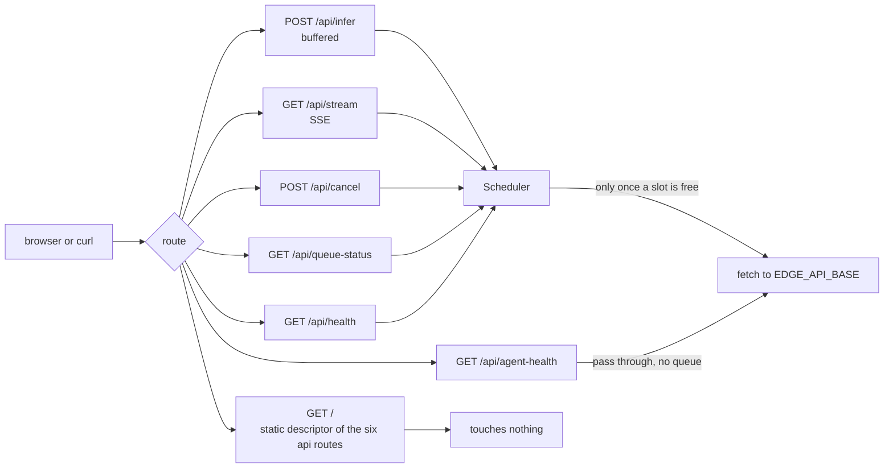
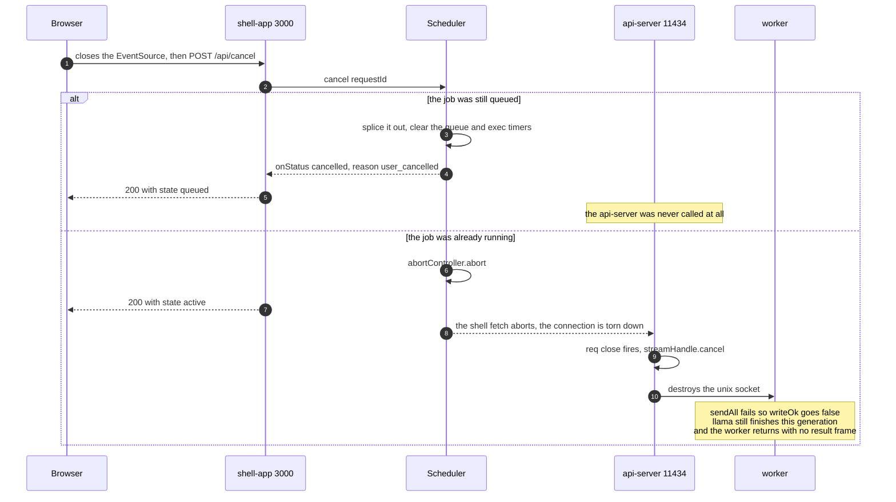
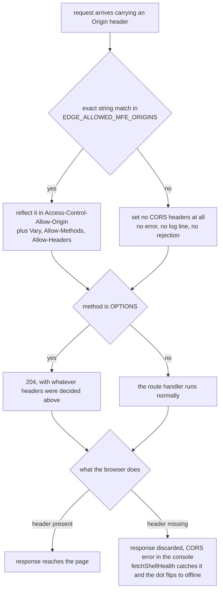
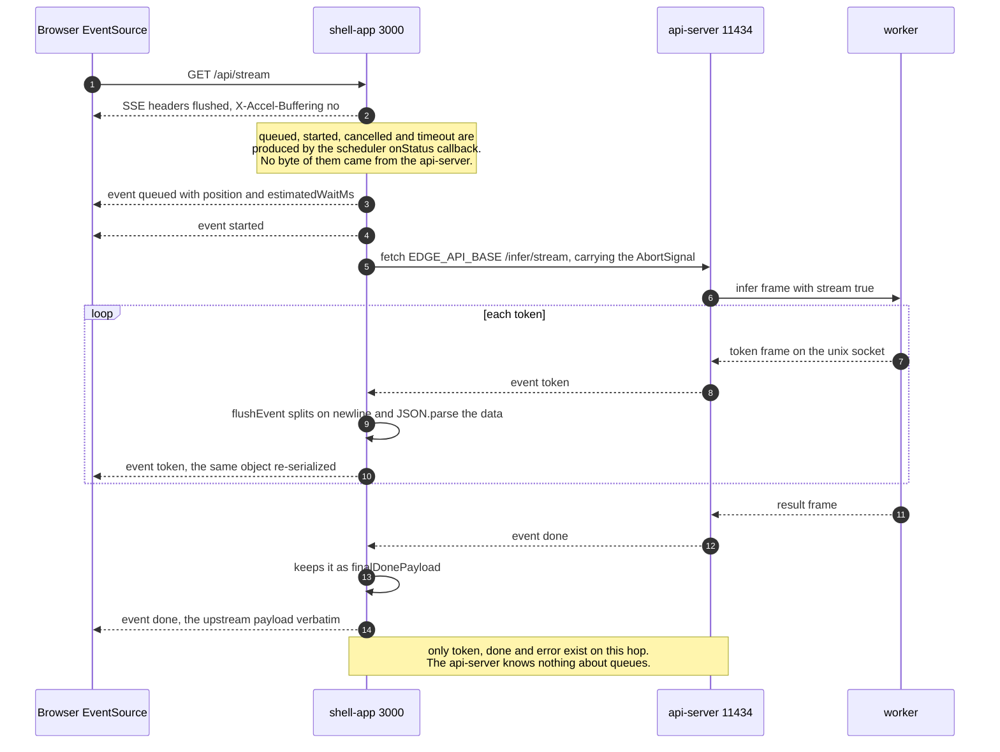

# The shell app

The shell app is the only process a browser is allowed to talk to. It owns the scheduler, it
owns the CORS allowlist, and it is the outer half of a two-hop SSE stream. It listens on
`EDGE_SHELL_PORT` (3000 by default) and binds `127.0.0.1`, because nothing in this stack
authenticates ([server.js:282](../backend/shell-app/server.js#L282)).

It holds no inference logic. Everything past the queue is a plain `fetch` to
`EDGE_API_BASE`, done by [edgeAgentService.js](../backend/shell-app/edgeAgentService.js).
Scheduling decisions belong to [06-scheduler.md](06-scheduler.md), and what happens on the
far side of that fetch belongs to [07-api-server.md](07-api-server.md).

## The HTTP surface

Seven routes, all defined in [server.js](../backend/shell-app/server.js). Three of them reach
the api-server, and only two of those go through the queue to get there.



`GET /` is a liveness ping that touches nothing, which makes it the safe one to poll when you
are trying to tell a wedged shell from a wedged backend.

### POST /api/infer

Buffered inference. Waits for the whole answer and replies once. None of the shipped clients
call it, they all stream, so in practice this is the `curl` path.

```bash
curl -X POST http://127.0.0.1:3000/api/infer \
  -H 'Content-Type: application/json' \
  -d '{"prompt":"What is 2+2?","mfeId":"chat_1","priority":"high","requestId":"smoke-1"}'
```

`prompt` is required and trimmed. `mfeId` defaults to `doc-qa`, `priority` defaults to
`normal` and is forced to one of `high` / `normal` / `low`, and a missing `requestId` becomes
a fresh `crypto.randomUUID()`.

```json
{
  "requestId": "smoke-1",
  "result": "2 + 2 = 4.",
  "device": "cuda",
  "degraded": false,
  "degradedReason": null
}
```

Failures, each with the status the shell picks in
[server.js:102-143](../backend/shell-app/server.js#L102-L143):

| Status | Body `error` | Cause |
|---|---|---|
| 400 | `prompt_required` | empty or non-string prompt |
| 408 | `queue_timeout` | waited past `EDGE_QUEUE_TIMEOUT_MS`, body carries `retryable: true` |
| 429 | `scheduler_overloaded` | the queue was already at `EDGE_MAX_QUEUE` |
| 499 | `request_cancelled` | cancelled while queued |
| 503 | `worker_crashed` | the worker died, body carries `retryAfterSeconds` |
| 504 | `exec_timeout` | ran past `EDGE_EXEC_TIMEOUT_MS`, body carries `ranMs` and `retryable` |
| 502 | whatever the api-server said, else `infer_failed` | anything else |

### GET /api/stream

Streaming inference over SSE. Query parameters rather than a body, because the browser side
is an `EventSource`. `mfeId` defaults to `meeting-summary` here and `priority` defaults to
`high`, which is different from the buffered route
([server.js:146-150](../backend/shell-app/server.js#L146-L150)).

```
GET /api/stream?prompt=Say+hi&mfeId=chat_1&priority=high&requestId=chat_1-m8q2-9fk3a1
```

Headers on the response: `text/event-stream`, `Cache-Control: no-cache`,
`Connection: keep-alive`, and `X-Accel-Buffering: no`.

An empty prompt gets a plain 400 JSON body, not an SSE error, because nothing has been
flushed yet. Once headers are out, every failure arrives as an `error` event instead.

If the browser closes the connection, `req.on('close')` cancels the job, so a closed tab
frees the slot instead of leaving it held
([server.js:170-179](../backend/shell-app/server.js#L170-L179)).

### POST /api/cancel

```json
{ "requestId": "chat_1-m8q2-9fk3a1" }
```

```json
{ "requestId": "chat_1-m8q2-9fk3a1", "cancelled": true, "state": "queued" }
```

`state` is `queued` if it was pulled out of the queue, `active` if its `AbortController` was
fired, `not_found` if the id is unknown, or the recorded terminal state (`done`, `failed`,
`timeout`, `cancelled`) with `cancelled: false` if it had already finished. A missing
`requestId` gets 400 `requestId_required`.

A cancel travels the same two hops as the stream did, in the other direction, and how far it
gets depends on which of those two states the job was in.



Nothing cancels llama itself. There is no cancel frame in the worker protocol, so an aborted
request costs the same compute as one that was read to the end.

### GET /api/queue-status

```
GET /api/queue-status?requestId=chat_1-m8q2-9fk3a1
```

```json
{
  "requestId": "chat_1-m8q2-9fk3a1",
  "state": "queued",
  "position": 3,
  "estimatedWaitMs": 8000
}
```

An unknown id answers `state: "not_found"` with `position: -1` and `estimatedWaitMs: -1`. A
finished id answers with the recorded done entry, which has a `finishedAt` instead of a
position. No client in the repo polls this route, the streaming clients get the same numbers
pushed to them on the `queued` event.

### GET /api/health

The scheduler's own snapshot, taken in process. It answers even when the backend is down.

```json
{
  "limits": { "maxSlots": 4, "maxPerMfe": 2, "maxQueue": 20 },
  "activeCount": 2,
  "queueLength": 5,
  "activeByMfe": { "chat_1": 2 }
}
```

Every client polls this every 5 seconds to drive its online/offline dot
([useChatClient.js:216-236](../clients/shared/src/hooks/useChatClient.js#L216-L236)).

### GET /api/agent-health

A pass-through of the api-server's `/health`, so the dashboard can reach it without knowing
the api-server's address. On failure it answers the upstream status, or 503, with
`{"error": "agent_unreachable", "message": "..."}`. The body shape is owned by
[07-api-server.md](07-api-server.md).

## CORS, and what happens when an origin is missing

`EDGE_ALLOWED_MFE_ORIGINS` is a comma-separated list, split and trimmed into a `Set` at
startup ([server.js:32-37](../backend/shell-app/server.js#L32-L37)). The middleware reflects
the matching origin rather than sending `*`. The branch worth drawing is the one where the
match fails, because nothing on the server side treats it as an error.



That bottom-right box is why this is worth a picture. From inside the client app a missing
origin looks exactly like the shell being down.

Two ways to trip over this:

1. Change a client's port and forget the variable. `127.0.0.1:5006` is not in the shipped
   list.
2. Open the page as `localhost` when only `127.0.0.1` is listed, or the reverse. They are
   different origins. The shipped list carries both spellings of all six client ports and all
   six Vite dev ports for that reason.


## SSE re-emission, the part that surprises people

The api-server speaks SSE to the shell. The shell does not proxy that stream. It parses it by
hand, byte by byte, in
[edgeAgentService.js:108-166](../backend/shell-app/edgeAgentService.js#L108-L166): read from
the fetch body reader, split on `\n`, treat a blank line as end of event, accumulate
`event:` and `data:` lines, `JSON.parse` the data. Then it emits its own SSE to the browser
from [server.js:163-217](../backend/shell-app/server.js#L163-L217). The two vocabularies are
not the same, and the diagram shows where the extra four events are born.



The `done` payload has two lives. The browser gets the upstream object passed straight
through the `onDone` callback, while `_streamFromApi` separately returns a normalized
`result` / `device` / `degraded` / `degradedReason` object to the scheduler
([edgeAgentService.js:168-177](../backend/shell-app/edgeAgentService.js#L168-L177)), which
the browser never sees.

**Changing the shape of a token payload means editing both hops and the client.** The
api-server writes `{ requestId, token }`
([routes/infer.js:147](../backend/api-server/routes/infer.js#L147)), the shell's `flushEvent`
hands that object to `onToken` unchanged, `server.js` re-serializes it, and
`useChatClient` reads `payload.token`
([useChatClient.js:78](../clients/shared/src/hooks/useChatClient.js#L78)). Rename that field
and three files break, in two tiers, with no type checker between them.

## A real stream, as the browser sees it

A `chat_1` submission that queues behind one other job, streams four pieces and finishes:

```
event: queued
data: {"requestId":"chat_1-m8q2-9fk3a1","position":1,"estimatedWaitMs":8000}

event: started
data: {"requestId":"chat_1-m8q2-9fk3a1"}

event: token
data: {"requestId":"chat_1-m8q2-9fk3a1","token":"Hello"}

event: token
data: {"requestId":"chat_1-m8q2-9fk3a1","token":" there"}

event: token
data: {"requestId":"chat_1-m8q2-9fk3a1","token":"!"}

event: done
data: {"requestId":"chat_1-m8q2-9fk3a1","result":"Hello there!","device":"cuda","degraded":false,"degradedReason":null,"replay":false}
```

The same request cancelled from the browser:

```
event: queued
data: {"requestId":"chat_1-m8q2-9fk3a1","position":2,"estimatedWaitMs":16000}

event: cancelled
data: {"requestId":"chat_1-m8q2-9fk3a1","reason":"user_cancelled"}
```

An `error` event with `request_cancelled` follows that one, because the job's promise rejects
after `onStatus` has already fired. The client never sees it: `cancelled` is a terminal event
in [shellApi.js:10-13](../clients/shared/src/lib/shellApi.js#L10-L13), so the `EventSource` is
already closed. In the usual flow the browser closes the stream itself before it POSTs
`/api/cancel`, and then `requestClosed` suppresses both.

Timed out while queued, then the same request timed out while running:

```
event: timeout
data: {"requestId":"chat_1-m8q2-9fk3a1","phase":"queue","waitedMs":30001,"retryable":true}

event: timeout
data: {"requestId":"chat_2-m8q2-x1","phase":"execution","ranMs":120003,"retryable":true}
```

A worker crash after the headers were flushed:

```
event: error
data: {"error":"worker_crashed","message":"worker_crashed","requestId":"chat_1-m8q2-9fk3a1","retryAfterSeconds":2}
```

Note the shape difference. `waitedMs` is only on a queue timeout and `ranMs` only on an
execution timeout, so a client that reads the wrong one gets `undefined` rather than a wrong
number.

## Failure cases

- **The api-server is down.** `fetch` throws, the scheduler's job rejects, and the buffered
  route answers 502 `infer_failed`. The streaming route emits an `error` event with
  `error: "stream_failed"`.
- **The api-server returns a non-2xx on the stream route.** `_streamFromApi` throws before any
  SSE is parsed, and the shell reports it as one `error` event. The upstream status is on the
  error object but is not put in the payload.
- **The upstream stream ends with no `done`.** The shell returns
  `{ requestId, result: '', device: 'cpu', degraded: false }`
  ([edgeAgentService.js:168](../backend/shell-app/edgeAgentService.js#L168)). The browser sees
  a stream that just ends. This is the one path where a client can be left with a truncated
  answer and no error.
- **An `error` event arrives mid-stream.** `flushEvent` throws from inside the read loop,
  which aborts the reader and rejects the job.

## Limitations

- The shell is a singleton by design and holds all queue state in memory. Restart it and every
  queued and running request is lost, and `/api/queue-status` answers `not_found` for ids that
  were live a second earlier.
- There is no authentication anywhere, which is why it binds loopback.
- `/api/queue-status` has no in-repo consumer.
- The SSE parser is hand-rolled and ignores `id:` and `retry:` fields, and does not handle
  comment lines. That is fine against this api-server, which never sends them, and would break
  against a general SSE producer.
