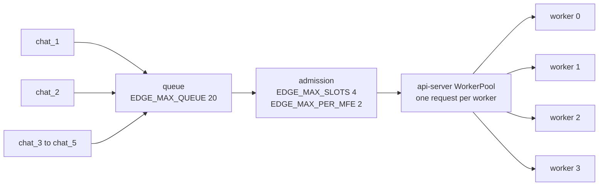
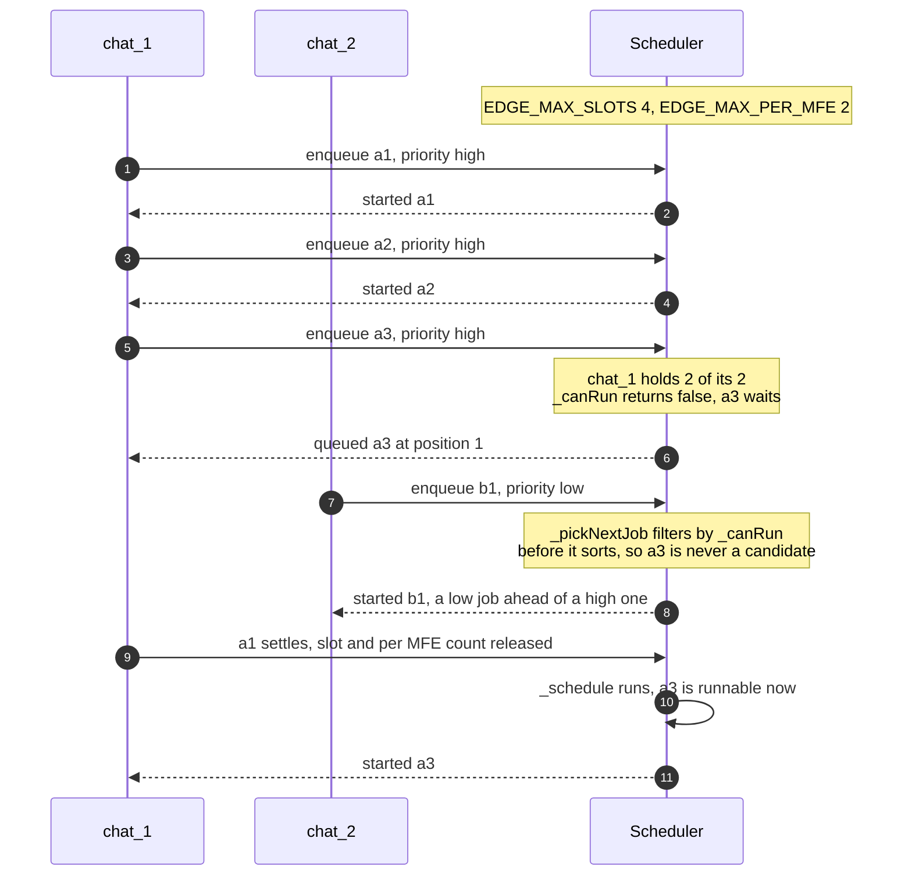
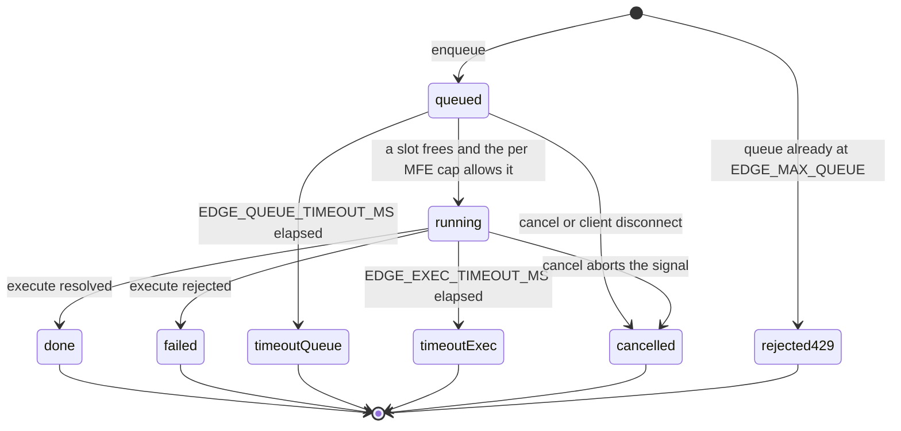
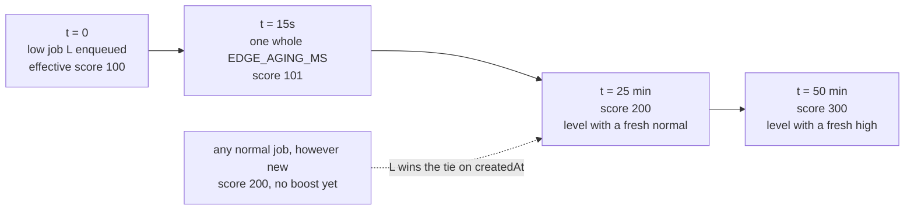

# The scheduler

The scheduler is the shell app's admission control. It decides which request runs now, which
one waits, and which one is refused outright, and it is the reason one noisy client cannot
take the whole machine. It is a single class in
[scheduler.js](../backend/shell-app/scheduler.js) with no dependencies and no I/O, which is
why the test suite can drive it directly.

It knows nothing about workers, devices or models. It runs an opaque `execute` function that
the caller supplies, and the only thing it hands that function is an `AbortSignal`.

## Two limits, in two different processes

Concurrency is capped twice in this system, and the two caps are configured separately and
can disagree.



Only the left box is this document. The pool is [07-api-server.md](07-api-server.md).

`EDGE_MAX_SLOTS` is the global cap on running jobs. `EDGE_MAX_PER_MFE` is how many of those
slots any single `mfeId` may hold at once. Both are read in
[edgeAgentService.js:9-20](../backend/shell-app/edgeAgentService.js#L9-L20) and default in
the constructor to 4 and 2.

**`EDGE_MAX_PER_MFE` must be strictly less than `EDGE_MAX_SLOTS`, or the fairness rule does
nothing at all.** The check is `current < this.maxPerMfe` after `this.active.size >=
this.maxSlots` ([scheduler.js:225-229](../backend/shell-app/scheduler.js#L225-L229)). With
both set to 4, a single MFE reaching 4 active jobs has already hit the global cap, so the
per-MFE test never rejects anything it would not have rejected anyway. Set them equal and you
have removed the fairness rule while leaving the variable in place, which is worse than not
having it, because the config still reads as though the rule exists.

The shipped 4 and 2 mean one client holds at most half the machine. Here is the rule biting,
with two slots still free and a `low` job from a quiet client starting ahead of a `high` job
from the flooder.



[scheduler.test.js:116](../tests/scheduler.test.js#L116) pins that shape: six jobs from one
MFE and two from another, the flooder never above 2 active, the quiet MFE still served.

`EDGE_MAX_SLOTS` should also not exceed the number of workers that actually started, or the
scheduler admits work the api-server then refuses with 503 `no_ready_workers`. The scheduler
has no way to learn that number.

## A job's life



Every terminal state except the 429 is written into a bounded `done` map, which is what
`/api/queue-status` reads afterwards.

## Admission

`enqueue` does one check before anything else: if `this.queue.length >= this.maxQueue` it
throws `SchedulerError('scheduler_overloaded')` with `status = 429` and
`details.maxQueue` ([scheduler.js:32-39](../backend/shell-app/scheduler.js#L32-L39)). This
throws synchronously, so the caller never gets a promise and no job object is created.

The cap counts queued jobs only. Running jobs are in a separate map, so at the shipped values
the system can hold 20 waiting plus 4 running before it starts refusing.

Everything that gets past that check is queued, never rejected for priority or for the
per-MFE cap. A job from an MFE that is already at its cap simply sits in the queue until one
of that MFE's jobs finishes.

## Priority and aging

Three levels, normalized from free text with anything unrecognized becoming `normal`
([scheduler.js:189-194](../backend/shell-app/scheduler.js#L189-L194)). Base scores are 300 for
`high`, 200 for `normal`, 100 for `low`.

The real comparison, in full:

```js
effectivePriority(job, now) {
  const ageBoost = Math.floor((now - job.createdAt) / this.agingMs);
  return this.basePriority(job.priority) + ageBoost;
}
```

and the sort that uses it, in `_pickNextJob`:

```js
candidates.sort((a, b) => {
  const p = this.effectivePriority(b, now) - this.effectivePriority(a, now);
  if (p !== 0) return p;
  return a.createdAt - b.createdAt;
});
```

One point per whole `EDGE_AGING_MS` waited, remainder discarded, and ties break on arrival
time so within one priority the queue is FIFO. What that buys a starved `low` job at the
shipped `EDGE_AGING_MS=15000`:



That is slow, and deliberately so: it stops a "Burst LOW x5" from starving forever without
letting background work jump interactive work on any normal timescale.
[scheduler.test.js:61](../tests/scheduler.test.js#L61) pins the arithmetic, including that
3500 ms at a 1000 ms interval is worth exactly 3 points.

`_pickNextJob` filters by `_canRun` **before** sorting, which is what the fairness sequence
above turns on: a job blocked by its MFE's cap is skipped over rather than blocking the queue
behind it.

## Estimated wait

```js
_estimateWaitMs(position) {
  if (position <= 0) return 0;
  const slots = Math.max(1, this.maxSlots);
  const batchesAhead = Math.ceil(position / slots);
  return batchesAhead * this.avgDurationMs;
}
```

`avgDurationMs` starts at `EDGE_DEFAULT_JOB_MS` (8000) and is updated on every slot release
with an exponential moving average, 70 percent old and 30 percent new
([scheduler.js:272](../backend/shell-app/scheduler.js#L272)).

Two things it does not model: the per-MFE cap, and the fact that a job may be cancelled or
time out rather than run to completion. So the number is a rough hint, not a promise. It is
computed against the position at the moment of the `queued` event and never revised, because
the shell pushes `queued` once and does not poll.

`getQueuePosition` re-sorts the whole queue on every call to produce a 1-based rank. At a
queue cap of 20 that is cheap.

## The two timeouts

| Bound | Variable | Fires while | Error code | HTTP | `phase` |
|---|---|---|---|---|---|
| Queue wait | `EDGE_QUEUE_TIMEOUT_MS` | queued | `queue_timeout` | 408 | `queue` |
| Execution | `EDGE_EXEC_TIMEOUT_MS` | running | `exec_timeout` | 504 | `execution` |

The queue timer is armed in `enqueue` and cleared the moment the job starts running
([scheduler.js:257](../backend/shell-app/scheduler.js#L257)). If it fires it removes the job
from the queue, notifies `timeout` with `waitedMs` and `retryable: true`, rejects with status
408 and records a done entry. It does **not** set `phase`, and the shell fills in `queue` as
the default when it re-emits ([server.js:204](../backend/shell-app/server.js#L204)).

The execution timer is armed in `_run`. When it fires it sets `job.execTimedOut`, notifies
`timeout` with `phase: 'execution'` and `ranMs`, **aborts the job's `AbortController`**,
rejects with status 504, records the done entry and releases the slot
([scheduler.js:283-309](../backend/shell-app/scheduler.js#L283-L309)).

That abort is the load-bearing part. It propagates into the shell's `fetch` to the
api-server, which tears down the upstream connection instead of leaving it open. The
`execTimedOut` flag then makes the late `.then` and `.catch` from the real work fall through
without touching the already-settled promise.

The slot is released by whichever comes first, the job settling or the timer, guarded by a
`released` boolean so it happens exactly once
([scheduler.js:262-281](../backend/shell-app/scheduler.js#L262-L281)). A job that ignores its
abort signal entirely still gives up its slot on time.
[scheduler.test.js:262](../tests/scheduler.test.js#L262) covers exactly that: an `execute`
returning `new Promise(() => {})` still frees the slot, and the next job runs.

Keep `EDGE_EXEC_TIMEOUT_MS` above whatever a real generation takes. The shipped value is
120000, and the supervisor's `EDGE_WORKER_STUCK_REQUEST_MS` is deliberately larger at 180000
so the scheduler gives up before the supervisor decides the worker is wedged.

## Cancel

`cancel(requestId)` looks in three places in order
([scheduler.js:107-140](../backend/shell-app/scheduler.js#L107-L140)):

1. The queue. Splice it out, clear both timers, notify `cancelled` with
   `reason: 'user_cancelled'`, reject, record. Returns `{ cancelled: true, state: 'queued' }`.
2. The active map. Fire the `AbortController` and return
   `{ cancelled: true, state: 'active' }`. The rejection arrives later, through the `.catch`
   that checks `signal.aborted`.
3. The done map. Returns `{ cancelled: false, state: <the recorded state> }`.

Anything else is `{ cancelled: false, state: 'not_found' }`.

Clearing the queue timer on cancel matters more than it looks. Without it a cancelled job
would still fire a `timeout` event at the browser after it had already been told `cancelled`.
[scheduler.test.js:290](../tests/scheduler.test.js#L290) waits past the timeout specifically
to assert no second event arrives.

The shell wires a browser disconnect straight into this, so closing a tab frees the slot.

## What a client can actually act on

The scheduler produces three signals a client can use, and the shipped clients use all three.

- **Queue position**, on the `queued` event. `chat_1` shows it as `queued #3`.
- **Estimated wait**, on the same event as `estimatedWaitMs`. The clients round it up to
  whole seconds and show `~8s`.
- **`retryable: true`**, on both timeout kinds, and `retryAfterSeconds` from the api-server on
  crash and no-worker errors. `backoffMs` prefers the server's hint and falls back to
  exponential backoff with jitter
  ([retry.js:22-30](../clients/shared/src/lib/retry.js#L22-L30)).

A retry reuses the same `requestId` on purpose, so a retry that races a late success replays
the cached answer instead of running inference twice. See
[08-idempotency.md](08-idempotency.md) and [17-clients.md](17-clients.md).

429 `scheduler_overloaded` is the one signal with no wait hint attached. It is in the client's
retryable set anyway, so it gets plain jittered backoff.

## Bounding the done map

The shell is long-lived, so finished jobs cannot accumulate forever. `_evictDone` drops
entries older than `EDGE_DONE_TTL_MS` and then trims to `EDGE_DONE_MAX_ENTRIES`, oldest
first. It relies on `Map` insertion order being finish order, so it can stop scanning at the
first entry inside the TTL ([scheduler.js:363-374](../backend/shell-app/scheduler.js#L363-L374)).

The cost is that a `requestId` old enough to be evicted answers `not_found` on
`/api/queue-status` rather than `done`, which is indistinguishable from an id that never
existed.

## Limitations

- All state is in memory in one process. A shell restart loses the queue.
- The scheduler cannot see the worker pool, so `EDGE_MAX_SLOTS` and the effective worker count
  have to be kept consistent by hand.
- `estimatedWaitMs` ignores the per-MFE cap, so a client sitting behind its own cap is told a
  wait that is too optimistic.
- Aging is linear and unbounded. A job that waits long enough eventually outranks everything,
  which is the intent, but there is no ceiling on the boost.
- A `queued` event is sent once, at enqueue time. There is no push when the position improves.

## Possible improvements

- Have the shell read the effective worker count the way the api-server now does through
  [workerCountSource.js](../backend/api-server/workerCountSource.js), and clamp `maxSlots` to
  it, so the two gates cannot disagree.
- Re-emit `queued` when a job's position changes, so a waiting client sees progress.
- Weight `avgDurationMs` by prompt length, since a 4000-token transcript and a two-word
  question are not the same job.
