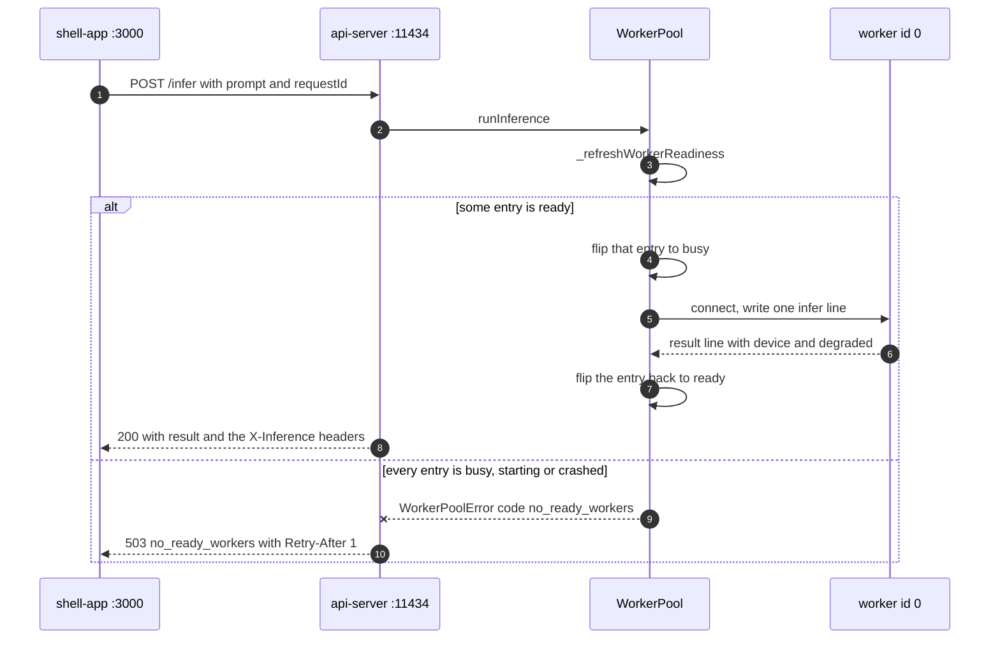
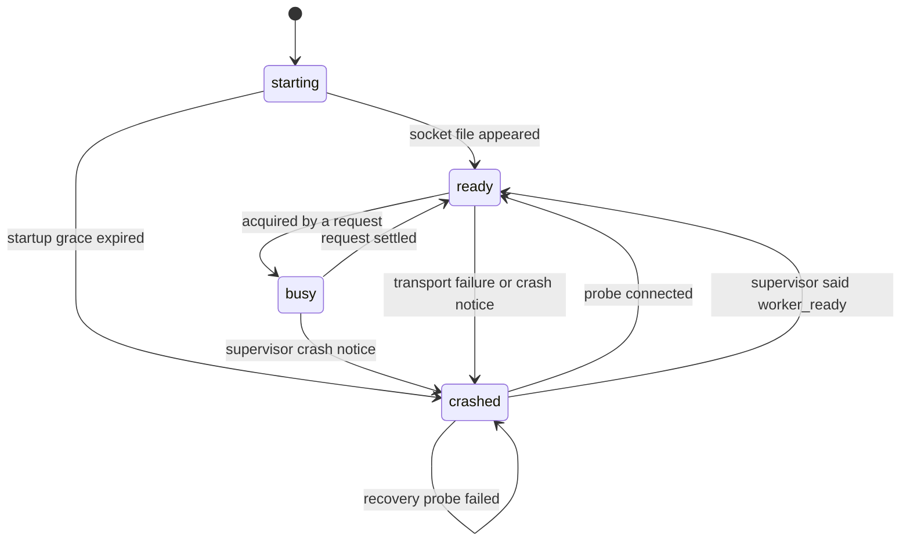
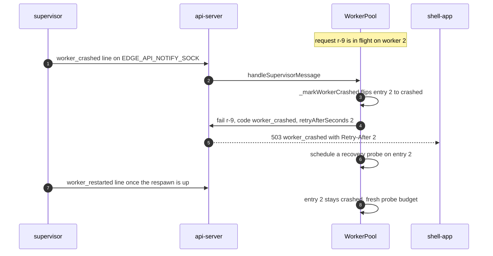
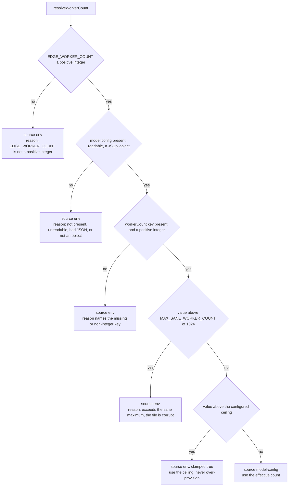

# The api-server

The api-server is the Node process that turns an HTTP request into a line of JSON on a unix
socket. It sits between the [shell app](05-shell-app.md), which is the only thing that calls
it, and the C++ [inference workers](09-inference-worker.md), which do the actual work. It
binds `127.0.0.1` and nothing else, so no browser ever reaches it directly.

It is started by the supervisor, not by a script of its own, and it registers itself in the
pidfile registry as `backend-api-server`. Its port comes from `EDGE_API_PORT`, which ships as
`11434`.

## What it owns

It owns the pool of worker connections and the decision of which worker gets a request. It
does not queue. It knows nothing about priorities, per-MFE fairness, or CORS. Those all live
one hop up, in the shell's [scheduler](06-scheduler.md).

It does own request deduplication, which is documented separately in
[08-idempotency.md](08-idempotency.md).

## HTTP surface

Three routes. Two of them are registered in
[routes/infer.js](../backend/api-server/routes/infer.js), the third in
[server.js:153](../backend/api-server/server.js#L153).

### POST /infer

Buffered inference. The whole answer comes back in one JSON body.

```bash
curl -X POST http://127.0.0.1:11434/infer -H 'Content-Type: application/json' \
  -d '{"prompt":"What is 2+2?","requestId":"smoke-1","mfeId":"doc-qa"}'
```

`prompt` is required. `requestId` and `mfeId` are optional, and a missing `requestId` gets a
`randomUUID()`. An empty or whitespace-only prompt is a 400:

```json
{ "error": "prompt_required" }
```

A success is 200 with:

```json
{
  "requestId": "smoke-1",
  "result": "2 + 2 = 4.",
  "device": "cuda",
  "degraded": false,
  "degradedReason": null,
  "replay": false
}
```

and these response headers:

| Header | Value |
|---|---|
| `X-Idempotent-Replay` | `true` when the answer came from the result cache or from joining an open run |
| `X-Inference-Device` | the tier the worker answered on, `cpu` if the worker did not say |
| `X-Inference-Degraded` | `true` when the worker fell off its best tier |
| `X-Latency-Mode` | `degraded` or `normal`, derived from the same flag |
| `X-Degraded-Reason` | only present when degraded, e.g. `cuda:removed` |

Errors:

| Status | Body `error` | When |
|---|---|---|
| 400 | `prompt_required` | empty prompt |
| 503 | `worker_crashed` | the supervisor said the worker holding this request died |
| 503 | `no_ready_workers` | no pool entry was in `ready` state |
| 502 | `worker_unavailable` | anything else, including a bad JSON frame from the worker |

Both 503s carry `Retry-After` (2 seconds for a crash, 1 for an empty pool), an
`X-Edge-Error` header, and repeat the number in the body:

```json
{ "error": "no_ready_workers", "retryAfterSeconds": 1, "requestId": "smoke-1" }
```

### GET /infer/stream

The same job, streamed as Server-Sent Events. Parameters are query string rather than body.

```bash
curl -N "http://127.0.0.1:11434/infer/stream?prompt=Say+hi&requestId=s1&mfeId=doc-qa"
```

The event vocabulary here is three names only. The shell adds its own on the second hop, and
the two sets are listed side by side in [05-shell-app.md](05-shell-app.md).

```
event: token
data: {"requestId":"s1","token":"Hi"}

event: token
data: {"requestId":"s1","token":" there"}

event: done
data: {"requestId":"s1","result":"Hi there","device":"cuda","degraded":false,"degradedReason":null,"replay":false}
```

An `error` event only appears once headers are already out. Before that the route can still
answer with a plain JSON status, so a crash detected during connect is a 503 body and a crash
detected mid-stream is:

```
event: error
data: {"error":"worker_crashed","retryAfterSeconds":2,"requestId":"s1"}
```

Closing the connection cancels the run. `req.on('close')` calls the handle's `cancel()`, which
fails the in-flight entry with code `stream_cancelled`.

A 409 `request_in_flight` is possible on this route, and only this route. See
[08-idempotency.md](08-idempotency.md) for why streaming cannot join an open run the way
buffered inference can.

### GET /health

What the dashboard ends up rendering. It calls `workerPool.getHealth()` and
`registry.snapshot()` and merges them.

```json
{
  "workers": [
    { "id": 0, "status": "ready", "device": "cuda", "degraded": false, "degradedReason": null },
    { "id": 1, "status": "busy", "device": "cpu", "degraded": false, "degradedReason": null },
    { "id": 2, "status": "crashed", "device": null, "degraded": false, "degradedReason": null },
    { "id": 3, "status": "starting", "device": null, "degraded": false, "degradedReason": null }
  ],
  "activeSlots": 1,
  "uptime": 412,
  "requests": { "inflight": [], "completedCached": 3, "orphanedFromPreviousRun": [] }
}
```

`uptime` is seconds. `device` is `null` until that worker has answered at least one request,
because only a `result` frame carries the tier
([ipc.js:286](../backend/api-server/ipc.js#L286)). It is the last tier observed, never a live
read of what the worker is on right now.

`getHealth` calls `_refreshWorkerReadiness()` before it builds the list. Without it, a worker
that died on model load would read as `starting` forever and the dashboard would show a lie
until somebody happened to send a request.

## The worker pool

[WorkerPool](../backend/api-server/ipc.js) pre-creates one entry per worker at construction
time and never adds or removes entries afterwards. Each entry is a plain object holding the
socket path `${EDGE_WORKER_SOCKET_PREFIX}${id}.sock`, a status, a recovery timer and the last
device it reported.

One in-flight request per worker. `_acquireWorker` finds the first entry in `ready` state,
flips it to `busy`, and hands it back. There is no second pass, no queue and no wait.

Both outcomes of that one decision, for a buffered `POST /infer`:



Nothing waits. The scheduler one hop up is what is supposed to have kept that request out.

### Worker states

Four states. `crashed` is the only one with a timer attached to it.



**`starting` is not a resting state.** `_refreshWorkerReadiness` runs on every acquire and
every health check. If the socket file still is not there and
`Date.now() - startedAt >= EDGE_WORKER_STARTUP_GRACE_MS` (15000 by default), the entry becomes
`crashed` and gets a recovery probe scheduled, exactly like one that died mid-request. A worker
that failed on model load stops reading as a slow boot.

The readiness check is `fs.existsSync` on the socket path, which a stale socket file from a
killed process also satisfies. That is deliberate and is caught one layer later: the first
request against such an entry fails with a transport error, and
`_quarantineAfterTransportFailure` moves it to `crashed`. `WorkerPool.isTransportFailure`
draws the line, and it counts `worker_connect_timeout`, `worker_socket_error` and
`worker_closed`. A worker that answered with an `error` frame is not a transport failure, so it
stays in the pool.

Recovery probing backs off linearly: attempt *n* fires after `EDGE_WORKER_RECOVERY_MS * n`.
After `EDGE_WORKER_RECOVERY_ATTEMPTS` attempts (10 shipped) it stops, and the entry is stuck
in `crashed` until a supervisor message revives it. The probe itself is a bare connect that
resolves false on error or on `connectTimeoutMs`.

### Reacting to the supervisor

`handleSupervisorMessage` is fed by a listener on `EDGE_API_NOTIFY_SOCK`, set up in
[server.js:65](../backend/api-server/server.js#L65). Frame layouts are in
[16-ipc-protocols.md](16-ipc-protocols.md).

A crash notice arriving while that worker holds a request:



- `worker_crashed` fails every in-flight request pinned to that worker, or only the one the
  notice named if it named one.
- `worker_restarted` does **not** trust the claim. The replacement process exists but its
  socket may not, so the entry is put back to `crashed` with a fresh attempt budget and probed
  like any other. A `busy` entry is left alone.
- `worker_ready` sets the entry straight to `ready`. Nothing in this repo currently sends that
  message, so today it is reachable only from tests. It is the documented escape hatch for an
  entry that exhausted its probe budget.

What the supervisor does on its side of that same event (restart, circuit breaker, crash log)
is in [14-crash-recovery.md](14-crash-recovery.md).

## How many workers there are

`EDGE_WORKER_COUNT` is a ceiling, not a promise. Capacity planning can decide the host cannot
pay for that many, so fewer are started. The api-server used to read the env variable straight
and pre-create pool entries for workers that never existed. That is fixed.

[workerCountSource.js](../backend/api-server/workerCountSource.js) reads `workerCount` out of
the model config JSON at `$EDGE_MODEL_CONFIG_PATH`, which the supervisor writes with the count
it actually placed. `resolveWorkerCount` picks between the two sources, and every branch that
is not the happy one falls back to the ceiling with a reason string attached:



A bad ceiling is passed through untouched, because there is nothing to clamp against and the
`WorkerPool` constructor is the one place that gets to reject it. Nothing in that path throws. The api-server has to boot standalone, and a missing model config
is the normal case then.

`logWorkerCountDecision` writes exactly one line at startup. On the good path it is `info`:

```
[api-server] worker pool size 2 from effective count in /tmp/edge-model-config.json (configured EDGE_WORKER_COUNT=4) (capacity-limited: fewer workers were started than configured)
```

On any fallback it is `warn` and names the reason:

```
[api-server] worker pool size 4 from EDGE_WORKER_COUNT (configured=4, effective from /tmp/edge-model-config.json unavailable: model config not present)
```

[tests/workerCountSource.test.js](../tests/workerCountSource.test.js) pins every one of those
branches against real files on disk, including the one that asserts the resolved number is
what `WorkerPool` actually pre-creates entries for.

This is a different number from `EDGE_MAX_SLOTS`. The resolver never reads the scheduler's
variables, and there is a test that greps the source to keep it that way.

## Failure cases

| What happens | What the caller sees |
|---|---|
| Every worker busy | 503 `no_ready_workers`, `Retry-After: 1` |
| Worker killed mid-request | 503 `worker_crashed`, `Retry-After: 2` |
| Socket file present, nothing listening | 502 `worker_unavailable`, and that entry is quarantined |
| Worker writes a line that is not JSON | 502 `worker_unavailable`, message `invalid worker JSON frame` |
| Worker sends `{"type":"error",...}` | 502 `worker_unavailable`, message is the worker's own error string |
| Client disconnects mid-stream | nothing, the run is cancelled and the worker entry returns to `ready` |
| Model config says 2, env says 4 | pool holds 2 entries, one `info` line explains why |

## Limitations

The pool has no notion of which worker is on which device. `_recordDevice` only updates after a
result comes back, so `_acquireWorker` cannot prefer the CUDA worker over a CPU one. It takes
the first ready entry in id order.

There is also no back-pressure signal upward. The worker count is read correctly on this side
now, but it is never published back to the shell, so `EDGE_MAX_SLOTS` can still admit work
this process then refuses with a 503.

## Possible improvements

- Feed the resolved worker count to the shell, so `EDGE_MAX_SLOTS` can be capped against real
  capacity instead of the configured ceiling.
- Have the supervisor send `worker_ready` when a replacement worker binds its socket. The
  api-server already handles it, and it would remove the case where an entry that burned its
  probe budget stays out of the pool forever.
- Pick a worker by device when the request asks for one, rather than first-ready.
