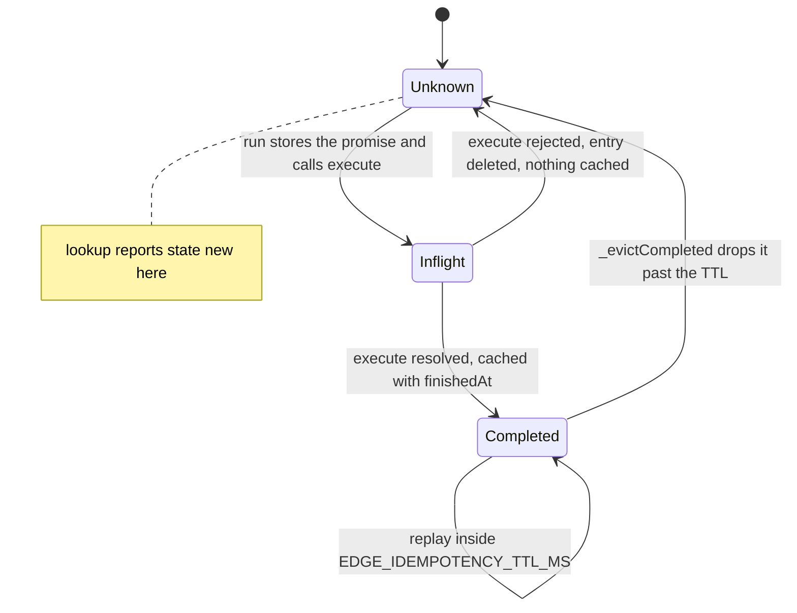
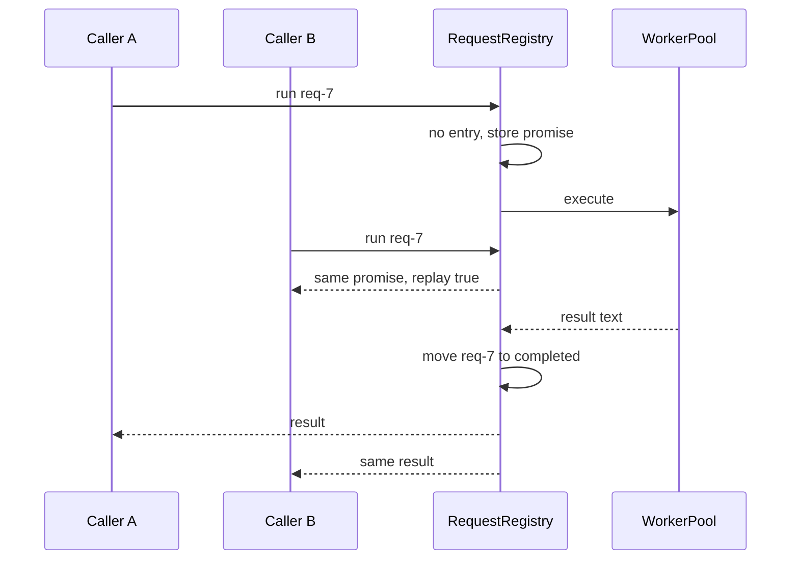
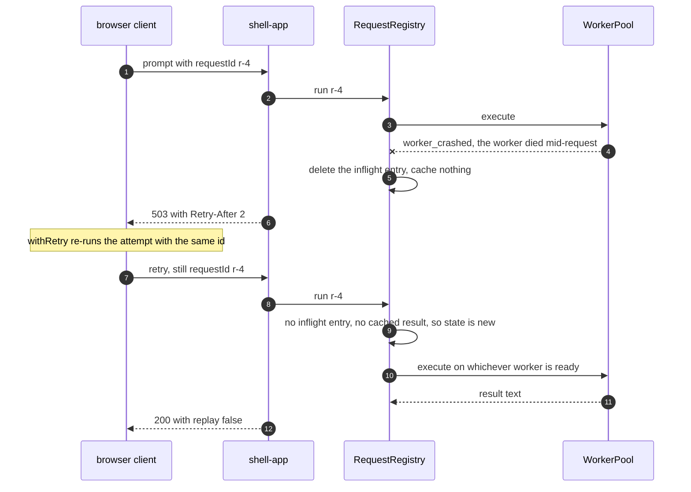
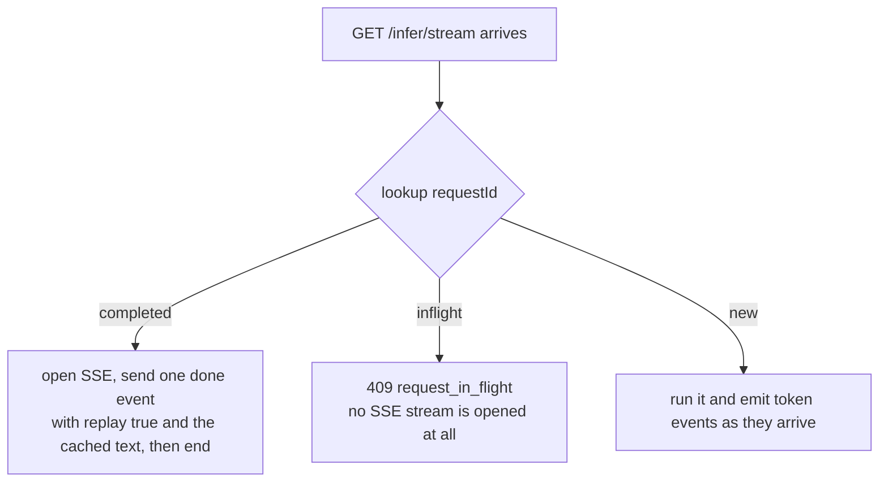

# Idempotent requests

Every client in this repo retries. `startRun` in
[useChatClient.js:126](../clients/shared/src/hooks/useChatClient.js#L126) generates one
`requestId`, then hands the attempt to `withRetry` from
[retry.js](../clients/shared/src/lib/retry.js), which re-runs it with that *same* id. A 503
caused by a worker crash therefore must not turn into two inference runs when the retry lands.
The [RequestRegistry](../backend/api-server/requestRegistry.js) is what makes that safe: it
coalesces concurrent submissions of one id onto a single run, and caches the answer for a
while afterwards.

One registry instance exists per api-server process. It is constructed at the top of
[routes/infer.js](../backend/api-server/routes/infer.js#L8) and shared by both inference
routes.

## What it owns

Two maps and one file.

- `inflight`, keyed by `requestId`, holding the promise of a run that has not settled.
- `completed`, keyed by `requestId`, holding a finished result and the time it finished.
- `$EDGE_INFLIGHT_PATH`, a JSON file that mirrors `inflight` to disk.

It does not know what a prompt is, does not talk to a worker, and does not care whether the
run was streamed. `run()` takes an `execute` callback and only ever calls it once per id.

## Three answers to one id

`run({ requestId, mfeId, stream, execute })` returns a handle with a `replay` flag, a `state`,
and a promise. Which of the three it returns depends on what the registry already knows:

| State of the id | `state` | `replay` | What happens |
|---|---|---|---|
| Never seen, or last attempt failed | `new` | `false` | `execute()` is called |
| Currently running | `inflight` | `true` | the caller gets the existing promise |
| Finished inside the TTL | `completed` | `true` | the caller gets the cached result |

Both replay cases skip the worker entirely. The second caller of an open id waits on exactly
the same promise as the first, so one prompt, one decode, two HTTP responses.

One id moves between those states like this. Note that the only way out of `inflight` on a
failure is straight back to `new`:





The stored promise gets a `.catch(() => {})` attached to it at
[requestRegistry.js:84](../backend/api-server/requestRegistry.js#L84). Without that, a replay
that nobody awaits would take the process down as an unhandled rejection.

## Failures are not cached

A rejected run deletes its `inflight` entry and writes nothing to `completed`. The comment in
the code says why in one line: caching it would make the id un-retryable. A client that got a
503 and retries with the same id must get a fresh attempt, not the cached 503.

The consequence is visible in `lookup()`. Straight after a failure the id reports `state: "new"`
again, as if it had never been submitted.

```js
await assert.rejects(failing.promise, /worker_crashed/);
assert.equal(registry.lookup('retry-me').state, 'new'); // the failure left no trace
```

This is the flow the whole component exists for: a worker dies, the client retries the same
id, and the retry is a fresh run rather than a cached 503.



## The result cache and its TTL

A successful run lands in `completed` with a `finishedAt` timestamp. `_evictCompleted` runs at
the top of `snapshot()`, `lookup()` and `run()`, and drops anything older than
`EDGE_IDEMPOTENCY_TTL_MS` (300000, five minutes). It walks the map in insertion order and
`break`s at the first entry still inside the window, because a `Map` iterates in insertion
order and insertion order here is finish order.

Once the window closes, resubmitting the id runs the prompt again from scratch.

**`EDGE_DONE_TTL_MS` and `EDGE_DONE_MAX_ENTRIES` are not this cache.** They belong to the
shell app's own completed-job table
([edgeAgentService.js:18](../backend/shell-app/edgeAgentService.js#L18)), one hop up. The
registry has no entry-count cap at all, only the TTL. On a busy stack with many distinct ids
inside one TTL window, `completed` grows until the window rolls over.

## Streaming replays are a different shape

A cached result is one finished string, and a live stream is a sequence of `token` events. You
cannot replay the first as the second, because only the merged text was ever stored.

The stream route decides before it writes any SSE headers, in
[routes/infer.js:124](../backend/api-server/routes/infer.js#L124):



On the `completed` path the client gets the whole answer at once rather than token by token.
The comment in the code is blunt about it: tokens cannot be re-sent, so replay the finished
answer alone.

The 409 body is:

```json
{ "error": "request_in_flight", "requestId": "s1" }
```

Joining an open run would mean forking its token callback to a second response, and there is
no fan-out in `WorkerPool.runStreamingInference`. Its `onToken` is a single function captured
when the run started. The 409 says so honestly instead of silently dropping the second
viewer's tokens.

Buffered `POST /infer` has no such problem and never returns a 409. It just awaits the shared
promise.

## The in-flight file

`$EDGE_INFLIGHT_PATH` (`/tmp/edge-inflight.json`) is rewritten on every state change: a run
starting, a run settling, a run failing. Real contents while one streaming request is open:

```json
{
  "pid": 288170,
  "updatedAt": "2026-08-22T18:57:04.668Z",
  "inflight": [
    {
      "requestId": "open-one",
      "mfeId": "meeting-summary",
      "stream": true,
      "startedAt": 1787425024668
    }
  ]
}
```

Writes go to a temp file and are then renamed over the target, so a reader never sees a half
written file. The temp name is `${inflightPath}.${pid}.${seq}.tmp` with a counter that
increments per write, and `_persist` serialises itself with a `writeInFlight` flag. Two writes
sharing one temp path would publish a spliced file, which `readInflightFile` then reads as
empty. The `overlapping writes still publish valid JSON` test in
[tests/requestRegistry.test.js](../tests/requestRegistry.test.js) fires 40 concurrent runs at
it and checks no `.tmp` files are left behind.

### Orphans

The constructor reads the file before it truncates it. Whatever the previous process left
open becomes `this.orphans`, and stays there for the life of the process. It never expires and
is never cleared, because it is a record of what the last run lost, not live state.

It comes out under `/health` as `requests.orphanedFromPreviousRun`:

```json
{
  "requests": {
    "inflight": [],
    "completedCached": 3,
    "orphanedFromPreviousRun": [
      { "requestId": "never-finished", "mfeId": "doc-qa", "stream": false, "startedAt": 1787424777123 }
    ]
  }
}
```

Any read failure gives `[]`. A missing file, an empty file and malformed JSON are all treated
the same way, and none of them stops the api-server booting.

This replaced `EDGE_LAST_REQUEST_PATH`, which was write-only and held a single id. Nothing read
it back, so it could not tell you what a crash lost.

## Failure cases

| What happens | What the caller sees |
|---|---|
| Same id submitted twice while running, buffered | both get the same body, the second with `X-Idempotent-Replay: true` |
| Same id submitted twice while running, streamed | second caller gets 409 `request_in_flight` |
| Same id after success, inside the TTL | cached body, or a single `done` event with `replay: true` |
| Same id after success, past the TTL | runs again from scratch |
| Same id after a failure | runs again from scratch, `replay` is `false` |
| `$EDGE_INFLIGHT_PATH` unwritable | writes fail silently, everything else keeps working, orphans are lost |

## Limitations

The cache is per process and lives in memory. Restart the api-server and every cached result
is gone, and the orphan list is the only thing that survives.

The registry keys on `requestId` alone. Two different prompts sent under one id inside the TTL
get the same answer, and nothing warns about it.

Nothing bounds `completed` by entry count. A client generating a fresh UUID per request, which
is the default when `requestId` is omitted, fills the map for a full TTL window.

The orphan list is reported and never acted on.

## Possible improvements

- Add an entry cap to `completed`, mirroring what the shell already does with
  `EDGE_DONE_MAX_ENTRIES`.
- Hash the prompt into the cache entry and refuse a replay whose prompt differs, rather than
  answering the old question.
- Buffer tokens per in-flight streaming run so a second viewer of the same id can be attached
  instead of refused with a 409.
