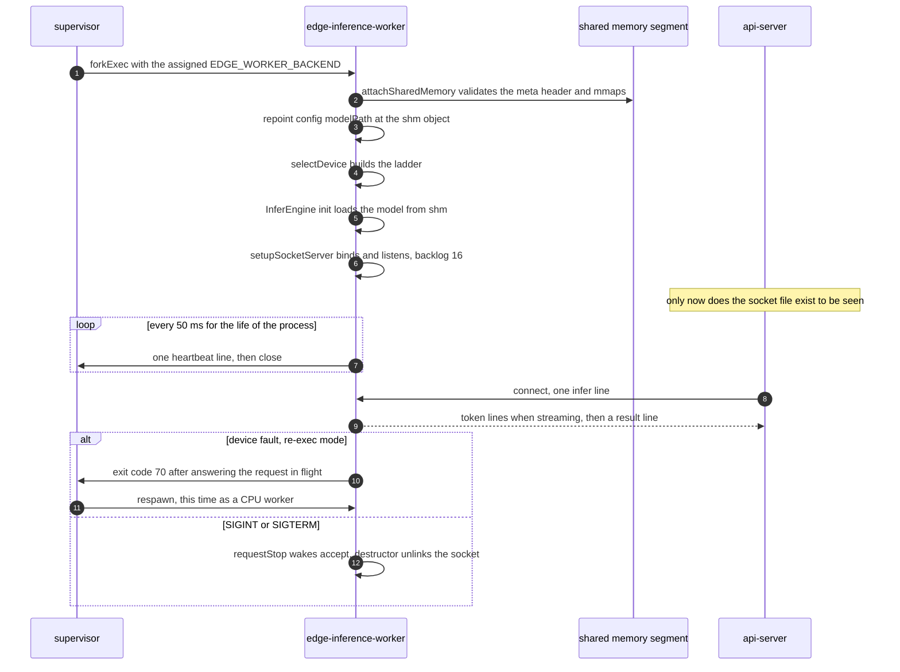
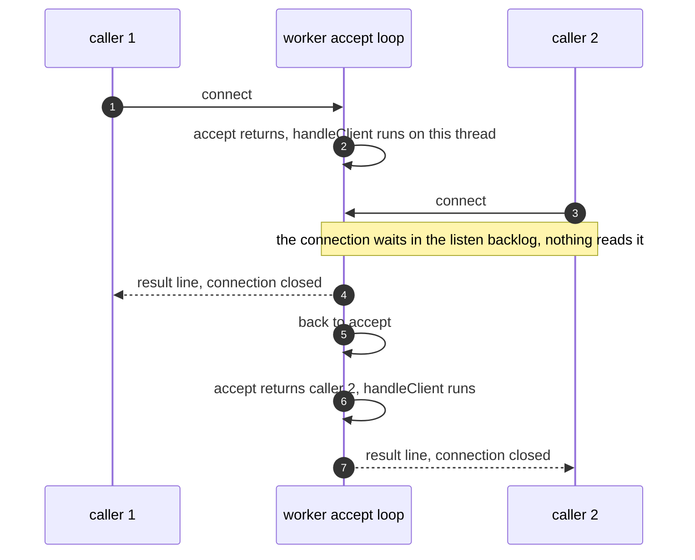
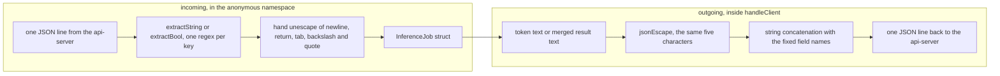

# The inference worker process

`edge-inference-worker` is the C++ process that actually runs the model. The supervisor forks
one per worker slot, each gets its own unix socket, and each handles exactly one request at a
time. This document covers the process from the outside in: arguments, startup, the socket, the
heartbeat, the JSON frames and the exit codes.

It stops at the point where the prompt string reaches the inference engine. Everything from
there to the generated token string, including model loading, tokenizing and the streaming
callback, is [10-llama-integration.md](10-llama-integration.md).

## Two modes

The very first thing [main.cpp](../backend/inference-worker/main.cpp#L60) does is scan `argv`
for `--probe-hardware`. If it finds it, the process runs `runHardwareProbe`, prints a hardware
report and exits. It never loads a model, never opens a socket, and never becomes a worker.

That mode exists because reaching a `ggml_backend_dev_t` builds the ggml registry, which
initializes CUDA, and llama.cpp has no way to release a CUDA primary context in-process. The
supervisor cannot afford to pay that cost, so it pays it in a short-lived child instead. What
the probe reports and what the supervisor does with it is
[12-hardware-capacity.md](12-hardware-capacity.md).

Anything else is normal worker mode.

## Arguments and environment

Config is built in two passes. Environment variables first, then command-line flags on top,
so a flag always wins. Every flag accepts both `--flag value` and `--flag=value`.

| Flag | Env fallback | Meaning |
|---|---|---|
| `--worker-id` | none, defaults to `0` | id used for the socket name and every heartbeat |
| `--socket-path` | `EDGE_WORKER_SOCKET_PREFIX` plus `<id>.sock` | where this worker listens |
| `--supervisor-socket` | `EDGE_SUPERVISOR_SOCK` | where heartbeats go |
| `--shm-name` | `EDGE_SHM_NAME` | the shared model segment to attach |
| `--model-path` | `EDGE_MODEL_PATH` | GGUF on disk, usually replaced at startup |
| `--model-size-bytes` | none | expected segment size, otherwise taken from `fstat` |
| `--heartbeat-ms` | none, defaults to `50` | heartbeat interval |
| `--max-tokens` | `EDGE_MAX_TOKENS` | generation cap |
| `--temperature` | `EDGE_TEMPERATURE` | sampling temperature |
| `--gpu-layers` | `EDGE_GPU_LAYERS` | layers to offload |
| `--seed` | `EDGE_SEED` | sampler seed |
| `--force-cpu` | `EDGE_FORCE_CPU=1` | drop every local accelerator from the ladder |

Env-only, with no flag: `EDGE_WORKER_BACKEND` (the tier the supervisor assigned),
`EDGE_DEVICE_FALLBACK_MODE`, `EDGE_DEVICE_LADDER`, `EDGE_DEVICE_QUARANTINE_MS`,
`EDGE_DEVICE_PROBE_INTERVAL_MS`, `EDGE_MEMINFO_PATH` (probe mode only) and
`EDGE_PROMPT_TEMPLATE`.

An unrecognised argument is fatal: the worker prints `Unknown argument: <arg>` and returns 1.
So are a missing model path, socket path, supervisor socket or shm name.

**There is no `--run-nonce` on the worker.** That flag belongs to `edge-model-cache`
([model-cache/main.cpp:48](../backend/model-cache/main.cpp#L48)), which the supervisor passes
this run's nonce so the ready flag cannot be confused with a previous run's. See
[11-model-cache.md](11-model-cache.md). The worker validates the header it finds, but it is
not given the nonce.

## Startup sequence

`Worker::init()` runs four steps in order, and returns false on any of them, which makes
`main` return 1.

1. **Attach shared memory.** `attachSharedMemory()` opens `$EDGE_SHM_NAME.meta`, checks the
   header, opens and mmaps the segment itself, and then repoints `config_.modelPath` at
   `/dev/shm/<name>` if that path is readable
   ([worker.cpp:283](../backend/inference-worker/worker.cpp#L283)). llama loads from shared
   memory rather than from disk, which is why N workers do not cost N copies of the weights.
   The header layout and the handshake are [11-model-cache.md](11-model-cache.md).
2. **Pick a device.** `selectDevice()` builds the ladder, registers the platform adapters and
   asks the router to select. Details in [13-device-fallback.md](13-device-fallback.md).
3. **Build the engine.** `InferEngine` is constructed and `init()`ed, then the llama-backed
   tiers are registered with the router and the fallback hook is installed.
4. **Bind the socket.** `setupSocketServer()` unlinks any stale file at the socket path, binds
   `AF_UNIX` `SOCK_STREAM`, listens with a backlog of 16, and logs
   `[worker] listening on /tmp/edge-worker-0.sock device=cuda`.

Note the ordering. The socket appears **last**, after the model is loaded. That is what makes
the api-server's `fs.existsSync` check on the socket path a usable readiness signal, and why
its `EDGE_WORKER_STARTUP_GRACE_MS` has to be long enough to cover a cold model load. See
[07-api-server.md](07-api-server.md).

`run()` then starts the heartbeat thread and blocks in `accept()`. The whole life of the
process, with the two peers it talks to:



## One connection per request

The accept loop is deliberately serial. `handleClient(clientFd)` is called on the accepting
thread, and the next `accept()` does not happen until it returns. There is no thread pool and
no second in-flight request. The api-server's one-request-per-worker rule is what the worker
can actually do, not a convention it chose.

What a second caller would experience. The api-server never does this, since the pool marks an
entry `busy` for the length of the request, so this is what a stray client would see:



`handleClient` reads until it sees a `\n` or the payload passes 1 MB, truncates at the first
newline, and parses that one line. Anything after the newline on the same connection is
discarded, because the connection is closed as soon as the reply is written.

Around the whole call it stamps `requestStartedAtMs_`, an atomic the heartbeat thread reads, and
clears it on return via a small RAII struct. That timestamp is what turns into `busyMs` on the
wire, and it is how the supervisor spots a wedged decode.

## JSON without a JSON library

The C++ side has no JSON dependency. The worker pulls fields out of the incoming frame with
`std::regex` and builds replies by concatenating strings. Both halves live in
[worker.cpp](../backend/inference-worker/worker.cpp), and they know nothing about each other:



The extractor for strings is one regex, at
[worker.cpp:32](../backend/inference-worker/worker.cpp#L32):

```cpp
const std::regex pattern("\"" + key + "\"\\s*:\\s*\"((?:\\\\.|[^\"\\\\])*)\"");
```

The `(?:\\.|[^"\\])*` body is what stops an escaped quote inside a prompt from ending the
value early. What comes back is then unescaped by hand for `\n`, `\r`, `\t`, `\\` and `\"`.
Any other escape sequence loses its backslash and keeps the character. A `\u00e9` in the
frame therefore comes out as the literal five characters `u00e9`. Unicode escapes are not
decoded.

Booleans get their own regex, at
[worker.cpp:97](../backend/inference-worker/worker.cpp#L97):

```cpp
const std::regex pattern("\"" + key + "\"\\s*:\\s*(true|false)");
```

A quoted `"true"` does not match, so it falls through to the caller's default.

The emitter is `jsonEscape`, a private static that escapes those same five characters and
passes everything else through byte for byte. A control character below 0x20 that is not a
newline, carriage return or tab is emitted raw, which is invalid JSON. In practice tokens from
the model do not contain them.

**Adding a field to a worker message means editing both sides of that picture.** There is no
schema, and nothing fails at build time if only one side learns the new field.

### What the regexes cannot do

[workerJsonTests.cpp](../backend/inference-worker/tests/workerJsonTests.cpp) pins the real
behaviour, including the sharp edge:

```cpp
EDGE_TEST(regex_extraction_has_no_idea_about_nesting,
          "a key nested inside another object is read as if it were top level") {
  const std::string frame = R"({"meta":{"requestId":"inner"},"requestId":"outer"})";
  CHECK_EQ(extracted(frame, "requestId"), std::string("inner"));
}
```

The first match anywhere in the line wins, whatever object it was in. The api-server only ever
sends a flat object, so this never bites in production, but any future nested field would.

Other pinned facts: a key is matched whole, so `requestId` is not read as `id`. Whitespace
around the colon is allowed. A missing key is reported as `false` rather than as an empty
string, and the out parameter is left untouched.

The 15 tests in that file build as `edge-worker-json-tests`. It `#include`s `worker.cpp` whole
to reach the anonymous-namespace parsers, which is why `worker.cpp` must not also be listed as
a source of that target.

## Frames on the wire

The exact bytes in both directions are [16-ipc-protocols.md](16-ipc-protocols.md). The short
version of what this process does with them:

`parseJob` requires `type` to be exactly `infer`, plus a `requestId` and a `prompt`. `stream`
defaults to false. A frame that fails any of those gets one error line and the connection
closes:

```json
{"type":"error","requestId":"","error":"expected type=infer"}
```

The three possible parse errors are `expected type=infer`, `missing requestId` and
`missing prompt`. A frame that parsed but arrived at a worker whose engine is null gets
`engine_not_initialized`.

If a token write fails mid-stream the worker stops there and sends nothing further, since the
peer is gone.

The `result` line carries the device fields appended by `deviceResultFields()` in both the
buffered and the streaming case: `device`, `degraded`, and `degradedReason` only when degraded.

## Prompt templating happens below this layer

The worker hands `job.prompt` to the router untouched. The instruct template is applied inside
the engine, by `InferEngine::applyPromptTemplate` at
[inferEngine.cpp:37](../backend/inference-worker/inferEngine.cpp#L37), immediately before
tokenizing. It substitutes into `EDGE_PROMPT_TEMPLATE`, defaulting to
`<|user|>\n{prompt}<|end|>\n<|assistant|>\n` for the shipped Phi-3 model, and returns the
prompt unchanged if the template has no `{prompt}` slot. That belongs to
[10-llama-integration.md](10-llama-integration.md).

## Heartbeats

`heartbeatLoop` runs on its own thread, opening a fresh connection to `$EDGE_SUPERVISOR_SOCK`
per beat. `config_.heartbeatIntervalMs` is 50 ms and nothing overrides it in the shipped setup.

```json
{"type":"heartbeat","workerId":0,"status":"busy","device":"cuda","busyMs":1420}
```

`status` is `busy` when `requestStartedAtMs_` is non-zero, `ready` otherwise, and `busyMs` is
how long the current request has been running. A connect or write failure is counted, not
retried, and every hundredth consecutive failure logs a line. The worker keeps going either
way. It never learns whether the supervisor is listening.

The loop only checks `running_` between beats, so `stopHeartbeat()` can wait up to one interval
for the join.

## Exit codes

[exitCodes.h](../backend/ipc/exitCodes.h) defines exactly one named code.

| Code | Meaning |
|---|---|
| `0` | clean exit, `requestStop()` was called by SIGINT or SIGTERM |
| `1` | argument error, or `init()` failed at any of its four steps |
| `70` (`EdgeExit::kReassignCpu`) | planned exit after a device-class fallback, respawn me as a CPU worker |

70 is the interesting one. When a worker faults off the GPU, `reloadOn` cannot give the
resident CUDA primary context back, so the only way to become genuinely CPU-only is to die.
The worker releases what it can, answers the request already in flight, sets `exitCode_ = 70`
and calls `requestStop()` to break the blocking `accept()`. The supervisor treats 70 as
planned: no crash-log line and no circuit-breaker tick. See
[13-device-fallback.md](13-device-fallback.md) and
[14-crash-recovery.md](14-crash-recovery.md).

Setting `EDGE_DEVICE_FALLBACK_MODE=reload` opts out. The worker then keeps the resident CUDA
context for the rest of its life and logs that it is doing so.

## Signals and shutdown

`SIGPIPE` is ignored, so a peer that vanishes mid-write turns into a failed `send` rather than
process death. `SIGINT` and `SIGTERM` both go to `signalHandler`, which calls
`Worker::requestStop()`. That clears `running_` and calls `shutdown(serverFd_, SHUT_RDWR)`,
because clearing the flag alone would not wake a thread blocked in `accept()`.

The destructor joins the heartbeat thread, deletes the engine, closes and unlinks the socket
file, and unmaps the shared segment. A `SIGKILL` skips all of that, which is why the socket
file can outlive the process and why the api-server has to probe rather than trust
`existsSync`.

## Failure cases

| What happens | What you see |
|---|---|
| Shared memory not ready | `[worker] shared model metadata is not ready`, exit 1 |
| Segment size disagrees with the header | `[worker] shared memory size mismatch: mapped=... metadata=...`, exit 1 |
| Model fails to load | `[worker] failed to initialize inference engine`, exit 1, no socket file ever appears |
| No usable tier in the ladder | `[worker] no usable device in ladder`, exit 1 |
| Frame is not `type: infer` | one `error` line back, worker stays up |
| Client disappears mid-stream | token writes fail, the stream stops, worker stays up |
| Supervisor socket gone | heartbeats fail silently, one log line per 100 failures |
| GPU fault with re-exec on | exit 70, supervisor respawns it as a CPU worker |

## Limitations

Serial by construction. A worker cannot batch two prompts, and the only way to get more
concurrency is more processes.

`extractString` is regex-based and unaware of structure. It works because the frames are flat
and machine-generated, and it would quietly misread anything nested.

The heartbeat is unidirectional and unacknowledged. The worker never learns that the
supervisor died, and has no way to ask it for anything.

`jsonEscape` does not escape control characters below 0x20 other than newline, carriage return
and tab. A model that emitted, say, a raw `0x01` would produce a line the api-server's
`JSON.parse` rejects, and the caller gets a 502 `worker_unavailable`.

## Possible improvements

- Swap the regex parsing for a single-header JSON library. The reason it is hand-rolled is
  that the C++ side has no dependencies, and the tests document the resulting sharp edges, but
  the extractor and emitter drifting apart is a real hazard.
- Escape the full control-character range in `jsonEscape`.
- Make the heartbeat carry the tier state as well as the device name, so
  [14-crash-recovery.md](14-crash-recovery.md) does not have to infer health from silence
  alone.
