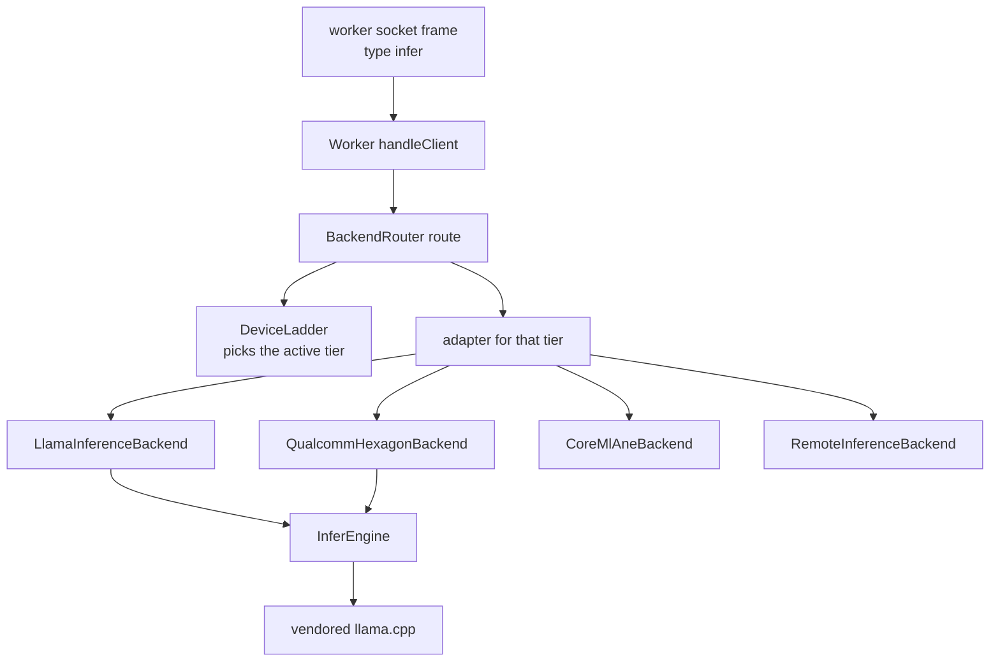
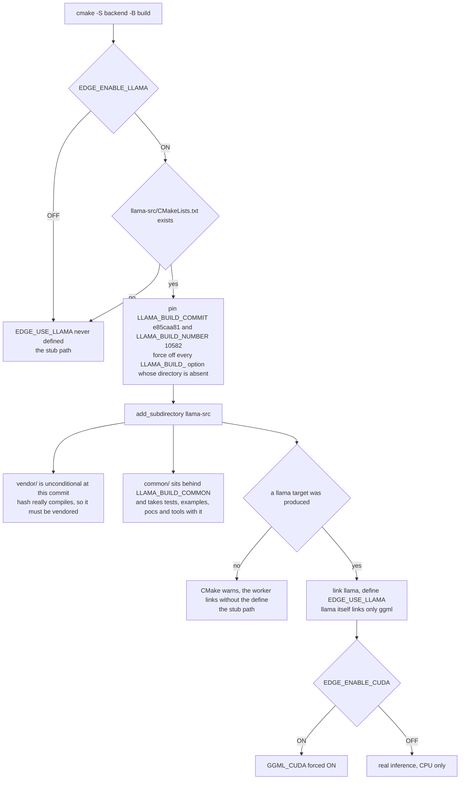
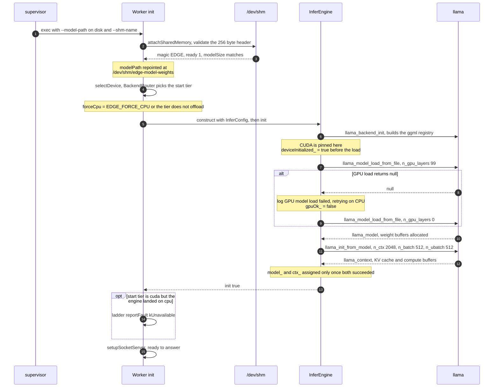
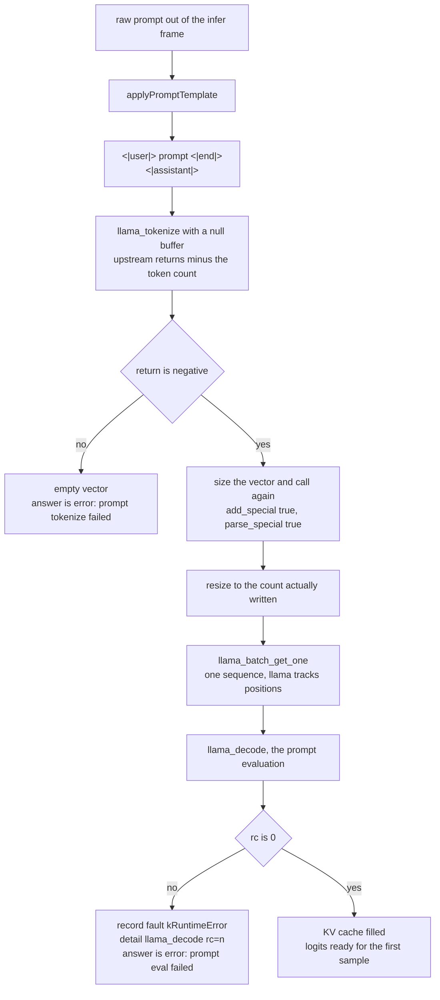
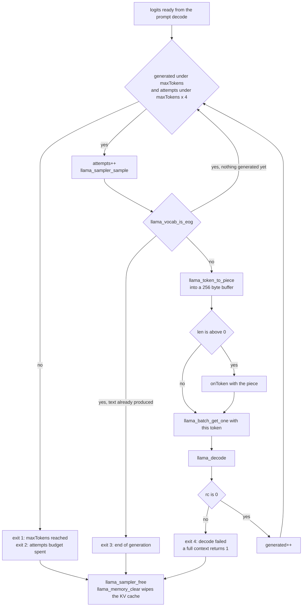
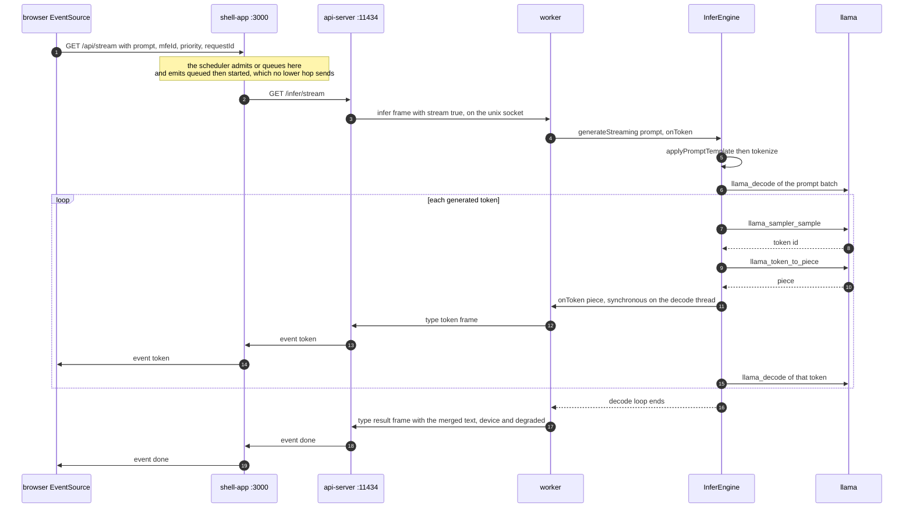

# llama.cpp integration

`InferEngine` is the only code in ServeInfer that calls llama.cpp. It turns a prompt string into
generated text, and it is the last stop before the model itself. Everything around it (the socket,
the JSON frames, the device ladder) exists to feed it and to carry its output back out.

This document covers the inside of the worker process, from "prompt string" to "token string". The
socket protocol around it belongs to [the inference worker](09-inference-worker.md), and the tier
selection above it belongs to [device fallback](13-device-fallback.md).

## Where the engine sits

The worker holds exactly one `InferEngine` and never talks to the ladder directly. A `BackendRouter`
sits between them, owning one adapter per tier and calling `execute()` on whichever tier the ladder
says is active.



`tierIsLlamaServed` at [inferenceBackend.cpp:45](../backend/inference-worker/inferenceBackend.cpp#L45)
decides which tiers get a `LlamaInferenceBackend`: `cpu`, `cuda`, `rocm`, `vulkan`, `metal` and
`accelerate`. `npu` is absent on purpose, because the Hexagon adapter binds the engine itself and a
blanket rule would run the whole graph on the CPU while reporting `npu`. Both adapters reach the
engine through [runThroughEngine](../backend/inference-worker/inferenceBackend.cpp#L18), which sets
the executing tier, calls `generate()` or `generateStreaming()`, and copies the engine's last fault
into the result.

## The vendored tree

`backend/inference-worker/llama-src` is a copy of upstream llama.cpp pinned to commit
`e85caa81ea2b65797396018c179b87ad61fa38ab`, ggml `0.21.0`, upstream build number 10582. It is the one
authoritative copy in the repo, and there is no submodule and no upstream checkout in the tree.

| Vendored | Files | Why |
|---|---|---|
| `CMakeLists.txt` | 1 | upstream's top-level build, entered by `add_subdirectory` |
| `LICENSE` | 1 | MIT, and upstream's build reads it at `CMakeLists.txt:198` through `license_add_file` |
| `cmake/` | 13 | build-info and toolchain helpers the top-level file includes |
| `include/` | 2 | `llama.h` and `llama-cpp.h`, the public API |
| `src/` | 215 | the `llama` library itself |
| `ggml/` | 1279 | the tensor library and every backend, including CUDA |
| `vendor/` | 27 | third-party headers `add_subdirectory(vendor)` pulls in |

### How the build gates it

[backend/inference-worker/CMakeLists.txt](../backend/inference-worker/CMakeLists.txt) decides which
of the two engines you get, and every branch that can drop you onto the stub is in here:



The forced-off list is `LLAMA_BUILD_COMMON`, `TESTS`, `TOOLS`, `EXAMPLES`, `SERVER`, `UI`,
`USE_PREBUILT_UI`, `APP` and `MTMD`
([CMakeLists.txt:40-53](../backend/inference-worker/CMakeLists.txt#L40)). `APP` and `MTMD` are new
since the old b9180 pin. Vendoring another upstream directory means revisiting this list, because
its whole point is that the options and the vendored set agree. Leaving `vendor/` out fails
configuration outright, which was not true at b9180.

The commit and build number are pinned by hand because `llama-src` has no `.git` of its own and
upstream's `build-info.cmake` would otherwise stamp the binary with this repo's commit.

The vendored tree must stay byte-exact. Do not edit it, do not reformat it, do not patch it file by
file. Re-sync it wholesale from a clean checkout of `e85caa81`, kept outside the repo so `git add -A`
cannot sweep it in. Its value as evidence rests on being identical to upstream.

## Configuration the engine reads

`InferConfig` at [inferEngine.h:12-20](../backend/inference-worker/inferEngine.h#L12) is filled in
`Worker::init` from `WorkerConfig`, which the worker's `main` fills from env vars and CLI flags
([main.cpp:74-99](../backend/inference-worker/main.cpp#L74)).

| Field | Env var | Flag | Shipped value | Used for |
|---|---|---|---|---|
| `modelPath` | `EDGE_MODEL_PATH` | `--model-path` | the GGUF on disk, then repointed at shm | `llama_model_load_from_file` |
| `gpuLayers` | `EDGE_GPU_LAYERS` | `--gpu-layers` | 99 | `llama_model_params.n_gpu_layers` |
| `maxTokens` | `EDGE_MAX_TOKENS` | `--max-tokens` | 512 | decode loop bound |
| `temperature` | `EDGE_TEMPERATURE` | `--temperature` | 0.8 | `llama_sampler_init_temp` |
| `seed` | `EDGE_SEED` | `--seed` | 42 | `llama_sampler_init_dist` |
| `forceCpu` | `EDGE_FORCE_CPU` | `--force-cpu` | 0 | forces `n_gpu_layers = 0` |
| `ctxSize` | none | none | 2048 | `llama_context_params.n_ctx` |

`forceCpu` is not only the env var. `Worker::init` sets it to `config_.forceCpu || !tierOffloads`,
and `tierOffloads` is true only for `cuda`, or for `npu` when the Hexagon backend is actually
compiled in ([worker.cpp:146-151](../backend/inference-worker/worker.cpp#L146)). A worker the
supervisor assigned to the CPU loads with `n_gpu_layers = 0` whatever `EDGE_GPU_LAYERS` says, and
the real guarantee behind it is `CUDA_VISIBLE_DEVICES=-1` in the child, described in
[hardware and capacity](12-hardware-capacity.md).

`ctxSize` has no env var and no flag, and `Worker::init` never assigns it, so it keeps the 2048
default from the struct. The shipped model trains at 4096, and llama says so on every boot:
`n_ctx_seq (2048) < n_ctx_train (4096) -- the full capacity of the model will not be utilized`.
Top-k 40 and top-p 0.9 are hard-coded in the sampler chain. `EDGE_PROMPT_TEMPLATE` is read directly
by the engine, is not in `.env.example` on purpose, and is covered
[below](#from-prompt-string-to-tokens).

## Startup: from worker start to ready to answer

`Worker::init` ([worker.cpp:132-182](../backend/inference-worker/worker.cpp#L132)) attaches shared
memory, selects a device, then builds the engine. `InferEngine::init`
([inferEngine.cpp:121](../backend/inference-worker/inferEngine.cpp#L121)) calls
`llama_backend_init()`, which builds ggml's backend registry, then `loadModel()`
([inferEngine.cpp:135](../backend/inference-worker/inferEngine.cpp#L135)). On a CUDA build that
first call is where CUDA is initialized, and it is the reason the supervisor never links llama: a
process that has touched CUDA cannot give the primary context back.

The whole path, from the `execvp` the supervisor did to a worker that can answer:



By the time llama sees a path, that path is `/dev/shm/edge-model-weights`, not the file on disk. See
[the model cache](11-model-cache.md) for how the bytes got there and what the worker validated first.

Only `n_gpu_layers` is changed on the model params. Everything else is upstream's default. That
matters for one field in particular: at this commit `llama_model_params` no longer has `use_mmap`,
`use_mlock` or `use_direct_io`. They were replaced by a single `enum llama_load_mode load_mode`
([llama.h:205-213](../backend/inference-worker/llama-src/include/llama.h#L205)). The default is
`LLAMA_LOAD_MODE_AUTO`, and the loader turns that into `use_mmap = true`
(`llama-src/src/llama-model-loader.cpp:554`). So llama memory-maps the shm object rather than
copying it, which is exactly the behaviour the model cache is built around. Nothing in `backend/`
ever set the old booleans, so the API change cost us nothing. The upgrade record in
[build-matrix.md](build-matrix.md) has the full delta.

The CPU retry is at [inferEngine.cpp:149-154](../backend/inference-worker/inferEngine.cpp#L149) and
the `kUnavailable` report at [worker.cpp:160-162](../backend/inference-worker/worker.cpp#L160). If
the context fails to build instead, the model is freed before returning false.

`deviceInitialized_` is set before the load rather than after
([inferEngine.cpp:143-146](../backend/inference-worker/inferEngine.cpp#L143)). That flag answers
"have I pinned a CUDA primary context", and once you have started the honest answer is yes.

### What it costs

Real lines from `logs/backend-supervisor.log`, one worker on cuda and one on cpu, same Phi-3-mini q4
GGUF:

```
load_tensors:        CUDA0 model buffer size =  2228.82 MiB
load_tensors:   CPU_Mapped model buffer size =  2281.66 MiB
llama_kv_cache:      CUDA0 KV buffer size =   768.00 MiB
~llama_context:      CUDA0 compute buffer size is  82.6367 MiB
```

`CPU_Mapped` is the shm mapping. `CUDA0` is a real upload into VRAM, which is why sharing one copy in
`/dev/shm` saves host RAM but not video RAM. I did not measure wall-clock load time, and nothing in
the logs records it.

## From prompt string to tokens

Both entry points start the same way:

```cpp
auto tokens = tokenize(applyPromptTemplate(prompt));
```

Everything that happens to the string between the socket frame and the first sample:



`parse_special = true` is what makes those markers become their own tokens rather than literal text.
A non-zero return from that one decode is the closest thing llama gives us to a device-fault signal
([inferEngine.cpp:265-270](../backend/inference-worker/inferEngine.cpp#L265)), and the router turns
it into a fallback down the ladder.

### The instruct template

`applyPromptTemplate` at [inferEngine.cpp:37](../backend/inference-worker/inferEngine.cpp#L37) wraps
the prompt in the model's chat form. The default is the Phi-3 instruct template:

```
<|user|>
{prompt}<|end|>
<|assistant|>
```

The prompt is substituted at `{prompt}`. `EDGE_PROMPT_TEMPLATE` overrides the whole form, and a value
with no `{prompt}` placeholder (including an empty string) sends the prompt through raw, which is
what you want for a base model.

This exists because the shipped model is instruct-tuned, and a bare prompt gets completed as text
rather than answered. Commit `5dda33f` records the symptoms: "write a poem about ai" came back as
`" and its capabilities"`, and "roast python programming language" came back as `"."`, a few tokens
then end-of-generation. It also explains the stray `<|assistant|>` that used to appear in answers.
Nothing was emitting the template, so the model emitted it itself.

The default is kept out of `.env.example` because the value contains `<|` and `|>`, which is a syntax
error for the `source .env` every script does. The wrapping happens inside the `EDGE_USE_LLAMA`
branch only, so the remote tier and the stub engine never see it.

### Tokenizing

`tokenize` at [inferEngine.cpp:182](../backend/inference-worker/inferEngine.cpp#L182) is the
standard two-pass form of `llama_tokenize`
([llama.h:1163](../backend/inference-worker/llama-src/include/llama.h#L1163)), with the vocab handle
from `llama_model_get_vocab(model)`. The tokenize failure surfaces as
`[error: prompt tokenize failed]`, as the whole answer or as one streamed token.

## Generation

`runDecodeLoop` at [inferEngine.cpp:204](../backend/inference-worker/inferEngine.cpp#L204) builds a
fresh sampler chain per call:

```cpp
llama_sampler* sampler = llama_sampler_chain_init(llama_sampler_chain_default_params());
llama_sampler_chain_add(sampler, llama_sampler_init_top_k(40));
llama_sampler_chain_add(sampler, llama_sampler_init_top_p(0.9f, 1));
llama_sampler_chain_add(sampler, llama_sampler_init_temp(cfg_.temperature));
llama_sampler_chain_add(sampler, llama_sampler_init_dist(cfg_.seed));
```

That is the order upstream documents in `llama.h`: narrow the candidate set, scale by temperature,
then draw. `llama_sampler_chain_add` takes ownership, so one `llama_sampler_free` at the end frees
all four. The seed is fixed at 42 and the chain is rebuilt per request, so the same prompt on the
same worker tends to produce the same answer.

The loop, with all four ways it can end drawn as their own exits:



Details that are easy to misread from the code:

- The piece is emitted **before** the token is fed back in. The sample uses the logits from the
  previous decode, and the decode at the bottom produces the logits for the next iteration.
- `generated` only advances on a successful decode, so exit 4 ends the run without counting, and
  leaves whatever was already produced.
- An end-of-generation token drawn before anything was produced is skipped rather than accepted
  ([inferEngine.cpp:222-227](../backend/inference-worker/inferEngine.cpp#L222)). The loop re-samples
  from the same logits, and the `dist` sampler's RNG has advanced, so it is a different draw. The
  `attempts` budget is what stops that spinning forever.
- The KV wipe is `llama_memory_clear(llama_get_memory(ctx), false)`. **There is no conversation
  state between requests.** Multi-turn chat works only because the client sends the whole transcript
  as the prompt, which is what `chat_2` does.
- There is no abort check anywhere in the loop. See [limitations](#limitations).

## Output and streaming

`generate()` ([inferEngine.cpp:249](../backend/inference-worker/inferEngine.cpp#L249)) passes the
decode loop a lambda that appends into a local string, and returns the whole answer. An empty answer
is recorded as a `kRuntimeError` fault with detail `empty model output` and returned as
`[error: empty model output]`.

`generateStreaming()` ([inferEngine.cpp:289](../backend/inference-worker/inferEngine.cpp#L289))
passes the caller's `onToken` straight through. That callback is `TokenSink`
([inferenceBackend.h:10](../backend/inference-worker/inferenceBackend.h#L10)), called synchronously
on the decode thread, once per piece, with no queue between the decode loop and the socket write.

The four hops one piece takes, and where the event vocabulary changes:



The actual frames on the first two hops.

**Worker to api-server**, one line of JSON on the AF_UNIX socket
([worker.cpp:521-524](../backend/inference-worker/worker.cpp#L521)):

```json
{"type":"token","requestId":"s1","token":"Hello"}
```

and at the end, one result frame with the merged text and the device fields
([worker.cpp:530-533](../backend/inference-worker/worker.cpp#L530)):

```json
{"type":"result","requestId":"s1","text":"Hello there","device":"cuda","degraded":false}
```

**api-server to shell**, SSE ([routes/infer.js:147](../backend/api-server/routes/infer.js#L147)):

```
event: token
data: {"requestId":"s1","token":"Hello"}

event: done
data: {"requestId":"s1","result":"Hello there","device":"cuda","degraded":false,"degradedReason":null,"replay":false}
```

The shell parses that stream by hand and re-emits its own
([edgeAgentService.js:126](../backend/shell-app/edgeAgentService.js#L126),
[server.js:211-216](../backend/shell-app/server.js#L211)). The `token` and `done` payloads pass
through unchanged, and the browser's `EventSource` listens for those same names.

### When the tier changes mid-stream

If the active tier faults partway through a stream, the router moves down the ladder and re-runs the
whole prompt on the next tier. Tokens already sent stay sent, so a browser can see a partial answer
followed by a complete one, while the final `done` payload carries only the text of the tier that
finished. That contract is pinned by
[fallbackContractTests.cpp:86](../backend/inference-worker/tests/fallbackContractTests.cpp#L86), and
the router never injects a token the backend did not produce. The mechanics of the move are in
[device fallback](13-device-fallback.md).

## The stub path

Every llama call in this file is inside `#if defined(EDGE_USE_LLAMA)`. When the gate above never
defines it, the `#else` branches take over:

- `init()` returns true without loading anything
  ([inferEngine.cpp:130-132](../backend/inference-worker/inferEngine.cpp#L130)).
- `generate()` returns `"Empty prompt received."` for an empty prompt, otherwise the literal
  `"Inference response: " + prompt`
  ([inferEngine.cpp:281-286](../backend/inference-worker/inferEngine.cpp#L281)).
- `generateStreaming()` calls `onToken` once with that whole string
  ([inferEngine.cpp:314](../backend/inference-worker/inferEngine.cpp#L314)), so a stream arrives as
  a single token.
- `tokenize()` returns an empty vector and `runDecodeLoop` does nothing.

```bash
cmake -S backend -B build -DEDGE_ENABLE_LLAMA=OFF && cmake --build build -j"$(nproc)"
```

That build takes seconds instead of the minutes a cold CUDA build costs, and needs no model file to
compile. It is the path to use when you are working on the supervisor, the IPC frames, the scheduler
or the clients, which is most of the repo. Every process, socket, frame and failure mode behaves the
same. Only the text is fake. `scripts/backend.sh` still checks the model file exists before starting
([backend.sh:51](../scripts/backend.sh#L51)), so a stub run is not model-free end to end. The
fault-injection path (`EDGE_SIMULATE_DEVICE_FAULT`) sits **outside** the `#if`, so device fallback
is exercisable in a stub build too.

## Failure cases

| What happens | What the engine does | What the client sees |
|---|---|---|
| Empty model path | `[infer-engine] model path is empty`, returns false | worker exits 1, supervisor restarts it, api-server answers 503 `no_ready_workers` while no worker is ready |
| Model will not load on GPU | retries once on CPU | answered on cpu, ladder marked degraded |
| Model will not load at all | `[infer-engine] failed to load model: <path>` | worker exits 1, then as above |
| `invalid magic characters` from llama | the GGUF bytes were not there | a model-cache handshake problem, see [11](11-model-cache.md) |
| Context creation fails | model freed, `[infer-engine] failed to create llama context` | worker exits 1 |
| Tokenize returns nothing | answer text is `[error: prompt tokenize failed]` | that string, no fault raised |
| Prompt decode returns non-zero | fault `kRuntimeError`, detail `llama_decode rc=<n>` | fallback down the ladder, or the error text if no tier is left |
| Context full mid-generation | `llama_decode` returns 1, the loop breaks | a truncated answer, no error |
| Model output is empty | fault `kRuntimeError`, detail `empty model output` | `[error: empty model output]` |
| Host OOM during load | killed by the OOM killer | worker crash, see [crash recovery](14-crash-recovery.md) |

Nothing here throws. Problems are reported as a fault plus a bracketed error string, because the
layer above needs both: the fault drives the ladder, and the string keeps the result frame from
contradicting tokens the client already received.

## Design decisions

**The engine holds `void*` for the model and context**, and `inferEngine.h` includes no llama header,
so the worker tree compiles without the vendored backend and the stub build is a real build of the
same code rather than a separate mock class. The cost is two `static_cast`s per method.

**One engine per process, guarded by a mutex.** `Worker::generateWithFallback` and
`streamWithFallback` both take `engineMutex_`, and the socket loop is single-threaded anyway. One
request per worker at a time is the whole concurrency model. Parallelism comes from four workers.
Teardown frees the context before the model, because the context holds the `ggml_backend` instances
whose destruction frees the CUDA pool
([inferEngine.cpp:76-88](../backend/inference-worker/inferEngine.cpp#L76)).

**Releasing is not the same as giving the device back.** `releaseDeviceResources()` frees model and
context, but `deviceResourcesResident()` keeps reporting that the CUDA primary context is still
pinned, because llama.cpp at this commit has no way to release it in-process. That is why a worker
falling from cuda to cpu exits with code 70 and is respawned. See
[device fallback](13-device-fallback.md).

## Limitations

- **No cancellation reaches the decode loop.** When a client disconnects, the api-server destroys
  the worker socket, the worker's `sendAll` fails, and the token callback starts returning early
  ([worker.cpp:517-520](../backend/inference-worker/worker.cpp#L517)). Generation itself continues
  to `maxTokens` or end-of-generation, and the worker stays busy for that whole time. `llama.h` has
  an abort callback on the context params that would fix this, and nothing sets it.
- **`n_ctx` is hard-coded at 2048** against a model trained at 4096, changeable only by editing
  `inferEngine.h`. A long transcript silently gets a truncated answer. The seed, top-k and top-p are
  fixed the same way, so identical prompts give identical answers.
- **No streaming detokenizer.** Each token is converted on its own, so a multi-byte UTF-8 character
  split across two tokens reaches the browser as two partial byte sequences. `llama_detokenize`
  exists and is not used.
- **No prompt-cache reuse.** The KV cache is cleared after every request, so a repeated system
  prompt is re-evaluated from scratch. Load time is not instrumented either, so a slow boot is
  invisible until the startup grace timer fires.

## Possible improvements

- Set `llama_context_params.abort_callback` to a flag the socket write path can set, so a cancelled
  request stops generating instead of finishing into a dead socket.
- Add `EDGE_CTX_SIZE`, `EDGE_TOP_K` and `EDGE_TOP_P`, threaded through `WorkerConfig` the way the
  other four already go, and treat a seed of 0 as "draw one".
- Buffer incomplete UTF-8 sequences across tokens before emitting.
- Log the load duration into the worker's own log line, not just llama's.

## Files

- [inferEngine.h](../backend/inference-worker/inferEngine.h) and [inferEngine.cpp](../backend/inference-worker/inferEngine.cpp): `InferConfig`, and every llama.cpp call in the repo
- [inferenceBackend.cpp](../backend/inference-worker/inferenceBackend.cpp) and [backendRouter.cpp](../backend/inference-worker/backendRouter.cpp): the adapters above the engine
- [CMakeLists.txt](../backend/inference-worker/CMakeLists.txt): how the vendored tree is configured and gated
- [llama-src/include/llama.h](../backend/inference-worker/llama-src/include/llama.h): the vendored API, pinned at `e85caa81`
- [build-matrix.md](build-matrix.md): the version delta, and why one binary cannot hold CUDA, Metal and Hexagon
