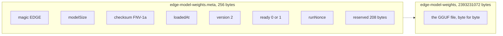
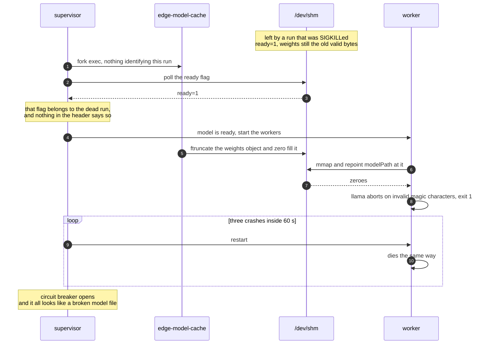
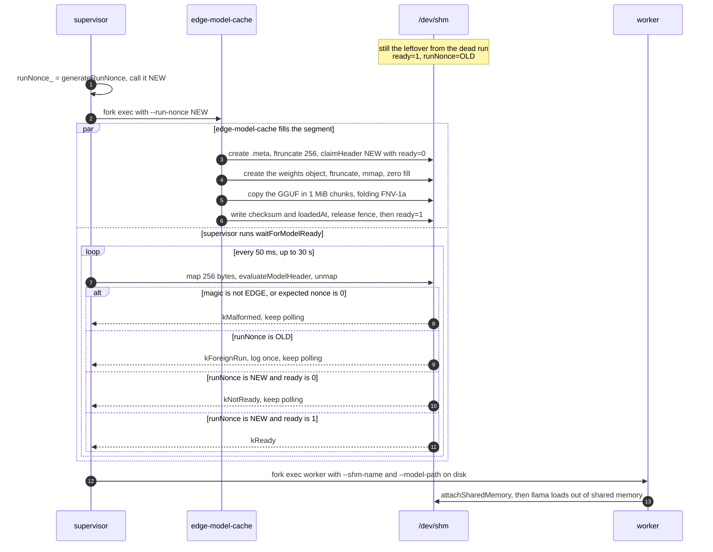
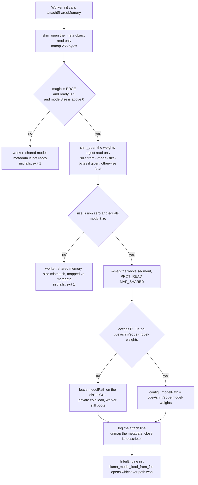
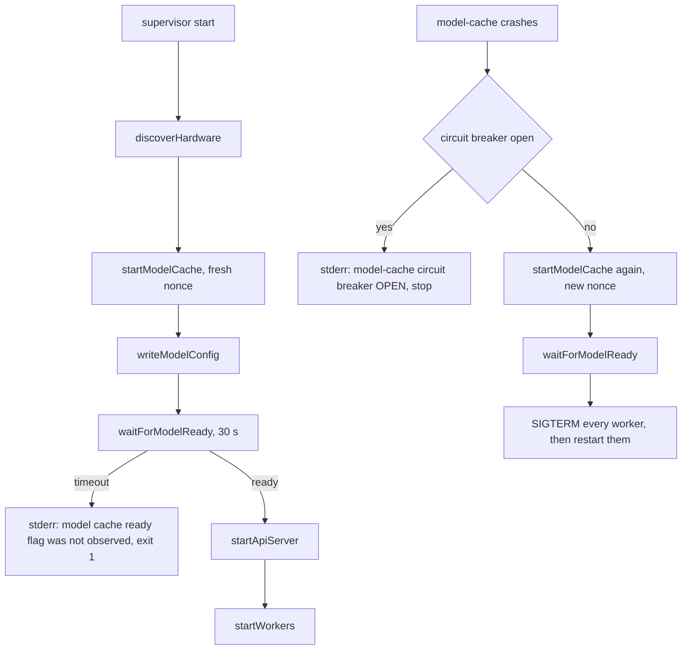

# The shared-memory model cache

`edge-model-cache` copies the GGUF file into POSIX shared memory once, at startup, and publishes a
256-byte header that says how big it is, what it hashes to, and whether it is safe to use. Every
worker then loads the model out of `/dev/shm` instead of off disk.

It exists because the alternative does not fit. The shipped model is 2,393,231,072 bytes, and four
workers each loading it independently would be four cold reads and four private copies. On the
development machine `/dev/shm` is 7.7 GB, so four copies would not even fit in the place they would
have to go.

## What sharing actually buys

| | Four independent workers | One shared copy |
|---|---|---|
| Reads of the 2.23 GiB file | 4 | 1 |
| Resident copies of the mapped weights | 4 | 1 |
| Cost of restarting one worker | full read of the file | map pages that are already resident |

The saving is real because llama memory-maps what it loads. At the pinned commit
`llama_model_params.load_mode` defaults to `LLAMA_LOAD_MODE_AUTO`, which the loader resolves to
`use_mmap = true`, and `llama_mmap` maps `PROT_READ, MAP_SHARED`
(`llama-src/src/llama-mmap.cpp:448-457`). A CPU worker's weights then show up in the log as
`load_tensors: CPU_Mapped model buffer size = 2281.66 MiB`, and those are the same physical pages
every other CPU worker mapped. See [llama integration](10-llama-integration.md) for the load itself.

The sharing is not total on the CPU path. The same run also logs
`load_tensors: CPU_REPACK model buffer size = 1242.00 MiB`, which is repacked weights in a buffer
this process allocated for itself. Mapped pages are shared, repacked ones are not.

The saving stops at the host. A worker with `n_gpu_layers = 99` uploads its own copy into VRAM
(`load_tensors: CUDA0 model buffer size = 2228.82 MiB`), and nothing about shared memory makes two
GPU workers share that. GPU capacity is planned separately, in
[hardware and capacity](12-hardware-capacity.md).

## Layout

Two shm objects, named from `EDGE_SHM_NAME` (shipped as `/edge-model-weights`). The `.meta` suffix
is added by `shmMetaName` at [paths.h:58](../backend/ipc/paths.h#L58), and `shmFilePath` at
[paths.h:62](../backend/ipc/paths.h#L62) is what turns the shm name into the `/dev/shm/...` path a
file API can open.



Both objects live in `/dev/shm`. The header describes the segment beside it and is the only thing
either the supervisor or a worker reads before touching a single weight.

### The header, field by field

From `SharedModelHeader` at [model_cache.h:10-20](../backend/model-cache/model_cache.h#L10). The
offsets are not guesses, they are asserted at
[modelCacheHandshakeTests.cpp:140](../backend/inference-worker/tests/modelCacheHandshakeTests.cpp#L140).

| Offset | Size | Type | Field | Meaning |
|---|---|---|---|---|
| 0 | 8 | `char[8]` | `magic` | `"EDGE"` in the first 4 bytes, the rest zero. Anything else is not our header |
| 8 | 8 | `uint64` | `modelSize` | size of the weights object in bytes |
| 16 | 8 | `uint64` | `checksum` | FNV-1a over every byte copied |
| 24 | 8 | `int64` | `loadedAt` | unix seconds, set when `ready` goes to 1 |
| 32 | 4 | `uint32` | `version` | `kSharedModelHeaderVersion`, currently 2 |
| 36 | 1 | `uint8` | `ready` | 0 while copying, 1 when the bytes are all in |
| 37 | 3 | `uint8[3]` | `pad` | alignment for the nonce |
| 40 | 8 | `uint64` | `runNonce` | which run published this header |
| 48 | 208 | `uint8[208]` | `reserved` | room for the next field |

`static_assert(sizeof(SharedModelHeader) == 256)` and
`static_assert(offsetof(SharedModelHeader, runNonce) == 40)` sit right under the struct
([model_cache.h:22-23](../backend/model-cache/model_cache.h#L22)). The nonce and its padding came out
of what used to be `reserved[219]`, so the header is still 256 bytes and every field that existed
before the nonce is at the offset it always had. A build that predates the nonce reads the same
layout.

## What the process does

```
edge-model-cache --model-path <path> [--shm-name <name>] [--run-nonce <n>]
```

Both `--flag value` and `--flag=value` forms are accepted
([main.cpp:30-61](../backend/model-cache/main.cpp#L30)). `--shm-name` defaults to `EDGE_SHM_NAME`.
`--model-path` is required. Run by hand with no `--run-nonce`, the process draws one of its own
rather than publishing under 0, because 0 is what every stale or truncated header already reads as
([main.cpp:73-77](../backend/model-cache/main.cpp#L73)).

`initialize()` at [model_cache.cpp:31](../backend/model-cache/model_cache.cpp#L31) runs three steps:
`openModelFile`, `createSharedMemory`, `loadModelIntoSharedMemory`. An empty file is a hard failure
in the first with `[model-cache] model file is empty: <path>`. The
[handshake diagram](#the-full-handshake) has the ordering of the other two, and two things in it are
not arbitrary.

**The metadata object is created first**, and `claimHeader()` stamps our nonce into it before a
single weight byte is copied. That keeps the window in which a previous run's header is on display
as short as this process can make it. The comment at
[model_cache.cpp:93-95](../backend/model-cache/model_cache.cpp#L93) is explicit that the ordering is
only a narrowing, and the nonce is what actually closes the window.

**The release fence before `ready = 1` is not decoration.** Without it a reader can see the flag
before the bytes it is supposed to describe. Both mappings are `msync`ed after.

Then it prints `[model-cache] ready, shared memory: /edge-model-weights runNonce=<n>` and blocks in
`waitUntilStopped()` until SIGINT or SIGTERM. The process stays alive for the whole run because the
mappings die with it.

The checksum uses the standard FNV-1a 64-bit constants
([model_cache.cpp:21-22](../backend/model-cache/model_cache.cpp#L21)). It is an integrity marker, not
a security control, and nothing currently verifies it. Workers log it and move on.

## The nonce handshake

This is the part that is easy to get wrong, and it was wrong once.

**The bug.** Shm objects outlive the process that created them. A stack that died without cleanup
(SIGKILL, a crash, a machine that got power-cycled mid-run) leaves both objects on `/dev/shm` with
`ready = 1` still on display, and the supervisor used to poll for exactly that flag. Here is the
whole failure, which is the reason the nonce exists at all:



**The fix.** The supervisor draws a fresh 64-bit nonce on **every** `startModelCache()`, restarts
included, and passes it as `--run-nonce`
([supervisor.cpp:307-317](../backend/supervisor/supervisor.cpp#L307)). `claimHeader` writes that
nonce into the header before any byte of the model is copied. The supervisor then judges the header
with `EdgeIPC::evaluateModelHeader` at [modelReady.h:25](../backend/ipc/modelReady.h#L25), which
treats `ready = 1` under any other nonce as another run's business.

```cpp
if (std::memcmp(header.magic, "EDGE", 4) != 0) return ModelReadyState::kMalformed;
if (header.runNonce != expectedNonce)         return ModelReadyState::kForeignRun;
std::atomic_thread_fence(std::memory_order_acquire);
return header.ready == 1 ? ModelReadyState::kReady : ModelReadyState::kNotReady;
```

Three of those four states mean "keep polling". Only `kReady`, our own nonce with `ready = 1`,
starts the api-server and the workers. Two details carry weight:

- **An expected nonce of 0 matches nothing, including a zeroed header.** `evaluateModelHeader`
  rejects `expectedNonce == 0` outright, and `generateRunNonce` never returns 0
  ([modelReady.h:58-77](../backend/ipc/modelReady.h#L58)). It reads `/dev/urandom` and falls back to
  `random_device` mixed with the pid and the steady clock. A truncated or never-stamped header reads
  as nonce 0, so 0 must never be a value anyone is waiting on.
- **`shm_unlink` is cleanup, never the correctness mechanism.** The destructor unlinks both objects
  ([model_cache.cpp:233-243](../backend/model-cache/model_cache.cpp#L233)) and
  `scripts/backend.sh stop` removes them again by path
  ([backend.sh:15](../scripts/backend.sh#L15)). Neither runs after a SIGKILL, which is precisely the
  case the nonce exists for. Correctness cannot depend on a cleanup path.

All four interesting cases are pinned by
[modelCacheHandshakeTests.cpp](../backend/inference-worker/tests/modelCacheHandshakeTests.cpp): a
stale ready flag reads as `foreign_run`, a foreign nonce never becomes ready, a malformed or
truncated header keeps the supervisor polling instead of crashing it, and the header's byte layout
has not moved. Eleven tests, no shared memory involved, since `evaluateModelHeader` takes a pointer
and a length.

### The full handshake

The same boot with the nonce in place. The copy and the poll run at the same time, in two
processes, which is the part the flag alone could not describe:



## How a worker attaches

`Worker::attachSharedMemory` at
[worker.cpp:217](../backend/inference-worker/worker.cpp#L217) is the first thing `Worker::init`
calls, before device selection and before the engine exists.



The weights mapping stays for the life of the process. The attach line is real evidence of which
path won: `[worker] attached shared GGUF memory: /edge-model-weights (2393231072 bytes,
checksum=3322726121541147254, path=/dev/shm/edge-model-weights)`. The header checks are at
[worker.cpp:232-241](../backend/inference-worker/worker.cpp#L232). The supervisor never passes
`--model-size-bytes`, so in practice the size always comes from the `fstat`.

### What "repoint the path" means

The trick is four lines ([worker.cpp:281-284](../backend/inference-worker/worker.cpp#L281)):

```cpp
const std::string sharedModelPath = EdgeIPC::shmFilePath(config_.shmName);
if (access(sharedModelPath.c_str(), R_OK) == 0) {
  config_.modelPath = sharedModelPath;
}
```

That overwrites the `--model-path` the supervisor passed, before the path is ever handed to
`InferConfig`. On Linux a POSIX shm object is an ordinary file in a tmpfs, so llama needs no special
support: it opens it, mmaps it, and gets a mapping of pages that are already resident and already
shared with every other worker. The worker's own `mmap` of the same object is separate, and mostly
serves to keep the segment referenced and to prove it is readable.

**The worker does not check the nonce.** It checks magic, `ready` and size only. The nonce gate lives
entirely in the supervisor, which is the process that decides when workers may start. A worker
launched by hand against a leftover segment will happily attach to it.

## Lifecycle



**Startup.** The supervisor starts the model cache first and gates everything else on it
([supervisor.cpp:89-113](../backend/supervisor/supervisor.cpp#L89)). `waitForModelReady`
([supervisor.cpp:333](../backend/supervisor/supervisor.cpp#L333)) polls the metadata object every
50 ms for up to `modelReadyTimeoutSeconds`, which is 30. It opens, `fstat`s, maps, evaluates and
unmaps on every poll rather than holding a mapping, so a metadata object that appears late is picked
up normally. A foreign run is logged once, not on every poll: `[supervisor] ignoring shared model
metadata from another run, waiting for runNonce=<n>`.

**Restart.** A model-cache crash is the expensive one. The supervisor registers it against circuit
breaker key `-1001`, and if the breaker is still closed it starts a new cache, waits for ready under
a **new** nonce, then SIGTERMs every worker and starts them again
([supervisor.cpp:537-546](../backend/supervisor/supervisor.cpp#L537),
[restartWorkersAfterModelCacheRestart at 616](../backend/supervisor/supervisor.cpp#L616)). Workers
have to go because their mapping points at the old, now unlinked, object. See
[crash recovery](14-crash-recovery.md) for the breaker.

**Cleanup.** `ModelCache::cleanup` unmaps, closes and `shm_unlink`s both objects on any clean exit.
`scripts/backend.sh stop` removes them by path as well, since a SIGKILLed cache unlinks nothing.

**Inspecting a running stack.**

```bash
ls -l /dev/shm/edge-model-weights /dev/shm/edge-model-weights.meta
```

One object of 2393231072 bytes and one of 256, no matter how many workers are running. Four objects
of the first size would mean the sharing is broken. If those files are there when nothing is running,
they are leftovers. They are harmless now, because the nonce makes the next run ignore them, but
`scripts/backend.sh stop` clears them anyway.

## Failure cases

| What goes wrong | Where it is caught | What you see |
|---|---|---|
| Model file missing or unreadable | `openModelFile` | `[model-cache] failed to open model file <path>: No such file or directory`, exit 1, supervisor start fails |
| Model file is empty | `openModelFile` | `[model-cache] model file is empty: <path>` |
| `/dev/shm` too small for the model | `ftruncate`, or the zero-fill right after `mmap` | `[model-cache] ftruncate failed: <errno>` if the truncate is refused. tmpfs allocates lazily, so more often the truncate succeeds and the zero-fill dies on SIGBUS with no message at all |
| Copy hits EOF early | `loadModelIntoSharedMemory` | `[model-cache] unexpected EOF while reading model` |
| Stale `ready=1` from a dead run | `evaluateModelHeader` | supervisor logs the foreign-run line once and waits for its own nonce |
| Malformed or truncated header | `evaluateModelHeader` | supervisor keeps polling, then times out after 30 s with `model cache ready flag was not observed` |
| Leftover object from a different model | worker `attachSharedMemory` | `[worker] shared memory size mismatch: mapped=<a> metadata=<b>`, worker exits 1 |
| Worker starts before ready | worker `attachSharedMemory` | `[worker] shared model metadata is not ready`, worker exits 1 |
| Weights present but zero-filled | llama, not us | `invalid magic characters`. This is the exact symptom the nonce handshake was built to stop, so seeing it now means something started a worker outside the supervisor's gate |

A checksum mismatch is not in that list, because nothing compares it. The field is published and
logged, and no reader validates it.

## Limitations

- **One model.** The shm name, the path and the header describe a single GGUF. There is no way to
  hold two, and no way to swap one at runtime. Changing models means stopping the backend.
- **The whole file is copied, twice over in a sense.** The cache reads 2.23 GiB and writes it into
  tmpfs, and tmpfs pages count against RAM. The saving is against N workers, not against one.
- **Sized by tmpfs.** `/dev/shm` defaults to half of physical RAM on most distributions. A model
  bigger than that cannot be cached at all, and nothing checks the free space before `ftruncate`.
- **The checksum is decorative.** Nothing verifies it, so a corrupted segment is caught by llama's
  magic check rather than by us.
- **Workers do not check the nonce**, so the gate only holds for workers the supervisor started.
- **The cache is a process, not a file.** It has to stay alive for the whole run, because the
  mappings and the unlink-on-exit both belong to it.

## Possible improvements

- Have the worker verify the run nonce too, taking it as a start argument the way it already takes
  `--shm-name`. That closes the hand-started case.
- Check free space on `/dev/shm` against the model size before `ftruncate`, and fail with a sentence
  an operator can act on instead of `No space left on device`.
- Verify the FNV-1a checksum in the worker on attach, behind a flag, so a corrupt segment reports as
  a corrupt segment.
- Pass `--model-size-bytes` from the supervisor, which is already a supported worker flag, so the
  size check does not depend on `fstat` agreeing with the header.

## Files

- [backend/model-cache/model_cache.h](../backend/model-cache/model_cache.h): `SharedModelHeader` and the config struct
- [backend/model-cache/model_cache.cpp](../backend/model-cache/model_cache.cpp): create, claim, copy, publish, clean up
- [backend/model-cache/main.cpp](../backend/model-cache/main.cpp): argument parsing and the standalone nonce
- [backend/ipc/modelReady.h](../backend/ipc/modelReady.h): `evaluateModelHeader` and `generateRunNonce`
- [backend/supervisor/supervisor.cpp](../backend/supervisor/supervisor.cpp): `startModelCache` and `waitForModelReady`
- [backend/inference-worker/worker.cpp](../backend/inference-worker/worker.cpp): `attachSharedMemory` and the path repoint
- [backend/inference-worker/tests/modelCacheHandshakeTests.cpp](../backend/inference-worker/tests/modelCacheHandshakeTests.cpp): the eleven tests that pin all of this
