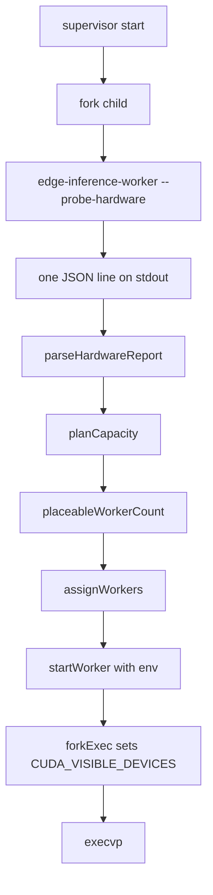
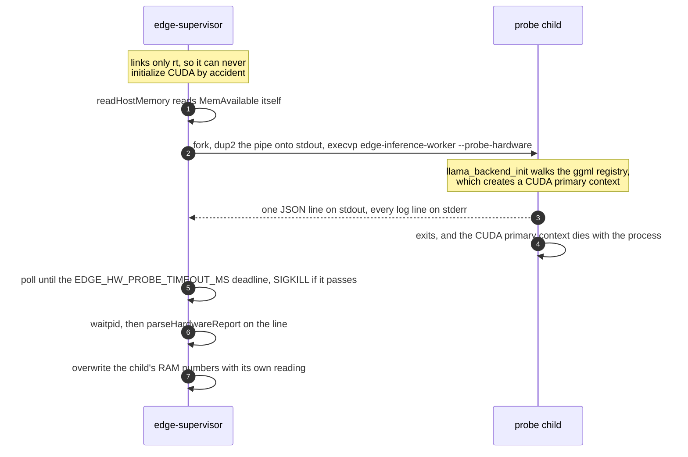
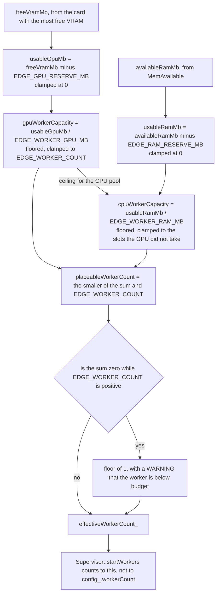
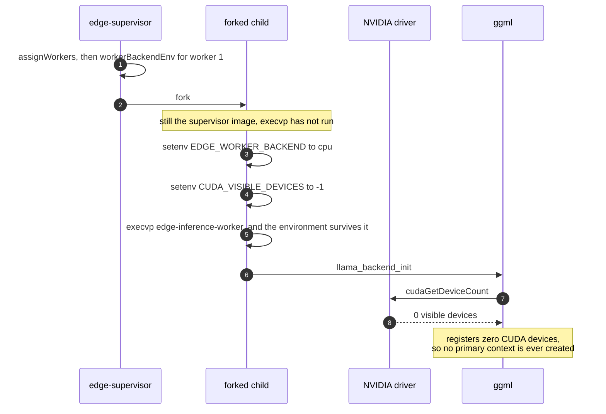

# Hardware probe and capacity planning

Before the supervisor forks a single worker it works out what the machine can actually pay for.
It asks a throwaway child process what hardware exists, turns that answer into a worker budget,
assigns each worker a backend, and only then starts them. This document covers everything that
happens up to `execvp`. What happens inside a running worker is [the device ladder](13-device-fallback.md).

## What owns what

[backend/hardware/](../backend/hardware/) is shared code compiled into both the supervisor and
the worker binary. It contains no llama and no ggml. Two pieces:

- [hardwareReport.h](../backend/hardware/hardwareReport.h) / [hardwareReport.cpp](../backend/hardware/hardwareReport.cpp)
  is the probe wire format. It serializes and parses the report JSON, and it reads
  `MemTotal` / `MemAvailable` out of `/proc/meminfo`.
- [capacityPlan.h](../backend/hardware/capacityPlan.h) / [capacityPlan.cpp](../backend/hardware/capacityPlan.cpp)
  is pure arithmetic. Capacity from a report plus limits, worker-to-backend assignment, and the
  env vector each worker is started with.

Neither file opens a socket or touches a device. That is what makes both testable on any machine.

## The order is discovery, capacity, assignment, startup

Four stages run back to back, and nothing else in the supervisor happens until they finish:



[Supervisor::start](../backend/supervisor/supervisor.cpp#L89) calls `discoverHardware()` as its
very first act, before the supervisor socket is even bound. The comment on that line says why:
every backend decision has to be made while nothing else can race for VRAM.

## Discovery runs in a child, and that is not optional

Reaching a `ggml_backend_dev_t` means calling `llama_backend_init()` and walking the ggml device
registry. On a CUDA build that initializes CUDA and creates a primary context, and llama.cpp at
the pinned commit has no way to release one in-process. Any process that enumerates devices
carries that context for the rest of its life, so the supervisor pays that cost in a child that
exits a moment later.

[runHardwareProbeChild](../backend/supervisor/supervisor.cpp#L132) is that fork, from the pipe to
the reap:



**The rule: the supervisor must keep linking only `rt`. Do not give it llama.**
[backend/supervisor/CMakeLists.txt](../backend/supervisor/CMakeLists.txt) says so in a comment and
enforces it in one line: `target_link_libraries(edge-supervisor PRIVATE rt)`. See
[docs/build-matrix.md](build-matrix.md) for the wider version of this argument.

### The probe report

[runHardwareProbe](../backend/inference-worker/hardwareProbe.cpp#L53) prints exactly one line to
stdout and everything else to stderr. On the reference machine that line is:

```json
{"probeOk":true,"note":"ggml registered 1 gpu device(s)","ramTotalBytes":17179869184,"ramAvailableBytes":12884901888,"gpus":[{"name":"CUDA0","description":"NVIDIA GeForce RTX 2050","freeBytes":3940548608,"totalBytes":4294967296}]}
```

ggml's CPU device is skipped on purpose. On Linux it reports `free == total`, which would size the
CPU pool off total RAM, so host memory comes from `MemAvailable` in `/proc/meminfo` instead. The
parent's reading wins because only it can be pointed at a test fixture through `EDGE_MEMINFO_PATH`
([supervisor.cpp:221](../backend/supervisor/supervisor.cpp#L221)).

Anything that goes wrong produces `probeOk=false` with the reason in `note`, and that is planned
against as "no GPU", never as a guess. The cases are in [Failure cases](#failure-cases) below.

## Capacity: EDGE_WORKER_COUNT is a ceiling, not a promise

[planCapacity](../backend/hardware/capacityPlan.cpp#L88) turns free VRAM and available RAM into
two worker counts, and [placeableWorkerCount](../backend/hardware/capacityPlan.cpp#L147) folds them
into one:



Both divisions floor, so leftover memory never buys a partial worker. The floor of one exists
because a runtime that starts no worker answers nothing. Counting to `effectiveWorkerCount_` is the
whole point: a worker the plan has no budget for is never started into an OOM-kill and restart
loop.

### The budget variables

| Variable | Default | What it means |
|---|---|---|
| `EDGE_GPU_RESERVE_MB` | 512 | VRAM held back from the pool entirely |
| `EDGE_WORKER_GPU_MB` | 2048 | VRAM one GPU worker is allowed |
| `EDGE_RAM_RESERVE_MB` | 1024 | Host RAM held back from the pool |
| `EDGE_WORKER_RAM_MB` | 1024 | Host RAM one CPU worker is allowed |
| `EDGE_HW_PROBE_TIMEOUT_MS` | 10000 | How long the probe child gets |

All five are optional. [backend/supervisor/main.cpp:64](../backend/supervisor/main.cpp#L64) reads
them with `std::getenv` and keeps the struct default when the variable is absent, unlike the Node
side where [requiredEnv](03-configuration.md) throws.

**These are worker counts, not request counts.** `EDGE_MAX_SLOTS` is a different number, owned by
[the scheduler](06-scheduler.md), and nothing here divides VRAM by it.

**The per-worker budgets are deliberately not derived from the GGUF size.** The weights are one
shared copy in `/dev/shm` (see [the model cache](11-model-cache.md)), so N workers do not cost
N times 2.3 GB. What the budget covers is the per-worker context, KV cache and compute buffers.

A non-positive budget is refused rather than dividing by zero, and a negative reserve is treated
as no reserve rather than as extra memory. Both cases name the offending variable in the reason
string.

## A worked example

The reference machine: a 4 GB RTX 2050 with 3758 MB free, 12288 MB of `MemAvailable`,
`EDGE_WORKER_COUNT=4`, and the shipped budgets. GPU capacity is 1 (the floor of 1.58 workers), CPU
capacity is 11 clamped to the 3 slots left, and placeable is 4. So worker 0 gets CUDA and workers 1
to 3 get the CPU. The plan serializes as:

```json
{"gpuWorkerCapacity":1,"cpuWorkerCapacity":3,"totalVramMb":4096,"freeVramMb":3758,"usableGpuMb":3246,"totalRamMb":16384,"availableRamMb":12288,"usableRamMb":11264,"gpuName":"NVIDIA GeForce RTX 2050","gpuIndex":0,"gpuReason":"free 3758MB - reserve 512MB = 3246MB usable / 2048MB per worker","cpuReason":"available 12288MB - reserve 1024MB = 11264MB usable / 1024MB per worker"}
```

Squeeze the same machine to 2247 MB of available RAM and CPU capacity drops to 1, placeable becomes
2, and the supervisor starts two workers instead of four. It says so on stderr:

```
[supervisor] discovery placeableWorkers=2 configuredWorkers=4 startingWorkers=2
[supervisor] discovery capacity holds 2 worker(s), so 2 of the 4 configured will not be started
```

Every assignment carries its own reason, and those are logged too:

```
[supervisor] assignment workerId=0 backend=cuda reason="gpu slot 1 of 1 (free 3679MB - reserve 512MB = 3167MB usable / 2048MB per worker)"
[supervisor] assignment workerId=1 backend=cpu reason="gpu capacity 1 already filled"
```

## Assignment and the CUDA guarantee

[assignWorkers](../backend/hardware/capacityPlan.cpp#L158) fills GPU slots first by worker id:
worker ids below `gpuWorkerCapacity` get `kCuda`, the rest get `kCpu`.
[workerBackendEnv](../backend/hardware/capacityPlan.cpp#L220) turns one assignment into two
environment variables:

| Assignment | `EDGE_WORKER_BACKEND` | `CUDA_VISIBLE_DEVICES` |
|---|---|---|
| cuda, gpuIndex 0 | `cuda` | `0` |
| cpu | `cpu` | `-1` |

The window where they are set is the whole trick. It is after `fork` and before `execvp`, inside a
child that is not yet a worker:



[Supervisor::forkExec](../backend/supervisor/supervisor.cpp#L453) is the `setenv` loop, and
**that is the whole CPU-only guarantee.** The driver reads `CUDA_VISIBLE_DEVICES` below ggml, so
an invalid index leaves it nothing to see. Setting `n_gpu_layers = 0` is not a substitute: it stops
llama offloading layers, but the process has still initialized the runtime and still holds a
context it cannot free. `EDGE_WORKER_BACKEND` is only there so the logs and the ladder agree with
the decision.

The GPU index comes from the trailing digits of the ggml device name (`CUDA0` gives `0`), not from
the device's position in the report, because `CUDA_VISIBLE_DEVICES` takes the driver ordinal.

## What the supervisor publishes

[Supervisor::writeModelConfig](../backend/supervisor/supervisor.cpp#L740) writes the whole
decision to `$EDGE_MODEL_CONFIG_PATH`:

```json
{"modelPath":"./backend/models/Phi-3-mini-4k-instruct-q4.gguf","shmName":"/edge-model-weights","workerCount":4,"configuredWorkerCount":4,"pollIntervalMs":50,"hardware":{...},"capacity":{...},"assignments":[...]}
```

`workerCount` is what actually started. `configuredWorkerCount` is the `EDGE_WORKER_COUNT`
ceiling. They differ on a constrained host, and the api-server reads `workerCount` from this file
so its pool matches reality. That side is described in [07-api-server.md](07-api-server.md).
[The dashboard](18-dashboard.md) reads the `hardware` and `capacity` blocks to show what was
probed.

## Failure cases

| What happens | What the plan does |
|---|---|
| Probe child fails to exec | `probeOk=false`, note `hardware probe exited exit_127`, zero GPU workers |
| Probe child exceeds its timeout | SIGKILLed, note names the timeout, zero GPU workers |
| Probe output unparseable | note `hardware probe emitted output this build cannot parse`, zero GPU workers |
| A GPU entry is missing `freeBytes` | the whole parse fails, because a zero there would be planned against as free VRAM |
| `/proc/meminfo` unreadable | `availableBytes` is 0, cpuReason is `available ram unknown, assuming none` |
| Reserve larger than free memory | usable clamps to 0, never negative |
| Every capacity is zero | placeable floors to 1 and the supervisor logs a WARNING that the worker is below budget |

## Limitations

- Only the roomiest card is planned against. A second GPU is reported and logged but never gets a
  worker, because `plan.gpuIndex` is a single value.
- Capacity is measured once, at startup. A worker restarted an hour later reuses the original plan,
  even if another process has since taken the VRAM.
- The per-worker budgets are flat numbers an operator has to tune. Nothing measures what a worker
  actually consumed and feeds it back.
- ROCm, Vulkan and Metal have ladder tiers but no capacity arithmetic. `WorkerBackend` has exactly
  two values, `kCuda` and `kCpu`.

## Tests

All of this is covered by `edge-hardware-tests`, with no GPU and no model file:

- [capacityPlanTests.cpp](../backend/inference-worker/tests/capacityPlanTests.cpp) the arithmetic,
  the assignment, the env vector, and the placeable count
- [capacityInputTests.cpp](../backend/inference-worker/tests/capacityInputTests.cpp) hostile input,
  including negative reserves, overflow-sized byte counts and a `"gpus"` key hidden inside a string
- [hardwareReportTests.cpp](../backend/inference-worker/tests/hardwareReportTests.cpp) the JSON
  round trip and the `/proc/meminfo` parser against fixture files
- [cudaInitTests.cpp](../backend/inference-worker/tests/cudaInitTests.cpp) the guarantee that a
  CPU-only plan never produces a worker that could initialize CUDA
