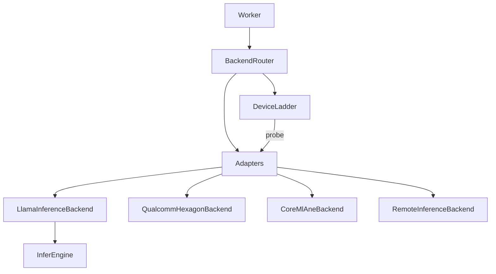
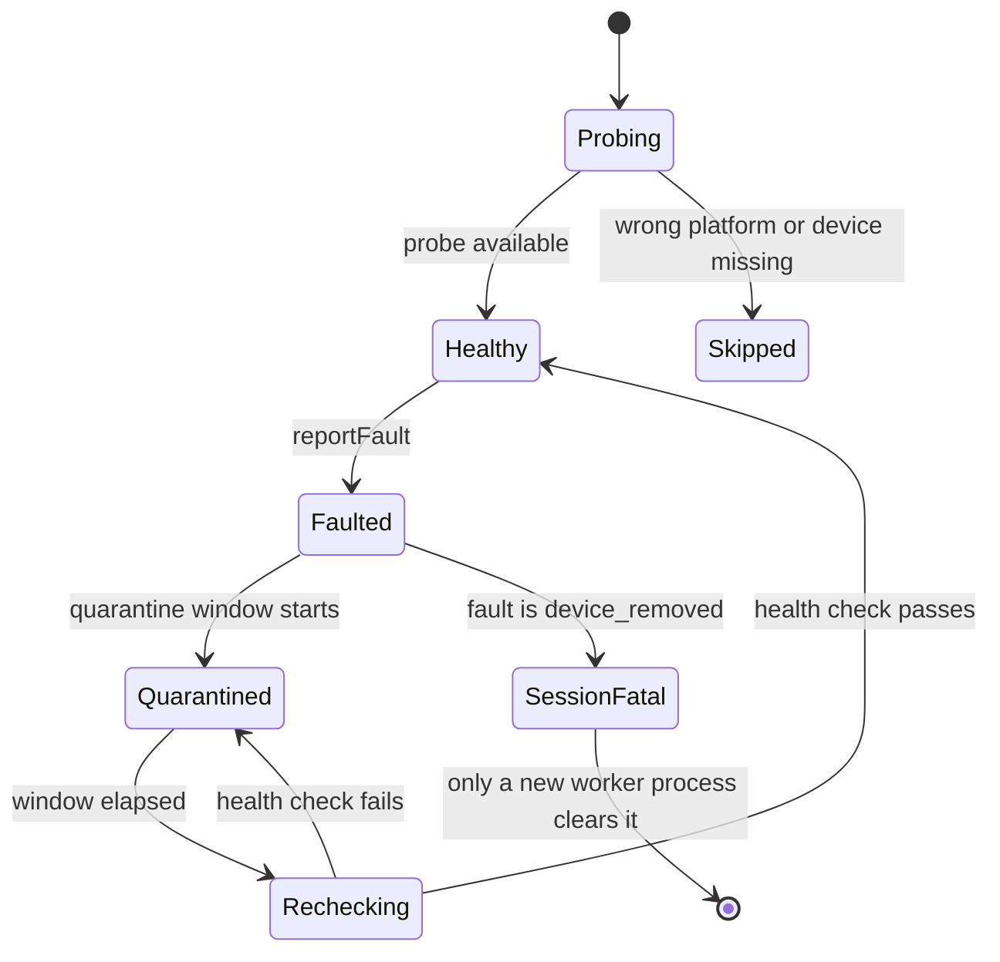
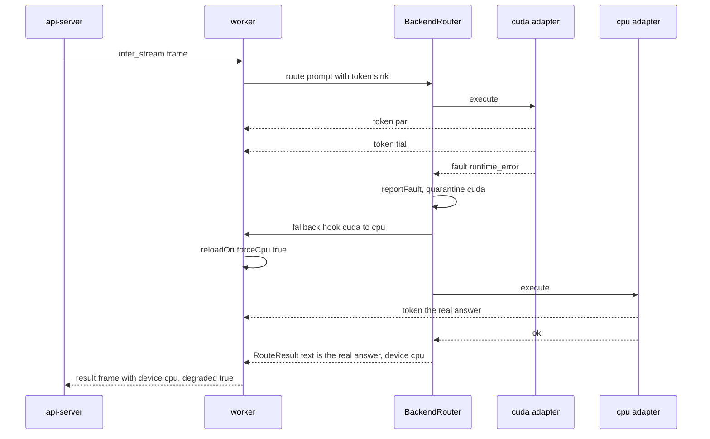
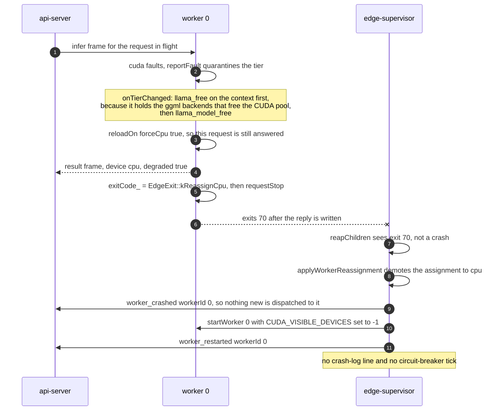

# Device fallback: the ladder inside a worker

A worker starts on the best device it can reach and walks down a list when that device stops
answering. The list is the ladder, and it lives entirely inside the worker process, after
`execvp`. Everything the supervisor decided before the fork is in
[12-hardware-capacity.md](12-hardware-capacity.md).

[device-fallback.md](device-fallback.md) is the companion: the full tier catalogue, the vendor
error mapping, and the two platform accelerators. This file is the mechanism they sit on.

## What the ladder is

`EDGE_DEVICE_LADDER` names the tiers, highest first. The shipped value:

```
EDGE_DEVICE_LADDER=cuda,npu,ane,cpu,remote
EDGE_DEVICE_QUARANTINE_MS=60000
EDGE_DEVICE_PROBE_INTERVAL_MS=5000
```

Naming a tier costs nothing on a machine that cannot serve it. `npu`, `ane` and `metal` have no
backend compiled into this Linux build, so their probes return `wrong_platform` and
[DeviceLadder::select](../backend/inference-worker/deviceLadder.cpp#L266) skips straight past them.
The same `.env` works on all three platforms. Valid names are listed in
[deviceBackends.cpp](../backend/inference-worker/deviceBackends.cpp#L206): `cpu`, `cuda`, `rocm`,
`vulkan`, `npu`, `directml`, `gpu`, `ane`, `metal`, `accelerate`, `remote`.

The worker also trims the ladder before building it
([worker.cpp:77](../backend/inference-worker/worker.cpp#L77)). A worker the supervisor gave no GPU
slot drops `cuda` but keeps `npu` and `ane`, since the supervisor rations only CUDA.
`EDGE_FORCE_CPU=1` is the stronger statement and drops every local accelerator. Either way `cpu`
is appended if it is missing, so the floor always exists.

## Three layers



[deviceLadder.cpp](../backend/inference-worker/deviceLadder.cpp) owns tier selection, quarantine,
the fault counters, and the health-check gate a faulted tier must pass before it is used again. It
knows nothing about inference. [backendRouter.cpp](../backend/inference-worker/backendRouter.cpp)
holds the adapters, points the ladder's probe at them
([backendRouter.cpp:68](../backend/inference-worker/backendRouter.cpp#L68)), and runs the
request-time walk. That indirection is what makes the NPU and ANE state machines testable on a
machine that has neither: a test registers a fake adapter and the ladder's probe now asks the fake.

[inferenceBackend.cpp](../backend/inference-worker/inferenceBackend.cpp) holds the adapters
themselves. `LlamaInferenceBackend` is registered for every tier `tierIsLlamaServed` accepts
(`cpu`, `cuda`, `rocm`, `vulkan`, `metal`, `accelerate`) and routes into `InferEngine`.

### The platform adapters are platform-specific and are not exercised on this hardware

`QualcommHexagonBackend` (Qualcomm Hexagon NPU) and `CoreMlAneBackend` (Core ML / Apple Neural
Engine) compile everywhere and **refuse to execute rather than faking success**. Ask the Qualcomm
adapter to run on this build and it returns a `kUnavailable` fault reading:

```
qualcomm hexagon backend is not compiled into this build (GGML_HEXAGON=OFF, needs HEXAGON_SDK_ROOT and a windows arm64 target)
```

The Core ML adapter has no build gate at all, because llama.cpp has no Core ML backend. Its
`executable()` returns `false` unconditionally. The router treats "reported success but cannot
execute" as a fault, so an adapter cannot lie its way into serving a request
([backendRouter.cpp:154](../backend/inference-worker/backendRouter.cpp#L154)).

## One tier's lifecycle



[reportFault](../backend/inference-worker/deviceLadder.cpp#L203) drives every downward edge: it
counts the fault, sets `quarantinedUntil = now + EDGE_DEVICE_QUARANTINE_MS`, invalidates the probe
cache, and re-runs `select()`. A `device_removed` fault also sets `sessionFatal`, because Windows
`ERROR_DEVICE_REMOVED` and the DXGI removed/hung/reset family leave the old device object invalid
even after a driver reset.

[recoverEligibleTier](../backend/inference-worker/deviceLadder.cpp#L179) is the only thing that
moves back up, and `route()` calls it once per request before it tries anything. Probe results are
cached for `EDGE_DEVICE_PROBE_INTERVAL_MS`, so a quarantined tier is not re-probed every time.
`beginSession()` clears all of it, and a session is the worker process, which is why a removed
device needs a respawn.

## degraded is measured against the baseline, not against cpu

The first tier `select()` settles on becomes `baselineIndex_`
([deviceLadder.cpp:277](../backend/inference-worker/deviceLadder.cpp#L277)). `degraded()` is
`activeIndex_ > baselineIndex_`.

A CPU-only machine is not degraded. It started on CPU and it is still on CPU. A machine that fell
off `cuda` onto `cpu` is degraded. Reporting it any other way (`activeDevice_ == "cpu"`) makes the
flag meaningless, because half the fleet would report degraded permanently.

The worker puts this in every result frame
([worker.cpp:396](../backend/inference-worker/worker.cpp#L396)):

```json
{"device":"cpu","degraded":true,"degradedReason":"cuda:runtime_error"}
```

`degradedReason` is `<faultedTier>:<faultName>`. The fault names are stable wire strings:
`none`, `device_unavailable`, `device_removed`, `unsupported_operation`, `runtime_error`.

`DeviceLadder::toJson` gives the fuller picture, and is what reaches `/health` and the dashboard:

```json
{"active":"cpu","degraded":true,"reason":"cuda:runtime_error","baseline":"cuda","tiers":[{"name":"cuda","faults":1,"sessionFatal":false,"quarantineMsLeft":58400,"healthy":true,"probe":"available","state":"GPU_UNHEALTHY","platform":"linux","note":"NVIDIA GPU"},{"name":"cpu","faults":0,"sessionFatal":false,"quarantineMsLeft":0,"healthy":true,"probe":"available","state":"CPU_AVAILABLE","platform":"any","note":"always present, the floor of every ladder"}]}
```

The `state` vocabulary is `<CLASS>_<STATUS>`, built by
[backendAvailabilityState](../backend/inference-worker/deviceBackends.cpp#L355). Classes are `CPU`,
`GPU`, `NPU`, `ANE`, `REMOTE`. Statuses are `AVAILABLE`, `UNAVAILABLE`, `UNHEALTHY` and
`UNSUPPORTED`, where `UNSUPPORTED` is reserved for a benched tier whose last fault was
`unsupported_operation`.

## Exercising it without the hardware

```bash
EDGE_SIMULATE_DEVICE_FAULT=cuda:removed  make backend
```

The format is `[<tier>:]removed|unsupported|runtime`. Behaviour, from
[injectedFault](../backend/inference-worker/inferEngine.cpp#L49):

- It fires **once per worker**. A fault that repeated would break the tier it fell back to as
  well, and again after a respawn.
- With a tier prefix it fires **only on that tier**, so the tier the ladder falls to keeps
  answering.
- An empty target (`:removed`) is a typo, not a wildcard. It never fires.
- Without a prefix it fires on whatever tier is executing.

The injected fault makes `generate()` return `[error: simulated device fault]` and record the
fault, which is exactly what a real vendor error would do.

## A mid-stream fallback, and what the client sees

The streaming contract holds across a fallback. Tokens already sent stay sent, and the final
result frame carries only the answer of the tier that finished, never the two concatenated.



The browser saw `partialthe real answer` as tokens. The result frame says `the real answer`. That
is deliberate and tested
([fallbackContractTests.cpp:86](../backend/inference-worker/tests/fallbackContractTests.cpp#L86)).
Two more rules from the same file:

- When every tier fails, the result frame carries the partial text the client already saw, so the
  final frame never contradicts the tokens.
- The router never injects a token the backend did not produce. No synthetic error string is ever
  streamed as if the model had said it.

## GPU to CPU means the process has to exit

A process that has initialized CUDA can never give the context back. llama.cpp at the pinned
commit has no API for it, so freeing the model and context leaves the primary context resident.
The only complete teardown is process exit, which makes this the one fallback that crosses three
processes:



The supervisor's half of that is in [14-crash-recovery.md](14-crash-recovery.md).

The decision itself lives in
[gpuResourceOwner.cpp](../backend/inference-worker/gpuResourceOwner.cpp). A re-exec is required
only when the previous tier was not already `cpu`, the next tier is `cpu`, and the engine reports
device resources still resident. A `cuda` to `vulkan` move stays in the process, because it does
not claim to be CPU-only.

`EDGE_DEVICE_FALLBACK_MODE` opts out:

| Value | Behaviour |
|---|---|
| `reexec` (default, and anything that is not the literal string `reload`) | exit 70, supervisor respawns as a CPU worker |
| `reload` | stay alive, keep the CUDA primary context resident for the rest of the process's life |

Climbing back up is different. A recovery (`remote` to `cpu`, say) also calls the fallback hook,
so the worker tells the two apart by ladder position
([worker.cpp:341](../backend/inference-worker/worker.cpp#L341)). Without that check a
`remote` to `cpu` recovery would look like a `cuda` to `cpu` fallback and the worker would exit.

## Failure cases

| Situation | Result |
|---|---|
| No tier in the ladder probes available | `select()` fails, worker logs `no usable device in ladder` and refuses to start |
| The active tier faults and nothing is below it | the active tier is kept, the fault is returned with any partial text |
| The next tier's engine will not load | the fallback hook returns false, routing stops, partial text is preserved |
| A recovered tier will not come up | it is faulted again immediately and the request is still served by the tier below |
| Every tier has faulted | routing stops after `tierCount() + 1` attempts with `ladder did not settle on a usable tier` |
| GPU model load fails at startup | the worker reports `gpu model load failed at startup` against `cuda` before the hook is installed, so it starts already degraded |

## Limitations

- Quarantine is a fixed window. There is no backoff, so a tier that fails repeatedly is retried on
  the same 60 s cadence forever.
- The fault counter (`consecutiveFaults`) is never reset by a successful run, only used as a
  "has this ever faulted" flag by `recoverEligibleTier`.
- The NPU and ANE state machines are exercised only through fakes. No CI runs on Windows ARM64 or
  on Apple silicon.
- A recovery probe is a readable-path check (`/dev/nvidiactl` exists, `libvulkan.so.1` exists). It
  does not run a real inference, so a card that is present but wedged passes its health check.

## Tests

`edge-hardware-tests` and `edge-remote-recovery-tests` cover this with injected fakes and no
hardware:

- [deviceLadderTests.cpp](../backend/inference-worker/tests/deviceLadderTests.cpp) parsing,
  selection, baseline, quarantine expiry, session-fatal removal, the JSON shape
- [backendRouterTests.cpp](../backend/inference-worker/tests/backendRouterTests.cpp) the full NPU
  and ANE state machines step by step, plus the two adapters refusing to fake success
- [fallbackContractTests.cpp](../backend/inference-worker/tests/fallbackContractTests.cpp) the
  streaming contract across a fallback and the reexec/reload modes
- [faultInjectionTests.cpp](../backend/inference-worker/tests/faultInjectionTests.cpp)
  `EDGE_SIMULATE_DEVICE_FAULT` targeting and one-shot behaviour
- [hexagonRouteTests.cpp](../backend/inference-worker/tests/hexagonRouteTests.cpp) the Qualcomm
  build gate, with the route forced open for the test
- [resourceLifecycleTests.cpp](../backend/inference-worker/tests/resourceLifecycleTests.cpp)
  release, residency, and when a respawn is actually required
