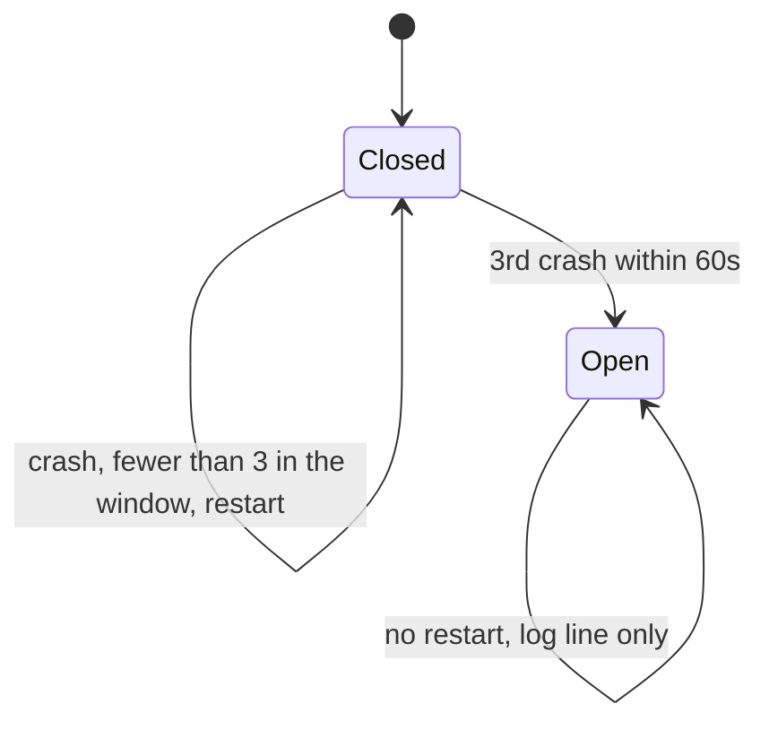
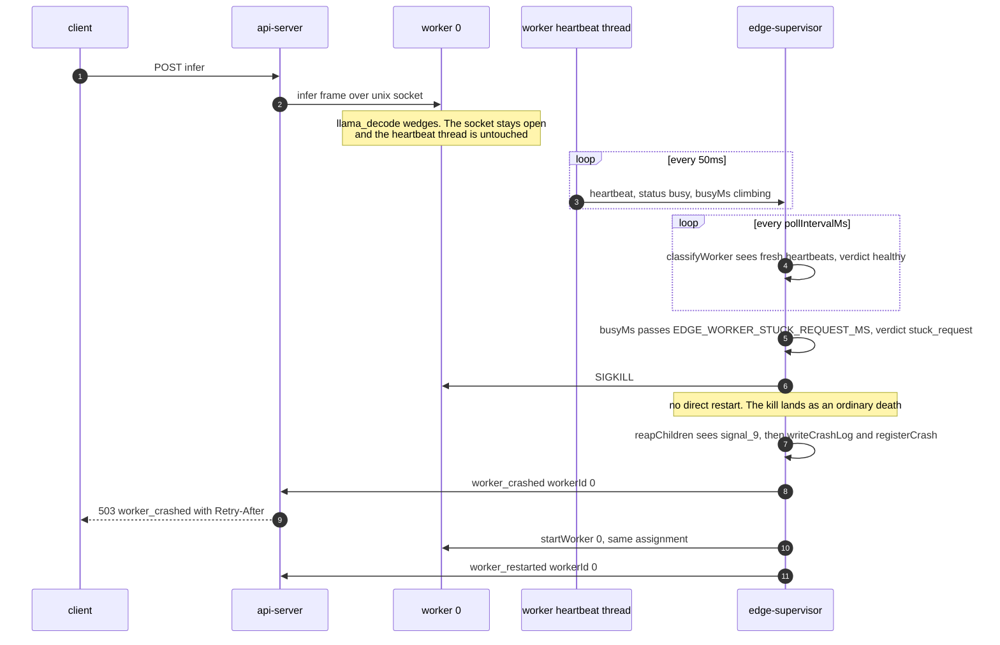
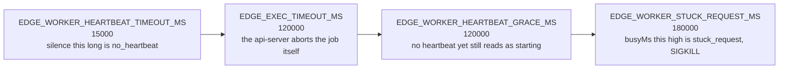
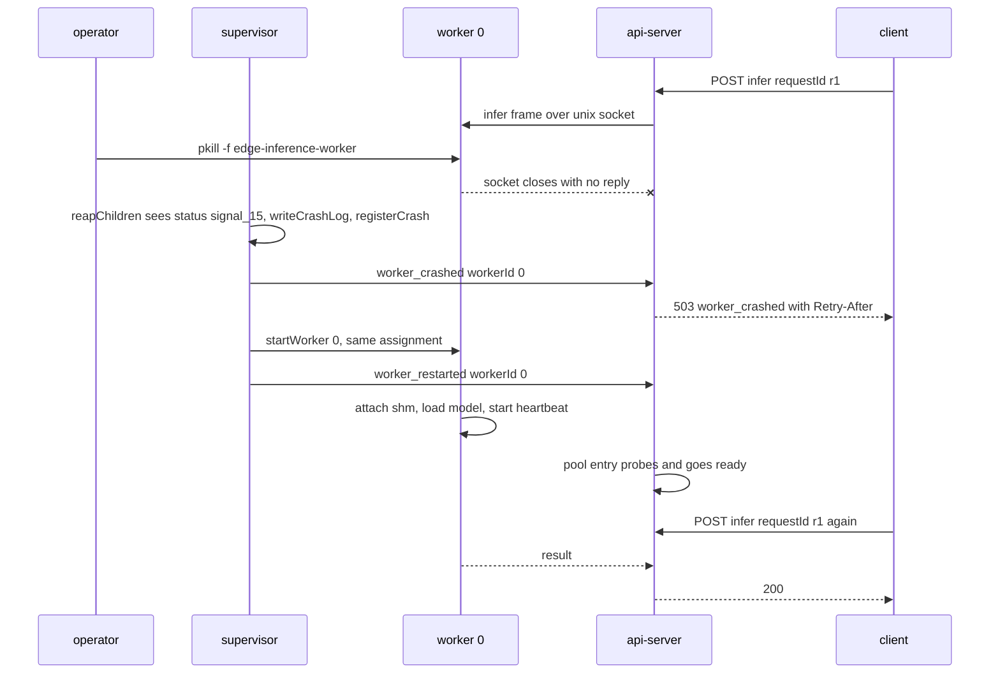

# Crash recovery, liveness and the circuit breaker

The supervisor owns three kinds of child: the model cache, the api-server, and N workers. When one
of them dies it restarts it, unless it has been dying too often. It also kills and restarts a
worker that is still alive but has stopped doing useful work.

This document is the supervisor's side. What the api-server does with a crash notification (pool
state, 503 responses, recovery probing) is [07-api-server.md](07-api-server.md).

## The monitor loop

[Supervisor::monitorLoop](../backend/supervisor/supervisor.cpp#L115) runs three things every
`pollIntervalMs` (50 ms by default):

```
reapChildren()          waitpid(-1, WNOHANG) until it returns nothing
drainSupervisorSocket() accept, read heartbeat lines, record them
checkWorkerLiveness()   classify each worker, SIGKILL the bad ones
```

That is the whole loop. No signal handler does recovery work, `SIGCHLD` is not caught, and death is
discovered by polling.

## What happens when a child dies

[Supervisor::handleCrash](../backend/supervisor/supervisor.cpp#L491), in order:

1. Look the pid up in `processesByPid_`. An unknown pid is ignored.
2. Remove its pidfile, and its worker-id entries from `workerPidById_` and `workerHealthById_`.
3. If it exited 0, stop. A clean exit is not a crash.
4. If it is a worker that exited 70, hand it to the reassignment path and stop. See below.
5. Write a line to `$EDGE_CRASH_LOG`.
6. If the supervisor is shutting down, stop.
7. For a worker: notify the api-server, ask the circuit breaker, restart, notify again.
8. For the model cache: ask the breaker, restart it, wait for ready, then restart every worker.
9. For the api-server: ask the breaker, restart it.

Step 8 is why a model-cache crash is expensive. Workers mmap the shared segment at startup, so a
new cache means tearing every worker down and starting it again
([restartWorkersAfterModelCacheRestart](../backend/supervisor/supervisor.cpp#L616)), and it
restarts `effectiveWorkerCount_` of them because capacity outlives a model-cache restart.

## The circuit breaker

Three crashes in 60 seconds and the supervisor stops restarting.



There is no half-open state and no retry timer, so once open for a given key that child stays down
until the whole supervisor is restarted. The key is the worker id for workers, and two sentinels
for the singletons:
`kCircuitKeyModelCache = -1001` and `kCircuitKeyApiServer = -1002`
([supervisor.cpp:36](../backend/supervisor/supervisor.cpp#L36)). So worker 0 crashing three times
does not stop worker 1 from being restarted.

Two mechanisms are consulted, and either one opens it:

- [CircuitBreaker::registerCrash](../backend/supervisor/supervisor.cpp#L61) keeps an in-memory
  deque of `steady_clock` timestamps per key, prunes anything older than 60 s, and returns true at
  three entries.
- [crashLimitOpenFromDisk](../backend/supervisor/supervisor.cpp#L754) re-reads `$EDGE_CRASH_LOG`
  and counts matching lines with a `ts` inside the last 60 seconds.

**What an open breaker means for the operator.** The stack keeps running with fewer workers. That
worker's pool entry never becomes ready so it is never handed out, but the scheduler keeps
admitting against `EDGE_MAX_SLOTS` regardless, which under load shows up as 503
`no_ready_workers`. The only signal is one line on the supervisor's stderr:

```
[supervisor] Worker 0 circuit breaker OPEN
```

The fix is `make backend-stop && make backend`, after reading `$EDGE_CRASH_LOG` to find out why it
was crashing.

## Liveness: restarting a worker that hangs

`waitpid` only reports death, so a worker that wedges would sit in the pool forever. The supervisor
classifies every worker on every poll instead.

Workers send a heartbeat to `$EDGE_SUPERVISOR_SOCK` every 50 ms
([worker.cpp:546](../backend/inference-worker/worker.cpp#L546)):

```json
{"type":"heartbeat","workerId":0,"status":"busy","device":"cuda","busyMs":4120}
```

`busyMs` is elapsed time on the current request, or 0 when idle.
[parseHeartbeat](../backend/supervisor/workerLiveness.cpp#L59) reads it out, and `recordHeartbeat`
stamps `lastHeartbeatMs` with the supervisor's own clock.
[classifyWorker](../backend/supervisor/workerLiveness.cpp#L70) then returns one of four verdicts:

| Verdict | Condition |
|---|---|
| `starting` | no heartbeat yet, and within `EDGE_WORKER_HEARTBEAT_GRACE_MS` of spawn |
| `no_heartbeat` | no heartbeat yet and past the grace, or silent for longer than `EDGE_WORKER_HEARTBEAT_TIMEOUT_MS` |
| `stuck_request` | beating fine, but `busyMs` exceeds `EDGE_WORKER_STUCK_REQUEST_MS` |
| `healthy` | none of the above |

`healthy` and `starting` are left alone. The other two are SIGKILLed
([checkWorkerLiveness](../backend/supervisor/supervisor.cpp#L658)):

```
[supervisor] worker 0 is stuck_request (silent 40ms, busy 194000ms); killing it so it can be restarted
```

### A hang, end to end

The stuck check reads elapsed request time rather than silence on purpose. The heartbeat runs on
its own thread, so a wedged `llama_decode` keeps beating happily and nothing else would ever notice:



A hang therefore costs a crash-log line and a circuit-breaker tick, exactly like a real crash. The
`no_heartbeat` verdict takes the same path from the SIGKILL onwards, it just gets there because the
heartbeats stopped rather than because `busyMs` climbed.

### The three knobs, in the order they have to sit



Left to right is increasing time, and two of those neighbours are the rules that matter:

- **The grace covers model load.** A worker mmaps a 2.3 GB segment and builds a context before it
  starts its heartbeat thread, so nothing beats before then. Set the grace below the real load
  time and the supervisor kills every worker at boot, forever.
- **Keep the stuck ceiling above `EDGE_EXEC_TIMEOUT_MS`.** The api-server aborts a request at the
  execution timeout. If the stuck ceiling were lower, the supervisor would kill a worker that was
  about to be released normally.
- **Setting any of them to 0 switches that check off.** A zero grace means silence is fatal
  immediately, a zero timeout means silence is never fatal, and a zero stuck ceiling means a wedged
  decode is never caught. Read the guards in
  [workerLiveness.cpp:70](../backend/supervisor/workerLiveness.cpp#L70) before changing one.

## A planned exit is not a crash

A worker that falls off the GPU exits 70 (`EdgeExit::kReassignCpu`). See
[13-device-fallback.md](13-device-fallback.md) for why process death is the only complete CUDA
teardown.

[applyWorkerReassignment](../backend/supervisor/workerReassignment.cpp#L18) handles it, and it is
deliberately a free function taking hooks so it can be tested with no sockets and no forking. The
worker's side of the same flow is the sequence diagram in
[13-device-fallback.md](13-device-fallback.md). What this function adds is four ways to refuse:
the exit was not really 70, the worker id is invalid, the supervisor is shutting down, or the
assignment is missing or already `kCpu`. A CPU worker asking to be reassigned goes down the
ordinary crash path. Otherwise it calls `demoteToCpu` in place, notifies the api-server, and starts
the replacement.

```
[supervisor] fallback workerId=0 previous=cuda error=worker_requested_cpu_reassignment cleanup=released_model_and_context next=cpu
```

The differences from a crash: no crash-log line, no circuit-breaker tick, and the worker comes
back with a different backend. `handleCrash` calls this before `writeCrashLog`, which is what makes
the "no crash-log line" part true.

If the replacement fails to start, the outcome is `kStartFailed`, `handleWorkerReassignment`
returns false, and the ordinary crash path takes over from step 5 of the crash sequence.

## Telling the api-server

[notifyApiServer](../backend/supervisor/supervisor.cpp#L790) opens a fresh connection to
`$EDGE_API_NOTIFY_SOCK`, writes one line, and closes. Two message types:

```json
{"type":"worker_crashed","workerId":0,"requestId":""}
{"type":"worker_restarted","workerId":0,"requestId":""}
```

`requestId` is always empty. The supervisor does not know what the worker was working on.

`worker_crashed` is what makes an in-flight request fail with 503 plus a `Retry-After` header
instead of hanging until the execution timeout. `worker_restarted` matters just as much: without
it the api-server's pool gives up probing after `EDGE_WORKER_RECOVERY_ATTEMPTS` and never takes the
worker back. Both are handled in [07-api-server.md](07-api-server.md), and the frame layouts are in
[16-ipc-protocols.md](16-ipc-protocols.md). A failed notify is logged and ignored, and the restart
still happens.

## The crash log

`$EDGE_CRASH_LOG` defaults to `./logs/edge-crash.log`. One JSON object per line, appended, never
rotated:

```json
{"ts":1755930012,"pid":48211,"type":"worker","workerId":0,"status":9,"reason":"signal_9"}
{"ts":1755930041,"pid":48377,"type":"model-cache","workerId":-1,"status":256,"reason":"exit_1"}
```

`status` is the raw `waitpid` status word. `reason` is the readable form from
[statusToReason](../backend/supervisor/supervisor.cpp#L888): `exit_<n>`, `signal_<n>`,
`stopped_<n>`, or `unknown`. `type` is `worker`, `model-cache` or `api-server`, and `workerId` is
`-1` for the two singletons.

It has two jobs: the post-mortem record an operator reads after the fact, and the second half of
the circuit breaker, since `crashLimitOpenFromDisk` counts lines in it.

## A worker killed mid-request, end to end



The retry uses the same `requestId` on purpose. Failures are not cached, so the id is free to be
replayed ([08-idempotency.md](08-idempotency.md)). To watch it happen:

```bash
pkill -f edge-inference-worker
tail -n 5 ./logs/edge-crash.log
```

## Contradictions the code still has

These are real, found in the current code, and not fixed.

1. **A failed reassignment notifies the api-server twice.**
   `applyWorkerReassignment` calls `notifyCrash` before it tries to start the replacement
   ([workerReassignment.cpp:184](../backend/supervisor/workerReassignment.cpp#L184)). If the start
   fails, `handleWorkerReassignment` returns false and `handleCrash` sends `worker_crashed` for the
   same worker again ([supervisor.cpp:522](../backend/supervisor/supervisor.cpp#L522)). It also
   writes a crash-log line with `reason: "exit_70"`, which reads as a crash for a planned exit.

2. **The crash log is never rotated, and the breaker reads it.**
   `crashLimitOpenFromDisk` counts lines whose `ts` is within 60 seconds of now, from a file that
   survives restarts. Stop the stack after three worker-0 crashes and start it again inside a
   minute, and the breaker opens on the first crash of the new run because the previous run's lines
   are still inside the window.

3. **An open breaker is permanent for the process.**
   `handleCrash` returns without restarting and nothing schedules a later retry. The in-memory
   deque would prune itself after 60 seconds, but nothing re-reads it, because nothing crashes
   again. A worker lost to the breaker stays lost until the supervisor is restarted.

4. **The two startup graces disagree.**
   The supervisor treats a worker with no heartbeat as `starting` for `EDGE_WORKER_HEARTBEAT_GRACE_MS`
   (120 s shipped). The api-server marks a pool entry `crashed` if its socket has not appeared
   within `EDGE_WORKER_STARTUP_GRACE_MS` (15 s shipped). On a cold load slower than 15 seconds the
   api-server has already written the worker off while the supervisor still considers it healthy
   and starting.

5. **A hang is indistinguishable from an operator kill in the log.**
   `checkWorkerLiveness` uses SIGKILL, so the crash line reads `signal_9`, exactly like a manual
   `pkill -9`. The reason for the kill is only on the supervisor's stderr, not in the crash log.

## Limitations

- Heartbeats are per-worker only. The model cache and the api-server are watched by `waitpid`
  alone, so either can hang without being noticed.
- `drainSupervisorSocket` accepts, reads to EOF, and closes for every heartbeat. That is one
  connection per worker per 50 ms.
- There is no backoff between restarts. Three crashes can happen in well under a second, so a
  worker that fails instantly on model load burns its whole budget almost immediately.
- The breaker threshold and window are compile-time constants
  ([supervisor.h:59](../backend/supervisor/supervisor.h#L59)), not env variables.

## Tests

The pure logic is tested in `edge-hardware-tests`, with no sockets and no forking:

- [workerLivenessTests.cpp](../backend/inference-worker/tests/workerLivenessTests.cpp) every
  verdict, the zero-disables-it rule, and the round trip from the worker's real heartbeat frame
  through `parseHeartbeat`
- [workerReassignmentTests.cpp](../backend/inference-worker/tests/workerReassignmentTests.cpp)
  exit 70 against a CUDA worker, a CPU worker, a missing assignment entry, a shutting-down
  supervisor, a failed start, and a missing start hook

The circuit breaker itself is not covered. Its logic sits in `Supervisor` methods that would need
a socket-free harness to reach.
