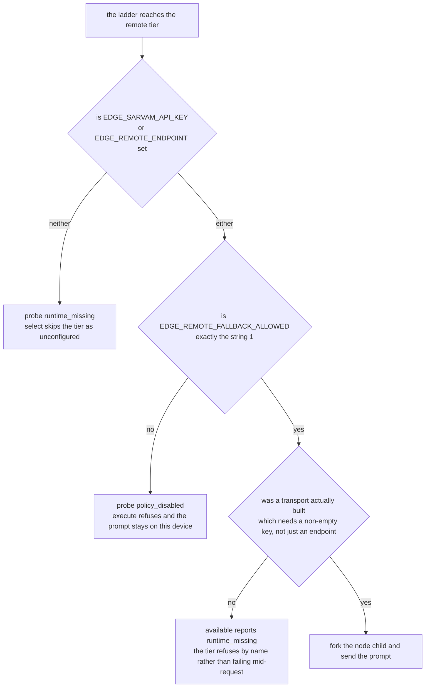
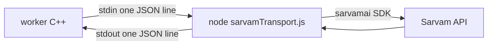
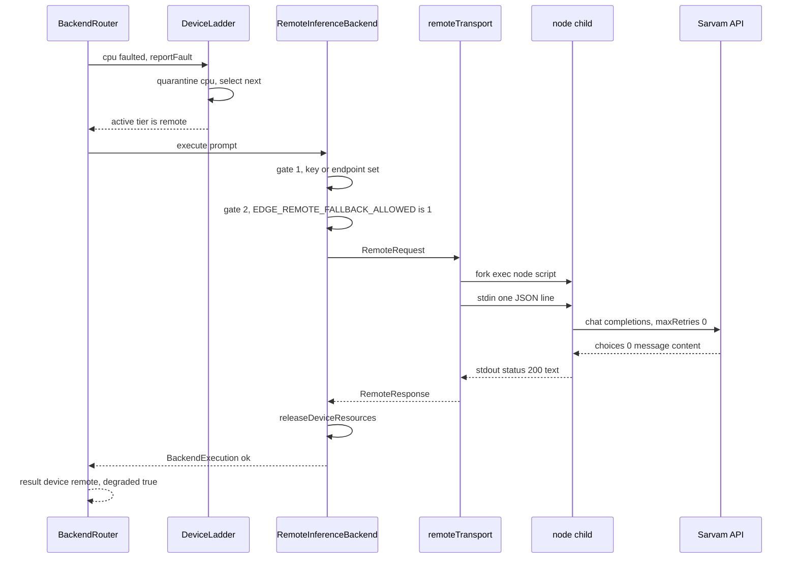

# The remote tier

`remote` is the last rung of [the device ladder](13-device-fallback.md). When no local device can
answer, and only when an operator has explicitly said yes, the worker sends the prompt to Sarvam's
hosted API and returns what comes back. It is off in a fresh clone.

```
EDGE_DEVICE_LADDER=cuda,npu,ane,cpu,remote
```

Being last matters. `cpu` sits above it and always probes available, so `remote` is reached only
after the CPU tier has faulted too.

## Two gates, and why one is not enough

Configuration and consent are separate variables, checked in that order, and there is a third
quieter gate under both of them:



A credential in the environment is not consent. This is an on-device inference runtime. A key
sitting in `.env` because someone once tried the Sarvam SDK, silently turning into "every prompt
your users type now leaves the machine", would be a real problem, and it would be invisible: the
answers would still arrive and the latency change is the only tell. So the opt-in is its own
variable, it has to be exactly the string `1`, and it ships as `0`.

The two upper gates are [probeRemote](../backend/inference-worker/deviceBackends.cpp#L195), re-read
on every call rather than cached
([inferenceBackend.cpp:294](../backend/inference-worker/inferenceBackend.cpp#L294)), so clearing
`EDGE_REMOTE_FALLBACK_ALLOWED` takes effect on the next request rather than the next restart. The
third is [makeRemoteTransport](../backend/inference-worker/remoteTransport.cpp#L372), which returns
an empty function when the key is empty.

## How C++ reaches the network

It does not. It shells out to Node.



[remoteTransport.cpp](../backend/inference-worker/remoteTransport.cpp) forks
`$EDGE_NODE_BIN $EDGE_REMOTE_TRANSPORT_SCRIPT`, writes one request line to its stdin, reads one
response line from its stdout, and waits for it to exit.

The indirection exists because the worker has no HTTP client, no TLS stack and no JSON library.
It parses JSON with `std::regex` and builds it with string concatenation
([16-ipc-protocols.md](16-ipc-protocols.md)). Adding curl and OpenSSL to the worker to call one
REST endpoint would mean owning TLS certificate handling, retry semantics and a vendor auth scheme
in C++. Node is already a dependency of this repo, the vendor ships a maintained SDK for it, and
`sarvamTransport.js` is 126 lines.

The cost is a process spawn per remote request. That is acceptable for a tier that only runs when
local hardware has already failed.

Both directions of the pipe are polled, so a child that never reads its stdin cannot wedge the
worker on a large prompt, and `SIGPIPE` is ignored for the duration so a child that dies early
cannot take the worker down with it.

## The variables

| Variable | Default | Used by |
|---|---|---|
| `EDGE_SARVAM_API_KEY` | empty | both. Empty means no transport is built at all |
| `EDGE_REMOTE_FALLBACK_ALLOWED` | `0` | the probe. Must be exactly `1` |
| `EDGE_REMOTE_ENDPOINT` | empty | base URL override. Empty means the SDK's own `https://api.sarvam.ai` |
| `EDGE_NODE_BIN` | `node` | the C++ side, to exec the child |
| `EDGE_REMOTE_TRANSPORT_SCRIPT` | `./backend/remote/sarvamTransport.js` | the C++ side, relative to the repo root |
| `EDGE_REMOTE_TIMEOUT_MS` | `30000` | both. See the note below |
| `EDGE_SARVAM_MODEL` | `sarvam-105b-conversations` | the script |
| `EDGE_SARVAM_TEMPERATURE` | `0.2` | the script |
| `EDGE_SARVAM_TOP_P` | `1` | the script |
| `EDGE_SARVAM_MAX_TOKENS` | `2000` | the script |

`EDGE_REMOTE_TIMEOUT_MS` is used twice on purpose. The script passes it to the SDK as
`timeoutInSeconds`, and the C++ side kills the child at that value **plus one second**
([remoteTransport.cpp:382](../backend/inference-worker/remoteTransport.cpp#L382)). The grace window
lets the child report its own timeout as a clean 504 rather than being SIGKILLed with no answer.

Put the real key in `.env`, never in `.env.example`. The tracked file ships with the key empty and
the opt-in at `0`.

## The two hops on the wire

### Worker to the transport script

One line on stdin, hand-built by
[buildRemoteRequestJson](../backend/inference-worker/remoteTransport.cpp#L344):

```json
{"prompt":"summarise the meeting","endpoint":"https://example.invalid/v1"}
```

`endpoint` is whatever `EDGE_REMOTE_ENDPOINT` held, read fresh per call. The caller's endpoint
wins over the script's own reading, because it is the one the operator declared consent against.

One line on stdout, read by
[parseRemoteResponseJson](../backend/inference-worker/remoteTransport.cpp#L349):

```json
{"status":200,"text":"cloud answer","error":""}
```

Only the **last** line of stdout is parsed, so the child is free to log before it answers. A line
with no `status` field is not a response, and the transport reports a failure rather than an empty
answer. Escaping is symmetric: the request escapes quotes, backslashes, newlines and control
characters as `\uXXXX`, and the response parser unescapes them, including rejoining a surrogate
pair that `JSON.stringify` emitted for an astral character.

### The transport script to Sarvam

[sarvamTransport.js](../backend/remote/sarvamTransport.js) calls the SDK:

```js
await client.chat.completions({
  messages: [{ role: 'user', content: request.prompt }],
  model: config.model,
  temperature: config.temperature,
  top_p: config.topP,
  max_tokens: config.maxTokens,
}, {
  timeoutInSeconds: config.timeoutMs / 1000,
  maxRetries: 0,
});
```

`maxRetries: 0` is deliberate. The ladder owns retry and fallback, and a hidden retry inside one
rung would hide the fault from the tier above it.

The answer is `response.choices[0].message.content`. Anything else (a non-string, an empty string)
is reported as `502` with `sarvam returned no message content`, never as a successful empty answer.

The script exits inside the `process.stdout.write` callback, because the SDK can leave a
keep-alive socket that would hold the child open past its answer.

## A remote fallback, end to end



Either gate failing short-circuits before the transport is ever called, and the prompt never
leaves the process. The refusal text says so:

```
remote fallback is not opted in (EDGE_REMOTE_FALLBACK_ALLOWED is not 1), so the prompt stays on this device
```

The worker's result frame then carries `"device":"remote","degraded":true` with a
`degradedReason` naming the local tier that faulted, for example `cpu:runtime_error`.

## Climbing back up

`remote` is a fallback, not a destination.
[BackendRouter::route](../backend/inference-worker/backendRouter.cpp#L142) calls `attemptRecovery()`
at the top of every request, before it tries anything. That walks the tiers above the active one
and takes the first that has served its `EDGE_DEVICE_QUARANTINE_MS` window, is not session-fatal,
and passes a fresh probe.

So a worker that fell to `remote` because the CPU tier faulted goes back to `cpu` on the first
request after the quarantine closes, without a restart. The `cpu` to `remote` fall and the
`remote` to `cpu` climb both fire the same fallback hook, and the worker tells them apart by ladder
position ([worker.cpp:341](../backend/inference-worker/worker.cpp#L341)). Without that check a
climb would look like a GPU-to-CPU fallback and the worker would exit 70 for no reason.

Recovery walks one rung at a time and stops at the best healthy tier. It never moves down, which
is `reportFault`'s job.

## Failure cases

Status classification is
[faultFromRemoteStatus](../backend/inference-worker/deviceBackends.cpp#L347):

| Status | Fault | Effect |
|---|---|---|
| 2xx | `none` | the text is the answer |
| `400`, `413`, `415`, `422` | `unsupported_operation` | this request, not this tier |
| `401`, `403`, `404` | `device_unavailable` | bad key or wrong endpoint |
| `429`, `5xx`, anything else | `runtime_error` | transient |
| `0` | `runtime_error` | the call never reached a server |

**Nothing maps to `device_removed`.** A passing 503 must not make the remote tier session-fatal for
the life of the worker.

The concrete cases:

- **No key.** No transport is built. The tier probes `runtime_missing`, `select()` skips it, and if
  it is somehow reached it returns `no remote transport was built for this worker`. The script
  itself also refuses with `401` and `EDGE_SARVAM_API_KEY is empty, so no prompt left this device`,
  before the SDK is loaded.
- **No consent.** `policy_disabled`, and `execute` refuses without calling the transport.
- **Timeout.** The SDK throws `SarvamAITimeoutError`, the script answers `504` with
  `sarvam call timed out: ...`. If the child itself hangs, the C++ side kills it at
  `EDGE_REMOTE_TIMEOUT_MS + 1000` and synthesizes `504` with
  `remote transport child exceeded 31000ms and was killed`.
- **HTTP error.** The SDK's `statusCode` is passed through verbatim, so a 429 stays a 429 and
  degrades the tier instead of returning text.
- **Malformed response.** No parseable line means `status: 0` and either
  `remote transport child emitted no readable response line` or
  `remote transport child exited <n> without a response line`, depending on the exit code.
- **SDK not installed.** `sarvamai` is a dependency of the api-server tier, so the script falls
  back to resolving it from `backend/api-server/node_modules`. If that also fails it answers
  `status: 0` with `sarvamai sdk is not installed: ...`.
- **Transport throws.** Caught in `execute`, released, and reported as `runtime_error` with
  `remote transport threw: ...`.

## The privacy tradeoff, plainly

When this tier serves a request, the user's prompt leaves the device and is sent to a third party
over the internet. That is the entire point of the tier, and it is the opposite of what the rest of
this runtime is for. Nothing here redacts, truncates or logs what was sent.

The design puts three things in the way of that happening by accident: the tier is last in the
ladder, it requires an explicit opt-in that is separate from the credential, and the opt-in ships
off. What it does **not** do is tell the end user. The `device` and `degraded` fields in the result
frame reach the browser, and [chat_1](17-clients.md) surfaces them, but there is no distinct
consent prompt at request time. An operator who sets `EDGE_REMOTE_FALLBACK_ALLOWED=1` is consenting
on behalf of everyone who uses that instance.

## Limitations

- No streaming. The SDK call is a single completion, and the adapter hands the whole answer to the
  token sink in one call ([inferenceBackend.cpp:342](../backend/inference-worker/inferenceBackend.cpp#L342)),
  so a remote answer arrives as one SSE `token` event.
- One process spawn per request, plus a fresh `loadEnv()` and SDK load inside it.
- The prompt is sent raw. No length cap beyond `EDGE_SARVAM_MAX_TOKENS` on the response side, and
  no redaction.
- The endpoint is not validated. Whatever `EDGE_REMOTE_ENDPOINT` holds is handed to the SDK as
  `baseUrl`.
- Sarvam is the only vendor. `RemoteInferenceBackend` is generic over a `RemoteTransport` function,
  but only one transport is ever built.

## Tests

Nothing here opens a socket or needs a key.

- [remoteFallbackTests.cpp](../backend/inference-worker/tests/remoteFallbackTests.cpp) covers the
  two gates, the status mapping, the fact that `remote` is reached only after every local tier has
  failed, and the climb back up. The policy cases use an `EnvGuard` that clears
  `EDGE_SARVAM_API_KEY` first, so a real key in a developer's own environment cannot reach any
  case. The transport cases point `EDGE_REMOTE_TRANSPORT_SCRIPT` at a shell script with the same
  argv shape and the same one-line stdout contract as the Node child, which is how the timeout,
  the dead child and the escaping round trip are tested for real without a network.
- [tests/sarvamTransport.test.js](../tests/sarvamTransport.test.js) runs the real script as a child
  with `NODE_PATH` pointing at a stub `sarvamai` module. It asserts the shipped generation defaults
  reach the SDK, that `maxRetries` is 0, that a 429 and a timeout come back as `429` and `504`, and
  that a missing key is refused before the SDK is ever loaded.
