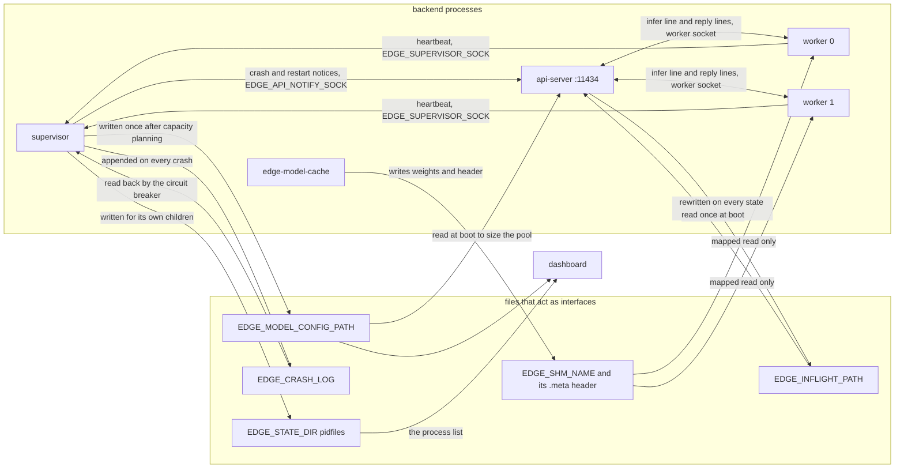
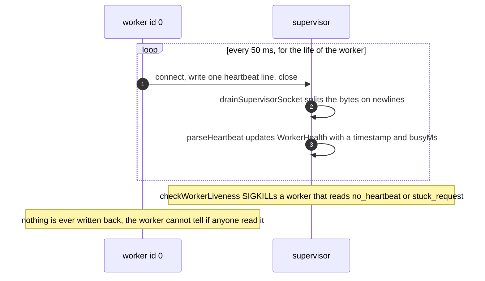
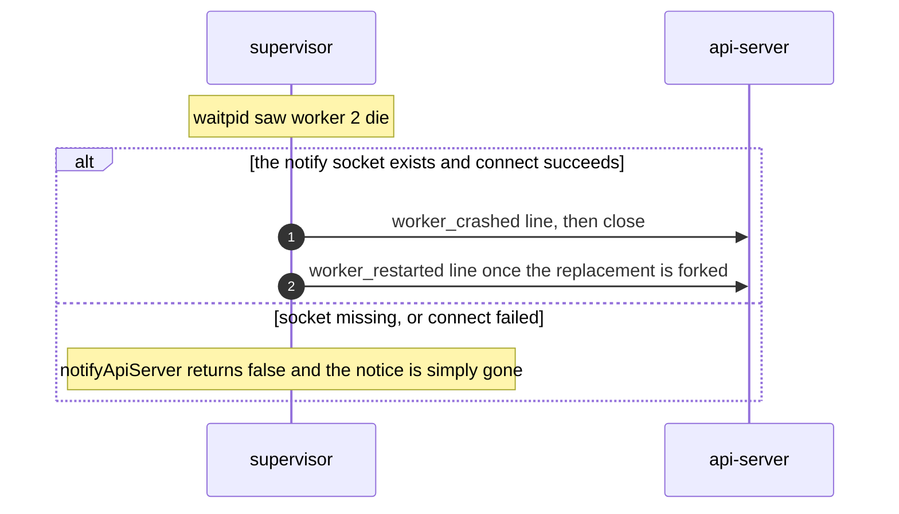
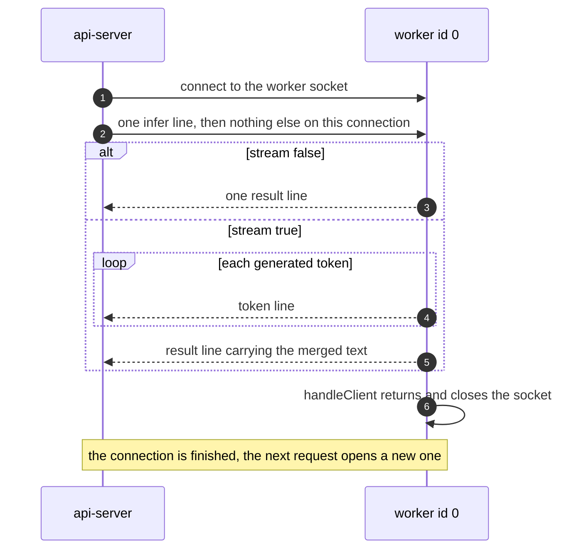

# IPC protocols

Every channel between two ServeInfer processes is newline-delimited JSON over an `AF_UNIX`
stream socket, or a file on disk. There is no protobuf, no message framing header, and no
JSON library on the C++ side. One line is one message, and `\n` is the only delimiter.

This document is the single reference for those bytes. HTTP bodies are not here: those belong
to the doc that owns the HTTP surface, which is [05-shell-app.md](05-shell-app.md) for the
browser-facing API and [07-api-server.md](07-api-server.md) for the internal one.

Every path comes from an environment variable, resolved on the C++ side through
[paths.h](../backend/ipc/paths.h) and on the Node side through
[config/env.js](../backend/config/env.js). Nothing has a hardcoded default.

## The map

Every socket and every interface file at once. An arrow points from the writer to the reader,
and the double-headed one is the only channel that carries a reply on the same connection:



| Socket | Variable | Server | Clients | Direction |
|---|---|---|---|---|
| Supervisor heartbeat | `EDGE_SUPERVISOR_SOCK` | supervisor | every worker | worker to supervisor |
| API notify | `EDGE_API_NOTIFY_SOCK` | api-server | supervisor | supervisor to api-server |
| Worker request | `EDGE_WORKER_SOCKET_PREFIX<id>.sock` | worker `<id>` | api-server | both ways |

## EDGE_SUPERVISOR_SOCK: worker heartbeats

Shipped as `/tmp/edge-supervisor.sock`. The supervisor binds it, and every worker uses a fresh
connection per beat rather than a long-lived one. The interval is 50 ms, set in
[main.cpp](../backend/inference-worker/main.cpp) as `config.heartbeatIntervalMs = 50`.



Worker to supervisor, the only message type on this channel:

```json
{"type":"heartbeat","workerId":0,"status":"busy","device":"cuda","busyMs":1420}
```

| Field | Type | Meaning |
|---|---|---|
| `type` | string | always `heartbeat` |
| `workerId` | number | the worker's `--worker-id` |
| `status` | string | `busy` while a request is being handled, `ready` otherwise |
| `device` | string | the tier the worker is currently on, e.g. `cuda`, `cpu`, `remote` |
| `busyMs` | number | how long the current request has been running, `0` when idle |

**These are a liveness signal now.** CLAUDE.md still says the supervisor "only drains and
discards" them, and that is out of date. `Supervisor::drainSupervisorSocket` is at
[supervisor.cpp:682](../backend/supervisor/supervisor.cpp#L682), and the killing rules plus the
three grace variables are in [14-crash-recovery.md](14-crash-recovery.md).

`parseHeartbeat` ([workerLiveness.cpp:59](../backend/supervisor/workerLiveness.cpp#L59)) is
even simpler than the worker's regexes. It does a substring search for the literal
`"type":"heartbeat"`, then `strtoll` after the literal `"workerId":`. No whitespace is
tolerated around those colons, so a pretty-printed frame would be ignored. `busyMs` is
optional and defaults to 0. A line that is not a heartbeat is silently dropped. There is a test
in [workerLivenessTests.cpp](../backend/inference-worker/tests/workerLivenessTests.cpp#L113)
that feeds it `{"type":"worker_ready","workerId":1}` and asserts it does not parse.

## EDGE_API_NOTIFY_SOCK: crash notifications

Shipped as `/tmp/edge-api-notify.sock`. The **api-server** binds it, in
[server.js:65](../backend/api-server/server.js#L65), unlinking any stale file first and
removing it again on `SIGTERM`, `SIGINT` and `exit`. The supervisor connects, writes one line,
and closes.

Supervisor to api-server. Two message types are produced, both from
`Supervisor::notifyApiServer` ([supervisor.cpp:790](../backend/supervisor/supervisor.cpp#L790)),
which builds the line by concatenation. Delivery is best effort and nothing is retried:



```json
{"type":"worker_crashed","workerId":2,"requestId":""}
```

```json
{"type":"worker_restarted","workerId":2,"requestId":""}
```

`requestId` is always the empty string today. The field exists so a future supervisor can name
the single request that died rather than making the pool fail every request on that worker, and
`_markWorkerCrashed` already handles both cases.

A third type, `worker_ready`, is understood by the api-server
([ipc.js:96](../backend/api-server/ipc.js#L96)) and produced by nothing in this repo. It is the
only way an entry that burned its recovery-probe budget gets back into the pool, so today such
an entry stays out until the api-server restarts.

What the api-server does with each of these is [07-api-server.md](07-api-server.md). What makes
the supervisor send them is [14-crash-recovery.md](14-crash-recovery.md).

## EDGE_WORKER_SOCKET_PREFIX<id>.sock: inference

Shipped as `/tmp/edge-worker-<id>.sock`. The worker binds it as the last step of startup, which
is why the file's existence works as a readiness hint. The api-server opens **one connection
per request**. There is no connection reuse and no pipelining.



### api-server to worker

Exactly one line, written on `connect`, from
[ipc.js:179](../backend/api-server/ipc.js#L179):

```json
{"type":"infer","requestId":"smoke-1","prompt":"What is 2+2?","mfeId":"doc-qa","stream":false}
```

| Field | Required | Meaning |
|---|---|---|
| `type` | yes | must be exactly `infer` |
| `requestId` | yes | echoed on every frame that comes back |
| `prompt` | yes | the raw prompt, before the instruct template |
| `mfeId` | no | which client app asked, carried for logging only |
| `stream` | no | `true` for token-by-token, defaults to `false` |

The worker reads until the first `\n` or 1 MB, whichever comes first, and ignores anything
after that newline.

### worker to api-server, buffered

```json
{"type":"result","requestId":"smoke-1","text":"2 + 2 = 4.","device":"cuda","degraded":false}
```

`degradedReason` is appended only when `degraded` is true, and reads `<tier>:<fault>`:

```json
{"type":"result","requestId":"smoke-1","text":"2 + 2 = 4.","device":"cpu","degraded":true,"degradedReason":"cuda:removed"}
```

### worker to api-server, streaming

The pool treats the trailing `result` as the end of the stream, exactly as it does in the
buffered case.

```json
{"type":"token","requestId":"s1","token":"Hi"}
{"type":"token","requestId":"s1","token":" there"}
{"type":"result","requestId":"s1","text":"Hi there","device":"cuda","degraded":false}
```

A token's `token` field can be any string, including one that is only whitespace. The pool
coerces a missing one to `''`.

### worker to api-server, errors

One `error` line, then close. The api-server turns this into a 502 `worker_unavailable`, not a
503, because the worker answered.

```json
{"type":"error","requestId":"smoke-1","error":"expected type=infer"}
```

The full set of `error` strings the worker can produce is `expected type=infer`,
`missing requestId`, `missing prompt` and `engine_not_initialized`. See
[09-inference-worker.md](09-inference-worker.md).

Any line the api-server cannot `JSON.parse` fails the request with code `worker_bad_json`. Any
`type` it does not recognise is skipped without comment.

## Shared memory

`$EDGE_SHM_NAME` (`/edge-model-weights`) holds the GGUF bytes, and `$EDGE_SHM_NAME.meta`
(`/edge-model-weights.meta`) holds a 256-byte `SharedModelHeader`. Both are POSIX shm objects,
visible as files under `/dev/shm`. `edge-model-cache` writes them and every worker maps them
read-only.

The header layout, the FNV-1a checksum, the run nonce and the ready handshake are
[11-model-cache.md](11-model-cache.md). It is not repeated here.

## Files that act as interfaces

Four kinds of file are read by a process other than the one that wrote them, which makes them
part of the contract just as much as the sockets are.

| File | Written by | Read by | Purpose |
|---|---|---|---|
| `$EDGE_STATE_DIR/<name>.pid` | every process, and the supervisor for its children | the dashboard, every stop script | the process list |
| `$EDGE_MODEL_CONFIG_PATH` | supervisor, once, after capacity planning | api-server, dashboard | what actually got started |
| `$EDGE_INFLIGHT_PATH` | api-server, on every request state change | api-server at boot | which requests a crash lost |
| `$EDGE_CRASH_LOG` | supervisor, append-only | supervisor, operators | circuit-breaker input |

### Pidfiles

`$EDGE_STATE_DIR` defaults to `/tmp/edge-runtime`. Each file holds a decimal pid and a newline,
nothing else.

```
$ ls /tmp/edge-runtime/
backend-api-server.pid  backend-model-cache.pid  backend-shell-app.pid
backend-supervisor.pid  backend-worker-0.pid     backend-worker-1.pid
client-chat_1.pid       client-chat_2.pid        dashboard.pid

$ cat /tmp/edge-runtime/backend-worker-0.pid
287456
```

The name prefix carries the tier, and that is load-bearing in two places. The dashboard's
`tierOf` ([dashboard/server.js:61](../dashboard/server.js#L61)) splits on `backend-`, `client-`
and the exact name `dashboard`, and each stop script globs its own prefix, so
`scripts/backend.sh stop` matches `$EDGE_STATE_DIR/backend-*.pid` and touches nothing else.

Shell-started processes register through `register()` in
[scripts/lib.sh:62](../scripts/lib.sh#L62). The supervisor writes them for its own children
through `Supervisor::writePidFile`, naming them `backend-model-cache`, `backend-api-server` and
`backend-worker-<id>`. A pidfile whose process is gone is reported as stale rather than
running, since the dashboard checks with `kill(pid, 0)`.

Full lifecycle detail is in [02-process-model.md](02-process-model.md).

### The model config JSON

`$EDGE_MODEL_CONFIG_PATH` defaults to `/tmp/edge-model-config.json`. Written once by
`Supervisor::writeModelConfig` ([supervisor.cpp:740](../backend/supervisor/supervisor.cpp#L740))
after the hardware probe and capacity plan, truncating whatever was there. It is one line of
JSON built by concatenation. Real contents from a laptop with one RTX 2050, with the three
nested blocks cut short here because
[12-hardware-capacity.md](12-hardware-capacity.md) owns them and shows them in full:

```json
{
  "modelPath": "/home/prawesh/.../backend/models/Phi-3-mini-4k-instruct-q4.gguf",
  "shmName": "/edge-model-weights",
  "workerCount": 4,
  "configuredWorkerCount": 4,
  "pollIntervalMs": 50,
  "hardware": { "probeOk": true, "note": "ggml registered 1 gpu device(s)", "ramTotalBytes": 16416772096, "ramAvailableBytes": 11019972608, "gpus": [ { "name": "CUDA0", "description": "NVIDIA GeForce RTX 2050", "freeBytes": 3872129024, "totalBytes": 3953983488 } ] },
  "capacity": { "gpuWorkerCapacity": 1, "cpuWorkerCapacity": 3, "usableGpuMb": 3180, "usableRamMb": 9485, "gpuName": "NVIDIA GeForce RTX 2050", "gpuIndex": 0 },
  "assignments": [ { "workerId": 0, "backend": "cuda", "gpuIndex": 0, "reason": "gpu slot 1 of 1" } ]
}
```

The two worker counts are different numbers on purpose. `configuredWorkerCount` is
`EDGE_WORKER_COUNT`, the ceiling. `workerCount` is what capacity planning could actually place
and what the start loops counted to. The api-server reads that second number to size its pool,
which is documented in [07-api-server.md](07-api-server.md).

Nothing rewrites this file when a worker is restarted or reassigned to CPU. It is a record of
the plan at startup, not live state.

### The in-flight file

`$EDGE_INFLIGHT_PATH` defaults to `/tmp/edge-inflight.json`. Written by the api-server's
request registry on every state change, using a per-write temp name plus `rename`. Read once,
by the next api-server process at boot.

```json
{"pid":288170,"updatedAt":"2026-08-22T18:57:04.668Z","inflight":[{"requestId":"open-one","mfeId":"meeting-summary","stream":true,"startedAt":1787425024668}]}
```

Details, including why the temp name carries a counter, are in
[08-idempotency.md](08-idempotency.md).

### The crash log

`$EDGE_CRASH_LOG` defaults to `./logs/edge-crash.log`. Append-only, one JSON object per line,
written by `Supervisor::writeCrashLog`. Real lines:

```json
{"ts":1787424191,"pid":283756,"type":"api-server","workerId":-1,"status":9,"reason":"signal_9"}
{"ts":1787424777,"pid":287456,"type":"worker","workerId":0,"status":9,"reason":"signal_9"}
```

| Field | Meaning |
|---|---|
| `ts` | epoch seconds |
| `pid` | the pid that died |
| `type` | `model-cache`, `api-server` or `worker` |
| `workerId` | the worker's id, `-1` for anything that is not a worker |
| `status` | the raw wait status, or the signal number |
| `reason` | a short string such as `signal_9` or `exit_1` |

The supervisor reads its own log back with `crashLimitOpenFromDisk`, counting lines from the
last 60 seconds that match this process type and, for workers, this worker id. Three or more
opens the circuit breaker. That is why the file is an interface and not just a log: deleting it
while the stack is running resets the breaker. Exit code 70 never produces a line here, because
it is a planned exit. See [14-crash-recovery.md](14-crash-recovery.md).

## Design notes

Newline-delimited JSON was chosen because the C++ side has no dependencies. That constraint is
what produces the regex parsing in the worker and the `strtoll`-after-substring parsing in
`workerLiveness.cpp`, and both are documented where they live rather than hidden.

Every socket is `AF_UNIX`, never TCP. The api-server binds `127.0.0.1` and nothing in the
backend listens on a routable address, so the whole runtime is unreachable from another host by
construction.

A dead process leaves its socket file behind, and that file still passes an existence check
while refusing connections. Nothing in this design can prevent that, so the api-server treats
`existsSync` as a hint and the first failed request as the proof.

## Limitations

- `AF_UNIX` paths must fit in 108 bytes including the terminator. `EDGE_STATE_DIR` and
  `EDGE_WORKER_SOCKET_PREFIX` living under `/tmp` is not cosmetic. A deep prefix silently
  truncates, since `snprintf` into `addr.sun_path` does not report the overflow.
- No channel is versioned. A worker built from one commit and an api-server from another will
  talk past each other with no error until a field goes missing.
- No message is acknowledged. Heartbeats, crash notifications and restart notifications are all
  fire-and-forget, and a failed delivery is not retried.
- `parseHeartbeat` matches literal `"type":"heartbeat"` with no whitespace tolerance, so it is
  stricter than the worker's own regex parser on the other channel. The two parsers on the C++
  side do not share a code path.
