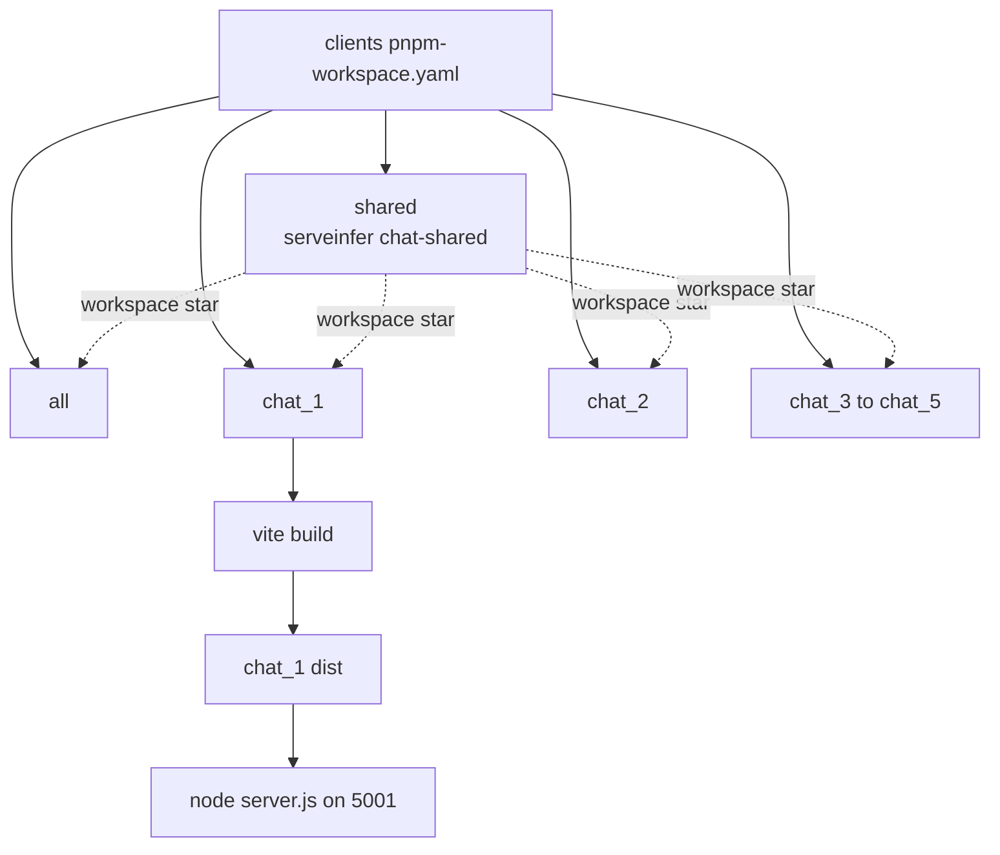
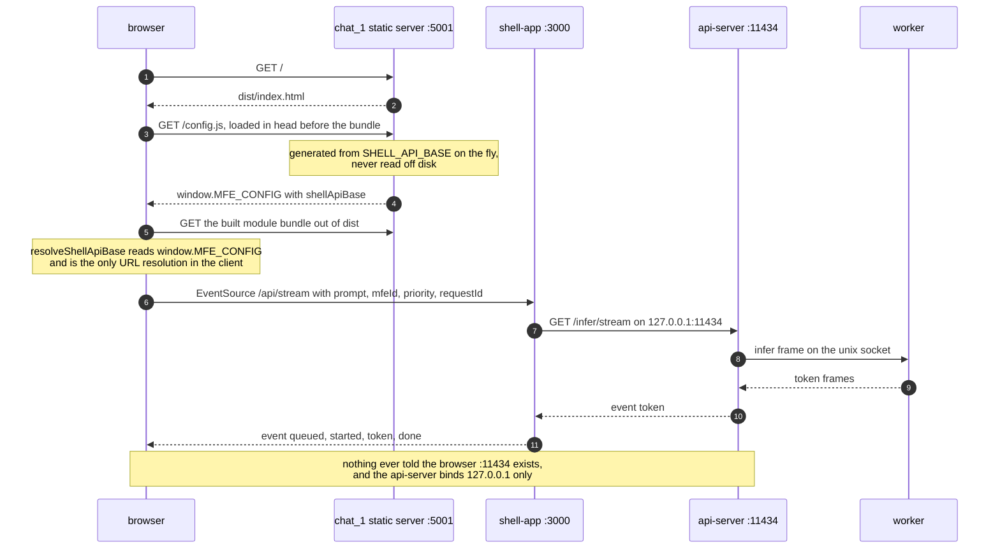
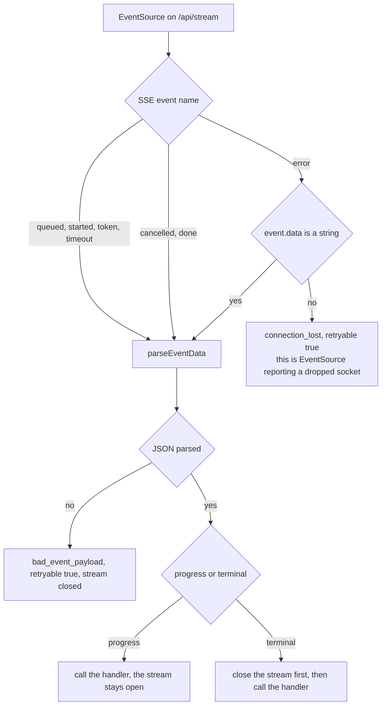
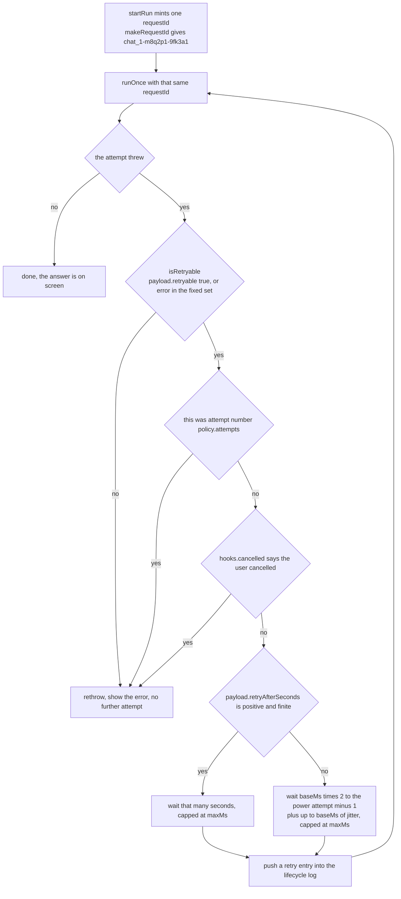

# The client apps

There are six client apps, not two: `all` plus `chat_1` through `chat_5`. They are the sample
user-facing pages, and they exist to prove that several independent front ends can share one
inference runtime without any of them knowing it exists. They are React pages built with Vite
from one shared package, in a pnpm workspace under [clients/](../clients).

They import nothing from `backend/`. A client's only contract with the rest of the system is a
base URL and the shell's HTTP surface, which means `node clients/chat_1/server.js` runs from a
fresh clone with no `.env` at all.

## What each one exercises

| App | Port | Distinctive props | What it is for |
|---|---|---|---|
| `all` | 5000 | renders all five in a grid with a summary bar | watching five clients contend for four slots at once |
| `chat_1` | 5001 | `showPriority`, `retry` | priority controls, burst, and the retry policy |
| `chat_2` | 5002 | `multiline`, `showTokens` | long transcript input and a live token counter |
| `chat_3` | 5003 | none | plain chat |
| `chat_4` | 5004 | none | plain chat |
| `chat_5` | 5005 | none | plain chat |

`chat_3`, `chat_4` and `chat_5` are identical apart from `id` and `label`
([chat_3/src/App.jsx](../clients/chat_3/src/App.jsx)). They exist to give the scheduler enough
distinct `mfeId` values to make the per-MFE cap visible.

`chat_1` is the only app with `showPriority`, which is what draws the extra buttons in
[ChatComposer.jsx:63-82](../clients/shared/src/components/ChatComposer.jsx#L63-L82): the
submit button becomes "Submit HIGH", and it gains "Prefetch LOW" and "Burst LOW x5". Burst
fires five concurrent runs at `low` priority from the same `mfeId`, which is the fastest way
to see queue positions climb and the per-MFE cap hold at 2. It is also the only app with
`retry: true`, so it is the only one that retries a failed run on its own.

`chat_2` sets `multiline`, which swaps the input for a resizable `textarea` with Ctrl+Enter
to send, and `showTokens`, which puts a running token count in the header.

`all` is a different shape. It mounts all five `ChatClient` components side by side and passes
each an `onStateChange` callback, then aggregates the results into a
[SummaryBar](../clients/all/src/SummaryBar.jsx) that shows how many are running, queued, idle
and offline, plus a breakdown by device. It is the demo view.

Every app defaults to `priority: 'high'`
([useChatClient.js:17](../clients/shared/src/hooks/useChatClient.js#L17)), so without
`chat_1`'s controls everything submits as `high`.

## The workspace



[pnpm-workspace.yaml](../clients/pnpm-workspace.yaml) lists all seven packages. There is no
root `package.json`, the workspace file alone defines the set. Each app depends on the shared
package as `"@serveinfer/chat-shared": "workspace:*"`, so pnpm symlinks it rather than
copying, and an edit in `shared/src` is picked up by every app's next build.

`shared/package.json` has no `dependencies`, only `peerDependencies` on React 19. React comes
from each app.

### Building

```bash
cd clients && pnpm install        # once, for the whole workspace
cd clients/chat_1 && pnpm build   # one app
cd clients && pnpm -r run build   # or all seven at once
```

`pnpm build` runs `vite build`, which writes `dist/`. That directory is gitignored
(`.gitignore:10`), so a fresh clone has to build before the static servers can serve
anything. Skip the build and the server answers
`503 chat-dashboard is not built: run "pnpm build" in clients/chat_1`
([server.js:44-47](../clients/chat_1/server.js#L44-L47)).

`make build` does **not** build the clients. It compiles the C++ and runs `npm install` in the
two backend Node services only ([build.sh](../scripts/build.sh)). The client build is a
separate manual step.

For development there is `pnpm dev`, which starts Vite on `CLIENT_DEV_PORT`, defaulting to
5180 for `all` and 5181 to 5185 for `chat_1` to `chat_5`. Those six dev ports are already in
the shipped `EDGE_ALLOWED_MFE_ORIGINS`, so the dev server can talk to the shell without a
config change.

## How a client learns where the shell is

The api-server is never named in any client. A client knows exactly one address, and it is
handed to it at runtime rather than baked into the bundle. From a cold browser tab to the
first token:



The generated file is one line
([server.js:34-42](../clients/chat_1/server.js#L34-L42)):

```js
window.MFE_CONFIG = {"shellApiBase":"http://127.0.0.1:3000"};
```

`resolveShellApiBase()` reads `window.MFE_CONFIG?.shellApiBase` and falls back to that same
default ([shellApi.js:15-19](../clients/shared/src/lib/shellApi.js#L15-L19)). So one built
bundle runs against any shell without a rebuild. See
[04-request-path.md](04-request-path.md).

There is a checked-in `public/config.js` in each app with the same default, which is what the
Vite dev server serves. In production the generated route wins, because the server checks that
path before touching `dist/`.

## The static server

[clients/chat_1/server.js](../clients/chat_1/server.js) is 69 lines of `node:http`, with no
dependencies. All six are byte-identical apart from the default port, the log prefix and the
"not built" message.

Two environment variables, both defaulted:

| Variable | Default | Set by |
|---|---|---|
| `CLIENT_PORT` | 5000 for `all`, 5001 to 5005 for the chats | [clients.sh:34](../scripts/clients.sh#L34) from `EDGE_CHAT_*_PORT` |
| `SHELL_API_BASE` | `http://127.0.0.1:3000` | [clients.sh:35](../scripts/clients.sh#L35) from `EDGE_SHELL_PUBLIC_BASE` |

Everything else it does is static file serving out of `dist/`, with a path-traversal check
(`filePath.startsWith(distDir)` returns 403 otherwise) and an SPA fallback that answers unknown
paths with `index.html`.

The server does not write its own pidfile. `spawn` in [scripts/lib.sh](../scripts/lib.sh) does
that, registering it as `client-chat_1` and so on. See
[02-process-model.md](02-process-model.md).

## The shared package

Seven modules, exported from
[shared/src/index.js](../clients/shared/src/index.js).

**[useChatClient.js](../clients/shared/src/hooks/useChatClient.js)** is where all the behaviour
lives. It owns messages, a lifecycle event log capped at 200 entries, status, connection,
token count, queue position, ETA, error and device. It exposes `send`, `burst`, `cancel` and
`clear`.

- `send` refuses to start if any run is already in flight (`runsRef.current.size > 0`), so a
  single client cannot flood itself. `burst` deliberately bypasses that by calling `startRun`
  five times in a loop.
- It polls `GET /api/health` on the shell every 5 seconds to drive the online/offline dot, and
  aborts that poll on unmount.
- `cancel` closes every open `EventSource` and also POSTs `/api/cancel` for each `requestId`,
  because closing the browser side alone would leave the shell holding the slot until it
  noticed the disconnect.

**[shellApi.js](../clients/shared/src/lib/shellApi.js)** is the transport. `startChatStream`
opens an `EventSource` against `/api/stream` and maps SSE event names onto handler names.
The awkward part is `error`: `EventSource` reports a dropped connection under the same name
the shell uses for a real server-sent error.



The string check is at
[shellApi.js:137-154](../clients/shared/src/lib/shellApi.js#L137-L154). Closing before
emitting means a handler that throws still leaves the stream torn down.

`makeRequestId(mfeId)` builds ids like `chat_1-m8q2p1-9fk3a1` from the mfeId, a base-36
timestamp and six random characters.

**Components.** [ChatClient.jsx](../clients/shared/src/components/ChatClient.jsx) is the whole
page: header with status dots, composer, error strip, conversation and lifecycle log. Every
per-app difference is a prop on it. [ChatComposer.jsx](../clients/shared/src/components/ChatComposer.jsx)
is the input and buttons, [ChatLog.jsx](../clients/shared/src/components/ChatLog.jsx) the
transcript with scroll pinning, [LifecycleLog.jsx](../clients/shared/src/components/LifecycleLog.jsx)
the event stream, and [StatusDot.jsx](../clients/shared/src/components/StatusDot.jsx) a
coloured dot with a tone per state.

The lifecycle log is the part worth pointing a new person at. It shows `submitted`, `queued`,
`started`, `retry`, `timeout`, `done`, `cancelled` and `error` with their payloads, which
makes the scheduler's behaviour visible in the browser without reading a server log.

## The retry policy

[retry.js](../clients/shared/src/lib/retry.js) is 49 lines and does three things.

`isRetryable(payload)` returns true if the payload says `retryable: true`, or if its `error` is
in a fixed set:

```js
const RETRYABLE_ERRORS = new Set([
  'worker_crashed',
  'no_ready_workers',
  'queue_timeout',
  'exec_timeout',
  'scheduler_overloaded',
]);
```

`withRetry(runAttempt, hooks, policy)` and `backoffMs(attempt, payload, policy)` are the other
two. The whole loop, with the one `requestId` running through every attempt:



The jitter is not decoration: one worker crash knocks back every client at once, and without
it they all come back in the same millisecond.

Defaults are 3 attempts, 500 ms base, 8000 ms max. `resolveRetryPolicy` merges
`window.MFE_CONFIG?.retry` over those. **That override is currently dead.** The static server
only ever puts `shellApiBase` into `MFE_CONFIG`, so although
[clients.sh:36-38](../scripts/clients.sh#L36-L38) passes `CLIENT_RETRY_ATTEMPTS`,
`CLIENT_RETRY_BASE_MS` and `CLIENT_RETRY_MAX_MS` into the process, nothing reads them and the
`EDGE_CLIENT_RETRY_*` variables in `.env.example` have no effect. The defaults in `retry.js`
are what actually runs.

### Retrying with the same requestId

`runOnce` takes `requestId` as a parameter rather than generating one
([useChatClient.js:127-149](../clients/shared/src/hooks/useChatClient.js#L127-L149)), and that
is what makes a retry cheap. The api-server caches a successful result against its `requestId`
for `EDGE_IDEMPOTENCY_TTL_MS`, so a retry that races a late success replays the cached answer
rather than running inference a second time. Failures are not cached, or an id could never be
retried at all. See [08-idempotency.md](08-idempotency.md).

Only `chat_1` sets `retry`, so it is the only app where this path runs. The others fail the
run and show the error.

## Failure cases

- **The shell is down.** The health poll fails, the connection dot goes red, the composer
  disables and its placeholder reads `unavailable`.
- **The client's origin is not in `EDGE_ALLOWED_MFE_ORIGINS`.** Identical symptom to the shell
  being down, with a CORS message in the browser console and nothing at all on the server. See
  [05-shell-app.md](05-shell-app.md).
- **`dist/` is missing.** Every path except `/config.js` answers 503 with the build
  instruction.
- **A malformed SSE payload.** `parseEventData` fails and the stream ends with
  `bad_event_payload`, marked retryable.

## Limitations

- `window.MFE_CONFIG.retry` is never populated, so the retry policy is not configurable at
  runtime despite the code supporting it.
- Only `chat_1` retries. The other five treat any error as final.
- `send` allows one run at a time per client, so the only way to get concurrency out of a
  single app is the burst button.
- Nothing reads `/api/queue-status`. The clients rely entirely on the single `queued` event, so
  a displayed position never updates while waiting.
- `chat_3` through `chat_5` are copies of each other. Five directories exist mostly so five
  ports and five `mfeId` values do.
