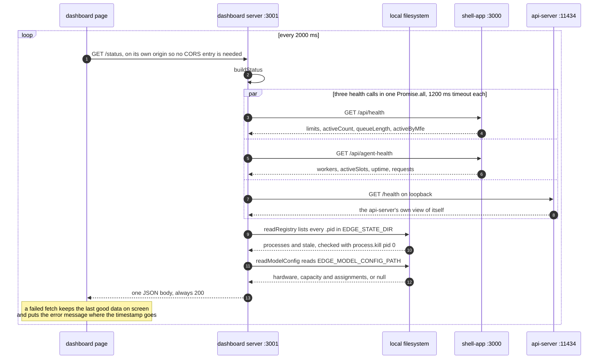
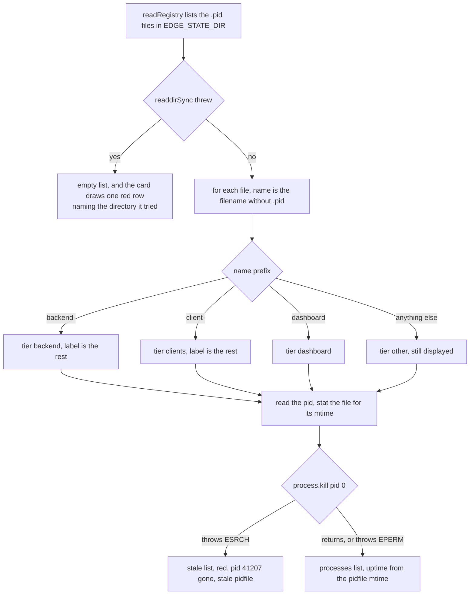
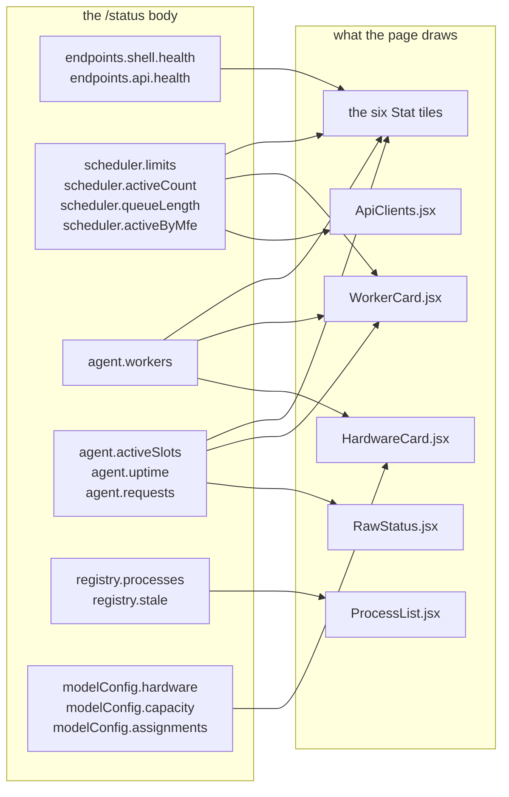

# The operator dashboard

The dashboard is the one page that shows the whole stack at once: which processes are up,
which workers are ready, what the scheduler is holding, and what hardware the backend found
at boot. It runs on `EDGE_STATUS_DASHBOARD_PORT` (3001 by default) and is a React page served
by a 208-line `node:http` server, [dashboard/server.js](../dashboard/server.js).

Like the clients, it imports nothing from `backend/`. Unlike the clients, it has to run on the
same host as the backend, because it reads `$EDGE_STATE_DIR` off the local filesystem and
talks to the api-server on loopback.

## Where its data comes from

Three sources, merged by `buildStatus()`
([server.js:138-157](../dashboard/server.js#L138-L157)). One poll cycle, which is where every
number on the page comes from:



The api-server binds `127.0.0.1`, which together with the state directory read is why the
dashboard has to run on the backend's host. A missing model config file means no backend has
booted since it was cleared, and is treated as a null rather than an error
([server.js:129-136](../dashboard/server.js#L129-L136)). The registry itself is
[02-process-model.md](02-process-model.md).

Every value has a default, so `node dashboard/server.js` runs standalone:
`DASHBOARD_PORT=3001`, `SHELL_API_BASE=http://127.0.0.1:3000`,
`AGENT_API_BASE=http://127.0.0.1:11434`, `EDGE_STATE_DIR=/tmp/edge-runtime`,
`EDGE_MODEL_CONFIG_PATH=/tmp/edge-model-config.json`.

## Why a new client needs no dashboard change

The process list is built by reading a directory, not by matching command lines. Everything
`readRegistry` decides about one process, it decides from the filename and the pid inside:



Add `chat_6`, register it as `client-chat_6`, and it shows up under Clients on the next
2-second poll. Nothing in the dashboard names any client, any path, or any port
([server.js:61-66](../dashboard/server.js#L61-L66)). A stale entry is worth drawing because it
usually means a crash nothing cleaned up after, and `EPERM` counts as alive because it means
the process exists and belongs to another user.

## The server's two endpoints

### GET /status

Everything, in one JSON body. This is what the page polls.

```json
{
  "timestamp": "2026-08-23T11:04:07.512Z",
  "endpoints": {
    "shell": {
      "url": "http://127.0.0.1:3000",
      "health": { "ok": true, "status": 200, "body": { "...": "hoisted below as scheduler" } }
    },
    "api": {
      "url": "http://127.0.0.1:11434",
      "health": { "ok": true, "status": 200, "body": { "...": "same shape as agent below" } }
    }
  },
  "scheduler": {
    "limits": { "maxSlots": 4, "maxPerMfe": 2, "maxQueue": 20 },
    "activeCount": 2,
    "queueLength": 3,
    "activeByMfe": { "chat_1": 2 }
  },
  "agent": {
    "workers": [
      { "id": 0, "status": "busy", "device": "cuda", "degraded": false, "degradedReason": null },
      { "id": 1, "status": "ready", "device": "cuda", "degraded": false, "degradedReason": null },
      { "id": 2, "status": "ready", "device": "cpu", "degraded": true, "degradedReason": "cuda:device_removed" }
    ],
    "activeSlots": 1,
    "uptime": 842,
    "requests": { "inflight": 1, "completedCached": 17, "orphanedFromPreviousRun": 0 }
  },
  "registry": {
    "processes": [
      { "name": "backend-api-server", "tier": "backend", "label": "api-server", "pid": 41205, "uptime": "14m 1s" },
      { "name": "backend-model-cache", "tier": "backend", "label": "model-cache", "pid": 41203, "uptime": "14m 2s" },
      { "name": "backend-supervisor", "tier": "backend", "label": "supervisor", "pid": 41201, "uptime": "14m 2s" },
      { "name": "backend-worker-0", "tier": "backend", "label": "worker-0", "pid": 41240, "uptime": "13m 55s" },
      { "name": "client-chat_1", "tier": "clients", "label": "chat_1", "pid": 41310, "uptime": "13m 40s" },
      { "name": "dashboard", "tier": "dashboard", "label": "dashboard", "pid": 41355, "uptime": "13m 38s" }
    ],
    "stale": [
      { "name": "client-chat_4", "tier": "clients", "label": "chat_4", "pid": 41313 }
    ],
    "stateDir": "/tmp/edge-runtime"
  },
  "modelConfig": {
    "modelPath": "./backend/models/Phi-3-mini-4k-instruct-q4.gguf",
    "shmName": "/edge-model-weights",
    "workerCount": 3,
    "configuredWorkerCount": 4,
    "pollIntervalMs": 50,
    "hardware": {
      "probeOk": true,
      "note": "ggml registered 1 gpu device(s)",
      "ramTotalBytes": 33395269632,
      "ramAvailableBytes": 1468006400,
      "gpus": [
        {
          "name": "CUDA0",
          "description": "NVIDIA GeForce RTX 4060 Laptop GPU",
          "freeBytes": 7516192768,
          "totalBytes": 8589934592
        }
      ]
    },
    "capacity": {
      "gpuWorkerCapacity": 3,
      "cpuWorkerCapacity": 0,
      "totalVramMb": 8192,
      "freeVramMb": 7168,
      "usableGpuMb": 6656,
      "totalRamMb": 31848,
      "availableRamMb": 1400,
      "usableRamMb": 376,
      "gpuName": "NVIDIA GeForce RTX 4060 Laptop GPU",
      "gpuIndex": 0,
      "gpuReason": "free 7168MB - reserve 512MB = 6656MB usable / 2048MB per worker",
      "cpuReason": "available 1400MB - reserve 1024MB = 376MB usable / 1024MB per worker"
    },
    "assignments": [
      { "workerId": 0, "backend": "cuda", "gpuIndex": 0, "reason": "gpu slot 1 of 3 (free 7168MB - reserve 512MB = 6656MB usable / 2048MB per worker)" },
      { "workerId": 1, "backend": "cuda", "gpuIndex": 0, "reason": "gpu slot 2 of 3 (...)" },
      { "workerId": 2, "backend": "cuda", "gpuIndex": 0, "reason": "gpu slot 3 of 3 (...)" }
    ]
  }
}
```

The `scheduler` and `agent` keys are the `body` of the shell's two health calls, hoisted for
convenience. When a call fails, `body` is absent, the hoisted key is `null`, and
`endpoints.<name>.health` carries `{ "ok": false, "status": 0, "error": "ECONNREFUSED" }`
instead. The whole thing still returns 200, because a down backend is a state to display, not
an error to raise.

The field names in `hardware`, `capacity` and `assignments` are produced by the C++ side, in
[hardwareReport.cpp:155](../backend/hardware/hardwareReport.cpp#L155) and
[capacityPlan.cpp:185](../backend/hardware/capacityPlan.cpp#L185). Their meaning belongs to
[12-hardware-capacity.md](12-hardware-capacity.md).

### GET /dashboard-config.js

Generated the same way the clients generate theirs, as
`window.DASHBOARD_CONFIG = {"shellBase":"...","apiBase":"..."}`
([server.js:168-176](../dashboard/server.js#L168-L176)). It is loaded by
[index.html](../dashboard/index.html) and **nothing in `dashboard/src` reads it**. The page only
ever calls `fetch('/status')` against its own origin
([App.jsx:24](../dashboard/src/App.jsx#L24)), so the route is left over and currently inert.

Everything else is static file serving out of `dist/`, with a path-traversal guard and an SPA
fallback. Without a build it answers `503 dashboard is not built: run "pnpm build" in
dashboard`. The dashboard has its own `pnpm-lock.yaml` and is not part of the clients
workspace, so build it from `dashboard/` with `pnpm install && pnpm build`.

## The page

[App.jsx](../dashboard/src/App.jsx) fetches `/status` on mount and every 2000 ms after, holds
the whole body in one state object, and hands slices of it to five components. Which slice
goes where:



`RawStatus` actually gets the whole body. It is drawn from `agent.requests` above because that
is the only place those numbers reach the page. A failed fetch leaves the last good data on
screen and puts the error message where the timestamp goes, so a blip does not blank the page.

### The top strip

Six `Stat` tiles, built inline in `App.jsx`:

| Tile | Value | Source |
|---|---|---|
| Shell singleton | `online 200`, or the error string | `endpoints.shell.health` |
| API server | same | `endpoints.api.health` |
| Workers ready | `2 of 3` | `agent.workers` filtered on `status === 'ready'` |
| Active slots | `2 / 4` | `scheduler.activeCount` and `limits.maxSlots` |
| Queued | `3 / 20` | `scheduler.queueLength` and `limits.maxQueue` |
| API uptime | `842s` | `agent.uptime` |

The Workers tile is green only when every worker is ready, amber when some are, red when the
list is empty, which is what a down api-server looks like.

### Cards

**[ProcessList.jsx](../dashboard/src/components/ProcessList.jsx)** groups the live processes
by tier in a fixed order (Backend, Clients, Dashboard, Other) and shows `label`, `pid` and
`uptime` per row, then the stale pidfiles in red underneath. With an unreadable or empty
`$EDGE_STATE_DIR` it draws one red row naming the directory it tried, so a misconfigured
value is visible rather than looking like an empty machine.

**[WorkerCard.jsx](../dashboard/src/components/WorkerCard.jsx)** draws one row per worker with
its `status` verbatim (`ready`, `busy`, `starting`, `crashed`), and `busy` gets no dot rather
than a warning, since busy is normal. Underneath, a Scheduler block with Active, Queue, Per MFE
and `agent.activeSlots` as "Agent busy". Those last two are the two independent concurrency
gates from [04-request-path.md](04-request-path.md) sitting next to each other, which is the
fastest way to spot them disagreeing.

**[HardwareCard.jsx](../dashboard/src/components/HardwareCard.jsx)** draws "No discovery on
file, start the backend to probe" when there is no `hardware` key. Otherwise: probe status,
accelerator name, free RAM, and a "Placed" tile reading
`workerCount / configuredWorkerCount`, which is where you see capacity planning having clamped
`EDGE_WORKER_COUNT`. Then per-GPU VRAM totals, host RAM, the GPU and CPU budgets with the
planner's own `gpuReason` and `cpuReason` strings, and one row per assignment.

That last part is the interesting one. `workerTierRow` joins the planned assignment against
the live worker by `workerId` and shows the disagreement rather than either half
([HardwareCard.jsx:21-32](../dashboard/src/components/HardwareCard.jsx#L21-L32)):

- no live device yet: `planned cuda · no request yet`, amber. A worker reports its device on
  its first request, not at startup.
- degraded: `cuda → cpu · cuda:device_removed`, red.
- running somewhere else without the degraded flag: `planned cuda · running cpu`, amber.
- agreeing: just `cuda`, green.

**[ApiClients.jsx](../dashboard/src/components/ApiClients.jsx)** lists which `mfeId` values are
holding slots right now, or "No client is holding a slot". This is the per-MFE cap made
visible: burst from `chat_1` and it pins at 2 while other clients still get in.

**[RawStatus.jsx](../dashboard/src/components/RawStatus.jsx)** is a collapsed `<details>` with
the entire `/status` body pretty-printed. It is the escape hatch for anything the cards do not
render, which currently includes `agent.requests`, `modelConfig.modelPath` and
`capacity.gpuIndex`.

[Card.jsx](../dashboard/src/components/Card.jsx), [Row.jsx](../dashboard/src/components/Row.jsx)
and [Stat.jsx](../dashboard/src/components/Stat.jsx) are presentation only. `Row` and `Stat`
take a `dot` of `ok`, `warn`, `bad` or `none`, and `Row` takes a separate `tone` for the value
text.

## Failure cases

- **The backend is down.** `/status` still answers 200. Both health tiles go red with
  `ECONNREFUSED`, the worker card reads "unavailable", and the process list shows whatever
  pidfiles remain, usually as stale entries.
- **`$EDGE_STATE_DIR` is wrong or missing.** `readRegistry` catches and returns an empty list,
  and the card shows one red row with the directory it tried.
- **The shell is up but the api-server is not.** The scheduler numbers keep updating while
  `agent` goes null, so Active slots reads normally and Workers ready reads "unavailable".
  That split is the intended diagnosis: the queue is fine, the runtime is not.
- **A health call takes longer than 1200 ms.** The request is destroyed and reported as
  `{ ok: false, status: 0, error: "timeout" }`, indistinguishable on the page from the service
  being down.

## Limitations

- Read-only. There is no way to restart a worker, drain the queue or cancel a request from
  here.
- No history. Every poll replaces the previous snapshot, so there is no way to see that a
  worker crashed 30 seconds ago unless its pidfile is still stale.
- `window.DASHBOARD_CONFIG` is generated and never read.
- `agent.requests`, which carries `inflight`, `completedCached` and `orphanedFromPreviousRun`
  from [08-idempotency.md](08-idempotency.md), only appears in the raw JSON blob.
- Polling is a fixed 2000 ms with no backoff, so a dashboard left open against a dead backend
  keeps making three failing requests every two seconds.
