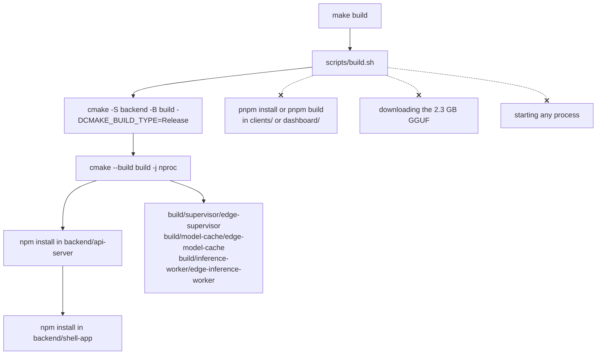
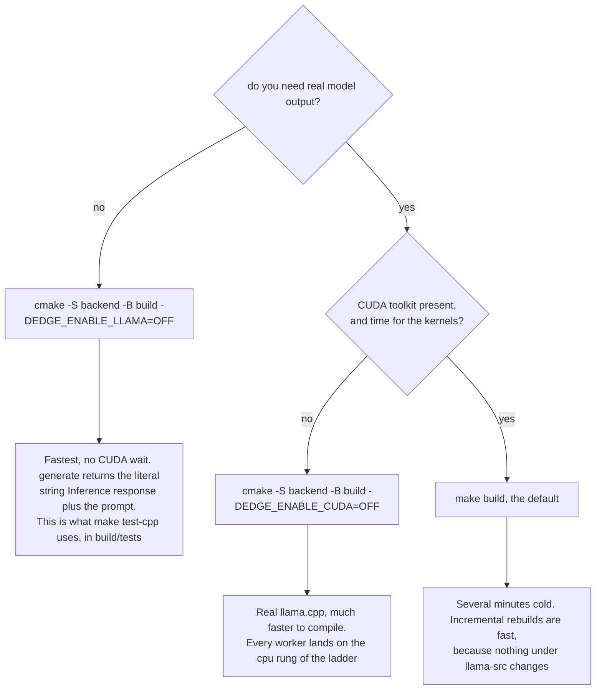

# Build and run

Getting ServeInfer running takes three things: compiling the C++ side, installing Node
dependencies, and downloading the model. `make build` does the first two. The model is a separate
manual step, because it is 2.3 GB and nobody wants a build target that downloads it silently.

## Prerequisites

| Tool | Why | Known-good version here |
|---|---|---|
| CMake >= 3.18 | `backend/CMakeLists.txt:1` sets that floor. Vendored llama.cpp asks for 3.14 to 3.28 | 3.28.3 |
| A C++17 compiler | `CMAKE_CXX_STANDARD 17`, extensions off | gcc from the host toolchain |
| Node.js | `node:test`, `node --test`, `import.meta.dirname` in the client servers | v24.17.0 |
| npm | `scripts/build.sh` installs the two backend services with it | ships with node |
| pnpm | The client workspace and the dashboard are pnpm projects | 11.17.0 |
| CUDA toolkit | Only for a GPU build. `-DEDGE_ENABLE_CUDA=OFF` skips it | |
| `hf` CLI | Only to download the model | |

Linux only in practice. The runtime uses POSIX shared memory, AF_UNIX sockets, `/proc/meminfo`
and `/dev/shm` paths directly.

## Download the model

Required before `make backend`. `scripts/backend.sh` refuses to start without the file, even for
a build with the llama backend compiled out.

```bash
hf download microsoft/Phi-3-mini-4k-instruct-gguf Phi-3-mini-4k-instruct-q4.gguf \
  --local-dir ./backend/models
```

That lands at `backend/models/Phi-3-mini-4k-instruct-q4.gguf`, which is what
`EDGE_MODEL_PATH` points at. `backend/models/` is gitignored apart from its `.gitkeep`.

## `make build`

[scripts/build.sh](../scripts/build.sh) is four commands, and the crossed arrows are the things
people expect it to do that it does not.



The C++ step is the slow one. A cold build takes several minutes because
`backend/inference-worker/CMakeLists.txt` adds the vendored llama.cpp tree as a subdirectory with
`GGML_CUDA=ON`, and compiling ggml's CUDA kernels for every supported architecture dominates the
wall clock. Incremental rebuilds after that are fast, because nothing under `llama-src/` changes.

What each binary links matters:

| Binary | Links |
|---|---|
| `edge-supervisor` | `rt` only, deliberately not llama |
| `edge-model-cache` | `rt` |
| `edge-inference-worker` | `Threads`, `rt`, and `llama` when enabled |

The supervisor's CMakeLists carries the reason it is not linked against llama in a comment:
enumerating devices through ggml costs the calling process a CUDA primary context it can never
give back. Do not add llama to it.

### Which build to run

Three configurations, and the choice is really about whether you need real model output.



### Fast iteration without the real backend

```bash
cmake -S backend -B build -DEDGE_ENABLE_LLAMA=OFF && cmake --build build -j"$(nproc)"
```

This works because every llama include is guarded. Without the `EDGE_USE_LLAMA` compile
definition, `InferEngine::generate()` returns the literal string
`"Inference response: " + prompt`, or `"Empty prompt received."` for an empty one
([inferEngine.cpp:285](../backend/inference-worker/inferEngine.cpp#L285)). The streaming path is
mocked the same way.

No model file is needed for the C++ build itself. `scripts/backend.sh` still checks one exists
before it starts anything, so to actually run this build you either download the model or point
`EDGE_MODEL_PATH` at any file.

This is also what `make test-cpp` uses. It configures a second build tree at `build/tests` with
the backend off, so a test run never waits on CUDA.

### CPU-only, with the real backend

```bash
cmake -S backend -B build -DEDGE_ENABLE_CUDA=OFF && cmake --build build -j"$(nproc)"
```

[build-matrix.md](build-matrix.md) covers why one binary cannot hold CUDA, Metal and Hexagon at
the same time, and why CPU-only has to be a separate process rather than a flag.

### The pnpm side

`make build` never touches this half. The six client apps are one pnpm workspace ([clients/pnpm-workspace.yaml](../clients/pnpm-workspace.yaml)):
`all`, `shared`, `chat_1` through `chat_5`. The five chat apps and `all` each depend on
`@serveinfer/chat-shared` through `workspace:*`. The dashboard is its own separate pnpm project.

```bash
cd clients && pnpm install
cd chat_1 && pnpm build     # repeat per app, or run it from each app directory

cd dashboard && pnpm install && pnpm build
```

Each `pnpm build` is `vite build` and writes `dist/`, which is gitignored. The static servers only
serve from `dist/`. Without it you get a 503 and a message naming the fix:

```
chat-dashboard is not built: run "pnpm build" in clients/chat_1
dashboard is not built: run "pnpm build" in dashboard
```

For live editing, `pnpm dev` runs vite on its own port: 5180 for `all`, 5181 to 5185 for `chat_1`
to `chat_5`, 5174 for the dashboard. Those client dev ports are already in the shipped
`EDGE_ALLOWED_MFE_ORIGINS`.

## The Make targets

| Target | Runs | Touches |
|---|---|---|
| `make build` | `scripts/build.sh` | `build/`, the two backend `node_modules` |
| `make backend` | `scripts/backend.sh start` | supervisor, model-cache, api-server, workers, shell-app |
| `make clients` | `scripts/clients.sh start` | the six static client servers |
| `make dashboard` | `scripts/dashboard.sh start` | the one dashboard server |
| `make backend-stop` | `scripts/backend.sh stop` | `backend-*.pid`, ports 11434 and 3000, the sockets, the shm objects |
| `make clients-stop` | `scripts/clients.sh stop` | `client-*.pid`, ports 5000-5005 |
| `make dashboard-stop` | `scripts/dashboard.sh stop` | `dashboard.pid`, port 3001 |
| `make stop` | `scripts/stop.sh` | all three stops, clients then dashboard then backend |
| `make run` | stop, build, then start all three | everything |
| `make restart` | identical to `make run` | everything |
| `make test` | `test-js` then `test-cpp` | `build/tests` |
| `make help` | prints the list | nothing |

Each tier's stop target touches only its own tier. That is deliberate: you can restart the backend
without dropping the browser pages people have open.

`make backend-stop` does more than kill processes. It also frees the two ports by pid if a
pidfile was lost, removes `$EDGE_SUPERVISOR_SOCK`, `$EDGE_API_NOTIFY_SOCK` and every
`$EDGE_WORKER_SOCKET_PREFIX*.sock`, and unlinks both `/dev/shm` objects. A stale socket or shm
object is the usual reason the next boot fails, so run the stop target rather than killing by
hand.

## From a clone to a running stack

```bash
cp .env.example .env
hf download microsoft/Phi-3-mini-4k-instruct-gguf Phi-3-mini-4k-instruct-q4.gguf \
  --local-dir ./backend/models
make build
(cd clients && pnpm install && for a in all chat_1 chat_2 chat_3 chat_4 chat_5; do (cd $a && pnpm build); done)
(cd dashboard && pnpm install && pnpm build)
make run
```

Then open `http://127.0.0.1:5000` for all five clients on one page, or `http://127.0.0.1:3001`
for the operator dashboard.

## Running one service on its own

The backend services read config from the environment only, and `requiredEnv` throws on anything
missing, so the env files have to be loaded first:

```bash
set -a && source .env.example && source .env && set +a
node backend/shell-app/server.js
```

The clients and the dashboard need none of that. Every variable they read has a default, so this
works in a fresh clone with no `.env` at all:

```bash
node clients/chat_1/server.js     # CLIENT_PORT, SHELL_API_BASE
node dashboard/server.js          # DASHBOARD_PORT, SHELL_API_BASE, AGENT_API_BASE, EDGE_STATE_DIR
```

The C++ binaries take their paths as flags but read the rest from the environment, so they need
the same `set -a` treatment. The one you may want by hand is the hardware probe, which prints its
report to stdout and exits:

```bash
build/inference-worker/edge-inference-worker --probe-hardware
```

## Where everything listens

| Process | Address | Set by |
|---|---|---|
| shell-app | `http://127.0.0.1:3000` | `EDGE_SHELL_PORT` |
| api-server | `http://127.0.0.1:11434` | `EDGE_API_PORT` |
| dashboard | `http://127.0.0.1:3001` | `EDGE_STATUS_DASHBOARD_PORT` |
| client `all` | `http://127.0.0.1:5000` | `EDGE_CHAT_ALL_PORT` |
| `chat_1` to `chat_5` | `http://127.0.0.1:5001` to `:5005` | `EDGE_CHAT_1_PORT` .. `EDGE_CHAT_5_PORT` |
| supervisor | AF_UNIX `/tmp/edge-supervisor.sock` | `EDGE_SUPERVISOR_SOCK` |
| api-server notify | AF_UNIX `/tmp/edge-api-notify.sock` | `EDGE_API_NOTIFY_SOCK` |
| worker N | AF_UNIX `/tmp/edge-worker-<N>.sock` | `EDGE_WORKER_SOCKET_PREFIX` |

Every TCP listener binds `127.0.0.1` explicitly. Nothing is reachable from another machine.

## Failure cases during build and start

| What you see | Cause |
|---|---|
| `[backend] missing binary: .../edge-supervisor` and `run 'make build' first` | The C++ targets were never compiled, or `build/` was deleted |
| `[backend] missing model file: <path>` | The GGUF is not where `EDGE_MODEL_PATH` points |
| `[backend] api-server port 11434 is already in use.` | An old runtime is up. `make backend-stop` first |
| `License file .../llama-src/LICENSE not found` during cmake | The vendored licence file went missing. Restore it, do not ignore it |
| `vendored llama-src did not produce 'llama' target, using mock backend.` | The subdirectory built but the target is absent, so you silently get the mock engine |
| `chat-dashboard is not built` on a client port | `pnpm build` was never run for that app |

More symptom-to-fix pairs are in [troubleshooting](21-troubleshooting.md).

## Notes on the vendored tree

`backend/inference-worker/llama-src/` is a byte-exact subset of llama.cpp at commit
`e85caa81ea2b65797396018c179b87ad61fa38ab`, ggml `0.21.0`. Do not edit or reformat it. Its value
as evidence depends on staying identical to upstream, and it is re-synced wholesale from a clean
checkout rather than file by file. `backend/inference-worker/CMakeLists.txt` forces off every
`LLAMA_BUILD_*` option whose directory is not vendored, including `LLAMA_BUILD_APP` and
`LLAMA_BUILD_MTMD`. If you ever vendor another directory, that list is what to revisit.
[build-matrix.md](build-matrix.md) is the long-form record.
