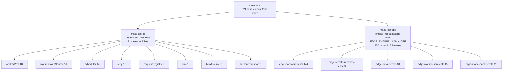
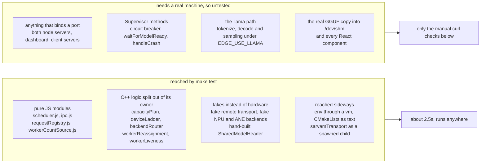

# Testing

There are 321 tests in two suites: 91 JavaScript and 230 C++. Neither adds a dependency to the
project. The JavaScript side uses `node:test`, and the C++ side uses a small assert harness
checked in at [backend/inference-worker/tests/testHarness.h](../backend/inference-worker/tests/testHarness.h).
Nothing needs the model file, a GPU, a network, or a running stack.

## Running them

```bash
make test        # both, about 2.5s once the C++ tree is warm
make test-js     # node --test tests/*.test.js
make test-cpp    # configure build/tests, compile five binaries, run them
```



That second build tree at `build/tests` is on purpose. The C++ under test is pure logic, so
pulling in the vendored llama.cpp build would add several minutes to a run that otherwise
takes seconds. The first `make test-cpp` after a clean checkout pays a one-time compile of
the five binaries.

There is no linter config and no CI. The suites are what you have.

## The JavaScript suite

Eight files in `tests/`, plus a shared helper at [tests/support.js](../tests/support.js) that
provides `deferred()`, `sleep()` and `waitFor()`.

| File | Cases | Covers |
|---|---|---|
| [tests/workerPool.test.js](../tests/workerPool.test.js) | 18 | `WorkerPool`: acquire and release, worker states, crash marking from a supervisor notification, recovery probes, the startup grace, frame errors |
| [tests/workerCountSource.test.js](../tests/workerCountSource.test.js) | 16 | `resolveWorkerCount`: reading the effective count out of the model config, and every reason it falls back to `EDGE_WORKER_COUNT` |
| [tests/scheduler.test.js](../tests/scheduler.test.js) | 14 | Slots, the per-client cap, priority ordering, aging, the queue cap, cancel, and both timeouts |
| [tests/retry.test.js](../tests/retry.test.js) | 13 | The browser retry helper in `clients/shared/src/lib/retry.js`: which errors are retryable, backoff, the `retryAfterSeconds` hint |
| [tests/requestRegistry.test.js](../tests/requestRegistry.test.js) | 9 | Coalescing concurrent submissions of one id, the success cache, that failures are not cached, the in-flight file |
| [tests/env.test.js](../tests/env.test.js) | 9 | The env parser and the precedence of process env over `.env` over `.env.example`, loaded into a `vm` against temp files |
| [tests/buildSource.test.js](../tests/buildSource.test.js) | 6 | Assertions about `backend/inference-worker/CMakeLists.txt` itself, so the vendored-llama build wiring cannot drift silently |
| [tests/sarvamTransport.test.js](../tests/sarvamTransport.test.js) | 6 | The remote transport helper, driven as a real child process with a fake response, never over the network |

Only four modules are imported directly: `backend/api-server/ipc`,
`backend/api-server/requestRegistry`, `backend/api-server/workerCountSource` and
`backend/shell-app/scheduler`. The others reach their target through the filesystem, a `vm`
context or a spawned child, which is how they avoid needing config loaded.

## The C++ suite

Five binaries, built from `backend/inference-worker/tests/`. Each one registers its cases through
the `EDGE_TEST` macro at static-init time and prints `ok - <description>` per case.

| Binary | Cases | Source files | Covers |
|---|---|---|---|
| `edge-hardware-tests` | 144 | `capacityPlanTests`, `hardwareReportTests`, `backendRouterTests`, `resourceLifecycleTests`, `fallbackContractTests`, `capacityInputTests`, `workerReassignmentTests`, `workerLivenessTests`, `hexagonRouteTests`, `cudaInitTests`, `faultInjectionTests` | Capacity planning and worker-to-device assignment, `/proc/meminfo` parsing, the `CUDA_VISIBLE_DEVICES` guarantee, the NPU and ANE state machines through injectable fakes, worker reassignment on exit 70, hang classification, fault injection, and the streaming contract across a fallback |
| `edge-remote-recovery-tests` | 32 | `remoteFallbackTests` | The remote tier's two consent gates, the climb back up the ladder after a quarantine, and the transport's child-process contract, all through an injected fake transport that opens no socket |
| `edge-device-tests` | 28 | `deviceLadderTests`, `deviceBackendsTests` | Ladder parsing and selection, quarantine and the health-check gate, `degraded` measured against the startup baseline, and the vendor error mapping for DXGI, Win32, QNN, CoreMedia and Core ML |
| `edge-worker-json-tests` | 15 | `workerJsonTests` | The worker's `std::regex` field extraction: whole-key matching, escape handling, nested objects, plus how the assigned backend narrows the ladder |
| `edge-model-cache-tests` | 11 | `modelCacheHandshakeTests` | The shared-memory ready handshake: a stale flag, a foreign nonce, a malformed or truncated header, and the header's byte layout |

Two build details are load-bearing:

- `workerJsonTests.cpp` `#include`s `worker.cpp` so it can reach the parsers in the anonymous
  namespace. `worker.cpp` must therefore not also be listed in that target's sources
  ([tests/CMakeLists.txt:20](../backend/inference-worker/tests/CMakeLists.txt#L20)).
- `edge-hardware-tests` compiles `../../supervisor/workerReassignment.cpp` and
  `../../supervisor/workerLiveness.cpp` directly. Those two pieces of supervisor logic were pulled
  out of `supervisor.cpp` specifically so they could be tested without a socket.

## The line between what is covered and what is not

Every suite runs with no model file, no GPU, no network and nothing listening. That constraint
is what decided which code lives where: the logic worth testing was pulled out of the
processes that need a real machine, and what stayed behind is untested.



Two gaps deserve naming. The circuit breaker
([supervisor.cpp:61](../backend/supervisor/supervisor.cpp#L61)) is the biggest one: its
threshold, its 60-second window and its cross-restart count from `$EDGE_CRASH_LOG` are all
unverified, because `Supervisor` expects real children and a bound socket.
`Worker::jsonEscape` is the other, a private static that the trick used on the
anonymous-namespace parsers cannot reach. `model_cache.cpp` is half covered: the header
handshake is tested against a hand-built struct, the copy into `/dev/shm` is not.

## Manual end-to-end checks

These need a running stack, and they are the only way to exercise the paths above.

```bash
# buffered inference, straight at the api-server
curl -X POST http://127.0.0.1:11434/infer -H 'Content-Type: application/json' \
  -d '{"prompt":"What is 2+2?","requestId":"smoke-1","mfeId":"doc-qa"}'

# streaming, api-server
curl -N "http://127.0.0.1:11434/infer/stream?prompt=Say+hi&requestId=s1&mfeId=doc-qa"

# the same two through the shell, so the scheduler is in the path
curl -X POST http://127.0.0.1:3000/api/infer -H 'Content-Type: application/json' \
  -d '{"prompt":"What is 2+2?","mfeId":"doc-qa","priority":"high"}'
curl -N "http://127.0.0.1:3000/api/stream?prompt=Say+hi&mfeId=meeting-summary"

# idempotent replay: same id, different prompt, the original answer comes back
curl -i -X POST http://127.0.0.1:11434/infer -H 'Content-Type: application/json' \
  -d '{"prompt":"Completely different question.","requestId":"smoke-1"}' | grep X-Idempotent-Replay

# crash recovery: expect 503 worker_crashed, then a new line in the crash log
pkill -f edge-inference-worker
tail -3 ./logs/edge-crash.log

# one shared model copy, not one per worker
ls -l /dev/shm/edge-model-weights

# device fallback with no hardware fault available
EDGE_SIMULATE_DEVICE_FAULT=cuda:removed make restart
curl -i -X POST http://127.0.0.1:11434/infer -H 'Content-Type: application/json' \
  -d '{"prompt":"probe","requestId":"probe-1"}' | grep -i 'X-Latency-Mode\|X-Degraded-Reason'
```

In the browser: `http://127.0.0.1:5000` puts all five clients on one page, which is the fastest
way to see the scheduler's per-client cap take effect. `chat_1` on `:5001` has the priority
selector and a "Burst LOW x5" button that shows queue positions and aging. `chat_2` on `:5002` is
the multi-line streaming one. The dashboard on `:3001` shows the process table, the worker states
and the probed hardware.

## Possible improvements

- A socket-free `Supervisor` harness, so the circuit breaker and the restart paths get covered.
  Pulling them out into free functions the way `workerReassignment` and `workerLiveness` already
  were is the pattern to follow.
- HTTP-level tests for the two Node servers using an ephemeral port and a stub worker socket.
  Nothing structural stops it, `WorkerPool` already takes its socket prefix as an option.
- A CI workflow. `make test` needs no model, no GPU and no network, so it would run anywhere.
