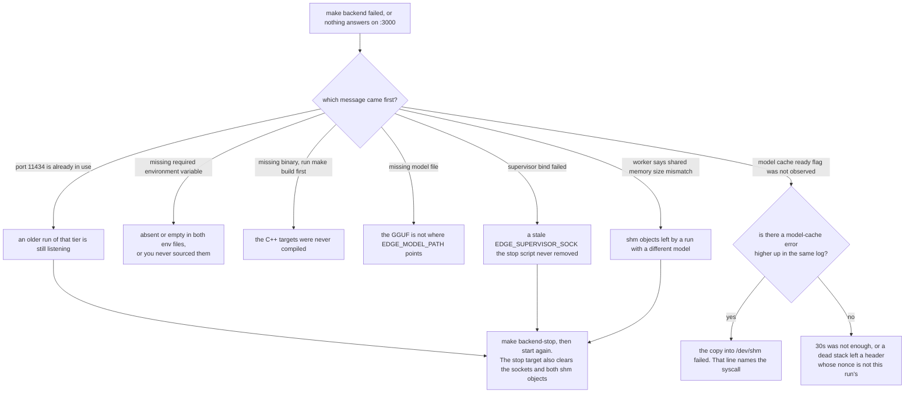
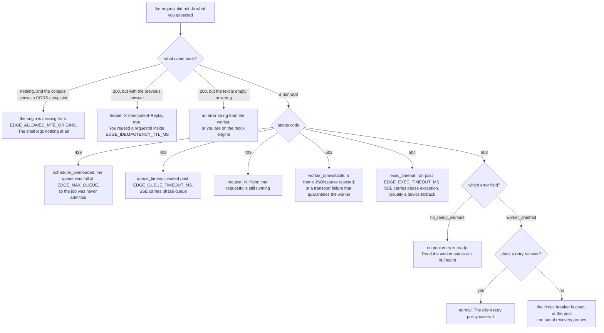

# Troubleshooting

Symptom, cause, fix. Every message quoted here was checked against the code that emits it, and
each entry links to the document that explains the mechanism rather than re-explaining it.

Two commands are worth knowing before anything else:

```bash
curl -s http://127.0.0.1:11434/health | python3 -m json.tool   # worker states, in-flight requests
tail -f logs/backend-supervisor.log                            # everything the C++ side prints
```

The supervisor's stderr goes to `logs/backend-supervisor.log`, and its children inherit that same
file descriptor, so worker and model-cache messages land there too. See
[the process model](02-process-model.md) for where each log lives.

## Start here: the stack will not start

Read the first error in `logs/backend-supervisor.log` or on the terminal, then follow it down.



Each leaf has an entry below:
[port in use](#a-tier-will-not-start-port-already-in-use),
[missing variable](#missing-required-environment-variable-edge_something),
[missing binary and missing model](19-build-and-run.md#failure-cases-during-build-and-start),
[ready flag](#supervisor-model-cache-ready-flag-was-not-observed),
[size mismatch](#worker-shared-memory-size-mismatch-mappedx-metadatay).

## Start here: a request failed

Branch on what the client actually received, not on what the log says.



Each leaf has an entry below:
[CORS](#a-new-clients-requests-silently-do-nothing),
[replay](#a-new-prompt-comes-back-with-the-old-answer),
[empty output](#empty-or-weak-output),
[429 and 408](#408-queue_timeout-under-load),
[409](#409-request_in_flight),
[502](#502-worker_unavailable-with-a-json-parse-message),
[504](#504-exec_timeout),
[503 no_ready_workers](#503-no_ready_workers),
[503 worker_crashed](#503-worker_crashed-that-never-recovers).

---

## A tier will not start: port already in use

```
[backend] api-server port 11434 is already in use.
[backend] run 'make backend-stop' first, or change it in .env.
```

`require_free_port` in [scripts/lib.sh:53](../scripts/lib.sh#L53) aborts before anything is
spawned. Run that tier's stop target: `make backend-stop`, `make clients-stop`,
`make dashboard-stop`, or `make stop` for all three. Do not just `kill` the process, because the
stop target also removes the sockets and `/dev/shm` objects and those break the next boot on
their own. If the pidfile was lost, `free_port` finds the listener by port and kills it anyway.

---

## `Missing required environment variable: EDGE_SOMETHING`

Thrown by `requiredEnv` at [backend/config/env.js:61](../backend/config/env.js#L61). Either you
added the variable to your local `.env` but not to the tracked `.env.example`, or you are running
a Node service by hand without loading the env files first:
`set -a && source .env.example && source .env && set +a`.

The shell scripts have their own version of the same error, with a `[backend]`, `[clients]` or
`[dashboard]` prefix, from the `require_env` list in [scripts/backend.sh:20](../scripts/backend.sh#L20).
That list is maintained separately from what the code reads, so a new required variable has to be
added in both places. See [configuration](03-configuration.md).

---

## `[supervisor] model cache ready flag was not observed`

[supervisor.cpp:103](../backend/supervisor/supervisor.cpp#L103). `waitForModelReady` polled the
shared-memory header for 30 seconds and never saw `ready=1` **under this run's nonce**. The
supervisor then exits 1 and nothing else starts.

Three things to check, in order:

1. Scroll up in the same log for the model cache's own error. It prints `[model-cache] ...` and
   names the failing syscall, for example `failed to open model file`, `model file is empty`, or
   `ftruncate failed` when `/dev/shm` is too small for the GGUF.
2. If you also see `[supervisor] ignoring shared model metadata from another run, waiting for
   runNonce=...`, a previous stack left a `ready=1` header behind and the new cache has not
   finished publishing yet. That message is informational once, not an error by itself.
3. If the model is large and the disk is slow, the copy can genuinely exceed 30 seconds. That
   timeout is a compile-time constant with no environment variable
   ([supervisor.h:41](../backend/supervisor/supervisor.h#L41)).

The nonce handshake is [the model cache](11-model-cache.md).

---

## `[worker] shared memory size mismatch: mapped=X metadata=Y`

[worker.cpp:267](../backend/inference-worker/worker.cpp#L267). The worker mapped a segment whose
size does not match the size in the header. That is a shm object left behind by a previous run
with a different model.

```bash
make backend-stop                 # removes both objects
# or by hand:
rm -f /dev/shm/edge-model-weights /dev/shm/edge-model-weights.meta
```

Its sibling, `[worker] shared model metadata is not ready`
([worker.cpp:239](../backend/inference-worker/worker.cpp#L239)), means the header failed the
magic, ready or size check. Same fix.

---

## `503 no_ready_workers`

```json
{ "error": "no_ready_workers", "retryAfterSeconds": 1, "requestId": "..." }
```

Thrown by `WorkerPool._acquireWorker`
([ipc.js:274](../backend/api-server/ipc.js#L274)) when no pool entry is in the `ready` state. The
response also carries `Retry-After: 1` and `X-Edge-Error: no_ready_workers`.

Look at what state the workers are actually in:

```bash
curl -s http://127.0.0.1:11434/health | python3 -m json.tool
```

- **All `starting`, right after boot.** Normal for a few seconds. `scripts/backend.sh` sleeps a
  flat 2 seconds before bringing up the shell and does not wait for a worker.
- **Still `starting` after `EDGE_WORKER_STARTUP_GRACE_MS`.** They cannot be, by construction:
  past the grace `_refreshWorkerReadiness` flips them to `crashed`
  ([ipc.js:307](../backend/api-server/ipc.js#L307)). If they are still `starting`, `getHealth` is
  not being called, which it is on every `/health`.
- **All `busy`.** You are at capacity. This is the correct answer, and the client should retry.
- **All `crashed`.** See the next entry.

If `EDGE_MAX_SLOTS` is larger than `EDGE_WORKER_COUNT`, the shell admits more work than the pool
can hold and this 503 is the expected outcome rather than a queue wait. See
[the api-server](07-api-server.md) and [the scheduler](06-scheduler.md).

---

## `503 worker_crashed` that never recovers

```json
{ "error": "worker_crashed", "retryAfterSeconds": 2, "requestId": "..." }
```

Sent when a worker died with a request in flight
([ipc.js:337](../backend/api-server/ipc.js#L337)). A single one of these is normal and the client
retry policy handles it. If it never stops, one of two gates is holding.

**The supervisor's circuit breaker is open.** Look for it in the supervisor log:

```
[supervisor] Worker 2 circuit breaker OPEN
```

Three crashes for that worker inside 60 seconds. The count also survives a supervisor restart,
because `crashLimitOpenFromDisk` re-counts matching lines out of `$EDGE_CRASH_LOG`
([supervisor.cpp:754](../backend/supervisor/supervisor.cpp#L754)). Nothing closes it
automatically. Fix the real crash first, then:

```bash
make stop && rm -f ./logs/edge-crash.log && make run
```

The same message exists for `model-cache` and `api-server` with those names instead of a worker
id.

**The pool exhausted its recovery probes.** After `EDGE_WORKER_RECOVERY_ATTEMPTS` failed probes,
`_scheduleRecoveryProbe` stops rescheduling ([ipc.js:378](../backend/api-server/ipc.js#L378)). It
comes back on its own only when the supervisor sends a `worker_restarted` notification, which
resets the attempt counter ([ipc.js:89](../backend/api-server/ipc.js#L89)). So if the supervisor
did restart the worker you should recover, and if the breaker is open it never will.

Read the crash log for the reason:

```bash
tail -5 logs/edge-crash.log
```

Each line is `{"ts":...,"pid":...,"type":"worker","workerId":2,"status":...,"reason":"signal_9"}`.
`signal_9` for a worker is usually the supervisor's own hang detector, not the kernel. See
[crash recovery](14-crash-recovery.md).

---

## `409 request_in_flight`

```json
{ "error": "request_in_flight", "requestId": "..." }
```

From the streaming route at [routes/infer.js:104](../backend/api-server/routes/infer.js#L104).
You reused a `requestId` that is still running. The streaming route refuses rather than charging
two workers for one id, because tokens cannot be replayed into a second stream.

Wait for the original to finish, or use a fresh id. See [idempotency](08-idempotency.md).

---

## A new prompt comes back with the old answer

Check the headers:

```
X-Idempotent-Replay: true
```

and the body's `"replay": true`. You reused a `requestId` inside `EDGE_IDEMPOTENCY_TTL_MS`
(shipped 300000, five minutes), and the registry served the cached result without ever reaching a
worker.

Use a fresh id per prompt, or shorten the TTL. Note that only successes are cached, so this never
hides a failure. [idempotency](08-idempotency.md) covers why.

---

## A new client's requests silently do nothing

No error in the shell log, no error in the api-server log, nothing in the network tab except a
CORS complaint from the browser.

The client's origin is not in `EDGE_ALLOWED_MFE_ORIGINS`. The middleware at
[shell-app/server.js:39](../backend/shell-app/server.js#L39) sets
`Access-Control-Allow-Origin` **only** when `allowedMfeOrigins.has(origin)`. There is no rejection
branch and nothing is logged, so the request is served and the browser drops the response.

Add both spellings of the origin, since the browser sends whichever the user typed:

```
EDGE_ALLOWED_MFE_ORIGINS=...,http://127.0.0.1:5006,http://localhost:5006
```

Then restart the shell (`make backend-stop && make backend`). If you are running the app through
`pnpm dev`, add its vite port too. See [the shell app](05-shell-app.md).

---

## `408 queue_timeout` under load

```json
{ "error": "queue_timeout", "retryable": true, "requestId": "..." }
```

The job sat in the scheduler queue longer than `EDGE_QUEUE_TIMEOUT_MS`
([scheduler.js:77](../backend/shell-app/scheduler.js#L77)). The SSE version of this carries
`phase: "queue"`, which is how you tell it apart from the execution timeout.

Either raise the timeout, raise `EDGE_MAX_SLOTS` and `EDGE_WORKER_COUNT` together, or accept the
backpressure. The browser retry helper treats it as retryable, so a user sees a retry rather than
a failure. See [the scheduler](06-scheduler.md).

Its neighbour is `429 scheduler_overloaded`, which means the queue itself was full
(`EDGE_MAX_QUEUE`) and the job was never admitted.

---

## `504 exec_timeout`

```json
{ "error": "exec_timeout", "ranMs": 120431, "retryable": true, "requestId": "..." }
```

The job ran longer than `EDGE_EXEC_TIMEOUT_MS` and the scheduler aborted its `AbortController`
([scheduler.js:293](../backend/shell-app/scheduler.js#L293)). The SSE version carries
`phase: "execution"`.

The usual cause is a device fallback. `EDGE_EXEC_TIMEOUT_MS` is shipped at 120 s, which suits the
GPU tier. A worker that fell from cuda to cpu is much slower per token, and the factor is not
measured here. Check the response headers:

```
X-Latency-Mode: degraded
X-Degraded-Reason: <tier and fault>
```

Set the bound for the slowest tier you actually list in `EDGE_DEVICE_LADDER`. Keep
`EDGE_WORKER_STUCK_REQUEST_MS` above it, or the supervisor's hang detector will kill the worker
before the scheduler gets to time the request out. See [device fallback](13-device-fallback.md).

---

## Empty or weak output

The worker returns the literal string `[error: empty model output]`
([inferEngine.cpp:278](../backend/inference-worker/inferEngine.cpp#L278)) and records a
`kRuntimeError` fault at the same time, which will quarantine the active tier if it keeps
happening. Its siblings are `[error: prompt tokenize failed]` and `[error: prompt eval failed]`.

Things to check:

- `EDGE_MAX_TOKENS` and `EDGE_TEMPERATURE`, both read once at worker startup.
- Whether the prompt suits the model. The worker wraps prompts in the model's instruct template
  before tokenizing, and `EDGE_PROMPT_TEMPLATE` overrides that.
- Whether you are actually on the mock engine. A build without `EDGE_USE_LLAMA` returns
  `Inference response: <prompt>` verbatim, which is not a model failure at all. See
  [build and run](19-build-and-run.md).

---

## `502 worker_unavailable` with a JSON parse message

```json
{ "error": "worker_unavailable", "message": "invalid worker JSON frame", "requestId": "..." }
```

The underlying code is `worker_bad_json` ([ipc.js:206](../backend/api-server/ipc.js#L206) and
[ipc.js:502](../backend/api-server/ipc.js#L502)). The worker wrote a line `JSON.parse` rejected.

The worker builds its replies by string concatenation with a hand-rolled `jsonEscape`, so the
usual cause is a control character in the model output that the escaper does not cover. That
function is one of the two things the test suites deliberately do not reach. See
[the IPC protocols](16-ipc-protocols.md) and [the worker](09-inference-worker.md).

`502 worker_unavailable` is also the catch-all for `worker_connect_timeout`,
`worker_socket_error` and `worker_closed`. Those three are transport failures and they quarantine
the worker for a recovery probe ([ipc.js:362](../backend/api-server/ipc.js#L362)), because a dead
process leaves its socket file behind and `fs.existsSync` cannot tell the difference.

---

## CMake warns about a missing LICENSE

```
CMake Warning: License file .../backend/inference-worker/llama-src/LICENSE not found
```

From `license_add_file` in
[llama-src/cmake/license.cmake:18](../backend/inference-worker/llama-src/cmake/license.cmake#L18),
called at [llama-src/CMakeLists.txt:198](../backend/inference-worker/llama-src/CMakeLists.txt#L198).

Do not ignore it. Upstream's build reads that file and embeds it in the binary, and MIT requires
the notice to ship with any redistribution of the source. Restore it from a clean llama.cpp
checkout at commit `e85caa81`. `backend/inference-worker/llama-src/` is otherwise a byte-exact
upstream tree, so re-sync it wholesale rather than editing files inside it.

A related warning is worth not ignoring either:

```
CMake Warning: vendored llama-src did not produce 'llama' target, using mock backend.
```

That one means your build silently has no model in it at all.

---

## The dashboard shows a process that is not running

The dashboard lists it under stale rather than under running. It reads `$EDGE_STATE_DIR/*.pid` and
checks each pid with `process.kill(pid, 0)`
([dashboard/server.js:112](../dashboard/server.js#L112)). A pidfile whose process is gone is
almost always something that was SIGKILLed, so nothing got the chance to remove the file.

`make stop` clears them. If a stale entry survives that, delete the file by hand from
`$EDGE_STATE_DIR`. See [the process model](02-process-model.md) and
[the dashboard](18-dashboard.md).

---

## Fewer workers started than `EDGE_WORKER_COUNT`

Not a fault. `EDGE_WORKER_COUNT` is a ceiling. Look for this in the supervisor log:

```
[supervisor] discovery placeableWorkers=2 configuredWorkers=4 startingWorkers=2
[supervisor] discovery capacity holds 2 worker(s), so 2 of the 4 configured will not be started
```

The capacity plan decided the machine cannot pay for all four, given `EDGE_WORKER_GPU_MB`,
`EDGE_WORKER_RAM_MB` and the two reserves. The api-server reads the effective count back out of
`$EDGE_MODEL_CONFIG_PATH` and sizes its pool to match, logging which source it used. Raise the
budgets or lower the count. See [hardware and capacity](12-hardware-capacity.md).
