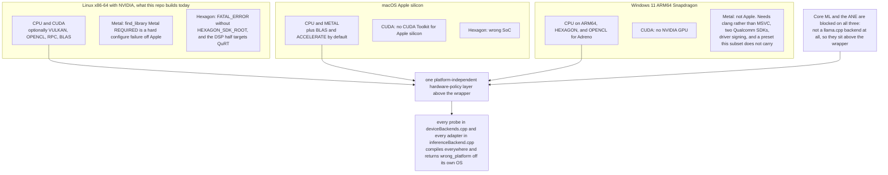
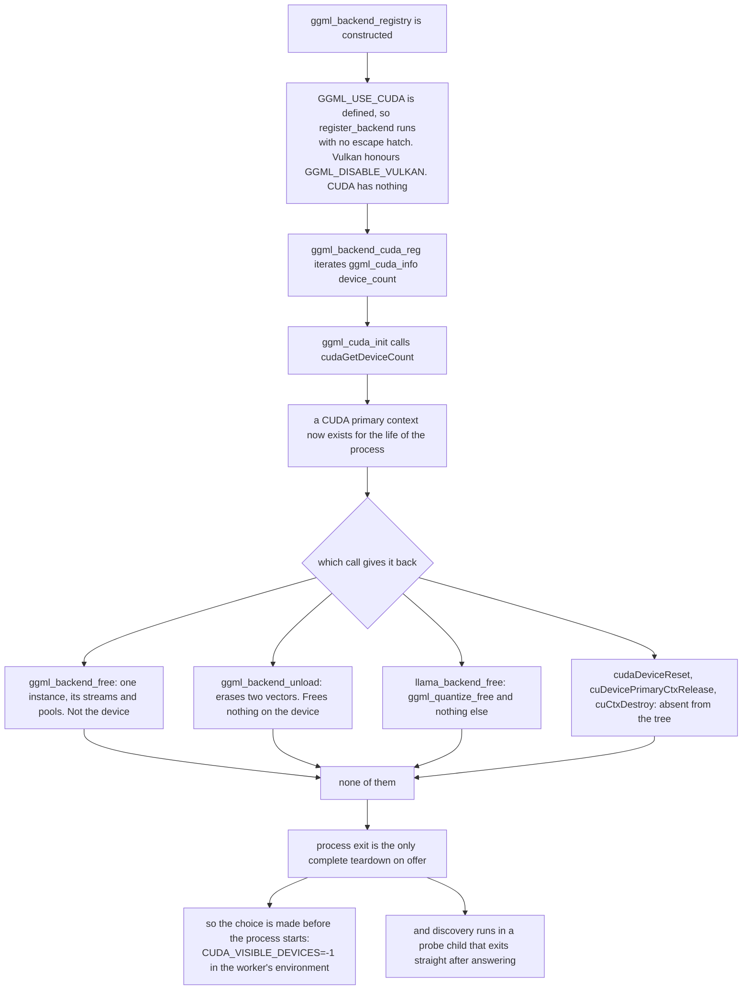
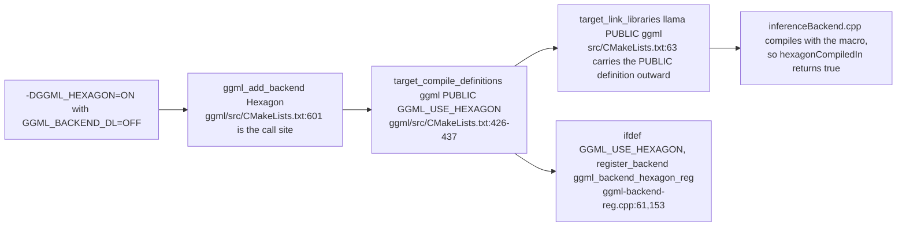

# Build matrix: which backends this build can contain

This is the deep dive behind one question: which accelerator backends a given build of this
repository can compile, load, initialize, execute and release at all.

That is a different question from what happens when a backend *faults*, which is
[13-device-fallback.md](13-device-fallback.md). The two are easy to mix up. "llama.cpp
supports Hexagon upstream" and "this binary can run on a Hexagon DSP" are different claims,
and only the second one lets you say the project supports Qualcomm NPUs.

Everything below was read out of the tree in `backend/inference-worker/llama-src/`, not from
upstream documentation.

## The vendored llama.cpp version

| Field | Value |
|---|---|
| Upstream | `ggml-org/llama.cpp` |
| Commit | `e85caa81ea2b65797396018c179b87ad61fa38ab` |
| Upstream build number | `10582` (`git rev-list --count`) |
| ggml version | `0.21.0` (`llama-src/ggml/CMakeLists.txt:6-9`) |
| Commit date | 2026-08-22 |

The vendored tree is a byte-exact, unmodified subset of upstream at that commit. All 1538
files were verified against `git cat-file blob e85caa81:<path>`. It does not include `docs/`
or `CMakePresets.json`, so anything quoted from those is cited to github.com at that ref
rather than to a local path.

### The upgrade record

This tree was deliberately moved forward, and it is recorded loudly because a silent
llama.cpp version bump would invalidate every claim in the rest of this document.

| | Before | After |
|---|---|---|
| Commit | `255582687b8dd211fdbc582e43ab842491554e94` | `e85caa81ea2b65797396018c179b87ad61fa38ab` |
| Release tag / build | `b9180` | build `10582` |
| ggml version | `0.11.1` | `0.21.0` |
| Commit date | 2026-05-16 | 2026-08-22 |
| Vendored files | 1333 | 1538 |

The two commits are 1402 upstream commits apart, and the old one is a direct ancestor of the
new one, so the delta is exact rather than estimated. Across the paths this repo vendors
today (`CMakeLists.txt LICENSE cmake include src ggml vendor`) 860 files differ: 305 added,
40 deleted, 515 modified.

Why upgrade at all, given "do not silently upgrade llama.cpp": the source has to be synchronized
from the reference tree, no two llama.cpp commits may be mixed, and the reference tree only
contains `e85caa81`. Cherry-picking files forward would be exactly the forbidden mixing, so the
tree moved wholesale to one consistent version and the change is written down rather than made
quietly.

**API impact on the wrapper: none.** All 41 `llama_*` and `ggml_backend_dev_*` symbols used by
`inferEngine.cpp`, `hardwareProbe.cpp` and the backend and router sources still exist with
byte-identical declarations. Two struct changes are worth knowing even though they do not
affect this project:

- `llama_model_params` lost `use_mmap`, `use_direct_io` and `use_mlock`. They are replaced by
  a single `enum llama_load_mode load_mode`. Nothing in `backend/` set those fields, and
  `llama_model_default_params()` returns `LLAMA_LOAD_MODE_AUTO`, which still mmaps, so the
  `/dev/shm` shared-weights design is unaffected.
- `llama_context_params` gained `n_outputs_max`, `n_outputs_max_per_seq` and `ctx_other`.
  `inferEngine.cpp` only sets `n_ctx`, `n_batch` and `n_ubatch`, all unchanged.

### What is vendored, and what is not

Selection is by dependency analysis against the actual CMake graph, not by taste.

| Path | Vendored | Why |
|---|---|---|
| `CMakeLists.txt`, `LICENSE` | yes | Entry point. `CMakeLists.txt:198` calls `license_add_file("llama.cpp" "LICENSE")`, and MIT requires the licence to ship. |
| `cmake/` | yes (13 files) | `build-info.cmake`, `common.cmake`, `license.cmake`, `llama-config.cmake.in` and `llama.pc.in` are all included by the root file. |
| `include/` | yes (2) | `llama.h` and `llama-cpp.h`, the public API the wrapper compiles against. |
| `src/` | yes (215) | The `llama` library target itself. |
| `ggml/` | yes (1279) | ggml core plus every backend adapter. Only CPU and CUDA actually compile here, the rest is inert source guarded by `GGML_*` options that default OFF. Kept whole so the `metal` and `hexagon` tiers can be enabled without a second sync, and because the subtree's CMake enumerates backends as one unit. |
| `vendor/` | yes (27) | `add_subdirectory(vendor)` is unconditional at `CMakeLists.txt:227` in this version. It was conditional at `b9180`, which is why the old copy could omit it. `vendor/hash` genuinely compiles: `hash.cpp`, `xxhash.c`, `sha1.c` and `sha256.c` appear as real translation units in `compile_commands.json`. |
| `common/` | no | Was vendored before, and is not required. `add_subdirectory(common)` is guarded by `LLAMA_BUILD_COMMON`, which this build forces OFF, and `llama` links only `ggml`. Removing it drops 69 files with no build impact. |
| `examples/`, `tools/`, `app/`, `tests/`, `pocs/`, `benches/`, `ci/`, `.github/`, `docs/`, `models/`, `gguf-py/`, `conversion/`, `scripts/`, `media/`, `grammars/`, `licenses/`, `requirements/` | no | Not reachable from the build with `LLAMA_BUILD_{COMMON,TESTS,TOOLS,EXAMPLES,SERVER,UI,APP,MTMD}=OFF`. |

`backend/inference-worker/CMakeLists.txt` also forces `LLAMA_BUILD_APP=OFF` and
`LLAMA_BUILD_MTMD=OFF`, the two options added since `b9180` that guard `app/` and
`tools/mtmd/`, directories deliberately not vendored. Adding a vendored directory means
revisiting that list.

### The ggml build stamp is wrong on purpose

`llama-src/` has no `.git` of its own, so upstream's git probes walk up and find *this*
repository. `backend/inference-worker/CMakeLists.txt` pins `LLAMA_BUILD_COMMIT=e85caa81` and
`LLAMA_BUILD_NUMBER=10582` before `add_subdirectory`, and the `llama` target honours it.
`ggml/CMakeLists.txt:13-29` does not: it re-runs `git rev-parse` itself and overwrites the
parent's value, so configure prints `ggml commit: <this repo's commit>-dirty`. That stamp is
cosmetic and wrong. The authoritative ggml version is the `0.21.0` at `ggml/CMakeLists.txt:6-9`,
and the file was left alone rather than patched so the tree stays byte-exact.

## The three-platform matrix

Three targets, what each one can hold, and the exact CMake line that stops it holding the rest:



**One binary cannot hold CUDA, Metal and Hexagon.** Not as a design preference, but because of
`find_library(... REQUIRED)` and `message(FATAL_ERROR ...)` gates in this exact tree. That policy
layer is what this repository ships instead, which is why an `EDGE_DEVICE_LADDER` string written
for a Snapdragon laptop still parses, still selects and still explains itself on this Linux box.

## Where the CMake gates are

Options live in `llama-src/ggml/CMakeLists.txt`. Each becomes a subdirectory through
`ggml_add_backend(<Name>)` at `ggml/src/CMakeLists.txt:483, 587-603`, which tests only whether the
option is truthy and applies no platform gating of its own. All real gating is inside each
backend's own CMake, and it fails hard rather than skipping.

| Option | Declared | Default | Hard dependency | Effective platform |
|---|---|---|---|---|
| `GGML_CPU` | `ggml/CMakeLists.txt:189` | ON | none | all |
| `GGML_CUDA` | `:199` | OFF | `find_package(CUDAToolkit)`, `enable_language(CUDA)`; links `cudart_static`, `cublas[Lt]_static` and `CUDA::cuda_driver` unless `GGML_CUDA_NO_VMM` | Linux and Windows with NVIDIA |
| `GGML_METAL` | `:238` | ON iff `APPLE` (`:95-103`) | `find_library` Foundation, Metal, MetalKit, all `REQUIRED` (`ggml-metal/CMakeLists.txt:1-3`) | macOS and iOS only |
| `GGML_HEXAGON` | `:270` | OFF | Hexagon SDK plus Hexagon Tools; `FATAL_ERROR` if `HEXAGON_SDK_ROOT` is unset (`ggml-hexagon/CMakeLists.txt:4-6`); `libcdsprpc` at runtime | Snapdragon aarch64 only |
| `GGML_OPENCL` | `:263` | OFF | `find_package(OpenCL REQUIRED)` and `find_package(Python3 REQUIRED)` (`ggml-opencl/CMakeLists.txt:1-2`) | any host with an OpenCL SDK; the Adreno kernels are Adreno-specific |
| `GGML_VULKAN` | `:223` | OFF | Vulkan SDK plus `vulkan-shaders-gen` | Linux, Windows, Android |

One more constraint shapes the next section. `BUILD_SHARED_LIBS=OFF`
(`backend/inference-worker/CMakeLists.txt:51`) makes `GGML_BACKEND_DL` impossible, because
`ggml/src/CMakeLists.txt:188-190` is an explicit `FATAL_ERROR`. Every compiled backend is
statically linked and statically registered, so there is no runtime plugin loading and, for CUDA,
no runtime opt-out.

## Why CPU-only means a separate process, not a flag

This is the evidence behind the `CUDA_VISIBLE_DEVICES=-1` guarantee in
[12-hardware-capacity.md](12-hardware-capacity.md) and the exit-70 reassignment in
[13-device-fallback.md](13-device-fallback.md).

The trap has two halves. Merely asking how many devices exist initializes CUDA, and nothing in
this version undoes it:



The line numbers behind each box: registration at `ggml-backend-reg.cpp:119-122`, Vulkan's escape
hatch at `:129-136`, `ggml_backend_cuda_reg()` at `ggml-cuda.cu:5501`, `ggml_backend_unload()` at
`ggml-backend-reg.cpp:266-289`, `llama_backend_free()` at `src/llama.cpp:148-150`. The registry
destructor says the same thing in a comment (`ggml-backend-reg.cpp:176-178`):

```cpp
~ggml_backend_registry() {
    // FIXME: backends cannot be safely unloaded without a function to destroy all the backend resources,
    // since backend threads may still be running and accessing resources from the dynamic library
```

`CUDA_VISIBLE_DEVICES` is read by the NVIDIA driver itself, below ggml, and an invalid index
truncates the visible-device list so `-1` yields none
([CUDA environment variables](https://docs.nvidia.com/cuda/cuda-programming-guide/05-appendices/environment-variables.html)).
`workerBackendEnv` in `backend/hardware/capacityPlan.cpp` is where it is set.

**Packaging note.** `ggml/src/ggml-cuda/CMakeLists.txt:179-183` links `CUDA::cuda_driver`
(`libcuda.so.1`) at link time unless `GGML_CUDA_NO_VMM=ON`, so a CUDA-enabled worker binary will
not start on a machine with no NVIDIA driver. Ship two binaries, or set `GGML_CUDA_NO_VMM=ON`.

## Qualcomm Hexagon on Windows ARM64

### What is in the tree

The backend is fully vendored at `llama-src/ggml/src/ggml-hexagon/`: `ggml-hexagon.cpp` (4510
lines), `htp-drv.cpp`, and an `htp/` directory of 73 files holding 27 DSP kernel sources and 43
headers, including HMX matmul and HMX flash-attention. Its public header exposes three symbols:
`ggml_backend_hexagon_init`, `ggml_backend_is_hexagon` and `ggml_backend_hexagon_reg`.

### Why this repository cannot build it

`-DGGML_HEXAGON=ON` on this machine dies before any compiler runs
(`ggml-hexagon/CMakeLists.txt:4-6`):

```cmake
if (NOT IS_DIRECTORY "${HEXAGON_SDK_ROOT}")
    message(FATAL_ERROR "Make sure HEXAGON_SDK_ROOT point to the correct Hexagon SDK installation.")
endif()
```

Even with the SDK, `build_htp_skel(v73 v75 v79 v81)` (lines 79-82) drives an `ExternalProject_Add`
against a toolchain file setting `CMAKE_SYSTEM_NAME QURT` and `CMAKE_SYSTEM_PROCESSOR Hexagon`
(`htp/cmake-toolchain.cmake:8-9`). The host half needs an ARM64 target too: `htp-drv.cpp:322-341`
loads `libcdsprpc` at runtime and resolves `rpcmem_alloc`, `dspqueue_*` and `remote_handle64_*`,
FastRPC symbols that exist only on Snapdragon.

Upstream marks it experimental at this exact commit. `ggml-hexagon.cpp:4291` logs
`"ggml-hex: Hexagon backend (experimental) : allocating new registry"`, and upstream's own
backend table marks it `[In Progress]`
([README.md at e85caa81](https://github.com/ggml-org/llama.cpp/blob/e85caa81ea2b65797396018c179b87ad61fa38ab/README.md)).
Only Hexagon and OpenVINO carry that marker. CUDA, Metal and OpenCL carry none.

### What a Snapdragon build would require

From [docs/backend/snapdragon/windows.md](https://github.com/ggml-org/llama.cpp/blob/e85caa81ea2b65797396018c179b87ad61fa38ab/docs/backend/snapdragon/windows.md)
and [docs/backend/snapdragon/README.md](https://github.com/ggml-org/llama.cpp/blob/e85caa81ea2b65797396018c179b87ad61fa38ab/docs/backend/snapdragon/README.md)
at that ref:

- LLVM core libraries plus Clang, CMake, Git and Python, **and** Visual Studio 2026 with the
  MSVC arm64 standard and runtime libraries. The compiler is clang, but the MSVC runtime is
  still needed.
- Qualcomm Adreno OpenCL SDK v2.3.2, as `OPENCL_SDK_ROOT`
- Qualcomm Hexagon SDK Community Edition v6.6.0.0, as `HEXAGON_SDK_ROOT`
- Hexagon Tools 19.0.07, shipped inside the SDK, as `HEXAGON_TOOLS_ROOT`
- Windows SDK 10.0.26100.0, as `WINDOWS_SDK_BIN`
- `HEXAGON_HTP_CERT`, a self-signed `.pfx`. The HTP skels are catalogued and signed with
  `inf2cat` and `signtool` (`ggml-hexagon/CMakeLists.txt:87-113`, targeting `/os:10_25H2_ARM64`)
- Test-signing enabled through `bcdedit`, with the certificate imported into both Trusted Root
  Certification Authorities and Trusted Publishers
- `cmake --preset arm64-windows-snapdragon-release`. `CMakePresets.json` is not vendored here,
  so its flags would have to be brought in or reproduced by hand.

The cross-compile toolchain files that *are* vendored: `llama-src/cmake/arm64-windows-llvm.cmake`,
`arm64-linux-clang.cmake` and `arm64-apple-clang.cmake`.

### What this repository ships instead

[QualcommHexagonBackend](../backend/inference-worker/inferenceBackend.h) is an adapter at the
hardware-policy boundary. It probes honestly (`QnnHtp.dll` and `dxcore.dll` on Windows,
`wrong_platform` elsewhere), translates QNN status families through `faultFromQnnStatus`, and
carries a build-gated route to the llama and ggml execution path. The state machine around it
is complete and tested through a fake: availability, `ERROR_DEVICE_REMOVED`, unhealthy,
fallback, health check, recovery.

`execute()` holds no unconditional refusal. It asks `hexagonCompiledIn()`, and when that is true
and an `InferEngine` is bound it calls `runThroughEngine()`, the same function
`LlamaInferenceBackend::execute()` calls for the CUDA and CPU tiers. There is no second execution
path and no stub.

The gate is ggml's own macro, not one invented for this project, and it reaches this repo's own
code through four upstream links:



Those lines were verified identical against upstream at `e85caa81` when the copy was taken.
They did move across the 1402-commit upgrade (`ggml_add_backend` used to sit at `:295-306`) but
the mechanism did not change, which is the part the route depends on.

### What has and has not been verified

Verified locally, and reproducible:

- The routed branch compiles in every build, gated or not. Only the predicate is behind the
  `#if`, so the route cannot rot (`hexagonRouteTests.cpp`, in `make test`).
- Compiling `inferenceBackend.cpp` with `-DGGML_USE_HEXAGON` flips `hexagonCompiledIn()` to
  `true`, makes `executable()` true once an engine is bound, and makes `execute()` route into
  the engine instead of refusing.
- Without the macro, which is every build this repository has ever produced,
  `hexagonCompiledIn()` is `false`, `executable()` is `false`, and `execute()` returns
  `qualcomm hexagon backend is not compiled into this build (GGML_HEXAGON=OFF, …)`.

**Never verified, and not claimed anywhere:** that inference has run on a Hexagon DSP. The
routed branch has never been linked against a real `ggml-hexagon`, because it cannot be built
on this host. Reaching a state where it could actually execute needs all of:

1. A Snapdragon Windows ARM64 or Android aarch64 target. `ggml-hexagon` cross-compiles its DSP
   half to QuRT, and there is no x86-64 Linux configuration of it.
2. `HEXAGON_SDK_ROOT` and `HEXAGON_TOOLS_ROOT` pointing at a Qualcomm Hexagon SDK (Community
   Edition v6.6.0.0) and Hexagon Tools 19.0.07, or `ggml-hexagon/CMakeLists.txt:4-6` is a hard
   `FATAL_ERROR`.
3. `-DGGML_HEXAGON=ON` with `GGML_BACKEND_DL=OFF`, or the macro is never defined and the
   backend is loaded dynamically instead, which this gate does not cover.
4. `libcdsprpc` at runtime, plus the signed `libggml-htp.inf` driver package.
5. Two changes in `worker.cpp`, which is outside this adapter. The engine must be bound to the
   adapter at its registration site (`Worker::selectDevice`, currently
   `std::make_shared<QualcommHexagonBackend>()` with no engine), and the engine must stop being
   built with `forceCpu = (active tier != "cuda")`, which would otherwise load the model with
   `n_gpu_layers = 0` and run the whole graph on the CPU while the router reported `npu`. That
   last point is also why `"npu"` is deliberately not in `tierIsLlamaServed()`.

Until all five hold, the honest statement is: the route exists, is compiled, and is build-gated
shut. It is unreachable and unverified on this platform.

`CoreMlAneBackend` deliberately has no matching gate. Hexagon has a real upstream macro to
test. Core ML has none, because there is no ggml Core ML backend at all. Writing an `#ifdef`
there would mean inventing a symbol nothing defines.

## Apple Metal and the Neural Engine are not the same resource

`grep -rniE "coreml|core ml|neural engine|MLModel|MLCompute|ANECompiler" llama-src/` returns
nothing across all 1538 files, and `ggml-metal/CMakeLists.txt:1-3` requires only Foundation, Metal
and MetalKit. `llama_supports_gpu_offload()` returning true on Apple silicon means Metal GPU,
nothing more.

The ANE is selected by setting `MLModelConfiguration.computeUnits` on an `MLModel`
([MLComputeUnits](https://developer.apple.com/documentation/coreml/mlcomputeunits)).
`.cpuAndNeuralEngine` allows the CPU and the neural engine but not the GPU, and `.cpuAndGPU`
allows both of those but not the neural engine. That is an API surface entirely disjoint from
llama.cpp, which is why the ANE story lives *above* the wrapper as
[CoreMlAneBackend](../backend/inference-worker/inferenceBackend.h) rather than as a ggml backend.

### kCMErrorUnsupportedOperation, recorded accurately

The runtime carries a constant by that name. Three facts about it, kept in the code as well as
here:

1. `kCMError*` is CoreMedia, an audio and video framework using `CoreMediaErrorDomain` and
   OSStatus values in the −12xxx range. Core ML is a different framework. It reports `NSError`s
   in `MLModelErrorDomain`
   ([MLModelErrorDomain](https://developer.apple.com/documentation/coreml/mlmodelerrordomain)),
   and [MLModelError.Code](https://developer.apple.com/documentation/coreml/mlmodelerror-swift.struct/code)
   has no `unsupportedOperation` case.
2. The identifier `kCMErrorUnsupportedOperation` does not appear in any Apple SDK header.
3. Its nearest real analogue is CoreMedia's `kCMBaseObjectError_UnsupportedOperation = -12782`
   (`CMBaseObject.h`), meaning "this object does not implement this method".

So the repo keeps the name and gives it the real value:
`constexpr long kCMErrorUnsupportedOperation = -12782` in
[inferenceBackend.h](../backend/inference-worker/inferenceBackend.h), with the discrepancy
written down beside it. `faultFromCoreMediaStatus` maps the whole −12xxx family to
`kUnsupportedOp`, so −12782 lands where it should.

This changes what an ANE fallback is *for*. An ANE-unsupported layer usually does not appear as an
error at all: Core ML partitions the graph at compile time and quietly hands unsupported layers to
the GPU or CPU, so the prediction succeeds, only slower. Catching that reliably needs
`MLComputePlan` or an Instruments trace. The error path this repo implements is the narrower case
where Core ML genuinely refuses.

## What "supported" means here

| Claim | True here? |
|---|---|
| CPU inference through llama.cpp | yes, built and running |
| CUDA inference through llama.cpp | yes, built and running. Discovery finds the card, capacity planning places one GPU worker, and `[infer-engine] loaded model on cuda` is followed by real decode activity in the log. The other three workers run on CPU with `CUDA_VISIBLE_DEVICES=-1` |
| CUDA capacity planning and per-worker isolation | yes, and the isolation is enforced before `execvp` |
| Full in-process CUDA teardown | **not possible at this llama.cpp version**, see the section above. The worker releases everything releasable and then exits to be respawned |
| Metal inference | not built here. Would build on macOS with `GGML_METAL=ON` |
| Hexagon / Qualcomm NPU inference | **no**. Vendored upstream, `[In Progress]`, unbuildable on this host, two proprietary SDKs and driver signing away |
| Core ML / ANE inference | **no**. Not a llama.cpp capability at all. The adapter exists, a compiled MLModel does not |
| The fallback state machine for all of the above | yes, complete and tested through injectable fakes |

Everything in the "no" rows is tested as *policy*. The runtime does the right thing when a
backend reports those vendor codes, and that is never presented as hardware validation. No test
in this repository has run on a Snapdragon NPU or an Apple Neural Engine.
