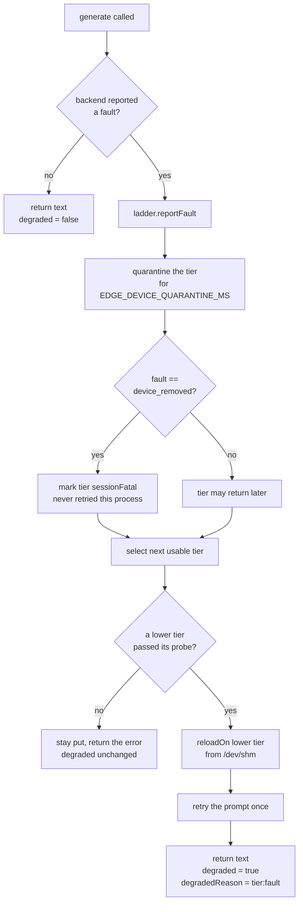
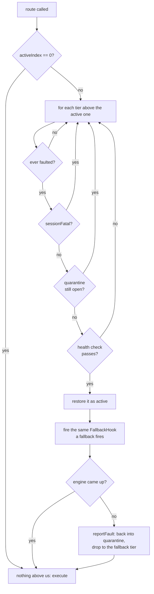
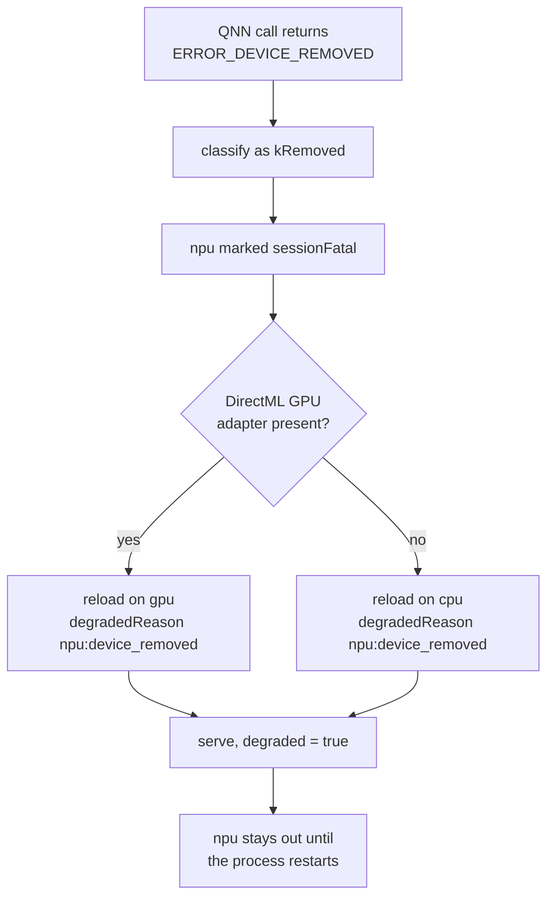
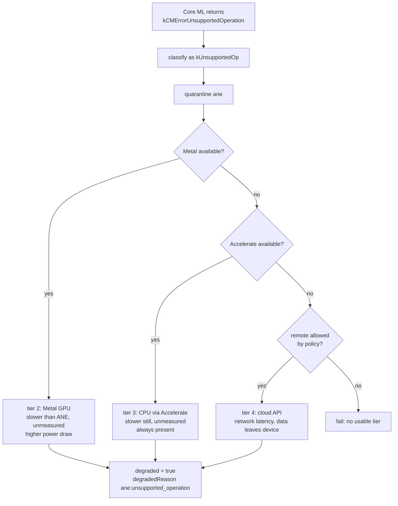

# Device fallback: Qualcomm NPU and Apple ANE

Both accelerators need the same contract, with different vendor error codes:

1. detect that the accelerator faulted,
2. fall to the next tier,
3. tell the client that latency changed, without changing the API contract,
4. do not go back to the faulted tier until a health check passes.

The code splits along that seam:

| File | Holds |
|---|---|
| [`deviceLadder.cpp`](../backend/inference-worker/deviceLadder.cpp) | **policy**: which tier, when to quarantine, when a tier may come back |
| [`deviceBackends.cpp`](../backend/inference-worker/deviceBackends.cpp) | **mechanism**: how to probe each accelerator, and how to read each vendor's error codes |
| [`inferenceBackend.cpp`](../backend/inference-worker/inferenceBackend.cpp) | **adapters**: the three-question interface each backend answers, and the Qualcomm and Core ML implementations |
| [`backendRouter.cpp`](../backend/inference-worker/backendRouter.cpp) | **routing**: which adapter runs this request, and how a vendor fault becomes the next tier |

Two companion documents. [build-matrix.md](build-matrix.md) covers the question underneath
all of this — which backends a given build can compile, load and execute at all, and why one
binary cannot hold CUDA, Metal and Hexagon together. Section 0 below covers the decision
made *before* any of this runs: how many workers this machine can carry, and which backend
each one starts on.

---

## 0. Before the ladder: the supervisor decides

The ladder above is what a worker does when its backend fails mid-session. It is not how a
worker gets its backend in the first place. That happens once, at boot, in the supervisor:

```text
hardware discovery -> resource calculation -> backend assignment -> worker startup -> inference
```

rather than the shape it replaces, where every worker started, every worker tried CUDA, and
they raced each other for VRAM.

**Discovery** runs in a short-lived `edge-inference-worker --probe-hardware` child that
prints one line of JSON and exits. It has to be a child: reaching a `ggml_backend_dev_t`
means building the backend registry, building the registry initializes CUDA, and this
llama.cpp cannot release a CUDA primary context in-process. A process that exits
immediately is the one place that cost is acceptable. The supervisor itself never links llama.

The child reports free and total VRAM through `ggml_backend_dev_memory` — `cudaMemGetInfo`
underneath, the same numbers `nvidia-smi` shows, correctly accounting for other processes on
the card. Host RAM comes from `/proc/meminfo`'s `MemAvailable`, deliberately not from ggml's
CPU device, which reports `free == total` on Linux and would size the pool off total RAM.
A probe that fails, times out or emits something unparseable is read as **no GPU**, never as
a guess.

**Capacity** is a pure function in [`capacityPlan.cpp`](../backend/hardware/capacityPlan.cpp):

```text
usable_gpu_mb       = max(0, free_vram_mb - EDGE_GPU_RESERVE_MB)
gpu_worker_capacity = min(EDGE_WORKER_COUNT, floor(usable_gpu_mb / EDGE_WORKER_GPU_MB))
cpu_worker_capacity = min(EDGE_WORKER_COUNT - gpu_worker_capacity,
                          floor(max(0, available_ram_mb - EDGE_RAM_RESERVE_MB) / EDGE_WORKER_RAM_MB))
workers_started     = max(1, min(EDGE_WORKER_COUNT, gpu_worker_capacity + cpu_worker_capacity))
```

That last line is the part that makes capacity a decision rather than a note in the log.
`EDGE_WORKER_COUNT` is the ceiling; the plan decides how much of it this machine can pay
for, and `startWorkers` counts to that. Starting a worker with no budget is how you get the
start, OOM-kill, restart, OOM-kill loop. The floor is one: a runtime that starts no worker
answers nothing, which is the worse failure, and the circuit breaker already bounds the cost
if that one worker does die.

Three numbers that are not the same number, and the reason this is worth spelling out:

```text
4 concurrent requests  !=  4 inference workers  !=  4 GPU workers
```

`EDGE_MAX_SLOTS` is the first one and belongs to the scheduler. Nothing here divides VRAM by
it. `EDGE_WORKER_GPU_MB` is a measured runtime budget, deliberately *not* derived from the
GGUF size: the weights live once in `/dev/shm` and every worker maps the same copy, so the
budget covers context, KV cache and compute buffers, which the file size says nothing about.

**Assignment** fills GPU slots first. On a 4 GB card with ~3.7 GB free, a 512 MB reserve and
a 2048 MB budget, that is one GPU slot:

```text
[supervisor] discovery probeOk=true gpus=1 note="ggml registered 1 gpu device(s)"
[supervisor] discovery gpu name=CUDA0 description="NVIDIA GeForce RTX 2050" totalVramMb=3770 freeVramMb=3604
[supervisor] discovery gpuReserveMb=512 workerGpuMb=2048 usableGpuMb=3092 gpuWorkerCapacity=1 reason="free 3604MB - reserve 512MB = 3092MB usable / 2048MB per worker"
[supervisor] discovery ramTotalMb=15656 ramAvailableMb=11234 ramReserveMb=1024 workerRamMb=1024 cpuWorkerCapacity=3 reason="available 11234MB - reserve 1024MB = 10210MB usable / 1024MB per worker"
[supervisor] discovery placeableWorkers=4 configuredWorkers=4 startingWorkers=4
[supervisor] assignment workerId=0 backend=cuda reason="gpu slot 1 of 1 (...)"
[supervisor] assignment workerId=1 backend=cpu reason="gpu capacity 1 already filled"
[supervisor] assignment workerId=2 backend=cpu reason="gpu capacity 1 already filled"
[supervisor] assignment workerId=3 backend=cpu reason="gpu capacity 1 already filled"
```

That block is captured supervisor output from this machine, from a run made while the card
still enumerated. It cannot be reproduced here now: the GPU has since gone into a
`[GPU requires reset]` state where `cuInit` returns `CUDA_ERROR_NO_DEVICE`, so discovery on
this host reports `gpus=0` and every worker is assigned `backend=cpu` with that reason.
Read it for what it is — discovery and assignment, the plan the supervisor made before any
worker ran. No CUDA worker has been observed serving a request here; the inference that has
been run end to end on this machine was on the CPU. One number in it is worth explaining
before someone files a bug about it. `nvidia-smi` reports this card as 4096 MiB total; the
probe reports 3770. Both are right: `ggml_backend_dev_memory` is `cudaMemGetInfo`, which reports the
memory available to a CUDA context and excludes what the driver has reserved for itself.
Planning against the smaller, honest number is the conservative direction.

### The CUDA guarantee, and exactly how far it goes

A CPU worker is CPU-only because it is started with **`CUDA_VISIBLE_DEVICES=-1`**, injected
between `fork` and `execvp`. That variable is read by the NVIDIA driver itself, below ggml:
with no visible device `ggml_cuda_init` sees `device_count == 0`, `ggml_backend_cuda_reg`
registers zero devices, and no primary context is ever created. `EDGE_WORKER_BACKEND=cpu`
rides along so the worker's own ladder and logs agree with the decision.

This is the only mechanism that works in this build. `n_gpu_layers = 0` prevents *offload*,
not *initialization*. `ggml_backend_unload` erases two vector entries and frees nothing on
the device. `GGML_BACKEND_DL` is impossible because `BUILD_SHARED_LIBS=OFF`. See
[build-matrix.md, section 3](build-matrix.md) for the evidence.

**And the honest limit.** Once a process has initialized CUDA, it holds that primary context
for good. `llama_free` and `llama_model_free` really do release the weights, the KV cache,
the compute buffers, every stream, every cuBLAS handle and the whole `ggml_cuda_pool` — but
not the context, and no API in this llama.cpp version can. So a worker that faults off
the GPU mid-session does this:

1. reports the fault, and the ladder falls to the next tier;
2. releases everything releasable and reloads on that tier, so the request in flight is
   still answered;
3. if the fall crossed from a device tier to the CPU *and* this process had touched CUDA,
   exits with code 70.

The supervisor treats 70 as a planned exit — no crash-log line, no circuit-breaker tick —
demotes that worker's assignment to CPU and respawns it with `CUDA_VISIBLE_DEVICES=-1`.
Process death is the teardown no API offers, and the restart is cheap because the weights
are still in `/dev/shm`.

`EDGE_DEVICE_FALLBACK_MODE=reload` turns the re-exec off. That is faster by one process
start, and it means the worker is CPU-*executing* rather than CPU-*only*, with the primary
context resident for the rest of its life. The trade is deliberate and is why the setting
exists rather than being hardcoded either way.

**Illustration, not a capture.** A real `cuda -> cpu` device fault has never been produced on
hardware here, so there is no recording of one. These are the four lines that sequence emits,
written out from the format strings in `Worker::onFallback`
(`backend/inference-worker/worker.cpp:336-368`) and `applyWorkerReassignment`
(`backend/supervisor/workerReassignment.cpp:53-56`):

```text
[worker] fallback previous=cuda error=runtime_error cleanup=released_model_and_context next=cpu state=CPU_AVAILABLE
[worker] device-class fallback cuda->cpu: cuda primary context is still resident and cannot be released in-process, exiting for reassignment as a cpu worker
[supervisor] fallback workerId=0 previous=cuda error=worker_requested_cpu_reassignment cleanup=released_model_and_context next=cpu
[supervisor] started worker 0 pid=<pid> backend=cpu
```

Section 7 shows the same path driven by `EDGE_SIMULATE_DEVICE_FAULT`, which is how it is
actually exercised here, and `edge-hardware-tests` drives the reassignment half of it against
`applyWorkerReassignment` with fork and exec injected.

Every backend compiles on every platform. A tier belonging to another OS reports
`wrong_platform` instead of being absent, so a ladder string copied from a Windows
deployment still parses, still selects, and still explains itself on Linux rather than
failing in a way nobody can read.

---

## 1. The shared mechanism



Three details that matter:

**Degraded is measured against a baseline, not against tier 0.** The first successful
selection records what this machine can actually offer. A laptop with no NPU is not
"degraded" for lacking one; a laptop that had an NPU and lost it is. Without that
baseline every CPU-only box would report degraded forever and the flag would carry no
information.

**A quarantine expiring is not enough to return a tier.** `DeviceLadder::select()` calls
`healthCheck()` on every candidate, and a tier whose probe fails stays out even after its
window closes. That is the "block retry until a driver health check passes" rule.

**`device_removed` ignores the quarantine entirely.** `ERROR_DEVICE_REMOVED` is unrecoverable
for the session, so that fault sets `sessionFatal` and the tier is gone until the worker
restarts.

### Recovery happens on the request path

Falling down the ladder is only half of it. `BackendRouter::route()` — which
`Worker::generateWithFallback` and `Worker::streamWithFallback` are the only callers of,
so every request a live worker serves goes through it — calls
`BackendRouter::attemptRecovery()` before it executes anything. That asks
`DeviceLadder::recoverEligibleTier()` whether a tier *above* the active one may come back:



There is one state machine, not two: recovery walks the same `DeviceLadder` gate a
fallback walks, in the other direction, and it reuses `reportFault` when a restored tier
turns out not to come up. A worker that fell to the CPU an hour ago now climbs back on
its next request instead of staying down until the supervisor respawns it.

**This is not a way around `sessionFatal`.** A `device_removed` tier is skipped by the
scan and stays skipped for the life of the process. Only `beginSession()` clears it, and
the only session boundary this runtime has is a new worker process.

**It does not cost a probe per request.** A worker sitting on its baseline tier returns
on an index comparison and touches nothing. A degraded worker skips, for free, every tier
that never faulted (an absent GPU is not a recovery candidate), every session-fatal tier,
and every tier still inside its window; only a tier genuinely out of quarantine is
probed, through the same cache `select()` uses, so it costs at most one probe per
`EDGE_DEVICE_PROBE_INTERVAL_MS` per tier.

**Direction matters to the worker, not just to the log.** `Worker::onTierChanged` fires
for both moves and tells them apart with `DeviceLadder::indexOf`. It has to: on a
`cuda,cpu,remote` ladder a `remote -> cpu` *recovery* has `next == "cpu"` and a resident
CUDA context, which is indistinguishable from a `cuda -> cpu` device-class *fallback* if
you only look at the tier names — and that fallback exits the worker for reassignment.
An upward move reloads the engine and logs
`[worker] recovery previous=... reason=health_check_passed cleanup=released_model_and_context next=...`;
only a downward one is charged the re-exec decision.

### The API contract does not change

A fallback adds fields, it never removes or renames any:

```json
{ "type": "result", "requestId": "...", "text": "...",
  "device": "cpu", "degraded": true, "degradedReason": "cuda:device_removed" }
```

`degradedReason` is absent when `degraded` is false. Over HTTP the same information also
rides on headers a client can read without parsing the body: `X-Inference-Device`,
`X-Inference-Degraded`, `X-Latency-Mode`, `X-Degraded-Reason`.

---

## 2. A3, Qualcomm NPU on Windows ARM64

Ladder: `EDGE_DEVICE_LADDER=npu,gpu,cpu`

| Step | Windows ARM64 | This Linux build |
|---|---|---|
| Probe | `IDXCoreAdapter` present and QNN backend loads | `access("/dev/nvidia0")` for the cuda tier |
| Fault source | QNN returns `ERROR_DEVICE_REMOVED` | `llama_decode` non-zero return |
| Escalation | npu to gpu to cpu | cuda to cpu |
| Health gate | re-enumerate the adapter before allowing npu back | re-probe the device node |



`ERROR_DEVICE_REMOVED` normally means the driver was reset or the device was surprise
removed. Re-enumerating inside the same process usually hands back a stale adapter, which
is why it is treated as unrecoverable for the session and why `sessionFatal` exists
rather than a longer quarantine.

**Cost of the fallback.** Dropping from NPU to CPU costs a large amount of throughput. How
large is not stated here, because nothing in this repository has measured it and there is no
Snapdragon part in reach to measure on — the ladder encodes the ordering, not a number. The
client is told through `X-Latency-Mode: degraded` so it can widen its own timeout rather than
treating the slower response as a hang. The scheduler's `EDGE_EXEC_TIMEOUT_MS` has to be set for the worst tier
on the ladder, not the best, or a legitimate CPU fallback gets killed as a stuck job.

---

## 3. A4, Apple Neural Engine on macOS

Ladder: `EDGE_DEVICE_LADDER=ane,metal,accelerate,remote`

`kCMErrorUnsupportedOperation` is a different animal from `ERROR_DEVICE_REMOVED`. The
device is healthy; it just cannot run this particular graph. Retrying the same op on the
same tier will fail identically forever, but a *different* model might be fine. So it maps
to `kUnsupportedOp`, which quarantines rather than kills the tier.



### Why this escalation order

| Tier | Chosen before | Because |
|---|---|---|
| ANE | everything | best tokens per joule; the reason the hardware exists |
| Metal | Accelerate | keeps work on-device and is expected to beat the CPU path, at a real power cost; the margin is unmeasured here |
| Accelerate | remote | slow, but local, private, and cannot fail from a dead network |
| remote | nothing | last resort: it breaks the on-device promise, so it is opt-in per deployment |

The remote tier is deliberately last and deliberately optional. An on-device runtime that
silently ships a user's meeting transcript to a cloud API on a driver hiccup would be a
worse failure than returning an error. So it is gated twice, and both gates are read on
every execute, not cached: `EDGE_SARVAM_API_KEY` or `EDGE_REMOTE_ENDPOINT` must give it
somewhere to send the prompt, **and** `EDGE_REMOTE_FALLBACK_ALLOWED=1` must record that
someone decided it may leave. Either one without the opt-in probes `policy_disabled` and
the tier is skipped. The two questions are kept apart on purpose: a credential sitting in
the environment for some other reason is not consent to send a transcript off the device.

`RemoteInferenceBackend` (in `inferenceBackend.cpp`, beside the Qualcomm and Core ML
adapters) is the adapter behind it. It is deliberately provider-neutral: it passes
`EDGE_REMOTE_ENDPOINT` through verbatim and never parses or rewrites it, and the network
call itself is a seam —

```
RemoteRequest { endpoint, prompt } -> RemoteTransport -> RemoteResponse { status, text, error }
```

— so a test drives it with a fake and never opens a socket. `faultFromRemoteStatus` maps
the reply into the same four `DeviceFault` buckets every other tier uses: `2xx` is
success, `400/413/415/422` is `kUnsupportedOp` (this request, not this endpoint),
`401/403/404` is `kUnavailable` (misconfigured, retrying will not help), and `0`,
`408`, `429` and `5xx` are `kRuntimeError`. Nothing maps to `kRemoved`: no HTTP status
means hardware vanished, and treating one that way would make remote session-fatal for a
passing 503.

**What fills the seam is the official Sarvam Node SDK, reached through a child process.**
The worker is C++ and cannot call a Node SDK in-process, so `makeRemoteTransport()`
spawns `backend/remote/sarvamTransport.js` the same way the supervisor spawns its
hardware probe: fork, exec, poll to a deadline, `SIGKILL` what overruns it. One JSON
request goes in on stdin, one JSON response line comes back on stdout, and the child dies
with the request. Writing is polled too, so a child that never reads its stdin cannot
wedge the worker on a large prompt. That beats hand-rolling an HTTP client and guessing a
response schema — the vendor's own client owns both — at the cost of one process per
remote call, which is a rung reached only after every local tier has already failed.

Without `EDGE_SARVAM_API_KEY` there is no transport at all: `makeRemoteTransport()`
returns empty rather than building one that fails per request, so a configured tier
refuses by name before anything is forked. The child maps its own failures onto the same
status vocabulary — `401` for a missing key, the SDK's `statusCode` for a typed API
error, `504` for `SarvamAITimeoutError`, `0` for a call that never reached a server — and
the parent adds `504` when it has to kill a hung child. Model, temperature, `top_p` and
`max_tokens` come from `EDGE_SARVAM_*`, and the SDK's own retry is turned off because the
ladder owns retry and a hidden one inside a rung hides the fault.

**No live call to Sarvam has been made.** Every test drives either the injected
`RemoteTransport` fake, a fake child script in place of node, or the helper against a
stubbed SDK module.

Ownership: the adapter implements `GpuResourceOwner` like the engine does, rather
than inventing a second cleanup vocabulary. What it owns is a transport session, and
unlike the CUDA primary context there is nothing here this process cannot free — every
call releases before it returns, on success, on failure and on a throw, and so does the
destructor.

---

## 4. The tier catalogue

Every name `EDGE_DEVICE_LADDER` accepts, and what its probe actually checks:

| Tier | Platform | Probe checks | Notes |
|---|---|---|---|
| `cpu` | any | nothing | always available, the floor of every ladder |
| `cuda` | linux, windows | `/dev/nvidiactl` and `/dev/nvidia0`, or `nvcuda.dll` loads | |
| `rocm` | linux | `/dev/kfd` | AMD |
| `vulkan` | linux, windows | a DRI render node **and** `libvulkan`, or `vulkan-1.dll` | portable GPU compute |
| `npu` | windows | `QnnHtp.dll` **and** `dxcore.dll` both load | A3's Qualcomm Hexagon NPU |
| `directml` / `gpu` | windows | `DirectML.dll` and `d3d12.dll` load | the Windows tier below the NPU |
| `ane` | macos | `CoreML.framework` **and** an ANE service | A4's Neural Engine. An Intel Mac has the framework but no engine, so both are checked |
| `metal` | macos | `Metal.framework` | |
| `accelerate` | macos | `Accelerate.framework` | |
| `remote` | any | `EDGE_SARVAM_API_KEY` or `EDGE_REMOTE_ENDPOINT` set **and** `EDGE_REMOTE_FALLBACK_ALLOWED=1` | off unless both are true |

A probe answers *why*, not just no, and `/health` carries the reason:
`available`, `wrong_platform`, `runtime_missing`, `device_missing`, `policy_disabled`.

Each tier also carries a `state`, which is the same information collapsed into one word. It is a projection of the probe result plus the ladder's quarantine and
session-fatal marks, not a second enum: two sources of truth about whether a tier is usable
would be one too many.

| State | Means |
|---|---|
| `CPU_AVAILABLE`, `GPU_AVAILABLE`, `NPU_AVAILABLE`, `ANE_AVAILABLE`, `REMOTE_AVAILABLE` | probes available and is not benched |
| `GPU_UNAVAILABLE`, `NPU_UNAVAILABLE`, ... | the probe says no: wrong platform, missing runtime, missing device, or disabled by policy |
| `NPU_UNHEALTHY`, `GPU_UNHEALTHY`, ... | quarantined or session-fatal after a fault |
| `ANE_UNSUPPORTED`, ... | benched specifically by `kUnsupportedOp`: the device is healthy, this graph is not |

A benched tier is not re-probed per request. `probeTierCached` reuses a result for
`EDGE_DEVICE_PROBE_INTERVAL_MS`, and a session-fatal tier is skipped without probing at all.

```json
{"name":"npu","faults":0,"sessionFatal":false,"quarantineMsLeft":0,
 "healthy":false,"probe":"wrong_platform","state":"NPU_UNAVAILABLE","platform":"windows"}
```

Two probes deliberately check more than one thing. `npu` requires both the QNN backend
library and DXCore, because a half-installed vendor runtime is exactly the case that turns
into a device fault on the first inference instead of a clean refusal at startup. `ane`
requires the framework and the hardware service for the same reason.

## 5. Vendor error codes

The mapping is the reviewable part of A3 and A4, so none of it sits behind a platform
`#if`. It answers one question: is this tier gone for the session, merely unable to run
this graph, or transiently broken.

| Vendor code | Maps to | Why |
|---|---|---|
| `DXGI_ERROR_DEVICE_REMOVED` (0x887A0005) | `kRemoved` | session-fatal |
| `DXGI_ERROR_DEVICE_HUNG` (0x887A0006) | `kRemoved` | the device object stays invalid after a reset |
| `DXGI_ERROR_DEVICE_RESET` (0x887A0007) | `kRemoved` | same |
| `DXGI_ERROR_UNSUPPORTED` (0x887A0004) | `kUnsupportedOp` | quarantine, do not kill |
| `ERROR_DEVICE_REMOVED` (1617) | `kRemoved` | the Win32 form A3 names |
| `ERROR_DEVICE_NOT_CONNECTED` (1167) | `kUnavailable` | never came up |
| `ERROR_NOT_SUPPORTED` (50) | `kUnsupportedOp` | |
| QNN device family (5xxx) | `kRemoved` | |
| QNN graph family (3xxx) | `kUnsupportedOp` | this graph, not this device |
| CoreMedia `-12xxx`, including `kCMErrorUnsupportedOperation` | `kUnsupportedOp` | |
| Core ML `MLModelError` feature/decryption/collection | `kUnsupportedOp` | |

Note the asymmetry, because it is the whole point of having two codes. Nothing Apple
returns maps to `kRemoved`. `kCMErrorUnsupportedOperation` means the device is healthy and
just cannot run this graph, so the tier is quarantined and a different model may use it
again. `ERROR_DEVICE_REMOVED` means the adapter is gone, so the tier is dead for the
session.

**Accuracy note.** The DXGI and Win32 constants above are stable documented values and are
compiled in. The QNN and Core ML numeric constants are not reproduced from memory: those
two functions dispatch on values a Windows-ARM64 or macOS build must supply from the real
vendor header. The mapping, which is the design decision, is complete and tested.

## 6. What is and is not implemented

| Piece | State |
|---|---|
| Supervisor-side hardware discovery through a short-lived probe child | implemented |
| GPU and CPU capacity calculation, and per-worker backend assignment | implemented |
| CPU workers started with no visible CUDA device | implemented |
| Releasing the model, context and CUDA pool on a fallback | implemented |
| Full in-process CUDA primary-context teardown | **not possible at this llama.cpp version**: the worker re-execs instead, see section 0 |
| Injectable backend adapters for Qualcomm/Hexagon and Core ML/ANE | implemented, and both refuse to execute in this build |
| Per-tier probes for all 11 tiers, including npu, ane, metal, accelerate | implemented |
| Vendor error code translation (DXGI, Win32, QNN families, CoreMedia, Core ML) | implemented |
| Probe reasons surfaced in `/health` | implemented |
| Fault classification enum (`kRemoved`, `kUnsupportedOp`, ...) | implemented |
| Escalation down a configurable ladder | implemented |
| Quarantine window per tier | implemented |
| Health-check gate before a tier returns | implemented |
| `device_removed` as session-fatal | implemented |
| Degraded signalling relative to a baseline | implemented |
| Mid-inference fallback with one retry on the lower tier | implemented |
| Reload from `/dev/shm` rather than a cold model load | implemented |
| Actually running inference on QNN, Core ML, Metal or Accelerate | **not implemented**: needs the vendor SDK and the hardware |
| Health-check-gated recovery reachable from production | implemented: `BackendRouter::route()` -> `attemptRecovery()` |
| The `remote` tier adapter, policy gate, status mapping and ownership | implemented |
| An HTTP client behind the `remote` tier | **not implemented on purpose**: `makeRemoteTransport()` ships empty and the adapter reports `runtime_missing`. The seam is real; a deployment plugs its own client in. No real external service has been tested |

A tier named in `EDGE_DEVICE_LADDER` whose backend does not exist simply fails its probe
and is skipped, so declaring `npu,cuda,cpu` on this Linux box selects `cuda` and reports
**not degraded**, which is the correct answer.

## 7. Exercising the path without the hardware

A real device removal cannot be produced here, so the fault is injectable:

```bash
EDGE_SIMULATE_DEVICE_FAULT=cuda:removed  # ERROR_DEVICE_REMOVED on cuda, session-fatal
EDGE_SIMULATE_DEVICE_FAULT=unsupported   # kCMErrorUnsupportedOperation, quarantine
EDGE_SIMULATE_DEVICE_FAULT=runtime       # generic backend fault, quarantine
```

The value is `[<tier>:]<fault>`, and it fires at most once per worker. Without a tier it faults
whichever tier runs first. A `cuda:` target never touches a respawned cpu worker, which inherits
the same environment.

With `EDGE_DEVICE_LADDER=cuda,cpu` and `EDGE_SIMULATE_DEVICE_FAULT=cuda:removed`, a worker
answers:

```json
{"type":"result","requestId":"probe-1","text":"...",
 "device":"cpu","degraded":true,"degradedReason":"cuda:device_removed"}
```

and logs:

```
[device-ladder] cuda faulted (device_removed): EDGE_SIMULATE_DEVICE_FAULT [unrecoverable for this session]
[device-ladder] fell back to cpu, latency mode degraded
```

The fallback is a real one: the cpu tier serves that same request and every one after it.
Unset, the variable costs one `getenv` per generate call and nothing else.
