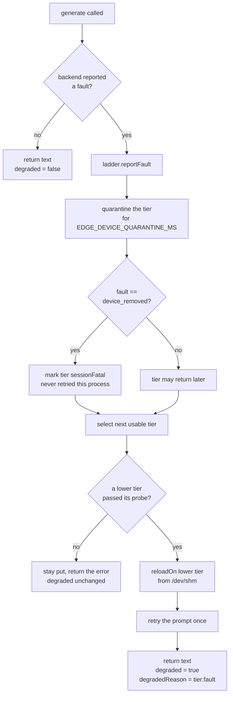
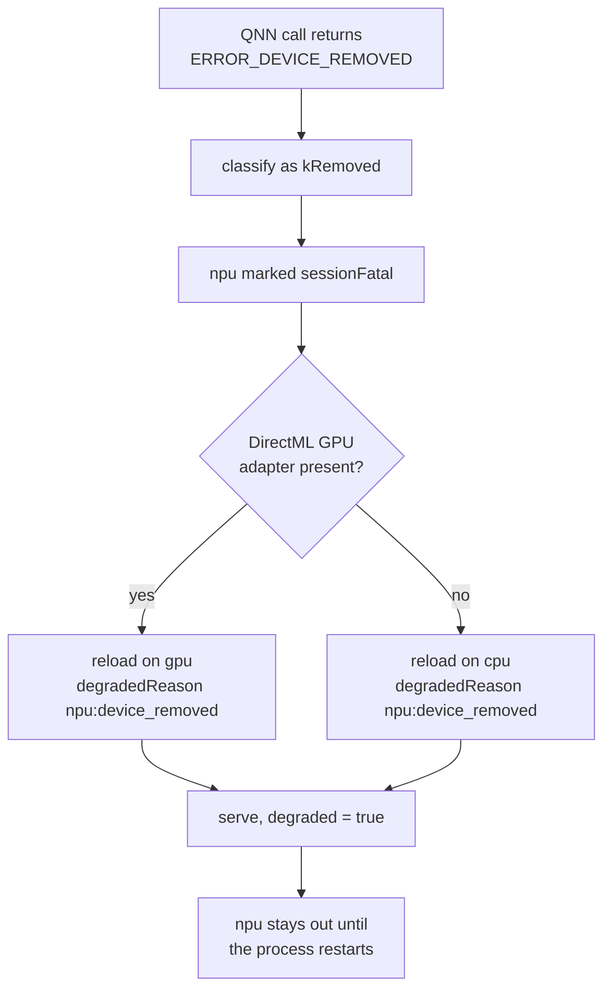
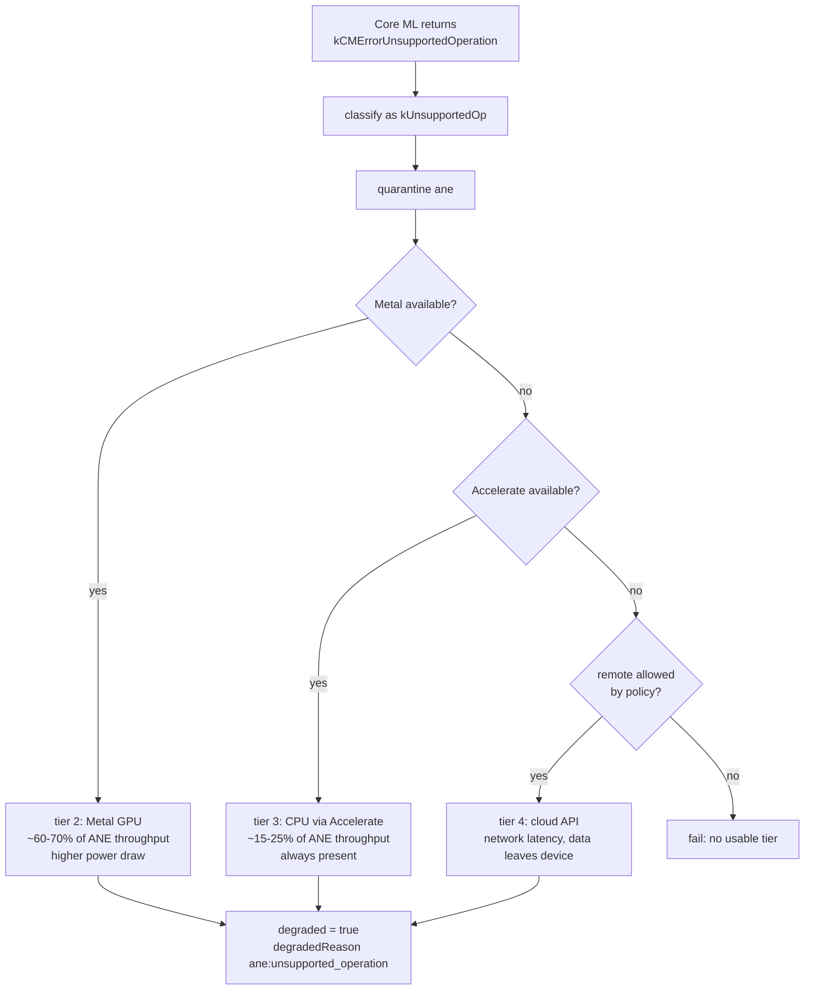

# Device fallback: answers to A3 (Qualcomm NPU) and A4 (Apple ANE)

Both questions describe the same contract with different vendor error codes:

1. detect that the accelerator faulted,
2. fall to the next tier,
3. tell the client that latency changed, without changing the API contract,
4. do not go back to the faulted tier until a health check passes.

The code splits along that seam:

| File | Holds |
|---|---|
| [`deviceLadder.cpp`](../backend/inference-worker/deviceLadder.cpp) | **policy**: which tier, when to quarantine, when a tier may come back |
| [`deviceBackends.cpp`](../backend/inference-worker/deviceBackends.cpp) | **mechanism**: how to probe each accelerator, and how to read each vendor's error codes |

Every backend compiles on every platform. A tier belonging to another OS reports
`wrong_platform` instead of being absent, so a ladder string copied from a Windows
deployment still parses, still selects, and still explains itself on Linux rather than
failing in a way nobody can read.

---

## 1. The shared mechanism



Three details that matter:

**Degraded is measured against a baseline, not against tier 0.** The first successful
selection records what this machine can actually offer. A laptop with no NPU is not
"degraded" for lacking one; a laptop that had an NPU and lost it is. Without that
baseline every CPU-only box would report degraded forever and the flag would carry no
information.

**A quarantine expiring is not enough to return a tier.** `DeviceLadder::select()` calls
`healthCheck()` on every candidate, and a tier whose probe fails stays out even after its
window closes. That is the brief's "block retry until a driver health check passes".

**`device_removed` ignores the quarantine entirely.** The brief defines
`ERROR_DEVICE_REMOVED` as unrecoverable for the session, so that fault sets
`sessionFatal` and the tier is gone until the worker restarts.

### The API contract does not change

A fallback adds fields, it never removes or renames any:

```json
{ "type": "result", "requestId": "...", "text": "...",
  "device": "cpu", "degraded": true, "degradedReason": "cuda:device_removed" }
```

`degradedReason` is absent when `degraded` is false. Over HTTP the same information also
rides on headers a client can read without parsing the body: `X-Inference-Device`,
`X-Inference-Degraded`, `X-Latency-Mode`, `X-Degraded-Reason`.

---

## 2. A3, Qualcomm NPU on Windows ARM64

Ladder: `EDGE_DEVICE_LADDER=npu,gpu,cpu`

| Step | Windows ARM64 | This Linux build |
|---|---|---|
| Probe | `IDXCoreAdapter` present and QNN backend loads | `access("/dev/nvidia0")` for the cuda tier |
| Fault source | QNN returns `ERROR_DEVICE_REMOVED` | `llama_decode` non-zero return |
| Escalation | npu to gpu to cpu | cuda to cpu |
| Health gate | re-enumerate the adapter before allowing npu back | re-probe the device node |



`ERROR_DEVICE_REMOVED` normally means the driver was reset or the device was surprise
removed. Re-enumerating inside the same process usually hands back a stale adapter, which
is why the brief calls it unrecoverable for the session and why `sessionFatal` exists
rather than a longer quarantine.

**Cost of the fallback.** Dropping from NPU to CPU on a Snapdragon X class part is roughly
an order of magnitude on tokens per second for a 4-bit 3B model. The client is told through
`X-Latency-Mode: degraded` so it can widen its own timeout rather than treating the slower
response as a hang. The scheduler's `EDGE_EXEC_TIMEOUT_MS` has to be set for the worst tier
on the ladder, not the best, or a legitimate CPU fallback gets killed as a stuck job.

---

## 3. A4, Apple Neural Engine on macOS

Ladder: `EDGE_DEVICE_LADDER=ane,metal,accelerate,remote`

`kCMErrorUnsupportedOperation` is a different animal from `ERROR_DEVICE_REMOVED`. The
device is healthy; it just cannot run this particular graph. Retrying the same op on the
same tier will fail identically forever, but a *different* model might be fine. So it maps
to `kUnsupportedOp`, which quarantines rather than kills the tier.



### Why this escalation order

| Tier | Chosen before | Because |
|---|---|---|
| ANE | everything | best tokens per joule; the reason the hardware exists |
| Metal | Accelerate | keeps work on-device and is roughly 3x the CPU path, at a real power cost |
| Accelerate | remote | slow, but local, private, and cannot fail from a dead network |
| remote | nothing | last resort: it breaks the on-device promise, so it is opt-in per deployment |

The remote tier is deliberately last and deliberately optional. An on-device runtime that
silently ships a user's meeting transcript to a cloud API on a driver hiccup would be a
worse failure than returning an error. In this codebase it is a tier name that no probe
accepts, so it never activates unless someone implements `probeTier("remote")` and makes
that policy decision explicitly.

---

## 4. The tier catalogue

Every name `EDGE_DEVICE_LADDER` accepts, and what its probe actually checks:

| Tier | Platform | Probe checks | Notes |
|---|---|---|---|
| `cpu` | any | nothing | always available, the floor of every ladder |
| `cuda` | linux, windows | `/dev/nvidiactl` and `/dev/nvidia0`, or `nvcuda.dll` loads | |
| `rocm` | linux | `/dev/kfd` | AMD |
| `vulkan` | linux, windows | a DRI render node **and** `libvulkan`, or `vulkan-1.dll` | portable GPU compute |
| `npu` | windows | `QnnHtp.dll` **and** `dxcore.dll` both load | A3's Qualcomm Hexagon NPU |
| `directml` / `gpu` | windows | `DirectML.dll` and `d3d12.dll` load | the Windows tier below the NPU |
| `ane` | macos | `CoreML.framework` **and** an ANE service | A4's Neural Engine. An Intel Mac has the framework but no engine, so both are checked |
| `metal` | macos | `Metal.framework` | |
| `accelerate` | macos | `Accelerate.framework` | |
| `remote` | any | `EDGE_REMOTE_ENDPOINT` set **and** `EDGE_REMOTE_FALLBACK_ALLOWED=1` | off unless both are true |

A probe answers *why*, not just no, and `/health` carries the reason:
`available`, `wrong_platform`, `runtime_missing`, `device_missing`, `policy_disabled`.

```json
{"name":"npu","healthy":false,"probe":"wrong_platform","platform":"windows",
 "faults":0,"sessionFatal":false,"quarantineMsLeft":0}
```

Two probes deliberately check more than one thing. `npu` requires both the QNN backend
library and DXCore, because a half-installed vendor runtime is exactly the case that turns
into a device fault on the first inference instead of a clean refusal at startup. `ane`
requires the framework and the hardware service for the same reason.

## 5. Vendor error codes

The mapping is the reviewable part of A3 and A4, so none of it sits behind a platform
`#if`. It answers one question: is this tier gone for the session, merely unable to run
this graph, or transiently broken.

| Vendor code | Maps to | Why |
|---|---|---|
| `DXGI_ERROR_DEVICE_REMOVED` (0x887A0005) | `kRemoved` | session-fatal |
| `DXGI_ERROR_DEVICE_HUNG` (0x887A0006) | `kRemoved` | the device object stays invalid after a reset |
| `DXGI_ERROR_DEVICE_RESET` (0x887A0007) | `kRemoved` | same |
| `DXGI_ERROR_UNSUPPORTED` (0x887A0004) | `kUnsupportedOp` | quarantine, do not kill |
| `ERROR_DEVICE_REMOVED` (1617) | `kRemoved` | the Win32 form the brief names |
| `ERROR_DEVICE_NOT_CONNECTED` (1167) | `kUnavailable` | never came up |
| `ERROR_NOT_SUPPORTED` (50) | `kUnsupportedOp` | |
| QNN device family (5xxx) | `kRemoved` | |
| QNN graph family (3xxx) | `kUnsupportedOp` | this graph, not this device |
| CoreMedia `-12xxx`, including `kCMErrorUnsupportedOperation` | `kUnsupportedOp` | |
| Core ML `MLModelError` feature/decryption/collection | `kUnsupportedOp` | |

Note the asymmetry, because it is the whole point of having two codes. Nothing Apple
returns maps to `kRemoved`. `kCMErrorUnsupportedOperation` means the device is healthy and
just cannot run this graph, so the tier is quarantined and a different model may use it
again. `ERROR_DEVICE_REMOVED` means the adapter is gone, so the tier is dead for the
session.

**Accuracy note.** The DXGI and Win32 constants above are stable documented values and are
compiled in. The QNN and Core ML numeric constants are not reproduced from memory: those
two functions dispatch on values a Windows-ARM64 or macOS build must supply from the real
vendor header. The mapping, which is the design decision, is complete and tested.

## 6. What is and is not implemented

| Piece | State |
|---|---|
| Per-tier probes for all 11 tiers, including npu, ane, metal, accelerate | implemented |
| Vendor error code translation (DXGI, Win32, QNN families, CoreMedia, Core ML) | implemented |
| Probe reasons surfaced in `/health` | implemented |
| Fault classification enum (`kRemoved`, `kUnsupportedOp`, ...) | implemented |
| Escalation down a configurable ladder | implemented |
| Quarantine window per tier | implemented |
| Health-check gate before a tier returns | implemented |
| `device_removed` as session-fatal | implemented |
| Degraded signalling relative to a baseline | implemented |
| Mid-inference fallback with one retry on the lower tier | implemented |
| Reload from `/dev/shm` rather than a cold model load | implemented |
| Actually running inference on QNN, Core ML, Metal or Accelerate | **not implemented**: needs the vendor SDK and the hardware |
| The HTTP client behind the `remote` tier | **not implemented**: the probe and policy gate exist, the call does not |

A tier named in `EDGE_DEVICE_LADDER` whose backend does not exist simply fails its probe
and is skipped, so declaring `npu,cuda,cpu` on this Linux box selects `cuda` and reports
**not degraded**, which is the correct answer.

## 7. Exercising the path without the hardware

A real device removal cannot be produced here, so the fault is injectable:

```bash
EDGE_SIMULATE_DEVICE_FAULT=removed      # ERROR_DEVICE_REMOVED, session-fatal
EDGE_SIMULATE_DEVICE_FAULT=unsupported  # kCMErrorUnsupportedOperation, quarantine
EDGE_SIMULATE_DEVICE_FAULT=runtime      # generic backend fault, quarantine
```

With `EDGE_DEVICE_LADDER=cuda,cpu` and `EDGE_SIMULATE_DEVICE_FAULT=removed`, a worker
answers:

```json
{"type":"result","requestId":"probe-1","text":"...",
 "device":"cpu","degraded":true,"degradedReason":"cuda:device_removed"}
```

and logs:

```
[device-ladder] cuda faulted (device_removed): EDGE_SIMULATE_DEVICE_FAULT [unrecoverable for this session]
[device-ladder] fell back to cpu, latency mode degraded
```

Unset, the variable costs one `getenv` per generate call and nothing else.
