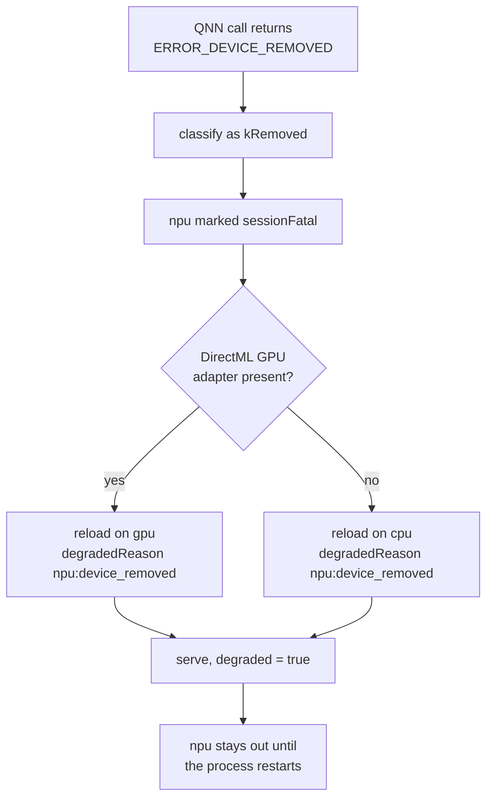
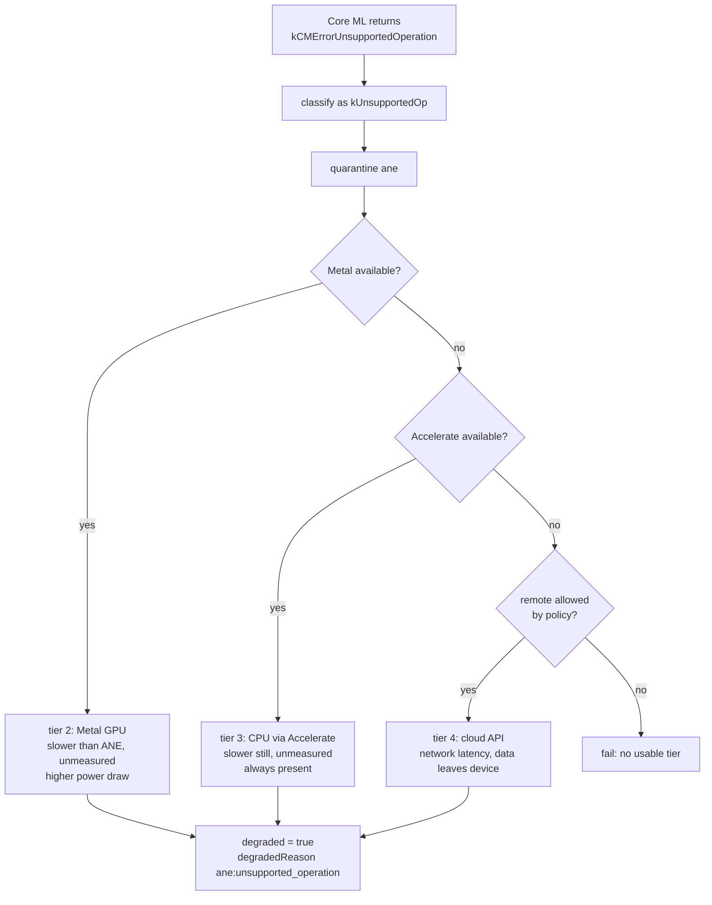

# Platform accelerators: the Qualcomm NPU and the Apple ANE

This is the deep dive behind [13-device-fallback.md](13-device-fallback.md). That document
covers the ladder mechanism, which works the same way for every tier. This one covers what a
tier actually is: every name `EDGE_DEVICE_LADDER` accepts, what each probe checks, and how each
vendor's error codes are read.

Two accelerators drive most of the design here, the Qualcomm Hexagon NPU on Windows ARM64 and
the Apple Neural Engine on macOS. Neither has ever run on this machine. What is implemented and
tested is the policy around them: the probes, the error mapping, and the escalation order. That
distinction is kept throughout, because a mapping table is not hardware validation.

Both accelerators need the same four things, with different vendor error codes:

1. detect that the accelerator faulted,
2. fall to the next tier,
3. tell the client that latency changed, without changing the API contract,
4. do not go back to the faulted tier until a health check passes.

## Where this sits

| File | Holds |
|---|---|
| [deviceLadder.cpp](../backend/inference-worker/deviceLadder.cpp) | **policy**: which tier, when to quarantine, when a tier may come back |
| [deviceBackends.cpp](../backend/inference-worker/deviceBackends.cpp) | **mechanism**: how to probe each accelerator, and how to read each vendor's error codes |
| [inferenceBackend.cpp](../backend/inference-worker/inferenceBackend.cpp) | **adapters**: the three-question interface each backend answers, plus the Qualcomm and Core ML implementations |
| [backendRouter.cpp](../backend/inference-worker/backendRouter.cpp) | **routing**: which adapter runs this request, and how a vendor fault becomes the next tier |

Three related documents, none of which this one repeats:

- [12-hardware-capacity.md](12-hardware-capacity.md): how a worker gets its backend in the
  first place, before `execvp`.
- [13-device-fallback.md](13-device-fallback.md): quarantine, the health gate, `degraded`,
  recovery, and the exit-70 reassignment.
- [build-matrix.md](build-matrix.md): why neither accelerator can be compiled into this build.

Every backend compiles on every platform. A tier belonging to another OS reports
`wrong_platform` instead of being absent, so a ladder string copied from a Windows deployment
still parses, still selects, and still explains itself on Linux rather than failing in a way
nobody can read.

## The tier catalogue

Every name `EDGE_DEVICE_LADDER` accepts, and what its probe actually checks:

| Tier | Platform | Probe checks | Notes |
|---|---|---|---|
| `cpu` | any | nothing | always available, the floor of every ladder |
| `cuda` | linux, windows | `/dev/nvidiactl` and `/dev/nvidia0`, or `nvcuda.dll` loads | |
| `rocm` | linux | `/dev/kfd` | AMD |
| `vulkan` | linux, windows | a DRI render node **and** `libvulkan`, or `vulkan-1.dll` | portable GPU compute |
| `npu` | windows | `QnnHtp.dll` **and** `dxcore.dll` both load | the Qualcomm Hexagon NPU |
| `directml` / `gpu` | windows | `DirectML.dll` and `d3d12.dll` load | the Windows tier below the NPU |
| `ane` | macos | `CoreML.framework` **and** an ANE service | the Neural Engine. An Intel Mac has the framework but no engine, so both are checked |
| `metal` | macos | `Metal.framework` | |
| `accelerate` | macos | `Accelerate.framework` | |
| `remote` | any | `EDGE_SARVAM_API_KEY` or `EDGE_REMOTE_ENDPOINT` set **and** `EDGE_REMOTE_FALLBACK_ALLOWED=1` | off unless both are true. See [15-remote-fallback.md](15-remote-fallback.md) |

A probe answers *why*, not just no, and `/health` carries the reason: `available`,
`wrong_platform`, `runtime_missing`, `device_missing` or `policy_disabled`.

Each tier also carries a `state`, which is the same information collapsed into one word. It is
a projection of the probe result plus the ladder's quarantine and session-fatal marks, not a
second enum. Two sources of truth about whether a tier is usable would be one too many.

| State | Means |
|---|---|
| `CPU_AVAILABLE`, `GPU_AVAILABLE`, `NPU_AVAILABLE`, `ANE_AVAILABLE`, `REMOTE_AVAILABLE` | probes available and is not benched |
| `GPU_UNAVAILABLE`, `NPU_UNAVAILABLE`, … | the probe says no: wrong platform, missing runtime, missing device, or disabled by policy |
| `NPU_UNHEALTHY`, `GPU_UNHEALTHY`, … | quarantined or session-fatal after a fault |
| `ANE_UNSUPPORTED`, … | benched specifically by `kUnsupportedOp`: the device is healthy, this graph is not |

One tier as it appears in `/health` on this Linux box:

```json
{"name":"npu","faults":0,"sessionFatal":false,"quarantineMsLeft":0,
 "healthy":false,"probe":"wrong_platform","state":"NPU_UNAVAILABLE","platform":"windows"}
```

A benched tier is not re-probed per request. `probeTierCached` reuses a result for
`EDGE_DEVICE_PROBE_INTERVAL_MS`, and a session-fatal tier is skipped without probing at all.

Two probes deliberately check more than one thing. `npu` requires both the QNN backend library
and DXCore, because a half-installed vendor runtime is exactly the case that turns into a
device fault on the first inference instead of a clean refusal at startup. `ane` requires the
framework and the hardware service for the same reason.

## Qualcomm NPU on Windows ARM64

Ladder: `EDGE_DEVICE_LADDER=npu,gpu,cpu`

| Step | Windows ARM64 | This Linux build |
|---|---|---|
| Probe | `IDXCoreAdapter` present and QNN backend loads | `access("/dev/nvidia0")` for the cuda tier |
| Fault source | QNN returns `ERROR_DEVICE_REMOVED` | `llama_decode` non-zero return |
| Escalation | npu to gpu to cpu | cuda to cpu |
| Health gate | re-enumerate the adapter before allowing npu back | re-probe the device node |



`ERROR_DEVICE_REMOVED` normally means the driver was reset or the device was surprise removed.
Re-enumerating inside the same process usually hands back a stale adapter, which is why it is
treated as unrecoverable for the session and why `sessionFatal` exists rather than a longer
quarantine.

**Cost of the fallback.** Dropping from NPU to CPU costs a large amount of throughput. How
large is not stated here, because nothing in this repository has measured it and there is no
Snapdragon part in reach to measure on. The ladder encodes the ordering, not a number. The
client is told through `X-Latency-Mode: degraded` so it can widen its own timeout rather than
treating the slower response as a hang. `EDGE_EXEC_TIMEOUT_MS` has to be set for the worst tier
on the ladder, not the best, or a legitimate CPU fallback gets killed as a stuck job.

## Apple Neural Engine on macOS

Ladder: `EDGE_DEVICE_LADDER=ane,metal,accelerate,remote`

`kCMErrorUnsupportedOperation` is a different animal from `ERROR_DEVICE_REMOVED`. The device is
healthy, it just cannot run this particular graph. Retrying the same op on the same tier will
fail identically forever, but a *different* model might be fine. So it maps to
`kUnsupportedOp`, which quarantines the tier rather than killing it.



### Why this escalation order

| Tier | Chosen before | Because |
|---|---|---|
| ANE | everything | best tokens per joule, the reason the hardware exists |
| Metal | Accelerate | keeps work on-device and is expected to beat the CPU path, at a real power cost. The margin is unmeasured here |
| Accelerate | remote | slow, but local, private, and cannot fail from a dead network |
| remote | nothing | last resort. It breaks the on-device promise, so it is opt-in per deployment |

The remote tier is deliberately last and deliberately optional. An on-device runtime that
silently ships a user's meeting transcript to a cloud API on a driver hiccup would be a worse
failure than returning an error. It is gated twice, and the gates, the transport and the wire
format are all in [15-remote-fallback.md](15-remote-fallback.md).

## Vendor error codes

This mapping is the reviewable part of both accelerators, so none of it sits behind a platform
`#if`. It answers one question: is this tier gone for the session, merely unable to run this
graph, or transiently broken.

| Vendor code | Maps to | Why |
|---|---|---|
| `DXGI_ERROR_DEVICE_REMOVED` (0x887A0005) | `kRemoved` | session-fatal |
| `DXGI_ERROR_DEVICE_HUNG` (0x887A0006) | `kRemoved` | the device object stays invalid after a reset |
| `DXGI_ERROR_DEVICE_RESET` (0x887A0007) | `kRemoved` | same |
| `DXGI_ERROR_UNSUPPORTED` (0x887A0004) | `kUnsupportedOp` | quarantine, do not kill |
| `ERROR_DEVICE_REMOVED` (1617) | `kRemoved` | the Win32 form |
| `ERROR_DEVICE_NOT_CONNECTED` (1167) | `kUnavailable` | never came up |
| `ERROR_NOT_SUPPORTED` (50) | `kUnsupportedOp` | |
| QNN device family (5xxx) | `kRemoved` | |
| QNN graph family (3xxx) | `kUnsupportedOp` | this graph, not this device |
| CoreMedia −12xxx, including `kCMErrorUnsupportedOperation` | `kUnsupportedOp` | |
| Core ML `MLModelError` feature, decryption, collection | `kUnsupportedOp` | |

Note the asymmetry, because it is the whole point of having two codes. Nothing Apple returns
maps to `kRemoved`. `kCMErrorUnsupportedOperation` means the device is healthy and just cannot
run this graph, so the tier is quarantined and a different model may use it again.
`ERROR_DEVICE_REMOVED` means the adapter is gone, so the tier is dead for the session.

`kCMErrorUnsupportedOperation` is not an Apple SDK identifier.
[build-matrix.md](build-matrix.md) records what it really is and why the code keeps the name
anyway.

**Accuracy note.** The DXGI and Win32 constants above are stable documented values and are
compiled in. The QNN and Core ML numeric constants are not reproduced from memory: those two
functions dispatch on values a Windows-ARM64 or macOS build must supply from the real vendor
header. The mapping, which is the design decision, is complete and tested.

## What is and is not implemented

Scoped to the two accelerators. The ladder mechanics they sit on are in
[13-device-fallback.md](13-device-fallback.md).

| Piece | State |
|---|---|
| Per-tier probes for all 11 tiers, including `npu`, `ane`, `metal`, `accelerate` | implemented |
| Probe reasons carried through to `/health` | implemented |
| Vendor error translation (DXGI, Win32, QNN families, CoreMedia, Core ML) | implemented |
| Injectable adapters for Qualcomm/Hexagon and Core ML/ANE | implemented, and both refuse to execute in this build |
| A build-gated route from the Hexagon adapter into the engine | implemented, compiled in every build, never reachable here. See [build-matrix.md](build-matrix.md) |
| Actually running inference on QNN, Core ML, Metal or Accelerate | **not implemented**: needs the vendor SDK and the hardware |

A tier named in `EDGE_DEVICE_LADDER` whose backend does not exist simply fails its probe and is
skipped. Declaring `npu,cuda,cpu` on this Linux box selects `cuda` and reports **not degraded**,
which is the correct answer.
