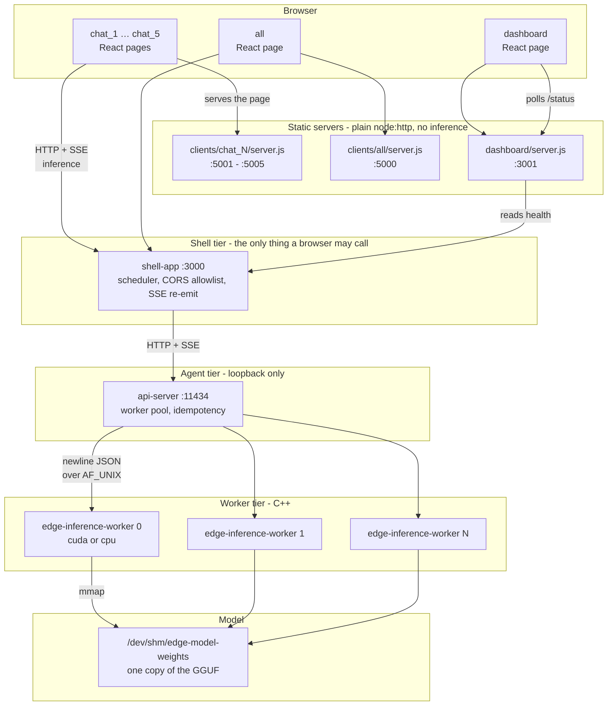
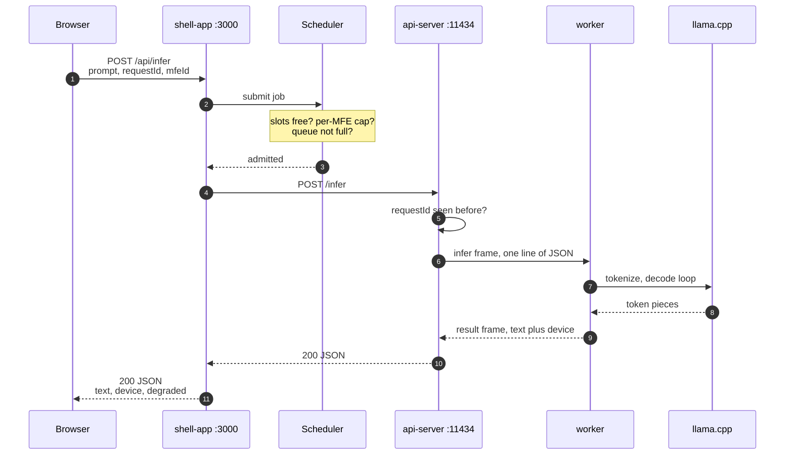
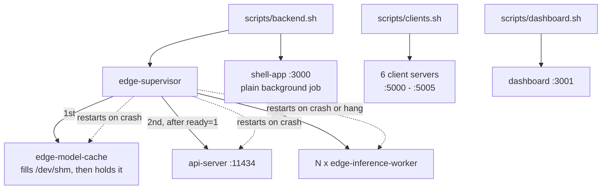
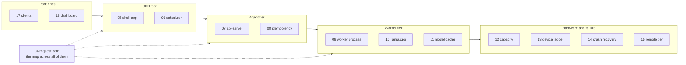

# ServeInfer documentation

ServeInfer is an on-device LLM inference runtime for GGUF models. It runs one model on one
machine, splits the work across several OS processes so a crash in one cannot take down the
others, and serves the result over HTTP and SSE to a set of sample browser apps.

This page is the index, and it starts with four diagrams. Read those and you have the shape of
the whole project. Everything after them is a link to a document that explains one piece
properly.

## The layers

Six browser pages talk to one shell. The shell talks to one api-server. The api-server talks to
four C++ workers over unix sockets, and every worker reads the same copy of the model out of
shared memory.

The dashed line to remember: a browser never reaches the api-server. It binds `127.0.0.1` and
the shell is the only caller. See [05-shell-app.md](05-shell-app.md).

## One request, end to end

This is the path the whole project exists to serve. A prompt leaves the browser, comes back as
tokens, and crosses four processes on the way.

When the client asks for a stream instead, the same path carries SSE and the shell adds events
of its own. Both flows are drawn hop by hop in [04-request-path.md](04-request-path.md).

## Who starts what

The backend is two independent process trees, not one. Mixing them up is the most common
confusion in this repo. `edge-supervisor` forks and restarts three kinds of child. The shell
app, the clients and the dashboard are started by their own scripts and nothing supervises them.

Kill the supervisor and the shell, the clients and the dashboard all keep running. That is the
design, not an accident. See [02-process-model.md](02-process-model.md).

## Which document covers which part

Three documents sit underneath all of it: [02-process-model.md](02-process-model.md) for
lifecycles, [03-configuration.md](03-configuration.md) for every environment variable, and
[16-ipc-protocols.md](16-ipc-protocols.md) for the exact bytes on every socket.

## Where to start

**New to the project?** Read [01](01-overview.md), [02](02-process-model.md) and
[04](04-request-path.md) in that order. That's about twenty minutes and it fills in the four
diagrams above.

**Just want it running?** Go straight to [19-build-and-run.md](19-build-and-run.md), then
[21-troubleshooting.md](21-troubleshooting.md) when something doesn't start.

**Here for the inference path specifically?** [09](09-inference-worker.md) →
[10](10-llama-integration.md) → [11](11-model-cache.md). That covers the worker process, how it
calls llama.cpp, and how the model gets into shared memory.

## Start here

| Doc | What's in it |
|---|---|
| [01-overview.md](01-overview.md) | What ServeInfer is, the three tiers, a tour of every piece, and what it deliberately is not |
| [02-process-model.md](02-process-model.md) | The two independent process trees, the pidfile registry, startup order, what dies when you kill what |
| [03-configuration.md](03-configuration.md) | Env-only config, the strict loader, and a table of every variable |

## The request path

Read these in order to follow a prompt from a browser tab to a worker and back.

| Doc | What's in it |
|---|---|
| [04-request-path.md](04-request-path.md) | The map. Both flows end to end, with links out to every hop. Read this before the four below |
| [05-shell-app.md](05-shell-app.md) | The only process a browser talks to. Its HTTP surface, CORS, and the outer half of the two-hop SSE stream |
| [06-scheduler.md](06-scheduler.md) | Admission control: slots, the per-client cap, priority with aging, and the two timeouts |
| [07-api-server.md](07-api-server.md) | HTTP to unix socket. The worker pool, worker states, and how many workers it thinks exist |
| [08-idempotency.md](08-idempotency.md) | Why retrying with the same request id is safe, and what gets cached |

## The inference path

How a prompt actually becomes tokens.

| Doc | What's in it |
|---|---|
| [09-inference-worker.md](09-inference-worker.md) | The worker process from the outside: arguments, socket, heartbeat, JSON by regex, exit codes |
| [10-llama-integration.md](10-llama-integration.md) | Inside the worker: the vendored llama.cpp tree, model loading, the prompt template, the decode loop, streaming |
| [11-model-cache.md](11-model-cache.md) | One copy of the weights in `/dev/shm`, the 256-byte header, the run-nonce handshake, and how workers attach |

## Hardware, failure and fallback

| Doc | What's in it |
|---|---|
| [12-hardware-capacity.md](12-hardware-capacity.md) | Everything before `execvp`: probing the machine, working out how many workers it can pay for, assigning devices |
| [13-device-fallback.md](13-device-fallback.md) | Everything after `execvp`: the device ladder, quarantine, degraded mode, and the GPU-to-CPU reassignment |
| [14-crash-recovery.md](14-crash-recovery.md) | Restarting a worker that died, killing one that hung, and the circuit breaker that stops the loop |
| [15-remote-fallback.md](15-remote-fallback.md) | The bottom rung: sending a prompt to a hosted API, and the two gates that keep it off by default |
| [16-ipc-protocols.md](16-ipc-protocols.md) | Reference. Every socket and interface file, with the real bytes on each |

## The front ends

| Doc | What's in it |
|---|---|
| [17-clients.md](17-clients.md) | The six sample apps, the shared React package, and the retry policy |
| [18-dashboard.md](18-dashboard.md) | The operator page: what it shows and where each number comes from |

## Working on it

| Doc | What's in it |
|---|---|
| [19-build-and-run.md](19-build-and-run.md) | Prerequisites, the model download, every Make target, and the fast build with no llama.cpp |
| [20-testing.md](20-testing.md) | Both suites, what they cover, and what is deliberately left uncovered |
| [21-troubleshooting.md](21-troubleshooting.md) | Symptom, cause, fix, for fifteen things that actually go wrong |

## Longer design notes

Two documents are reference material rather than part of the reading order.

- [build-matrix.md](build-matrix.md): why one binary cannot hold CUDA, Metal and Hexagon at
  once, plus the vendored llama.cpp version history.
- [device-fallback.md](device-fallback.md): the tier catalogue, the vendor error mapping, and
  the two platform accelerators this project cannot run. Companion to [13](13-device-fallback.md).

## A note on accuracy

Every claim in these documents was checked against the code, not copied from the older
documentation. Where the code and the old docs disagreed, the code won and the difference is
called out in the relevant page. Anything that is only planned, only simulated, or only works on
hardware this project has never run on is labelled as such where it appears.
