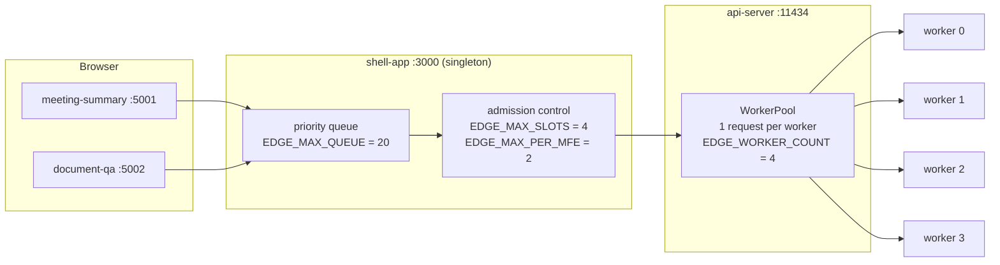
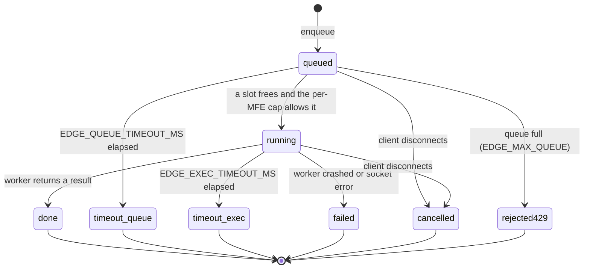

# Scheduler architecture and queueing model (B2)

Concurrency is limited in two independent places. They are configured separately and can
disagree, which is the first thing to understand about this system.



`EDGE_MAX_SLOTS` must not exceed `EDGE_WORKER_COUNT`. If it does, the shell admits work the
agent then rejects with `no_ready_workers`, turning a queue wait into a 503.

`EDGE_MAX_PER_MFE` must be strictly less than `EDGE_MAX_SLOTS`, or the fairness rule does
nothing: with both at 2, one MFE can legally hold every slot, which is the exact case the
assignment forbids. The shipped values are 4 and 2, so one MFE can hold at most half.

## A request's states



Two distinct timeouts, and the SSE `timeout` event carries `phase` to tell them apart:

| Phase | Bound by | Emitted as | HTTP |
|---|---|---|---|
| `queue` | `EDGE_QUEUE_TIMEOUT_MS` | `timeout` with `waitedMs` | 408 |
| `execution` | `EDGE_EXEC_TIMEOUT_MS` | `timeout` with `ranMs` | 504 |

The execution timeout aborts the job's `AbortController`, which propagates through the
shell's fetch to the api-server and frees the slot. Before it existed a wedged request
held its slot for the life of the process.

## Priority and aging

Three priorities, base scores 300 / 200 / 100. Every `EDGE_AGING_MS` a queued job waits, it
gains one point. A low-priority job therefore overtakes a normal one after roughly 100
aging intervals, which is what stops "Burst LOW x5" from starving behind interactive work
forever. Ties break on arrival time.

```
effective = base(priority) + floor((now - createdAt) / EDGE_AGING_MS)
```

## Backpressure the client can act on

Every transient failure carries `retryAfterSeconds` and `retryable`. Both MFEs honour them
through `public/retry.js`: server hint first, otherwise exponential backoff with jitter,
capped at `EDGE_CLIENT_RETRY_MAX_MS`, up to `EDGE_CLIENT_RETRY_ATTEMPTS` tries.

A retry reuses the same `requestId` on purpose. The api-server keeps successful results
against that id for `EDGE_IDEMPOTENCY_TTL_MS`, so a retry that races a late success replays
the cached answer instead of running inference twice. Failures are deliberately not cached,
or an id could never be retried at all.
