# ServeInfer

An on-device, multi-process LLM inference runtime for GGUF models, plus the micro-frontend client
stack that consumes it.

Naming warning before anything else. The product is called **ServeInfer**. Every binary, identifier,
socket path and environment variable in the tree says `edge` or `EDGE_`. That is deliberate and
nothing is being renamed. When you read `edge-supervisor` or `EDGE_MAX_SLOTS`, that is ServeInfer.

---

## Contents

1. [What ServeInfer is](#1-what-serveinfer-is)
2. [The two process trees](#2-the-two-process-trees)
3. [Startup sequence](#3-startup-sequence)
4. [The request path](#4-the-request-path)
5. [Every hop's payload](#5-every-hops-payload)
6. [HTTP endpoints](#6-http-endpoints)
7. [The scheduler](#7-the-scheduler)
8. [Crash recovery](#8-crash-recovery)
9. [Device fallback and degraded mode](#9-device-fallback-and-degraded-mode)
10. [Idempotency and the request registry](#10-idempotency-and-the-request-registry)
11. [The shared-memory model cache](#11-the-shared-memory-model-cache)
12. [IPC conventions](#12-ipc-conventions)
13. [Configuration](#13-configuration)
14. [Micro-frontends](#14-micro-frontends)
15. [Build and run](#15-build-and-run)
16. [Verification](#16-verification)
17. [Troubleshooting](#17-troubleshooting)

---

## 1. What ServeInfer is

ServeInfer runs one large language model on one Linux machine and serves it to browser pages over
HTTP. The model is `backend/models/Phi-3-mini-4k-instruct-q4.gguf`, 2,393,231,072 bytes on disk.

The problem it solves is the one you hit the moment you want more than a single-threaded local
`llama.cpp` binary:

**A 2.3 GB model cannot be loaded once per worker.** Four workers loading their own copy costs
about 9.5 GB of RAM before a single token is generated. ServeInfer loads the GGUF into POSIX shared
memory once, in a dedicated process, and every worker attaches to that one copy.

**Inference in-process kills the process.** A bad decode, a driver fault or an out-of-memory in the
backend takes down whatever was hosting it. ServeInfer puts inference in separate C++ worker
processes behind Unix sockets, and a supervisor restarts them. An HTTP request in flight when a
worker dies gets a 503 with a `Retry-After`, not a hung socket.

**Unbounded concurrency turns latency into a lottery.** Ten browser tabs hitting one GPU means every
one of them waits for all the others. ServeInfer admits a fixed number of jobs, queues the rest by
priority with aging, and tells the queued client its position and estimated wait.

**One misbehaving frontend should not starve the others.** Two independent browser apps share the
runtime, so the scheduler caps how many slots any single app can hold.

**An accelerator can disappear mid-session.** The worker escalates down a configurable device
ladder, retries the prompt on the tier below, and reports `degraded: true` with the reason, without
changing the shape of the API response.

### The pieces

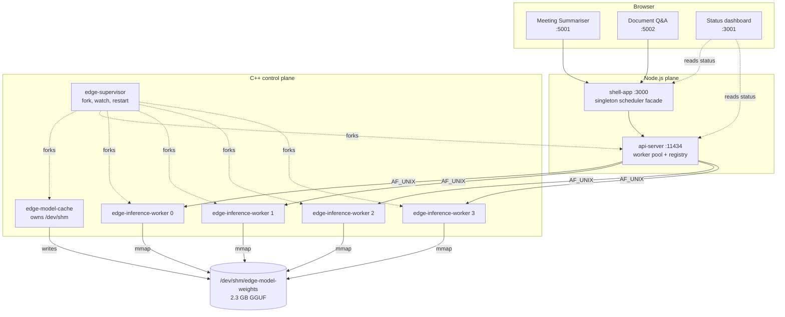
```mermaid
flowchart TB
    subgraph browser["Browser"]
        MS["Meeting Summariser<br/>:5001"]
        DQ["Document Q&A<br/>:5002"]
        DASH["Status dashboard<br/>:3001"]
    end

    subgraph node["Node.js plane"]
        SHELL["shell-app :3000<br/>singleton scheduler facade"]
        API["api-server :11434<br/>worker pool + registry"]
    end

    subgraph cpp["C++ control plane"]
        SUP["edge-supervisor<br/>fork, watch, restart"]
        MC["edge-model-cache<br/>owns /dev/shm"]
        W0["edge-inference-worker 0"]
        W1["edge-inference-worker 1"]
        W2["edge-inference-worker 2"]
        W3["edge-inference-worker 3"]
    end

    SHM[("/dev/shm/edge-model-weights<br/>2.3 GB GGUF")]

    MS --> SHELL
    DQ --> SHELL
    DASH -.->|"reads status"| SHELL
    DASH -.->|"reads status"| API
    SHELL --> API
    API -- "AF_UNIX" --> W0 & W1 & W2 & W3
    SUP -.->|"forks"| MC
    SUP -.->|"forks"| API
    SUP -.->|"forks"| W0 & W1 & W2 & W3
    MC -- writes --> SHM
    W0 & W1 & W2 & W3 -- mmap --> SHM
```

Language split: C++ for anything that owns a process, a signal or a page of memory. Node for
anything that speaks HTTP. The boundary between them is a Unix socket carrying newline-delimited
JSON.

### What it deliberately is not

There's no user account system, no login and no password anywhere. There's no database. The
api-server binds `127.0.0.1` only (`backend/api-server/server.js:166`), so it never accepts remote traffic.
The build is POSIX only, since it uses `fork`, `execvp`, `AF_UNIX` and `shm_open` directly.

---

## 2. The two process trees

This is the single most common source of confusion in the repo, so it comes before everything else.

`scripts/backend.sh` starts **two independent things**. They're not one tree, and one does not
supervise the other.

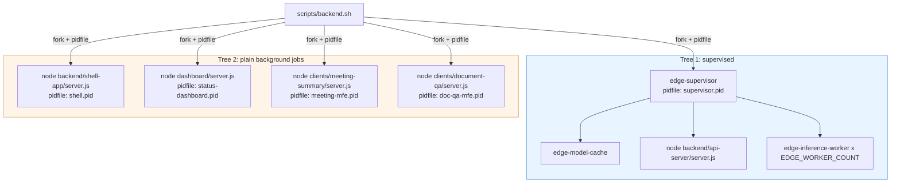
```mermaid
flowchart TB
    START["scripts/backend.sh"]

    subgraph tree1["Tree 1: supervised"]
        SUP["edge-supervisor<br/>pidfile: supervisor.pid"]
        MC["edge-model-cache"]
        API["node backend/api-server/server.js"]
        W["edge-inference-worker x EDGE_WORKER_COUNT"]
        SUP --> MC
        SUP --> API
        SUP --> W
    end

    subgraph tree2["Tree 2: plain background jobs"]
        SH["node backend/shell-app/server.js<br/>pidfile: shell.pid"]
        DB["node dashboard/server.js<br/>pidfile: status-dashboard.pid"]
        M1["node clients/meeting-summary/server.js<br/>pidfile: meeting-mfe.pid"]
        M2["node clients/document-qa/server.js<br/>pidfile: doc-qa-mfe.pid"]
    end

    START -- "fork + pidfile" --> SUP
    START -- "fork + pidfile" --> SH
    START -- "fork + pidfile" --> DB
    START -- "fork + pidfile" --> M1
    START -- "fork + pidfile" --> M2

    style tree1 fill:#e8f4ff,stroke:#4a90d9
    style tree2 fill:#fff4e8,stroke:#d99b4a
```

The supervisor forks its three kinds of child in `Supervisor::start()`
(`backend/supervisor/supervisor.cpp:86-107`), in a fixed order: model-cache, then api-server, then the
workers. `scripts/backend.sh` launches all five background jobs and writes a pidfile for each
into `$EDGE_STATE_DIR`.

### What happens when you kill the supervisor

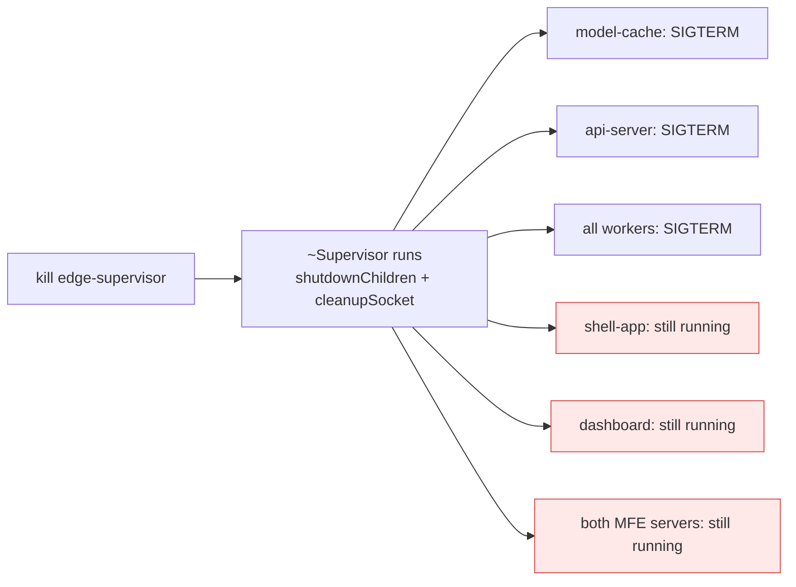
```mermaid
flowchart LR
    K["kill edge-supervisor"] --> D["~Supervisor runs<br/>shutdownChildren + cleanupSocket"]
    D --> A["model-cache: SIGTERM"]
    D --> B["api-server: SIGTERM"]
    D --> C["all workers: SIGTERM"]
    D --> E["shell-app: still running"]
    D --> F["dashboard: still running"]
    D --> G["both MFE servers: still running"]

    style E fill:#ffe8e8,stroke:#d94a4a
    style F fill:#ffe8e8,stroke:#d94a4a
    style G fill:#ffe8e8,stroke:#d94a4a
```

The destructor at `backend/supervisor/supervisor.cpp:80-84` calls `shutdownChildren()`, which sends SIGTERM
to every pid it tracks, waits two seconds, then SIGKILLs the survivors
(`backend/supervisor/supervisor.cpp:374-400`). It only ever tracked the processes it forked itself. The
shell, the dashboard and the MFE servers are still listening on their ports afterwards, and the
browser will keep talking to a shell whose backend has vanished.

`scripts/stop.sh` is what actually cleans up. It kills from pidfiles, then scans `ps` output for
anything matching the runtime's command lines (`scripts/stop.sh:58-81`), then kills whatever is
still listening on the five ports (`scripts/stop.sh:133-158`), then removes the sockets and the
`/dev/shm` objects (`scripts/stop.sh:160-161`).

### Lifecycle class of every process

| Process | Class | Count | Who owns it | Restart policy |
|---|---|---|---|---|
| `edge-supervisor` | persistent | 1 | `scripts/backend.sh` background job, pidfile | not restarted by anything |
| `edge-model-cache` | persistent | 1 | supervisor | restarted on crash, behind the breaker, then all workers restart |
| `api-server` (node) | persistent | 1 | supervisor | restarted on crash, behind the breaker |
| `edge-inference-worker` | pooled | `EDGE_WORKER_COUNT` | supervisor | fixed-size pool, each slot restarted on crash, behind the breaker |
| `shell-app` (node) | persistent | 1 | `scripts/backend.sh` background job, pidfile | not supervised |
| `dashboard` (node) | persistent | 1 | `scripts/backend.sh` background job, pidfile | not supervised |
| MFE static servers | persistent | 2 | `scripts/backend.sh` background job, pidfile | not supervised |

Nothing here is on-demand. No process is spawned per request. Workers are pre-forked into a fixed
pool exactly so that a request never pays model load time.

### Bind addresses differ

| Process | Listen call | Reachable from |
|---|---|---|
| api-server | `app.listen(port, '127.0.0.1')` (`backend/api-server/server.js:166`) | loopback only |
| shell-app | `app.listen(port)` (`backend/shell-app/server.js:281`) | **every interface** |
| system-dashboard | `.listen(port, '127.0.0.1')` (`dashboard/server.js:312`) | loopback only |
| meeting-summary MFE | `.listen(port, '127.0.0.1')` (`clients/meeting-summary/server.js:58`) | loopback only |
| document-qa MFE | `.listen(port, '127.0.0.1')` (`clients/document-qa/server.js:58`) | loopback only |

The shell is the only process that binds beyond loopback, and it's the one with no authentication.
On a shared network that's an open inference endpoint. If that matters to you, add the host argument
to `backend/shell-app/server.js:281`.

---

## 3. Startup sequence

Order is strict. The model-cache has to publish `ready=1` in the shared-memory header before the
api-server or any worker starts. `Supervisor::waitForModelReady` blocks on that
(`backend/supervisor/supervisor.cpp:179-213`), polling every 50 ms with a 30 second deadline.

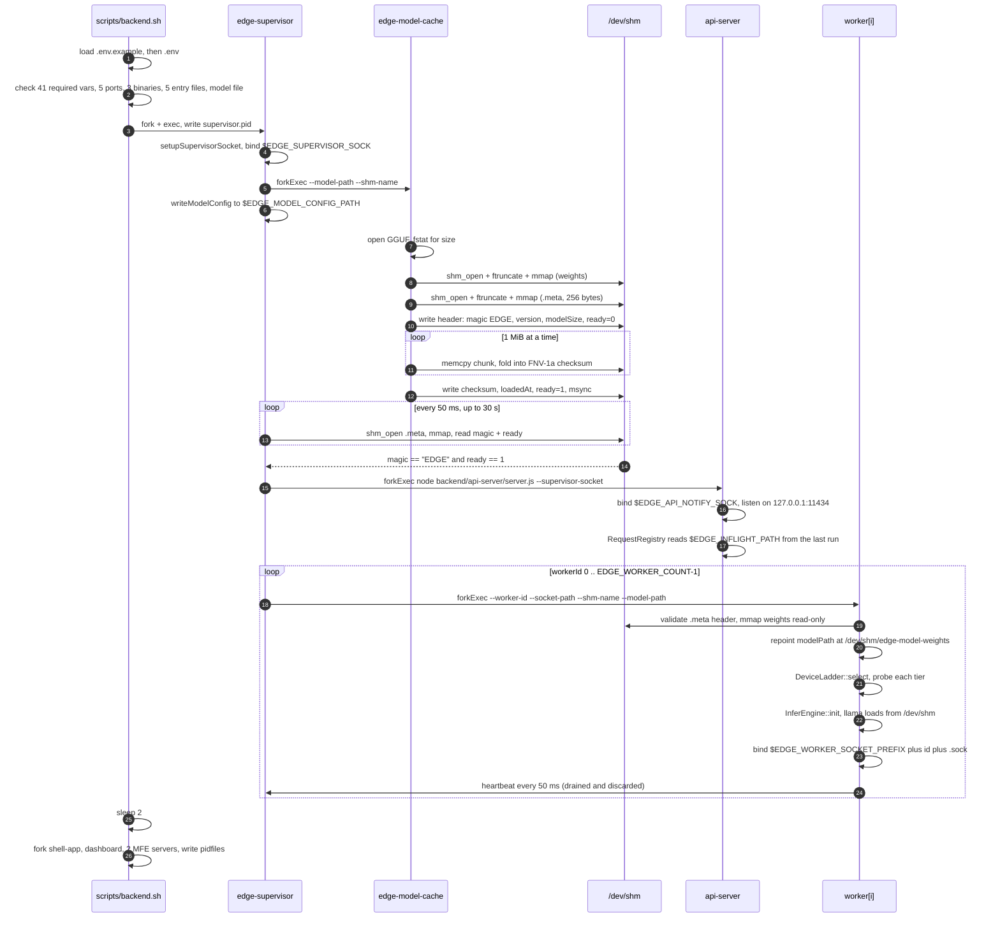
```mermaid
sequenceDiagram
    autonumber
    participant SH as scripts/backend.sh
    participant SUP as edge-supervisor
    participant MC as edge-model-cache
    participant SHM as /dev/shm
    participant API as api-server
    participant W as worker[i]

    SH->>SH: load .env.example, then .env
    SH->>SH: check 41 required vars, 5 ports, 3 binaries, 5 entry files, model file
    SH->>SUP: fork + exec, write supervisor.pid

    SUP->>SUP: setupSupervisorSocket, bind $EDGE_SUPERVISOR_SOCK
    SUP->>MC: forkExec --model-path --shm-name
    SUP->>SUP: writeModelConfig to $EDGE_MODEL_CONFIG_PATH

    MC->>MC: open GGUF, fstat for size
    MC->>SHM: shm_open + ftruncate + mmap (weights)
    MC->>SHM: shm_open + ftruncate + mmap (.meta, 256 bytes)
    MC->>SHM: write header: magic EDGE, version, modelSize, ready=0
    loop 1 MiB at a time
        MC->>SHM: memcpy chunk, fold into FNV-1a checksum
    end
    MC->>SHM: write checksum, loadedAt, ready=1, msync

    loop every 50 ms, up to 30 s
        SUP->>SHM: shm_open .meta, mmap, read magic + ready
    end
    SHM-->>SUP: magic == "EDGE" and ready == 1

    SUP->>API: forkExec node backend/api-server/server.js --supervisor-socket
    API->>API: bind $EDGE_API_NOTIFY_SOCK, listen on 127.0.0.1:11434
    API->>API: RequestRegistry reads $EDGE_INFLIGHT_PATH from the last run

    loop workerId 0 .. EDGE_WORKER_COUNT-1
        SUP->>W: forkExec --worker-id --socket-path --shm-name --model-path
        W->>SHM: validate .meta header, mmap weights read-only
        W->>W: repoint modelPath at /dev/shm/edge-model-weights
        W->>W: DeviceLadder::select, probe each tier
        W->>W: InferEngine::init, llama loads from /dev/shm
        W->>W: bind $EDGE_WORKER_SOCKET_PREFIX plus id plus .sock
        W->>SUP: heartbeat every 50 ms (drained and discarded)
    end

    SH->>SH: sleep 2
    SH->>SH: fork shell-app, dashboard, 2 MFE servers, write pidfiles
```

Two details in there that surprise people.

**`scripts/backend.sh` sleeps two seconds and moves on.** Line 210. There's no readiness check on the
supervisor tree before the shell starts. If model loading is slow, the shell comes up first and its
first few requests get `no_ready_workers` back from the api-server. The MFE retry policy covers
that case, which is why it exists.

**The worker's own mmap of the weights is validation, not the load path.** It maps the segment
read-only (`backend/inference-worker/worker.cpp:222`) to confirm the size matches the header, then hands
llama the `/dev/shm` *path* (`backend/inference-worker/worker.cpp:231-234`) and llama maps it again itself.
Two mappings of the same physical pages cost nothing extra.

### Startup failure modes

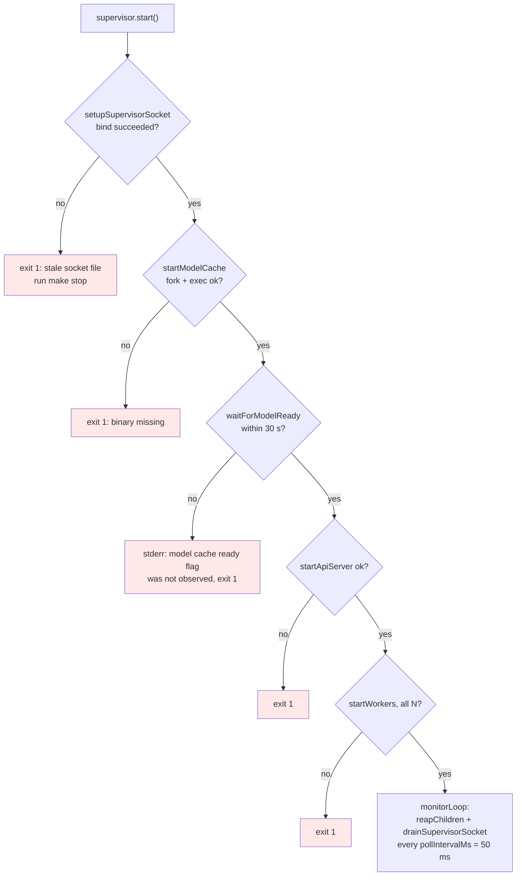
```mermaid
flowchart TD
    A["supervisor.start()"] --> B{"setupSupervisorSocket<br/>bind succeeded?"}
    B -- no --> F1["exit 1: stale socket file<br/>run make stop"]
    B -- yes --> C{"startModelCache<br/>fork + exec ok?"}
    C -- no --> F2["exit 1: binary missing"]
    C -- yes --> D{"waitForModelReady<br/>within 30 s?"}
    D -- no --> F3["stderr: model cache ready flag<br/>was not observed, exit 1"]
    D -- yes --> E{"startApiServer ok?"}
    E -- no --> F4["exit 1"]
    E -- yes --> G{"startWorkers, all N?"}
    G -- no --> F5["exit 1"]
    G -- yes --> H["monitorLoop:<br/>reapChildren + drainSupervisorSocket<br/>every pollIntervalMs = 50 ms"]

    style F1 fill:#ffe8e8
    style F2 fill:#ffe8e8
    style F3 fill:#ffe8e8
    style F4 fill:#ffe8e8
    style F5 fill:#ffe8e8
```

A worker that fails `init()` exits non-zero rather than serving. The commonest causes are a
`.meta` header that isn't ready, a size mismatch between the mapped segment and the header
(`backend/inference-worker/worker.cpp:214-220`), and no usable tier in the device ladder
(`backend/inference-worker/worker.cpp:250-253`).

---

## 4. The request path

```
Browser MFE (:5001 / :5002) -> shell-app (:3000) -> api-server (:11434) -> worker (AF_UNIX) -> llama
```

Four processes, three protocol changes. HTTP JSON into the shell, HTTP JSON or SSE into the
api-server, newline-delimited JSON over a Unix socket into the worker, then a C++ call into llama.

### 4.1 Buffered request, the happy path

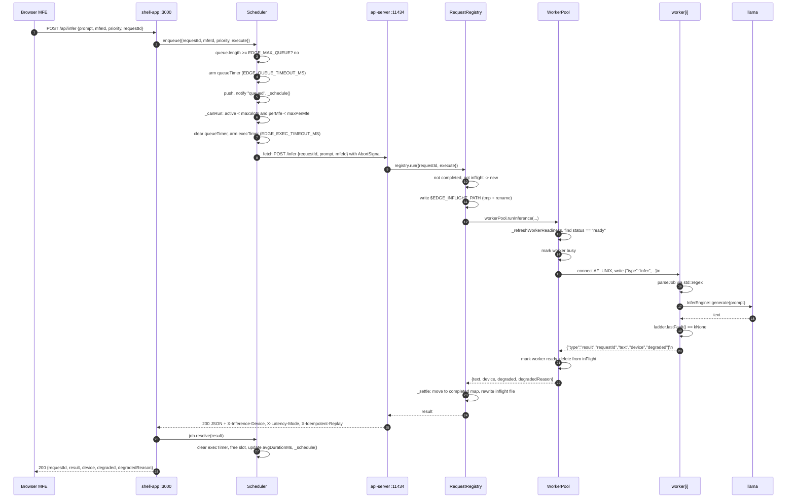
```mermaid
sequenceDiagram
    autonumber
    participant B as Browser MFE
    participant S as shell-app :3000
    participant SC as Scheduler
    participant A as api-server :11434
    participant R as RequestRegistry
    participant P as WorkerPool
    participant W as worker[i]
    participant L as llama

    B->>S: POST /api/infer {prompt, mfeId, priority, requestId}
    S->>SC: enqueue({requestId, mfeId, priority, execute})
    SC->>SC: queue.length >= EDGE_MAX_QUEUE? no
    SC->>SC: arm queueTimer (EDGE_QUEUE_TIMEOUT_MS)
    SC->>SC: push, notify "queued", _schedule()
    SC->>SC: _canRun: active < maxSlots and perMfe < maxPerMfe
    SC->>SC: clear queueTimer, arm execTimer (EDGE_EXEC_TIMEOUT_MS)
    SC->>A: fetch POST /infer {requestId, prompt, mfeId} with AbortSignal

    A->>R: registry.run({requestId, execute})
    R->>R: not completed, not inflight -> new
    R->>R: write $EDGE_INFLIGHT_PATH (tmp + rename)
    R->>P: workerPool.runInference(...)
    P->>P: _refreshWorkerReadiness, find status == "ready"
    P->>P: mark worker busy
    P->>W: connect AF_UNIX, write {"type":"infer",...}\n

    W->>W: parseJob via std::regex
    W->>L: InferEngine::generate(prompt)
    L-->>W: text
    W->>W: ladder.lastFault() == kNone
    W-->>P: {"type":"result","requestId","text","device","degraded"}\n

    P->>P: mark worker ready, delete from inFlight
    P-->>R: {text, device, degraded, degradedReason}
    R->>R: _settle: move to completed map, rewrite inflight file
    R-->>A: result
    A-->>S: 200 JSON + X-Inference-Device, X-Latency-Mode, X-Idempotent-Replay
    S->>SC: job.resolve(result)
    SC->>SC: clear execTimer, free slot, update avgDurationMs, _schedule()
    S-->>B: 200 {requestId, result, device, degraded, degradedReason}
```

The shell strips the api-server's response headers. `backend/shell-app/server.js:95-101` builds a fresh JSON
body and sets nothing else, so `X-Inference-Device` and friends do not reach the browser on this
route. The same information is in the body as `device` and `degraded`.

### 4.2 Streaming request, two SSE hops

The api-server emits SSE to the shell. The shell parses that stream by hand
(`backend/shell-app/edgeAgentService.js:115-166`) and emits its own SSE to the browser, adding events the
api-server knows nothing about.

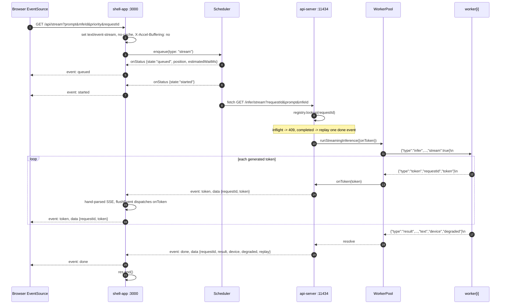
```mermaid
sequenceDiagram
    autonumber
    participant B as Browser EventSource
    participant S as shell-app :3000
    participant SC as Scheduler
    participant A as api-server :11434
    participant P as WorkerPool
    participant W as worker[i]

    B->>S: GET /api/stream?prompt&mfeId&priority&requestId
    S->>S: set text/event-stream, no-cache, X-Accel-Buffering: no
    S->>SC: enqueue(type: "stream")
    SC-->>S: onStatus {state:"queued", position, estimatedWaitMs}
    S-->>B: event: queued
    SC-->>S: onStatus {state:"started"}
    S-->>B: event: started

    SC->>A: fetch GET /infer/stream?requestId&prompt&mfeId
    A->>A: registry.lookup(requestId)
    Note over A: inflight -> 409, completed -> replay one done event
    A->>P: runStreamingInference({onToken})
    P->>W: {"type":"infer",...,"stream":true}\n

    loop each generated token
        W-->>P: {"type":"token","requestId","token"}\n
        P->>A: onToken(token)
        A-->>S: event: token, data {requestId, token}
        S->>S: hand-parsed SSE, flushEvent dispatches onToken
        S-->>B: event: token, data {requestId, token}
    end

    W-->>P: {"type":"result",...,"text","device","degraded"}\n
    P-->>A: resolve
    A-->>S: event: done, data {requestId, result, device, degraded, replay}
    S-->>B: event: done
    S->>S: res.end()
```

The two vocabularies are not the same set:

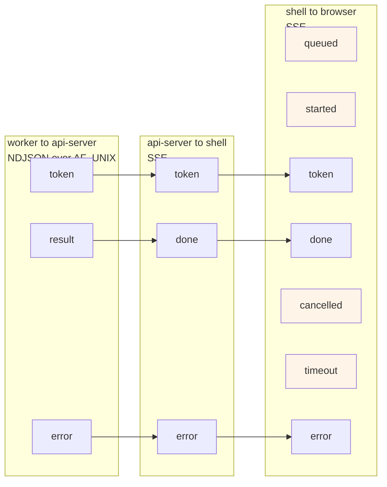
```mermaid
flowchart LR
    subgraph worker["worker to api-server<br/>NDJSON over AF_UNIX"]
        T1["token"]
        R1["result"]
        E1["error"]
    end
    subgraph api["api-server to shell<br/>SSE"]
        T2["token"]
        D2["done"]
        E2["error"]
    end
    subgraph shell["shell to browser<br/>SSE"]
        Q3["queued"]
        S3["started"]
        T3["token"]
        D3["done"]
        C3["cancelled"]
        TO3["timeout"]
        E3["error"]
    end

    T1 --> T2 --> T3
    R1 --> D2 --> D3
    E1 --> E2 --> E3
    style Q3 fill:#fff4e8
    style S3 fill:#fff4e8
    style C3 fill:#fff4e8
    style TO3 fill:#fff4e8
```

`queued`, `started`, `cancelled` and `timeout` come from the scheduler's `onStatus` callback
(`backend/shell-app/server.js:187-210`). They never exist upstream of the shell. Changing a token payload
shape means editing both hops plus both MFE clients.

### 4.3 Where each concurrency gate sits

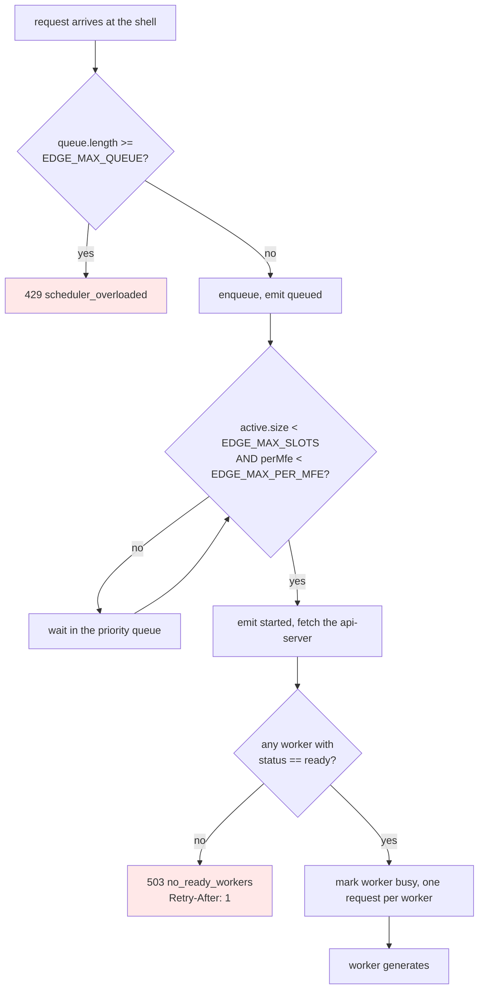
```mermaid
flowchart TD
    IN["request arrives at the shell"] --> G1{"queue.length >=<br/>EDGE_MAX_QUEUE?"}
    G1 -- yes --> R429["429 scheduler_overloaded"]
    G1 -- no --> Q["enqueue, emit queued"]
    Q --> G2{"active.size < EDGE_MAX_SLOTS<br/>AND perMfe < EDGE_MAX_PER_MFE?"}
    G2 -- no --> WAIT["wait in the priority queue"]
    WAIT --> G2
    G2 -- yes --> RUN["emit started, fetch the api-server"]
    RUN --> G3{"any worker with<br/>status == ready?"}
    G3 -- no --> R503["503 no_ready_workers<br/>Retry-After: 1"]
    G3 -- yes --> BUSY["mark worker busy, one request per worker"]
    BUSY --> WORK["worker generates"]

    style R429 fill:#ffe8e8
    style R503 fill:#ffe8e8
```

Two gates, two config sources, and nothing keeps them consistent. Section 7 covers what goes wrong
when they disagree.

---

## 5. Every hop's payload

Everything below comes from the source. Field names and shapes are what the code actually sends.

### 5.1 Browser MFE to shell, buffered

`POST http://127.0.0.1:3000/api/infer`

```json
{
  "prompt": "Summarise the attached meeting notes in three bullets.",
  "mfeId": "doc-qa",
  "priority": "high",
  "requestId": "5f2a9c14-8b3d-4a1e-9c7f-0d2e8a1b6c33"
}
```

`prompt` is required and trimmed (`backend/shell-app/server.js:82`). `mfeId` defaults to `"doc-qa"`
(`backend/shell-app/server.js:83`). `priority` is normalised to exactly one of `high`, `normal`, `low`, with
anything unrecognised becoming `normal` (`backend/shell-app/server.js:59-64`). `requestId` defaults to a
fresh `crypto.randomUUID()`.

Success, HTTP 200:

```json
{
  "requestId": "5f2a9c14-8b3d-4a1e-9c7f-0d2e8a1b6c33",
  "result": "1. Budget approved.\n2. Launch moved to Q3.\n3. Hiring freeze lifted.",
  "device": "cuda",
  "degraded": false,
  "degradedReason": null
}
```

### 5.2 Browser MFE to shell, streaming

`GET http://127.0.0.1:3000/api/stream?prompt=...&mfeId=meeting-summary&priority=high&requestId=...`

Query params, not a body. `mfeId` defaults to `"meeting-summary"` here rather than `"doc-qa"`, and
`priority` defaults to `"high"` (`backend/shell-app/server.js:148-149`).

The response is `text/event-stream`. Every request emits `queued` first, even one that starts
immediately, because `enqueue` pushes onto the queue array and notifies before calling `_schedule()`
(`backend/shell-app/scheduler.js:93-98`). A request that runs at once shows `position: 1`.

```
event: queued
data: {"requestId":"s1","position":1,"estimatedWaitMs":8000}

event: started
data: {"requestId":"s1"}

event: token
data: {"requestId":"s1","token":"Budget"}

event: token
data: {"requestId":"s1","token":" approved"}

event: done
data: {"requestId":"s1","result":"Budget approved.","device":"cuda","degraded":false,"degradedReason":null,"replay":false}
```

Each event as its own JSON object:

```json
{ "requestId": "s1", "position": 3, "estimatedWaitMs": 16000 }
```

```json
{ "requestId": "s1" }
```

```json
{ "requestId": "s1", "token": " approved" }
```

```json
{
  "requestId": "s1",
  "result": "Budget approved.",
  "device": "cuda",
  "degraded": false,
  "degradedReason": null,
  "replay": false
}
```

`cancelled`, emitted when the client disconnects while queued or calls `POST /api/cancel`:

```json
{ "requestId": "s1", "reason": "user_cancelled" }
```

`timeout` carries a `phase` field, and that field is the only way to tell the two timeouts apart.
Queue phase:

```json
{ "requestId": "s1", "phase": "queue", "waitedMs": 30001, "retryable": true }
```

Execution phase:

```json
{ "requestId": "s1", "phase": "execution", "ranMs": 120004, "retryable": true }
```

`ranMs` is absent on the queue variant and `waitedMs` is absent on the execution variant, because
`_notify` spreads only the payload it was given (`backend/shell-app/scheduler.js:360-368`). The shell reads
both and lets `JSON.stringify` drop the undefined one (`backend/shell-app/server.js:201-208`).

`error`:

```json
{
  "error": "worker_crashed",
  "message": "worker crashed while request in-flight",
  "requestId": "s1",
  "retryAfterSeconds": 2,
  "retryable": false
}
```

`retryAfterSeconds` appears only when the upstream payload carried one
(`backend/shell-app/server.js:230-232`). `retryable` appears only for `SchedulerError`
(`backend/shell-app/server.js:233-236`).

### 5.3 Shell to api-server, buffered

`POST http://127.0.0.1:11434/infer`, built at `backend/shell-app/edgeAgentService.js:31-36`:

```json
{
  "requestId": "5f2a9c14-8b3d-4a1e-9c7f-0d2e8a1b6c33",
  "prompt": "Summarise the attached meeting notes in three bullets.",
  "mfeId": "doc-qa"
}
```

`priority` is not forwarded. It's a scheduler concept and the api-server has no queue.

Response, HTTP 200:

```json
{
  "requestId": "5f2a9c14-8b3d-4a1e-9c7f-0d2e8a1b6c33",
  "result": "1. Budget approved.\n2. Launch moved to Q3.\n3. Hiring freeze lifted.",
  "device": "cuda",
  "degraded": false,
  "degradedReason": null,
  "replay": false
}
```

Headers on that response (`backend/api-server/routes/infer.js:46-52`):

```
X-Idempotent-Replay: false
X-Inference-Device: cuda
X-Inference-Degraded: false
X-Latency-Mode: normal
```

`X-Degraded-Reason` is set only when `degradedReason` is truthy.

### 5.4 Shell to api-server, streaming

`GET http://127.0.0.1:11434/infer/stream?requestId=...&prompt=...&mfeId=...`, built at
`backend/shell-app/edgeAgentService.js:85-96` with `Accept: text/event-stream`.

Three event types come back and no more:

```
event: token
data: {"requestId":"s1","token":" approved"}

event: done
data: {"requestId":"s1","result":"Budget approved.","device":"cuda","degraded":false,"degradedReason":null,"replay":false}

event: error
data: {"error":"worker_crashed","retryAfterSeconds":2,"requestId":"s1"}
```

The stream route sets the SSE headers but not the `X-Inference-*` headers. Device and degraded
information rides in the `done` payload instead.

### 5.5 api-server to worker

One AF_UNIX connection per request, to `$EDGE_WORKER_SOCKET_PREFIX{id}.sock`. One line of JSON,
newline terminated (`backend/api-server/ipc.js:149-156` for streaming, `backend/api-server/ipc.js:391-398` for
buffered):

```json
{"type":"infer","requestId":"s1","prompt":"Summarise the notes.","mfeId":"doc-qa","stream":true}
```

The worker's `parseJob` reads `type`, `requestId`, `prompt` and `stream` only
(`backend/inference-worker/worker.cpp:355-371`). It never reads `mfeId`. The field is sent and ignored.

### 5.6 Worker replies

Built by string concatenation in `Worker::handleClient` (`backend/inference-worker/worker.cpp:414-441`).
Each is one line terminated with `\n`.

Token, streaming only:

```json
{"type":"token","requestId":"s1","token":" approved"}
```

Result, both modes. The device fields come from `Worker::deviceResultFields`
(`backend/inference-worker/worker.cpp:316-324`):

```json
{"type":"result","requestId":"s1","text":"Budget approved.","device":"cuda","degraded":false}
```

When the ladder fell back, `degradedReason` appears and names the tier plus the fault:

```json
{"type":"result","requestId":"probe-1","text":"...","device":"cpu","degraded":true,"degradedReason":"cuda:device_removed"}
```

`degradedReason` is absent, not null, when `degraded` is false.

Error. Note there's no `requestId` on this frame (`backend/inference-worker/worker.cpp:404`,
`backend/inference-worker/worker.cpp:410`):

```json
{"type":"error","error":"missing prompt"}
```

```json
{"type":"error","error":"engine_not_initialized"}
```

The api-server turns any `error` frame into a `WorkerPoolError` with code `worker_error` and HTTP
status 502 (`backend/api-server/ipc.js:186-193`).

### 5.7 Worker to supervisor, heartbeat

Every `heartbeatIntervalMs`, hardcoded to 50 ms at `backend/inference-worker/main.cpp:61` and only
changeable with the `--heartbeat-ms` flag that `scripts/backend.sh` never passes:

```json
{"type":"heartbeat","workerId":2,"status":"ready","device":"cuda"}
```

The supervisor accepts the connection, reads until EOF and throws the bytes away
(`backend/supervisor/supervisor.cpp:432-461`). Heartbeats are not yet a liveness signal. Worker death is
detected by `waitpid`, not by a missed heartbeat.

### 5.8 Supervisor to api-server, crash notification

Over `$EDGE_API_NOTIFY_SOCK`, from `Supervisor::notifyApiServerWorkerCrash`
(`backend/supervisor/supervisor.cpp:531-532`):

```json
{"type":"worker_crashed","workerId":2,"requestId":""}
```

`requestId` is always the empty string. The api-server therefore takes the "fail everything on that
worker" branch rather than the "fail one request" branch (`backend/api-server/ipc.js:267-274`).

The api-server also handles `worker_ready` and `worker_restarted` (`backend/api-server/ipc.js:70`), but
nothing in the supervisor ever sends either message. See the contradictions list in section 8.

### 5.9 Files on disk

Crash log, one JSON object per line, appended to `$EDGE_CRASH_LOG`
(`backend/supervisor/supervisor.cpp:468-470`):

```json
{"ts":1755856320,"pid":48213,"type":"worker","workerId":2,"status":11,"reason":"signal_11"}
```

`reason` is `exit_<code>`, `signal_<n>` or `stopped_<n>` (`backend/supervisor/supervisor.cpp:578-588`). A
segfault reads `signal_11`, which is this build's analogue of the Windows access violation the
assignment describes.

Model config snapshot, truncated and rewritten at every supervisor start
(`backend/supervisor/supervisor.cpp:478-480`):

```json
{"modelPath":"/abs/path/models/Phi-3-mini-4k-instruct-q4.gguf","shmName":"/edge-model-weights","workerCount":4,"pollIntervalMs":50}
```

In-flight registry, written with temp file plus rename on every state change
(`backend/api-server/requestRegistry.js:121-138`):

```json
{"pid":48210,"updatedAt":"2026-08-22T07:12:03.441Z","inflight":[{"requestId":"s1","mfeId":"doc-qa","stream":true,"startedAt":1755856323441}]}
```

Despite the `.jsonl` extension in `EDGE_INFLIGHT_PATH`, this is a single JSON object, not one object
per line.

---

## 6. HTTP endpoints

### 6.1 shell-app, port `EDGE_SHELL_PORT` (3000)

Every route sits behind an origin allowlist. If the `Origin` header is present and appears in
`EDGE_ALLOWED_MFE_ORIGINS`, CORS headers are set. If it's present and absent from the list, no CORS
headers go out and the browser drops the response (`backend/shell-app/server.js:39-52`). `OPTIONS` always
returns 204.

#### `GET /`

Singleton metadata. No parameters.

```json
{
  "service": "shell-app",
  "role": "singleton_scheduler_facade",
  "api": {
    "infer": "/api/infer",
    "stream": "/api/stream",
    "cancel": "/api/cancel",
    "queueStatus": "/api/queue-status",
    "health": "/api/health",
    "agentHealth": "/api/agent-health"
  }
}
```

#### `POST /api/infer`

Body: `prompt` (required), `mfeId` (default `"doc-qa"`), `priority` (default `"normal"`),
`requestId` (default a fresh UUID).

| Status | Body | When |
|---|---|---|
| 200 | `{requestId, result, device, degraded, degradedReason}` | success |
| 400 | `{"error":"prompt_required"}` | prompt missing or blank after trim |
| 408 | `{"error":"queue_timeout","retryable":true,"requestId"}` | queued past `EDGE_QUEUE_TIMEOUT_MS` |
| 429 | `{"error":"scheduler_overloaded","requestId"}` | queue already at `EDGE_MAX_QUEUE` |
| 499 | `{"error":"request_cancelled","requestId"}` | cancelled while queued |
| 503 | `{"error":"worker_crashed","retryAfterSeconds":2,"requestId"}` | worker died mid-request |
| 504 | `{"error":"exec_timeout","ranMs":120004,"retryable":true,"requestId"}` | ran past `EDGE_EXEC_TIMEOUT_MS` |
| 502 or upstream status | `{error, message, requestId}` | anything else, including `no_ready_workers` passed through with its own 503 |

No `X-Inference-*` or `Retry-After` headers on this route. The shell builds a fresh response.

#### `GET /api/stream`

Query: `prompt` (required), `mfeId` (default `"meeting-summary"`), `priority` (default `"high"`),
`requestId` (default a fresh UUID).

400 with `{"error":"prompt_required"}` if the prompt is blank. Otherwise the response is always 200
with these headers:

```
Content-Type: text/event-stream
Cache-Control: no-cache
Connection: keep-alive
X-Accel-Buffering: no
```

Failures arrive as an `error` event inside the stream, not as an HTTP status, because the headers
are already flushed (`backend/shell-app/server.js:157-161`). Events: `queued`, `started`, `token`, `done`,
`cancelled`, `timeout`, `error`. Payloads are in section 5.2.

Closing the `EventSource` triggers `req.on('close')`, which cancels the job
(`backend/shell-app/server.js:170-179`). A queued job is dropped and rejected. An active job has its
`AbortController` aborted, which propagates through the shell's `fetch` to the api-server.

#### `POST /api/cancel`

Body: `{"requestId": "..."}`.

```json
{ "requestId": "s1", "cancelled": true, "state": "queued" }
```

`state` is one of `queued`, `active`, `not_found`, or the recorded done state
(`done`, `failed`, `cancelled`, `timeout`). `cancelled` is false when the job already finished.
400 with `{"error":"requestId_required"}` when the field is missing.

#### `GET /api/queue-status?requestId=...`

```json
{ "requestId": "s1", "state": "queued", "position": 3, "estimatedWaitMs": 16000 }
```

```json
{ "requestId": "s1", "state": "active", "position": 0, "estimatedWaitMs": 0 }
```

```json
{ "requestId": "s1", "state": "not_found", "position": -1, "estimatedWaitMs": -1 }
```

A finished request returns whatever `_recordDone` stored, which has a different shape:

```json
{ "requestId": "s1", "state": "done", "finishedAt": 1755856331002 }
```

400 with `{"error":"requestId_required"}` when the query param is missing.

#### `GET /api/health`

Scheduler snapshot, local to the shell. It never touches the api-server.

```json
{
  "limits": { "maxSlots": 4, "maxPerMfe": 2, "maxQueue": 20 },
  "activeCount": 2,
  "queueLength": 5,
  "activeByMfe": { "doc-qa": 2 }
}
```

#### `GET /api/agent-health`

Proxies `GET /health` on the api-server and returns its body verbatim. On failure:

```json
{ "error": "agent_unreachable", "message": "fetch failed" }
```

with the upstream status, or 503 when there wasn't one.

### 6.2 api-server, port `EDGE_API_PORT` (11434)

Bound to `127.0.0.1`. No CORS middleware, because nothing in a browser is supposed to reach it.

#### `POST /infer`

Body: `prompt` (required, trimmed), `requestId` (default a fresh UUID), `mfeId` (default `""`).

Success, 200:

```json
{
  "requestId": "smoke-1",
  "result": "2 + 2 = 4.",
  "device": "cuda",
  "degraded": false,
  "degradedReason": null,
  "replay": false
}
```

Headers:

| Header | Value | Always? |
|---|---|---|
| `X-Idempotent-Replay` | `true` or `false` | yes |
| `X-Inference-Device` | `cuda`, `cpu`, or whatever tier the ladder is on | yes |
| `X-Inference-Degraded` | `true` or `false` | yes |
| `X-Latency-Mode` | `degraded` when degraded, else `normal` | yes |
| `X-Degraded-Reason` | for example `cuda:device_removed` | only when degraded |

Errors:

| Status | Body | Extra headers |
|---|---|---|
| 400 | `{"error":"prompt_required"}` | none |
| 503 | `{"error":"worker_crashed","retryAfterSeconds":2,"requestId"}` | `Retry-After: 2`, `X-Edge-Error: worker_crash` |
| 503 | `{"error":"no_ready_workers","retryAfterSeconds":1,"requestId"}` | `Retry-After: 1`, `X-Edge-Error: no_ready_workers` |
| 502 | `{"error":"worker_unavailable","message","requestId"}` | none |

The 502 catch-all covers `worker_connect_timeout`, `worker_socket_error`, `worker_closed` and
`worker_bad_json`, all defined in `backend/api-server/ipc.js`.

#### `GET /infer/stream`

Query: `prompt` (required), `requestId` (default a fresh UUID), `mfeId` (default `""`).

Before any headers go out, the route asks the registry what state that id is in
(`backend/api-server/routes/infer.js:102-107`):

| Prior state | Result |
|---|---|
| `inflight` | 409 `{"error":"request_in_flight","requestId"}`, no stream opened |
| `completed` | 200 SSE with a single `done` event carrying `replay: true`, then close |
| `new` | normal streaming run |

A replayed stream can't re-send tokens it already sent, so it hands back the finished answer as one
`done` event.

Errors after the headers are flushed become an `error` event in the stream, followed by
`res.end()`. Before they're flushed, they're an HTTP status: 503 for `worker_crashed` with
`Retry-After` and `X-Edge-Error`, 502 for everything else.

#### `GET /health`

```json
{
  "workers": [
    { "id": 0, "status": "ready" },
    { "id": 1, "status": "busy" },
    { "id": 2, "status": "crashed" },
    { "id": 3, "status": "starting" }
  ],
  "activeSlots": 1,
  "uptime": 412,
  "requests": {
    "inflight": [
      { "requestId": "s1", "mfeId": "doc-qa", "stream": true, "startedAt": 1755856323441 }
    ],
    "completedCached": 12,
    "orphanedFromPreviousRun": [
      { "requestId": "old-7", "mfeId": "meeting-summary", "stream": true, "startedAt": 1755855102003 }
    ]
  }
}
```

`uptime` is in seconds. `orphanedFromPreviousRun` is what the previous api-server process had open
when it died, read back from `$EDGE_INFLIGHT_PATH` at construction
(`backend/api-server/requestRegistry.js:19`).

### 6.3 system-dashboard, port `EDGE_STATUS_DASHBOARD_PORT` (3001)

| Route | Returns |
|---|---|
| `GET /status` | aggregated JSON, see below |
| `GET /dashboard-config.js` | `window.DASHBOARD_CONFIG = {shellBase, apiBase, meetingMfeUrl, docQaMfeUrl};` |
| `GET /` and static files | the dashboard page from `dashboard/public/` |

`/status` fans out to five places in parallel (`dashboard/server.js:253-275`): the shell's
`/api/health` and `/api/agent-health`, the api-server's `/health`, and a plain reachability check on
each MFE URL. It also shells out to `ps -eo pid=,ppid=,stat=,etime=,cmd=` and classifies every
matching process by command line, falling back to the pidfiles in `$EDGE_STATE_DIR`
(`dashboard/server.js:173-251`).

### 6.4 MFE static servers, ports 5001 and 5002

| Route | Returns |
|---|---|
| `GET /config.js` | `window.MFE_CONFIG = {"shellApiBase":"...","retry":{"attempts":3,"baseMs":500,"maxMs":8000}};` |
| `GET /` | `public/index.html` |
| anything else | the matching file under `public/`, 403 on a path escape, 404 otherwise |

---

## 7. The scheduler

### 7.1 Two limits, configured separately

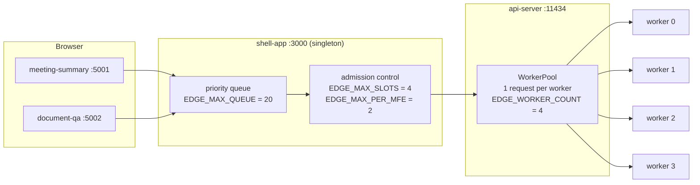
```mermaid
flowchart LR
    subgraph browser["Browser"]
        M1["meeting-summary :5001"]
        M2["document-qa :5002"]
    end
    subgraph shellbox["shell-app :3000 (singleton)"]
        Q["priority queue<br/>EDGE_MAX_QUEUE = 20"]
        S["admission control<br/>EDGE_MAX_SLOTS = 4<br/>EDGE_MAX_PER_MFE = 2"]
    end
    subgraph apibox["api-server :11434"]
        P["WorkerPool<br/>1 request per worker<br/>EDGE_WORKER_COUNT = 4"]
    end
    W1["worker 0"]
    W2["worker 1"]
    W3["worker 2"]
    W4["worker 3"]

    M1 --> Q
    M2 --> Q
    Q --> S
    S --> P
    P --> W1 & W2 & W3 & W4
```

`EDGE_MAX_SLOTS` must not exceed `EDGE_WORKER_COUNT`. If it does, the shell admits work the
api-server then rejects with `no_ready_workers`, and a wait that should have been a queue position
becomes a 503.

`EDGE_MAX_PER_MFE` must be strictly less than `EDGE_MAX_SLOTS`, or the fairness rule does nothing.
With both at 2, one MFE can legally hold every slot, which is the case the fairness rule exists to prevent.
Shipped values are 4 slots, 4 workers, 2 per MFE, so one MFE tops out at half the pool.

Nothing validates either invariant at startup. Both are yours to get right in `.env`.

### 7.2 A request's lifecycle

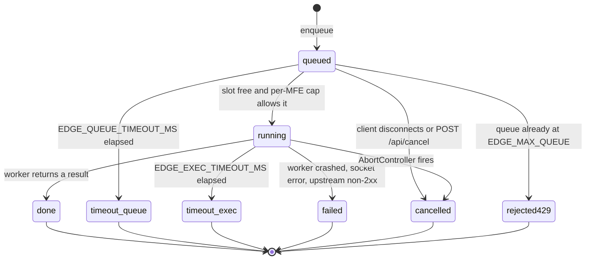
```mermaid
stateDiagram-v2
    [*] --> queued: enqueue
    queued --> rejected429: queue already at EDGE_MAX_QUEUE
    queued --> timeout_queue: EDGE_QUEUE_TIMEOUT_MS elapsed
    queued --> cancelled: client disconnects or POST /api/cancel
    queued --> running: slot free and per-MFE cap allows it
    running --> done: worker returns a result
    running --> timeout_exec: EDGE_EXEC_TIMEOUT_MS elapsed
    running --> failed: worker crashed, socket error, upstream non-2xx
    running --> cancelled: AbortController fires
    done --> [*]
    timeout_queue --> [*]
    timeout_exec --> [*]
    failed --> [*]
    cancelled --> [*]
    rejected429 --> [*]
```

Every terminal state writes an entry into the `done` map (`backend/shell-app/scheduler.js:341-344`), which
is what `GET /api/queue-status` reads afterwards. That map is evicted by TTL
(`EDGE_DONE_TTL_MS`) and then hard-capped at `EDGE_DONE_MAX_ENTRIES`
(`backend/shell-app/scheduler.js:347-358`). Without that it grew for the life of the shell process.

### 7.3 Admission

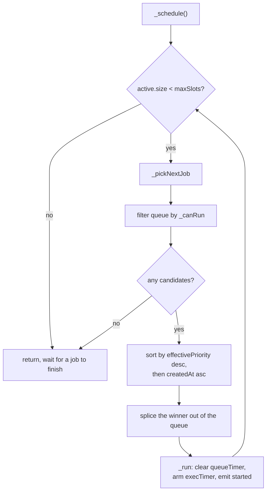
```mermaid
flowchart TD
    A["_schedule()"] --> B{"active.size < maxSlots?"}
    B -- no --> Z["return, wait for a job to finish"]
    B -- yes --> C["_pickNextJob"]
    C --> D["filter queue by _canRun"]
    D --> E{"any candidates?"}
    E -- no --> Z
    E -- yes --> F["sort by effectivePriority desc,<br/>then createdAt asc"]
    F --> G["splice the winner out of the queue"]
    G --> H["_run: clear queueTimer,<br/>arm execTimer, emit started"]
    H --> B
```

`_canRun` is two checks and nothing more (`backend/shell-app/scheduler.js:225-229`):

```js
if (this.active.size >= this.maxSlots) return false;
const current = this.perMfeActive.get(job.mfeId) || 0;
return current < this.maxPerMfe;
```

`mfeId` is whatever the client sent. A frontend that lies about its `mfeId` gets a fresh per-MFE
budget. The cap is a fairness mechanism between cooperating apps, not a security boundary.

### 7.4 Priority and aging

Three priorities with base scores 300, 200 and 100 (`backend/shell-app/scheduler.js:196-200`). Every
`EDGE_AGING_MS` a job spends queued adds one point (`backend/shell-app/scheduler.js:202-205`):

```
effective = base(priority) + floor((now - createdAt) / EDGE_AGING_MS)
```

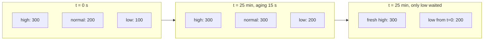
```mermaid
flowchart LR
    subgraph t0["t = 0 s"]
        A0["high: 300"]
        B0["normal: 200"]
        C0["low: 100"]
    end
    subgraph t1["t = 25 min, aging 15 s"]
        A1["high: 300"]
        B1["normal: 300"]
        C1["low: 200"]
    end
    subgraph t2["t = 25 min, only low waited"]
        A2["fresh high: 300"]
        C2["low from t=0: 200"]
    end
    t0 --> t1 --> t2
```

A low-priority job overtakes a freshly arrived normal one after about 100 aging intervals, which at
the shipped 15 s is roughly 25 minutes. That's slow, and it's the setting to turn down if you want
starvation protection that actually bites within a session. Ties break on arrival time, so equal
scores are FIFO.

The Document Q&A page has a "Burst LOW x5" button (`clients/document-qa/public/app.js:216-221`) that
fires five low-priority requests at once. It exists to make the queue positions visible in the
browser.

### 7.5 Estimated wait

```
batchesAhead = ceil(position / maxSlots)
estimatedWaitMs = batchesAhead * avgDurationMs
```

`avgDurationMs` is an exponentially weighted average, 70 percent old and 30 percent new, updated
after every job finishes (`backend/shell-app/scheduler.js:329`). It's seeded from `EDGE_DEFAULT_JOB_MS`, so
the first few estimates are that constant. The estimate ignores priority entirely, so a low-priority
job's ETA is optimistic whenever higher-priority work keeps arriving.

### 7.6 The two timeouts

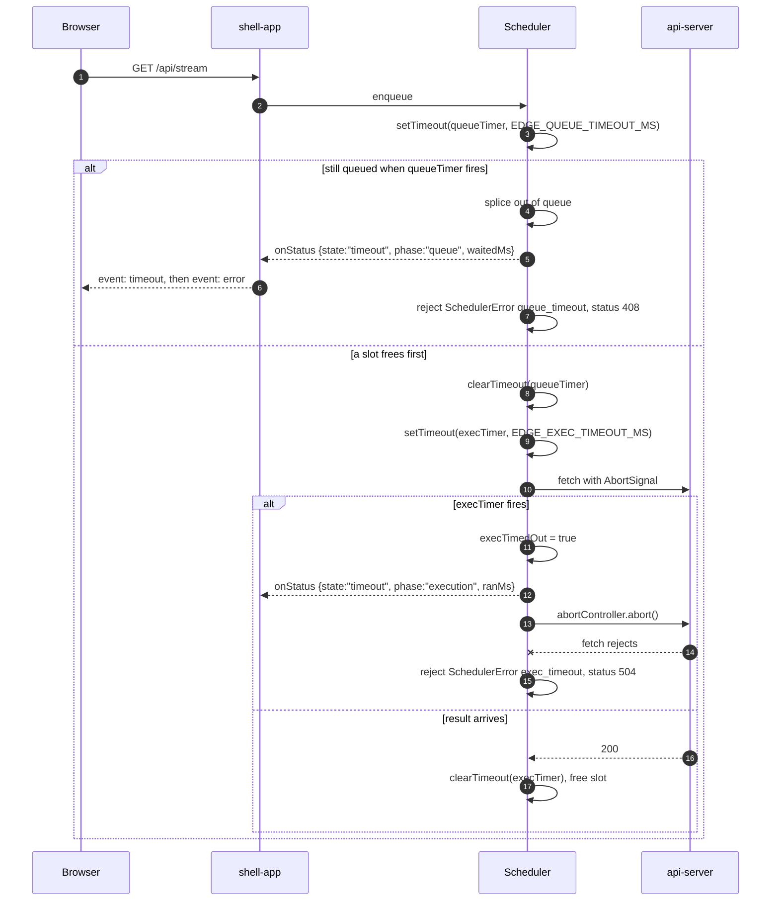
```mermaid
sequenceDiagram
    autonumber
    participant B as Browser
    participant S as shell-app
    participant SC as Scheduler
    participant A as api-server

    B->>S: GET /api/stream
    S->>SC: enqueue
    SC->>SC: setTimeout(queueTimer, EDGE_QUEUE_TIMEOUT_MS)

    alt still queued when queueTimer fires
        SC->>SC: splice out of queue
        SC-->>S: onStatus {state:"timeout", phase:"queue", waitedMs}
        S-->>B: event: timeout, then event: error
        SC->>SC: reject SchedulerError queue_timeout, status 408
    else a slot frees first
        SC->>SC: clearTimeout(queueTimer)
        SC->>SC: setTimeout(execTimer, EDGE_EXEC_TIMEOUT_MS)
        SC->>A: fetch with AbortSignal
        alt execTimer fires
            SC->>SC: execTimedOut = true
            SC-->>S: onStatus {state:"timeout", phase:"execution", ranMs}
            SC->>A: abortController.abort()
            A--xSC: fetch rejects
            SC->>SC: reject SchedulerError exec_timeout, status 504
        else result arrives
            A-->>SC: 200
            SC->>SC: clearTimeout(execTimer), free slot
        end
    end
```

| Phase | Bound by | SSE payload | HTTP on `/api/infer` | Slot freed by |
|---|---|---|---|---|
| queue | `EDGE_QUEUE_TIMEOUT_MS` (30 s) | `timeout` with `phase: "queue"`, `waitedMs` | 408 | job never held one |
| execution | `EDGE_EXEC_TIMEOUT_MS` (120 s) | `timeout` with `phase: "execution"`, `ranMs` | 504 | aborting the `AbortController` |

The queue timer fires blind and then checks whether the job is still in the queue array
(`backend/shell-app/scheduler.js:66-70`). If it isn't, the callback returns and does nothing. `_run` also
clears it explicitly (`backend/shell-app/scheduler.js:257`).

Before the execution timeout existed, a wedged in-flight request held its slot for the life of the
process. Nothing downstream covered it, because `backend/api-server/ipc.js` only has socket connect
timeouts and the worker has none at all.

Set `EDGE_EXEC_TIMEOUT_MS` for the slowest tier on your device ladder, not the fastest. A legitimate
CUDA-to-CPU fallback is much slower — by how much is unmeasured, no GPU inference having been run
on this machine — and a timeout tuned for the GPU will kill it as a stuck job.

### 7.7 Backpressure the client can act on

Every transient failure carries `retryAfterSeconds`, `retryable`, or both. Both MFEs honour them
through `public/retry.js`, which is byte-identical in the two apps. Section 14 covers the policy.

---

## 8. Crash recovery

### 8.1 A worker dies mid-request

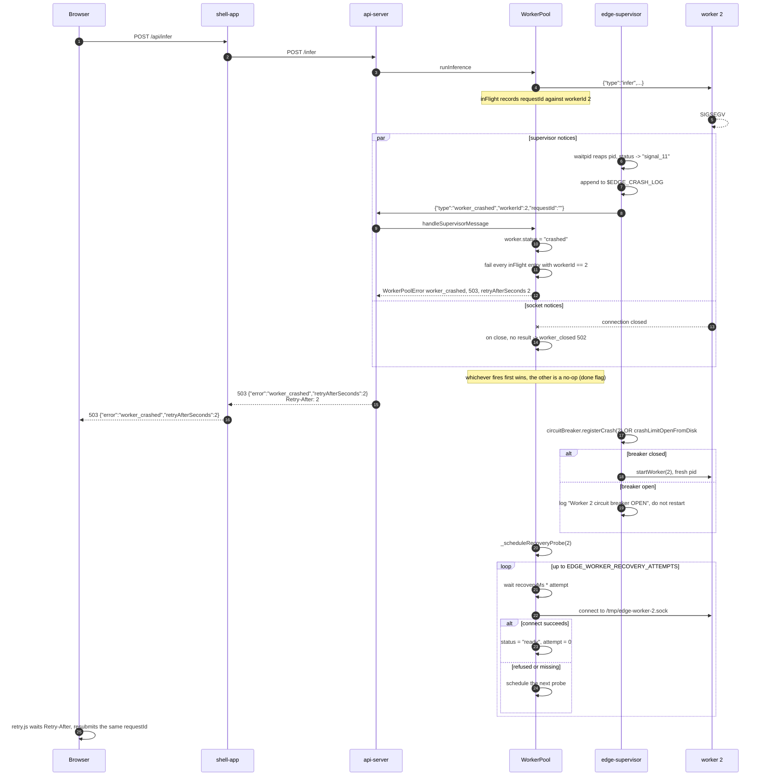
```mermaid
sequenceDiagram
    autonumber
    participant B as Browser
    participant S as shell-app
    participant A as api-server
    participant P as WorkerPool
    participant SUP as edge-supervisor
    participant W as worker 2

    B->>S: POST /api/infer
    S->>A: POST /infer
    A->>P: runInference
    P->>W: {"type":"infer",...}
    Note over P: inFlight records requestId against workerId 2
    W-->>W: SIGSEGV

    par supervisor notices
        SUP->>SUP: waitpid reaps pid, status -> "signal_11"
        SUP->>SUP: append to $EDGE_CRASH_LOG
        SUP->>A: {"type":"worker_crashed","workerId":2,"requestId":""}
        A->>P: handleSupervisorMessage
        P->>P: worker.status = "crashed"
        P->>P: fail every inFlight entry with workerId == 2
        P-->>A: WorkerPoolError worker_crashed, 503, retryAfterSeconds 2
    and socket notices
        W--xP: connection closed
        P->>P: on close, no result -> worker_closed 502
    end

    Note over P: whichever fires first wins, the other is a no-op (done flag)

    A-->>S: 503 {"error":"worker_crashed","retryAfterSeconds":2}<br/>Retry-After: 2
    S-->>B: 503 {"error":"worker_crashed","retryAfterSeconds":2}

    SUP->>SUP: circuitBreaker.registerCrash(2) OR crashLimitOpenFromDisk
    alt breaker closed
        SUP->>W: startWorker(2), fresh pid
    else breaker open
        SUP->>SUP: log "Worker 2 circuit breaker OPEN", do not restart
    end

    P->>P: _scheduleRecoveryProbe(2)
    loop up to EDGE_WORKER_RECOVERY_ATTEMPTS
        P->>P: wait recoveryMs * attempt
        P->>W: connect to /tmp/edge-worker-2.sock
        alt connect succeeds
            P->>P: status = "ready", attempt = 0
        else refused or missing
            P->>P: schedule the next probe
        end
    end

    B->>B: retry.js waits Retry-After, resubmits the same requestId
```

Two independent paths detect the death, and both call the same `fail` closure. The `done` flag in
`_runRequest` and `failInFlight` makes the second one a no-op
(`backend/api-server/ipc.js:130-140`, `backend/api-server/ipc.js:368-375`).

### 8.2 The circuit breaker

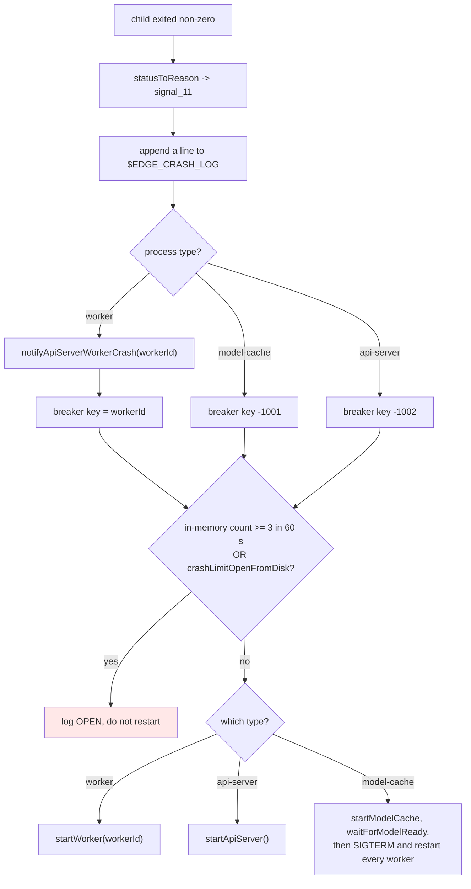
```mermaid
flowchart TD
    A["child exited non-zero"] --> B["statusToReason -> signal_11"]
    B --> C["append a line to $EDGE_CRASH_LOG"]
    C --> D{"process type?"}
    D -- worker --> E["notifyApiServerWorkerCrash(workerId)"]
    D -- model-cache --> M["breaker key -1001"]
    D -- api-server --> N["breaker key -1002"]
    E --> F["breaker key = workerId"]
    F --> G{"in-memory count >= 3 in 60 s<br/>OR crashLimitOpenFromDisk?"}
    M --> G
    N --> G
    G -- yes --> H["log OPEN, do not restart"]
    G -- no --> I{"which type?"}
    I -- worker --> J["startWorker(workerId)"]
    I -- api-server --> K["startApiServer()"]
    I -- model-cache --> L["startModelCache, waitForModelReady,<br/>then SIGTERM and restart every worker"]

    style H fill:#ffe8e8
```

Threshold and window are compile-time constants: three crashes in sixty seconds
(`backend/supervisor/supervisor.h:48-49`). The restart decision ORs the in-memory deque with a re-read of
the crash log from disk (`backend/supervisor/supervisor.cpp:341`), so the rule survives a supervisor
restart. `crashLimitOpenFromDisk` parses the log with three regexes and counts lines newer than
`now - 60` that match the process type, plus the worker id when the type is `worker`
(`backend/supervisor/supervisor.cpp:483-517`).

Consequence worth knowing. `$EDGE_CRASH_LOG` is append-only and nothing rotates it. A long-lived
deployment reparses a growing file on every crash. It's a `/tmp` path by default, so a reboot clears
it.

A model-cache crash is the expensive one. It restarts the cache, waits for `ready=1` again, then
SIGTERMs and restarts every worker (`backend/supervisor/supervisor.cpp:402-420`), because the workers'
mappings point at a shared-memory object that no longer exists.

### 8.3 Worker states in the pool

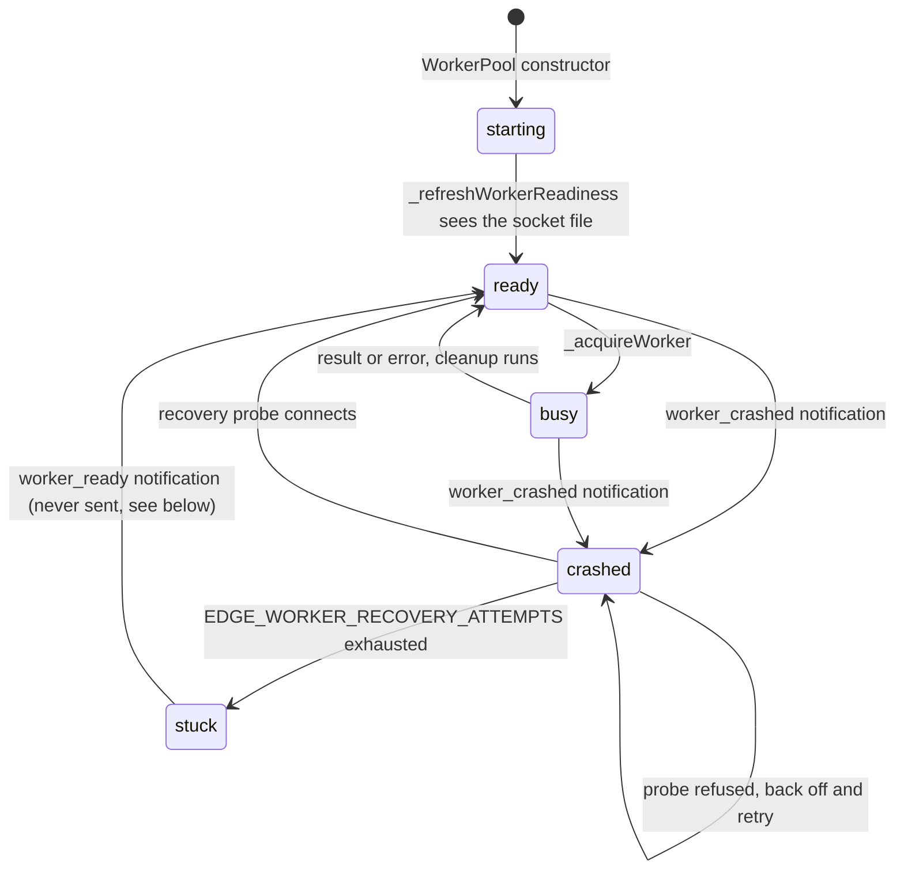
```mermaid
stateDiagram-v2
    [*] --> starting: WorkerPool constructor
    starting --> ready: _refreshWorkerReadiness sees the socket file
    ready --> busy: _acquireWorker
    busy --> ready: result or error, cleanup runs
    ready --> crashed: worker_crashed notification
    busy --> crashed: worker_crashed notification
    crashed --> ready: recovery probe connects
    crashed --> crashed: probe refused, back off and retry
    crashed --> stuck: EDGE_WORKER_RECOVERY_ATTEMPTS exhausted
    stuck --> ready: worker_ready notification (never sent, see below)
```

`_refreshWorkerReadiness` runs on every acquire and flips any non-busy, non-crashed worker between
`starting` and `ready` purely on whether the socket file exists
(`backend/api-server/ipc.js:251-258`). That's a file existence check, not a liveness check. The recovery
probe is the one that actually connects.

Recovery backs off linearly: `EDGE_WORKER_RECOVERY_MS * attempt`, so with the shipped 2000 ms and 10
attempts the last probe lands about 110 seconds after the crash
(`backend/api-server/ipc.js:294-319`). A stale socket file left behind by a dead process refuses the
connection, which is exactly the case the old bare timer got wrong: it flipped the worker back to
`ready` after 2000 ms whether or not a replacement had started, so a restart the breaker had
suppressed still got handed requests.

### 8.4 Two contradictions in the recovery path

**`worker_ready` has no sender.** `backend/api-server/ipc.js:300` says "only a supervisor `worker_ready`
notification brings it back now", and `handleSupervisorMessage` handles both `worker_ready` and
`worker_restarted` (`backend/api-server/ipc.js:70-78`). The supervisor's only outbound message is
`worker_crashed` (`backend/supervisor/supervisor.cpp:531`). Once a worker exhausts its recovery attempts, in
practice nothing brings it back short of restarting the api-server. A supervisor-side notify on
successful `startWorker` would close that.

**`CircuitBreaker::isOpen` is never called.** It's declared at `backend/supervisor/supervisor.h:45`, defined
at `backend/supervisor/supervisor.cpp:58-64`, and has no call site. The live check is `registerCrash`'s
return value, which reports "this crash was the third", so the breaker is queried only at the moment
it trips.

### 8.5 What the crash log is for

```bash
pkill -f edge-inference-worker
tail -3 ./logs/edge-crash.log
```

```json
{"ts":1755856320,"pid":48213,"type":"worker","workerId":2,"status":15,"reason":"signal_15"}
```

`pkill` sends SIGTERM, so the reason is `signal_15`. A real segfault reads `signal_11`. A Windows access violation is the same class of fault, and `signal_11` is its Linux equivalent. The
recovery contract is the same, only the fault code and the process API differ.

---

## 9. Device fallback and degraded mode

The full treatment, including the decision trees for the Qualcomm NPU and Apple ANE cases and the
escalation-order tradeoffs, is in [`docs/device-fallback.md`](docs/device-fallback.md). This section
is the summary and the pointer.

`backend/inference-worker/deviceLadder.cpp` owns tier selection, quarantine and the health-check gate. The
worker asks it for a tier at startup (`backend/inference-worker/worker.cpp:243-258`) and escalates through
it whenever a generate call reports a fault (`backend/inference-worker/worker.cpp:263-276`).

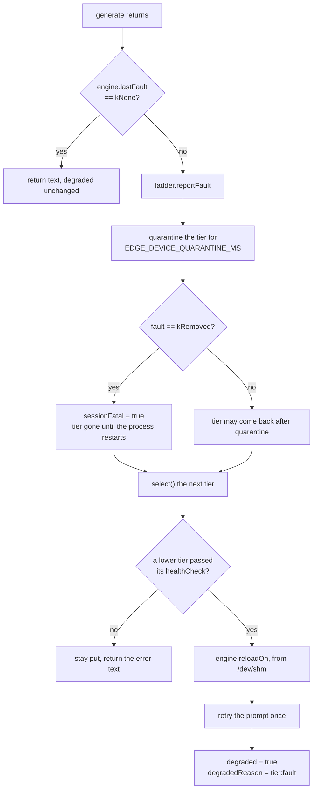
```mermaid
flowchart TD
    A["generate returns"] --> B{"engine.lastFault<br/>== kNone?"}
    B -- yes --> C["return text, degraded unchanged"]
    B -- no --> D["ladder.reportFault"]
    D --> E["quarantine the tier for<br/>EDGE_DEVICE_QUARANTINE_MS"]
    E --> F{"fault == kRemoved?"}
    F -- yes --> G["sessionFatal = true<br/>tier gone until the process restarts"]
    F -- no --> H["tier may come back after quarantine"]
    G --> I["select() the next tier"]
    H --> I
    I --> J{"a lower tier passed<br/>its healthCheck?"}
    J -- no --> K["stay put, return the error text"]
    J -- yes --> L["engine.reloadOn, from /dev/shm"]
    L --> M["retry the prompt once"]
    M --> N["degraded = true<br/>degradedReason = tier:fault"]
```

Four things to carry away.

**`degraded` is measured against a startup baseline, not against `activeDevice_ == "cpu"`.** The
first successful `select()` records `baselineIndex_` (`backend/inference-worker/deviceLadder.cpp:106-110`),
and `degraded()` is `activeIndex_ > baselineIndex_` (`backend/inference-worker/deviceLadder.h:54`). A
CPU-only machine is not degraded. A machine that fell off `cuda` onto `cpu` is. Reporting it any
other way makes the flag meaningless.

**A quarantine expiring isn't enough to bring a tier back.** `select()` calls `healthCheck()` on
every candidate (`backend/inference-worker/deviceLadder.cpp:101-103`), and a tier whose probe fails stays
out even after its window closes.

**A tier with no backend compiled in fails its probe and gets skipped.** `probeTier` returns true
for `cpu`, checks `access("/dev/nvidia0")` for `cuda`, and returns false for everything else
including `npu`, `ane`, `metal` and `remote` (`backend/inference-worker/deviceLadder.cpp:13-22`). So
declaring `EDGE_DEVICE_LADDER=npu,cuda,cpu` on this Linux box selects `cuda` and reports not
degraded, which is the correct answer.

**Fallback adds fields, it never renames or removes them.** The `result` frame gains
`degradedReason` and nothing else changes. Over HTTP the same information rides on
`X-Inference-Device`, `X-Inference-Degraded`, `X-Latency-Mode` and `X-Degraded-Reason`.

Exercise the path without the hardware:

```bash
EDGE_SIMULATE_DEVICE_FAULT=cuda:removed  # ERROR_DEVICE_REMOVED on cuda, session-fatal
EDGE_SIMULATE_DEVICE_FAULT=unsupported   # kCMErrorUnsupportedOperation, quarantine only
EDGE_SIMULATE_DEVICE_FAULT=runtime       # generic backend fault, quarantine only
```

The value is `[<tier>:]<fault>`. Without a tier it faults whichever tier runs first. Either way
it fires at most once per worker (`backend/inference-worker/inferEngine.cpp:36-63`), so the tier
the ladder falls to answers normally and a respawned cpu worker that inherits the same
environment is never faulted by a `cuda:` target.

One rough edge. `DeviceLadder` stores `probeInterval_` from `EDGE_DEVICE_PROBE_INTERVAL_MS`
(`backend/inference-worker/deviceLadder.cpp:69`) and never reads it. Probing happens on demand inside
`select()`, not on a timer, so that variable currently has no effect.

---

## 10. Idempotency and the request registry

`backend/api-server/requestRegistry.js` does two jobs from one data structure.

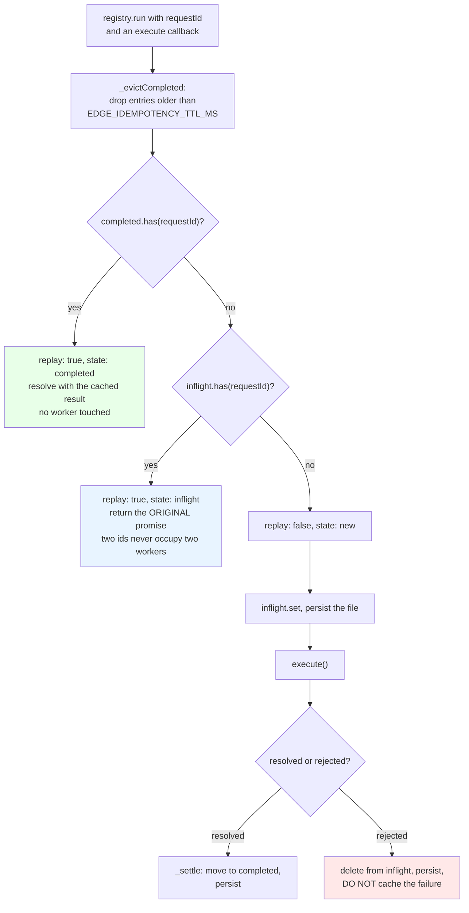
```mermaid
flowchart TD
    A["registry.run with requestId<br/>and an execute callback"] --> B["_evictCompleted:<br/>drop entries older than<br/>EDGE_IDEMPOTENCY_TTL_MS"]
    B --> C{"completed.has(requestId)?"}
    C -- yes --> D["replay: true, state: completed<br/>resolve with the cached result<br/>no worker touched"]
    C -- no --> E{"inflight.has(requestId)?"}
    E -- yes --> F["replay: true, state: inflight<br/>return the ORIGINAL promise<br/>two ids never occupy two workers"]
    E -- no --> G["replay: false, state: new"]
    G --> H["inflight.set, persist the file"]
    H --> I["execute()"]
    I --> J{"resolved or rejected?"}
    J -- resolved --> K["_settle: move to completed,<br/>persist"]
    J -- rejected --> L["delete from inflight, persist,<br/>DO NOT cache the failure"]

    style D fill:#e8ffe8
    style F fill:#e8f4ff
    style L fill:#ffe8e8
```

**Concurrent submissions coalesce.** Two requests with one id share a single inference run, because
the second gets the first one's promise back (`backend/api-server/requestRegistry.js:73-77`).

**Successes are cached for `EDGE_IDEMPOTENCY_TTL_MS`.** A replay after success returns the original
answer, with `X-Idempotent-Replay: true` and `replay: true` in the body. Send a different prompt
under a used id inside the window and you get the first answer back. That's the contract, not a bug.

**Failures are deliberately not cached** (`backend/api-server/requestRegistry.js:86-92`). Caching them
would make an id un-retryable forever, and the whole point of the same-id retry is that the client
can come back.

### The streaming replay problem

Tokens already sent can't be un-sent, so the streaming route doesn't use `run()`'s coalescing
blindly. It calls `lookup()` first (`backend/api-server/routes/infer.js:102`) and branches:

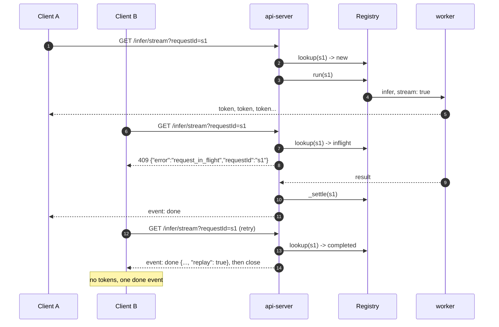
```mermaid
sequenceDiagram
    autonumber
    participant C1 as Client A
    participant C2 as Client B
    participant A as api-server
    participant R as Registry
    participant W as worker

    C1->>A: GET /infer/stream?requestId=s1
    A->>R: lookup(s1) -> new
    A->>R: run(s1)
    R->>W: infer, stream: true
    W-->>C1: token, token, token...

    C2->>A: GET /infer/stream?requestId=s1
    A->>R: lookup(s1) -> inflight
    A-->>C2: 409 {"error":"request_in_flight","requestId":"s1"}

    W-->>A: result
    A->>R: _settle(s1)
    A-->>C1: event: done

    C2->>A: GET /infer/stream?requestId=s1 (retry)
    A->>R: lookup(s1) -> completed
    A-->>C2: event: done {..., "replay": true}, then close
    Note over C2: no tokens, one done event
```

A live duplicate gets a 409 rather than a second worker. A finished one gets the whole answer in a
single `done` event.

### The in-flight file

`$EDGE_INFLIGHT_PATH` names what was open. It's rewritten on every state change with a temp file
plus rename (`backend/api-server/requestRegistry.js:132-137`), so a reader never sees a half-written file.
At construction the registry reads whatever the previous process left behind and exposes it under
`/health` as `requests.orphanedFromPreviousRun`.

It replaced `EDGE_LAST_REQUEST_PATH`, which was write-only, held one id, and got overwritten by
every request. Under any concurrency it could not say what was in flight, and nothing ever read it
back.

Two things it does not do. The writes are asynchronous and fire-and-forget, so a hard kill can lose
the last update. And orphans are reported, never resumed. They're a diagnostic, not a work queue.

---

## 11. The shared-memory model cache

Four workers loading a 2.3 GB GGUF each costs about 9.5 GB. ServeInfer loads it once.

```mermaid
sequenceDiagram
    autonumber
    participant MC as edge-model-cache
    participant DISK as backend/models/*.gguf
    participant SHM as /dev/shm/edge-model-weights
    participant META as /dev/shm/edge-model-weights.meta
    participant W as worker[i]
    participant L as llama

    MC->>DISK: open O_RDONLY, fstat -> 2393231072
    MC->>SHM: shm_open O_CREAT|O_RDWR, ftruncate, mmap RW
    MC->>META: shm_open O_CREAT|O_RDWR, ftruncate 256, mmap RW
    MC->>META: magic "EDGE", version 1, modelSize, ready = 0
    loop 1 MiB buffer
        MC->>DISK: read
        MC->>SHM: memcpy at offset
        MC->>MC: checksum = FNV-1a fold
    end
    MC->>META: checksum, loadedAt, ready = 1
    MC->>SHM: msync MS_SYNC
    MC->>META: msync MS_SYNC

    W->>META: shm_open O_RDONLY, mmap 256 bytes
    W->>W: magic == "EDGE" and ready == 1 and modelSize > 0?
    W->>SHM: shm_open O_RDONLY, fstat
    W->>W: mapped size == header.modelSize? else fail
    W->>SHM: mmap PROT_READ MAP_SHARED
    W->>W: access("/dev/shm/edge-model-weights", R_OK) ok
    W->>W: config_.modelPath = that path
    W->>L: llama_model_load_from_file(/dev/shm/edge-model-weights)
    L->>SHM: llama mmaps the same pages
```

### The header

`SharedModelHeader` is 256 bytes, enforced by a `static_assert`
(`backend/model-cache/model_cache.h:8-18`):

| Field | Type | Meaning |
|---|---|---|
| `magic[8]` | `char` | first four bytes are `EDGE`, the rest are zero |
| `modelSize` | `uint64` | GGUF size in bytes, must equal the mapped segment size |
| `checksum` | `uint64` | FNV-1a over the whole file |
| `loadedAt` | `int64` | Unix seconds when `ready` flipped to 1 |
| `version` | `uint32` | header format version, currently 1 |
| `ready` | `uint8` | 0 while copying, 1 when the bytes and checksum are final |
| `reserved[219]` | `uint8` | padding to 256 |

The header lives in its own shared-memory object, `$EDGE_SHM_NAME.meta`. Keeping it out of the
weights object means a reader can map 256 bytes to check readiness without mapping 2.3 GB.

The checksum is FNV-1a, offset basis `14695981039346656037`, prime `1099511628211`
(`backend/model-cache/model_cache.cpp:20-21`), folded chunk by chunk as the file is copied
(`backend/model-cache/model_cache.cpp:58-65`). It's an integrity marker, not a security control. Nothing
currently recomputes it to verify: the worker reads it and logs it
(`backend/inference-worker/worker.cpp:236-237`), and validates size and the ready flag instead.

### Why the workers repoint their model path

```mermaid
flowchart LR
    A["worker starts with<br/>--model-path ./backend/models/....gguf"] --> B["attachSharedMemory"]
    B --> C{"/dev/shm/edge-model-weights<br/>readable?"}
    C -- yes --> D["config_.modelPath =<br/>/dev/shm/edge-model-weights"]
    C -- no --> E["keep the disk path"]
    D --> F["llama loads from shared memory"]
    E --> G["llama loads from disk"]
    F --> H["restart cost: map existing pages"]
    G --> I["restart cost: full disk read"]

    style H fill:#e8ffe8
    style I fill:#fff4e8
```

`backend/inference-worker/worker.cpp:231-234` is the whole trick. A worker restart maps pages that are
already resident instead of re-reading 2.3 GB from disk, and N workers share one physical copy.

### Lifecycle notes

The model cache holds its mappings and blocks in `waitUntilStopped()` until a signal arrives
(`backend/model-cache/model_cache.cpp:52-56`). On a clean exit its destructor `shm_unlink`s both objects
(`backend/model-cache/model_cache.cpp:220-230`). On a hard kill it doesn't, which is why `scripts/stop.sh`
removes `/dev/shm/${SHM_NAME#/}` and its `.meta` explicitly (`scripts/stop.sh:161`). A leftover
object from a previous run with a different model size is a common cause of a worker refusing to
start with `shared memory size mismatch`.

Verify there's one copy:

```bash
ls -l /dev/shm/edge-model-weights /dev/shm/edge-model-weights.meta
```

```
-rw-rw-rw- 1 prawesh prawesh 2393231072 Aug 22 13:18 /dev/shm/edge-model-weights
-rw-rw-rw- 1 prawesh prawesh        256 Aug 22 13:18 /dev/shm/edge-model-weights.meta
```

One 2.3 GB object, not four.

---

## 12. IPC conventions

Everything between processes is newline-delimited JSON over `AF_UNIX`. No length prefixes, no
framing beyond `\n`, no protocol version field.

```mermaid
flowchart TB
    SUP["edge-supervisor"]
    API["api-server"]
    W0["worker 0"]
    W1["worker 1"]
    MC["edge-model-cache"]

    W0 -- "heartbeat every 50 ms<br/>$EDGE_SUPERVISOR_SOCK" --> SUP
    W1 -- "heartbeat every 50 ms<br/>$EDGE_SUPERVISOR_SOCK" --> SUP
    SUP -- "worker_crashed<br/>$EDGE_API_NOTIFY_SOCK" --> API
    API -- "infer, one connection per request<br/>$EDGE_WORKER_SOCKET_PREFIX0.sock" --> W0
    API -- "infer, one connection per request<br/>$EDGE_WORKER_SOCKET_PREFIX1.sock" --> W1
    MC -.->|"$EDGE_SHM_NAME and its .meta"| W0
    MC -.->|"$EDGE_SHM_NAME and its .meta"| W1

    style SUP fill:#e8f4ff
    style API fill:#fff4e8
```

| Path variable | Direction | Server | Carries | Notes |
|---|---|---|---|---|
| `EDGE_SUPERVISOR_SOCK` | worker to supervisor | supervisor | `heartbeat` | drained and discarded, not a liveness signal |
| `EDGE_API_NOTIFY_SOCK` | supervisor to api-server | api-server | `worker_crashed` | drives `_markWorkerCrashed`, 503 plus `Retry-After` |
| `EDGE_WORKER_SOCKET_PREFIX<id>.sock` | api-server to worker | worker | `infer`, then `token`, `result` or `error` | one connection per request, closed after the result |
| `EDGE_SHM_NAME` and `.meta` | model-cache to workers | not a socket | GGUF bytes plus the 256-byte header | POSIX shared memory |

Socket creation and teardown are symmetric on both sides. The supervisor unlinks its path before
binding (`backend/supervisor/supervisor.cpp:126-128`) and again on shutdown
(`backend/supervisor/supervisor.cpp:422-430`). The worker does the same
(`backend/inference-worker/worker.cpp:332`, `backend/inference-worker/worker.cpp:83-85`). The api-server unlinks
before binding (`backend/api-server/server.js:66-72`) and registers cleanup on SIGTERM, SIGINT and exit
(`backend/api-server/server.js:115-117`). Leftover socket files are still the commonest cause of a failed
boot, which is why `stop.sh` removes them all.

### The C++ side has no JSON library

The worker extracts fields with `std::regex` (`backend/inference-worker/worker.cpp:22-67`):

```cpp
const std::regex pattern("\"" + key + "\"\\s*:\\s*\"((?:\\\\.|[^\"\\\\])*)\"");
```

and builds replies by string concatenation with a hand-rolled `jsonEscape` that handles exactly five
characters: backslash, quote, newline, carriage return and tab
(`backend/inference-worker/worker.cpp:508-534`). The supervisor has its own identical copy
(`backend/supervisor/supervisor.cpp:550-576`).

Three consequences.

**Adding a field to a worker message means editing both the extractor and the emitter.** They're
separate code with no shared schema.

**The extractor is order-independent and type-loose.** `extractString` finds the first match of
`"key": "..."` anywhere in the line. A prompt whose text contains the literal characters
`"requestId":"x"` would be found by the `requestId` pattern if it appeared first. In practice the
api-server always emits `requestId` before `prompt`, so the real ordering saves it.

**Control characters below 0x20 other than the three named ones pass through unescaped.** Model
output rarely contains them, but a prompt with a raw `\x01` produces a line that `JSON.parse` rejects
on the Node side, which surfaces as `worker_bad_json` and a 502.

The Node side is the mirror image: `JSON.stringify` out, and a manual buffer split on `\n` with
`JSON.parse` per line in (`backend/api-server/ipc.js:159-212`).

---

## 13. Configuration

Config is environment variables only. There are deliberately no fallback literals anywhere in the
Node code.

```mermaid
flowchart TD
    A["process starts"] --> B["backend/config/env.js records<br/>initialKeys = Object.keys(process.env)"]
    B --> C["loadFile('.env.example', override = false)"]
    C --> D["loadFile('.env', override = true)"]
    D --> E{"requiredEnv(name)"}
    E -- "undefined or empty string" --> F["throw: Missing required<br/>environment variable: NAME"]
    E -- present --> G["return the string"]
    G --> H{"numberEnv?"}
    H -- "Number(raw) not finite" --> I["throw: must be a number"]
    H -- finite --> J["return the number"]

    style F fill:#ffe8e8
    style I fill:#ffe8e8
```

Precedence, highest first:

1. A variable already in the real process environment when `backend/config/env.js` loads. `loadFile` skips
   any key in `initialKeys` outright (`backend/config/env.js:39`).
2. `.env`, which is gitignored and overrides loaded values.
3. `.env.example`, which is tracked.

That ordering has a consequence you'll trip over exactly once. **A new config value must go into
`.env.example`, not just `.env`, or a fresh clone crashes at startup.** `scripts/backend.sh`
also keeps its own explicit list of required variables that needs the same update.

The C++ side reads the same variables, through `backend/ipc/paths.h` for the paths and `getenv` directly for
the rest (`backend/inference-worker/main.cpp:63-91`, `backend/supervisor/main.cpp:45-50`). C++ has no `requiredEnv`
equivalent: a missing variable becomes an empty string and each `main` checks the ones it needs.

### Every variable

Meaning and what breaks when it's missing or wrong. Values shown are the shipped `.env.example`
defaults.

#### Core runtime

| Variable | Default | Meaning | If missing or wrong |
|---|---|---|---|
| `EDGE_STATE_DIR` | `/tmp/edge-runtime` | directory for the five pidfiles | `scripts/backend.sh` aborts, `stop.sh` cannot find processes to kill |
| `EDGE_WORKER_COUNT` | `4` | size of the worker pool | `scripts/backend.sh` aborts, and if it exceeds `EDGE_MAX_SLOTS` you're paying for idle workers |
| `EDGE_MODEL_PATH` | `./backend/models/Phi-3-mini-4k-instruct-q4.gguf` | GGUF the model-cache reads, resolved to an absolute path by `scripts/backend.sh` | `scripts/backend.sh` aborts with `missing model file` |
| `EDGE_FORCE_CPU` | `0` | `1` collapses the ladder to `{"cpu"}` (`backend/inference-worker/worker.cpp:245-247`) | `scripts/backend.sh` aborts |
| `EDGE_LOG_LEVEL` | `info` | one of `debug`, `info`, `warn`, `error` | `requiredEnv` throws in both Node services |

#### Ports

| Variable | Default | Meaning | If missing or wrong |
|---|---|---|---|
| `EDGE_API_PORT` | `11434` | api-server, loopback only | `scripts/backend.sh` aborts if the port is taken |
| `EDGE_SHELL_PORT` | `3000` | shell-app, all interfaces | same |
| `EDGE_STATUS_DASHBOARD_PORT` | `3001` | dashboard | same |
| `EDGE_MEETING_MFE_PORT` | `5001` | meeting-summary static server | same |
| `EDGE_DOC_QA_MFE_PORT` | `5002` | document-qa static server | same |

Changing a port means changing its matching `*_URL` or `*_BASE` variable **and**
`EDGE_ALLOWED_MFE_ORIGINS`.

#### Service URLs

| Variable | Default | Meaning | If missing or wrong |
|---|---|---|---|
| `EDGE_API_BASE` | `http://127.0.0.1:11434` | where the shell and dashboard reach the api-server | shell throws at boot, every `/api/infer` fails |
| `EDGE_SHELL_PUBLIC_BASE` | `http://127.0.0.1:3000` | injected into each MFE's `/config.js` as `shellApiBase` | MFE servers throw at boot, browser calls go to the wrong host |
| `EDGE_MEETING_MFE_URL` | `http://127.0.0.1:5001` | dashboard reachability check | dashboard throws at boot |
| `EDGE_DOC_QA_MFE_URL` | `http://127.0.0.1:5002` | same | same |
| `EDGE_ALLOWED_MFE_ORIGINS` | four loopback origins | CORS allowlist, comma separated | a missing origin means CORS silently drops that MFE's requests |

The shipped `.env` adds `http://localhost:5173` to the allowlist for a Vite dev server. That entry
is not in `.env.example`.

#### Inference defaults

Read by the worker from the environment (`backend/inference-worker/main.cpp:66-77`), each overridable by a
command-line flag that `scripts/backend.sh` doesn't pass.

| Variable | Default | Meaning | If missing or wrong |
|---|---|---|---|
| `EDGE_MAX_TOKENS` | `512` | generation cap per request | worker falls back to its compiled default of 512 |
| `EDGE_TEMPERATURE` | `0.8` | sampler temperature | compiled default 0.8 |
| `EDGE_GPU_LAYERS` | `99` | layers offloaded when the tier is `cuda` | compiled default 99 |
| `EDGE_SEED` | `42` | dist sampler seed, so runs are reproducible | compiled default 42 |

#### Scheduler limits

| Variable | Default | Meaning | If missing or wrong |
|---|---|---|---|
| `EDGE_MAX_SLOTS` | `4` | global concurrent jobs in the shell | shell throws at boot, and exceeding `EDGE_WORKER_COUNT` turns queue waits into 503s |
| `EDGE_MAX_PER_MFE` | `2` | per-MFE concurrent cap | shell throws, and equal to `EDGE_MAX_SLOTS` makes the fairness rule inert |
| `EDGE_MAX_QUEUE` | `20` | queue depth before 429 | shell throws |
| `EDGE_AGING_MS` | `15000` | one priority point per interval waited | shell throws, and too large means aging never bites |
| `EDGE_QUEUE_TIMEOUT_MS` | `30000` | queued-wait bound, 408 | shell throws |
| `EDGE_DEFAULT_JOB_MS` | `8000` | seed for `avgDurationMs` | shell throws, only affects the first few ETAs |
| `EDGE_EXEC_TIMEOUT_MS` | `120000` | running-job bound, 504 | shell throws, and too small kills legitimate CPU-tier work |
| `EDGE_DONE_TTL_MS` | `300000` | how long a finished job stays queryable | shell throws |
| `EDGE_DONE_MAX_ENTRIES` | `500` | hard cap on the done map | shell throws |

#### IPC and runtime files

| Variable | Default | Meaning | If missing or wrong |
|---|---|---|---|
| `EDGE_SHM_NAME` | `/edge-model-weights` | POSIX shm object, mapped to `/dev/shm/edge-model-weights` | supervisor, model-cache and worker all refuse to start |
| `EDGE_SUPERVISOR_SOCK` | `/tmp/edge-supervisor.sock` | heartbeat listener | supervisor exits 1 |
| `EDGE_WORKER_SOCKET_PREFIX` | `/tmp/edge-worker-` | worker sockets are prefix + id + `.sock` | api-server throws, supervisor exits 1 |
| `EDGE_WORKER_CONNECT_TIMEOUT_MS` | `3000` | connect timeout and probe timeout | api-server throws |
| `EDGE_API_NOTIFY_SOCK` | `/tmp/edge-api-notify.sock` | crash notifications | api-server throws, crashes never reach in-flight requests |
| `EDGE_CRASH_LOG` | `./logs/edge-crash.log` | append-only crash record, re-read by the breaker | supervisor exits 1 |
| `EDGE_MODEL_CONFIG_PATH` | `/tmp/edge-model-config.json` | snapshot written at supervisor start | supervisor exits 1 |

#### Worker recovery

| Variable | Default | Meaning | If missing or wrong |
|---|---|---|---|
| `EDGE_WORKER_RECOVERY_MS` | `2000` | base probe delay, multiplied by the attempt number | api-server throws |
| `EDGE_WORKER_RECOVERY_ATTEMPTS` | `10` | probe attempts before giving up | api-server throws, and after the last one nothing brings the worker back |

#### Replay safety

| Variable | Default | Meaning | If missing or wrong |
|---|---|---|---|
| `EDGE_IDEMPOTENCY_TTL_MS` | `300000` | how long a successful result answers a replayed id | api-server throws |
| `EDGE_INFLIGHT_PATH` | `/tmp/edge-inflight.jsonl` | open-request registry, read back at boot | api-server throws |

#### Client retry policy

Read by the MFE static servers and handed to the browser through `/config.js`. The shell never sees
them.

| Variable | Default | Meaning | If missing or wrong |
|---|---|---|---|
| `EDGE_CLIENT_RETRY_ATTEMPTS` | `3` | total attempts per user action | MFE server throws at boot |
| `EDGE_CLIENT_RETRY_BASE_MS` | `500` | exponential backoff base and jitter width | same |
| `EDGE_CLIENT_RETRY_MAX_MS` | `8000` | backoff ceiling | same |

#### Device ladder

| Variable | Default | Meaning | If missing or wrong |
|---|---|---|---|
| `EDGE_DEVICE_LADDER` | `cuda,npu,ane,cpu,remote` | tier names, highest first | worker falls back to the compiled `{"cuda","npu","ane","cpu","remote"}`, an empty parse becomes `{"cpu"}` |
| `EDGE_DEVICE_QUARANTINE_MS` | `60000` | how long a faulted tier stays out | compiled default 60000 |
| `EDGE_DEVICE_PROBE_INTERVAL_MS` | `5000` | stored and never read, see section 9 | no effect |

#### Undocumented in `.env.example`

| Variable | Values | Meaning |
|---|---|---|
| `EDGE_SIMULATE_DEVICE_FAULT` | `[<tier>:]removed`, `unsupported`, `runtime` | injects one device fault on the named tier, for exercising the ladder |

---

## 14. Micro-frontends

Two browser apps, each on its own port, each served by a 61-line Node static server with no
dependencies.

```mermaid
flowchart TB
    subgraph b["Browser"]
        P1["Meeting Summariser page"]
        P2["Document Q&A page"]
    end
    subgraph static["Static servers"]
        S1["clients/meeting-summary/server.js :5001"]
        S2["clients/document-qa/server.js :5002"]
    end
    SHELL["shell-app :3000<br/>origin allowlist"]
    API["api-server :11434<br/>bound to 127.0.0.1"]

    P1 -- "GET /config.js, /index.html, /app.js" --> S1
    P2 -- "GET /config.js, /index.html, /app.js" --> S2
    S1 -- "injects shellApiBase + retry policy" --> P1
    S2 -- "injects shellApiBase + retry policy" --> P2
    P1 -- "fetch and EventSource" --> SHELL
    P2 -- "fetch and EventSource" --> SHELL
    SHELL --> API
    P1 -.->|"no route exists"| API
    P2 -.->|"no route exists"| API

    style API fill:#ffe8e8
```

### Why the MFEs never see the api-server

Three separate mechanisms, and all three have to hold.

**The api-server binds loopback only.** `app.listen(port, '127.0.0.1')` at
`backend/api-server/server.js:166`.

**The MFEs are never told where it is.** `/config.js` hands them `shellApiBase` and the retry
policy, and nothing else (`clients/document-qa/server.js:32-40`):

```js
window.MFE_CONFIG = {"shellApiBase":"http://127.0.0.1:3000","retry":{"attempts":3,"baseMs":500,"maxMs":8000}};
```

Injecting it at runtime rather than baking it into the HTML means a port change is a restart, not a
rebuild.

**The shell enforces an origin allowlist.** `EDGE_ALLOWED_MFE_ORIGINS` is split on commas into a
`Set` at boot (`backend/shell-app/server.js:32-37`) and checked per request. An origin that isn't on the
list gets no CORS headers, and the browser drops the response. A new MFE port that isn't added to
that variable fails silently, with a CORS error in the browser console and nothing at all in the
shell's log.

### The client retry policy

`public/retry.js` is byte-identical in both apps. One attempt is one `EventSource` lifecycle,
resolving on `done` and rejecting with the shell's error payload attached
(`clients/document-qa/public/app.js:95-162`).

```mermaid
stateDiagram-v2
    [*] --> attempt1: user clicks
    attempt1 --> success: done event
    attempt1 --> classify: error or cancelled event
    classify --> give_up: not retryable
    classify --> give_up: attempts exhausted
    classify --> give_up: user cancelled during backoff
    classify --> backoff: retryable and attempts left
    backoff --> attempt_n: wait, same requestId
    attempt_n --> success: done event
    attempt_n --> classify: error again
    success --> [*]
    give_up --> [*]
```

Retryable means `payload.retryable === true`, or the error code is in this set
(`clients/document-qa/public/retry.js:16-22`):

```
worker_crashed, no_ready_workers, queue_timeout, exec_timeout, scheduler_overloaded
```

Backoff takes the server's hint when there is one, otherwise exponential with jitter
(`clients/document-qa/public/retry.js:30-39`):

```js
if (hintSeconds > 0) return Math.min(hintSeconds * 1000, RETRY.maxMs);
const exponential = RETRY.baseMs * Math.pow(2, attempt - 1);
const jitter = Math.random() * RETRY.baseMs;
return Math.min(exponential + jitter, RETRY.maxMs);
```

The jitter is there so two MFEs knocked back by the same worker crash don't return in lockstep.

**Retries reuse the same `requestId` on purpose.** That's what makes the api-server's idempotency
cache useful: a retry that races a late success replays the cached answer instead of paying for a
second inference run. Both apps drop the partial answer the failed attempt left on screen before
retrying (`clients/meeting-summary/public/app.js:175-178`).

Cancelling breaks the retry loop rather than waiting out the backoff. The app adds the id to a
`cancelledRequests` set and `withRetry` checks it both before and after the sleep
(`clients/document-qa/public/retry.js:54-67`).

### What each app exercises

| App | Port | Transport | Priority | Exercises |
|---|---|---|---|---|
| Meeting Summariser | 5001 | SSE | always `high` | token streaming, stop mid-stream, token counting |
| Document Q&A | 5002 | SSE | `high` on Ask, `low` on Prefetch and Burst | queue positions, aging, per-MFE fairness, cancel |

The Document Q&A "Burst LOW x5" button is the fastest way to see the queue do anything. Press it and
watch positions 1 through 5 appear in the event log.

Both pages poll `/api/health` and `/api/agent-health` every two seconds to render their status pill.

---

## 15. Build and run

### Prerequisites

```bash
sudo apt update
sudo apt install -y build-essential cmake git curl python3-pip libssl-dev nodejs npm
sudo apt install -y nvidia-cuda-toolkit        # only for the CUDA tier
pip3 install -U huggingface-hub
```

### Download the model

Required before `make backend`, which aborts without it.

```bash
hf download microsoft/Phi-3-mini-4k-instruct-gguf \
  Phi-3-mini-4k-instruct-q4.gguf \
  --local-dir ./backend/models
```

### The Make targets

```bash
make run       # stop -> build -> start all three tiers. The usual one.
make build     # cmake C++ targets into build/, then npm install in the two node services
make backend   # the runtime tier alone: supervisor, model cache, workers, api-server, shell app
make clients   # the two sample apps
make dashboard # the operator status page
make stop      # stop every tier, remove sockets and /dev/shm objects
make restart   # identical to run
```

```mermaid
flowchart LR
    RUN["make run"] --> STOP["scripts/stop.sh"]
    STOP --> BUILD["scripts/build.sh"]
    BUILD --> START["scripts/backend.sh"]
    BUILD --> C1["cmake -S . -B build -DCMAKE_BUILD_TYPE=Release"]
    BUILD --> C2["cmake --build build -j nproc"]
    BUILD --> C3["npm install in api-server/"]
    BUILD --> C4["npm install in shell-app/"]
```

`make build` compiles the vendored llama.cpp with CUDA on, which takes several minutes cold. Only
`api-server` and `shell-app` have a `package.json`. The dashboard and both MFE servers use Node
builtins only, so there's nothing to install for them.

### Fast iteration without the real backend

```bash
cmake -S . -B build -DEDGE_ENABLE_LLAMA=OFF && cmake --build build -j"$(nproc)"
```

`llama.h` is behind an `#if defined(EDGE_USE_LLAMA)` guard (`backend/inference-worker/inferEngine.cpp:3-5`),
so the tree builds with no vendored backend. Without that define, `InferEngine::generate()` returns
the literal string `"Inference response: <prompt>"` (`backend/inference-worker/inferEngine.cpp:228-233`). No
model file is needed for the C++ build, though `scripts/backend.sh` still checks one exists.

Real backend on CPU only:

```bash
cmake -S . -B build -DEDGE_ENABLE_CUDA=OFF && cmake --build build -j"$(nproc)"
```

`EDGE_ENABLE_LLAMA` and `EDGE_ENABLE_CUDA` are both `ON` by default
(`backend/inference-worker/CMakeLists.txt:3-4`). A missing `llama-src/CMakeLists.txt` produces a warning and
a mock-backend build rather than a hard failure (`backend/inference-worker/CMakeLists.txt:50-52`).

### Running one service on its own

Node services read config from the environment only, so load it first:

```bash
set -a && source .env.example && source .env && set +a
node backend/shell-app/server.js
```

Without that, the process throws on the first `requiredEnv` call it reaches.

### Where things listen

| URL | What |
|---|---|
| `http://127.0.0.1:11434` | api-server |
| `http://127.0.0.1:3000` | shell-app |
| `http://127.0.0.1:3001` | status dashboard |
| `http://127.0.0.1:5001` | Meeting Summariser |
| `http://127.0.0.1:5002` | Document Q&A |

---

## 16. Verification

This section covers end-to-end verification by hand, against a running stack. Unit-level coverage of
the pure functions is being added separately and is not documented here yet. There is no linter
config and no CI.

```bash
# 1. buffered inference straight at the agent
curl -X POST http://127.0.0.1:11434/infer \
  -H 'Content-Type: application/json' \
  -d '{"prompt":"What is 2+2?","requestId":"smoke-1","mfeId":"doc-qa"}'

# 2. streaming, agent
curl -N "http://127.0.0.1:11434/infer/stream?prompt=Say+hi&requestId=s1&mfeId=doc-qa"

# 3. the same two through the shell, so the scheduler is in the path
curl -X POST http://127.0.0.1:3000/api/infer \
  -H 'Content-Type: application/json' \
  -d '{"prompt":"What is 2+2?","mfeId":"doc-qa","priority":"high"}'
curl -N "http://127.0.0.1:3000/api/stream?prompt=Say+hi&mfeId=meeting-summary"

# 4. idempotent replay: same id, different prompt, original answer comes back
curl -i -X POST http://127.0.0.1:11434/infer \
  -H 'Content-Type: application/json' \
  -d '{"prompt":"Completely different question.","requestId":"smoke-1"}' | grep X-Idempotent-Replay

# 5. crash recovery
pkill -f edge-inference-worker      # expect 503 worker_crashed, then a new line in $EDGE_CRASH_LOG
tail -3 ./logs/edge-crash.log

# 6. one shared model copy, not one per worker
ls -l /dev/shm/edge-model-weights

# 7. device fallback with no hardware fault available
EDGE_SIMULATE_DEVICE_FAULT=cuda:removed make restart
curl -i -X POST http://127.0.0.1:11434/infer \
  -H 'Content-Type: application/json' \
  -d '{"prompt":"probe","requestId":"probe-1"}' | grep -i 'X-Latency-Mode\|X-Degraded-Reason'
```

In the browser: Document Q&A on `:5002`, press "Burst LOW x5" to see queue positions and aging.
Meeting Summariser on `:5001` for streaming. Status dashboard on `:3001` for the process table.

The cheap wins for automated coverage are the pure functions: scheduler priority and aging
(`backend/shell-app/scheduler.js:196-205`), the circuit breaker (`backend/supervisor/supervisor.cpp:50-76`), the
worker's regex JSON parsing (`backend/inference-worker/worker.cpp:22-67`), the device ladder's selection and
quarantine logic (`backend/inference-worker/deviceLadder.cpp:92-153`), the request registry
(`backend/api-server/requestRegistry.js`), the env parser (`backend/config/env.js:10-28`), and the browser retry
helper (`clients/document-qa/public/retry.js`). None of them needs a running model.

---

## 17. Troubleshooting

### A tier aborts with a port already in use

```
[backend] api-server port 11434 is already in use.
[backend] run 'make backend-stop' first, or change it in .env.
```

An old runtime is still up. Run that tier's stop target (`make backend-stop`, `make
clients-stop`, `make dashboard-stop`) or `make stop` for all of them. It also removes stale sockets and shared-memory
objects, which otherwise break the next boot on their own.

### `Missing required environment variable: EDGE_SOMETHING`

Thrown by `backend/config/env.js:61`. Either you added a variable to `.env` but not `.env.example`, or
you're running a Node service by hand without sourcing the env files. Both fixes are in section 13.

### `[supervisor] model cache ready flag was not observed`

`waitForModelReady` timed out after 30 seconds. Either the model-cache died before flipping
`ready=1`, or the model file is large enough and the disk slow enough that copying 2.3 GB exceeds
the deadline. Check the supervisor's stderr for the model-cache's own error, then check
`/dev/shm/edge-model-weights.meta` exists.

### `[worker] shared memory size mismatch: mapped=X metadata=Y`

`backend/inference-worker/worker.cpp:217-218`. A shared-memory object left behind by a previous run with a
different model. `make stop` removes both objects, or do it by hand:

```bash
rm -f /dev/shm/edge-model-weights /dev/shm/edge-model-weights.meta
```

### `503 no_ready_workers`

Every worker is `starting`, `busy` or `crashed`. Check which:

```bash
curl -s http://127.0.0.1:11434/health | python3 -m json.tool
```

`starting` right after boot is normal, because `scripts/backend.sh` sleeps only two seconds before bringing up
the shell. If workers stay `starting`, their sockets never appeared, so check the supervisor stderr
for worker init failures. If `EDGE_MAX_SLOTS` is larger than `EDGE_WORKER_COUNT`, the shell is
admitting more work than the pool can hold and this 503 is the expected outcome.

### `503 worker_crashed` that never recovers

The circuit breaker is open. Look for it in the supervisor's stderr:

```
[supervisor] Worker 2 circuit breaker OPEN
```

Three crashes in sixty seconds, counted across supervisor restarts because the count is also read
back from `$EDGE_CRASH_LOG`. Nothing closes the breaker automatically. Fix the underlying crash,
then:

```bash
make stop && rm -f ./logs/edge-crash.log && make run
```

A worker that exhausted its `EDGE_WORKER_RECOVERY_ATTEMPTS` probes stays out too, and for that one
only an api-server restart helps. See section 8.4.

### `409 request_in_flight`

You reused a `requestId` that's still streaming. Wait for the original to finish, or use a new id.
This is the streaming route refusing to charge two workers for one id.

### The answer for a new prompt is the old answer

You reused a `requestId` inside `EDGE_IDEMPOTENCY_TTL_MS`. The response carries
`X-Idempotent-Replay: true` and `"replay": true`, which is how you tell. Use a fresh id, or shorten
the TTL.

### A new MFE's requests silently do nothing

Its origin isn't in `EDGE_ALLOWED_MFE_ORIGINS`. The shell sends no CORS headers and the browser
drops the response, with nothing at all logged on the shell side. Add the origin and restart the
shell.

### `408 queue_timeout` under load

Jobs are waiting longer than `EDGE_QUEUE_TIMEOUT_MS`. Either raise it, raise `EDGE_MAX_SLOTS` and
`EDGE_WORKER_COUNT` together, or accept the backpressure. The MFE retry policy treats it as
retryable, so a user sees a retry rather than a failure.

### `504 exec_timeout` on the CPU tier

`EDGE_EXEC_TIMEOUT_MS` is tuned for the GPU. A CUDA-to-CPU fallback is much slower on tokens per
second — the factor is unmeasured here — so set the bound for the slowest tier in
`EDGE_DEVICE_LADDER`. `X-Latency-Mode: degraded` on the response is the signal that you're on a
lower tier.

### Empty or weak output

Tune `EDGE_TEMPERATURE` and `EDGE_MAX_TOKENS`, and check the prompt style suits the model. The
worker reports `[error: empty model output]` as a `kRuntimeError` fault, which will quarantine the
tier if it keeps happening (`backend/inference-worker/inferEngine.cpp:223-226`).

### `502 worker_unavailable` with a JSON parse message

`worker_bad_json`. The worker emitted a line Node couldn't parse, which usually means a control
character survived the hand-rolled `jsonEscape`. See section 12.

### CMake warns about a missing LICENSE

```
License file .../backend/inference-worker/llama-src/LICENSE not found
```

The licence file has gone missing from the vendored tree. Restore it from the llama.cpp
repository rather than ignoring the warning: upstream's build reads it
(`llama-src/CMakeLists.txt:186`), and MIT requires the notice to ship with any
redistribution of the source. `backend/inference-worker/llama-src/` is otherwise an
unmodified upstream tree, so don't edit or reformat it.
